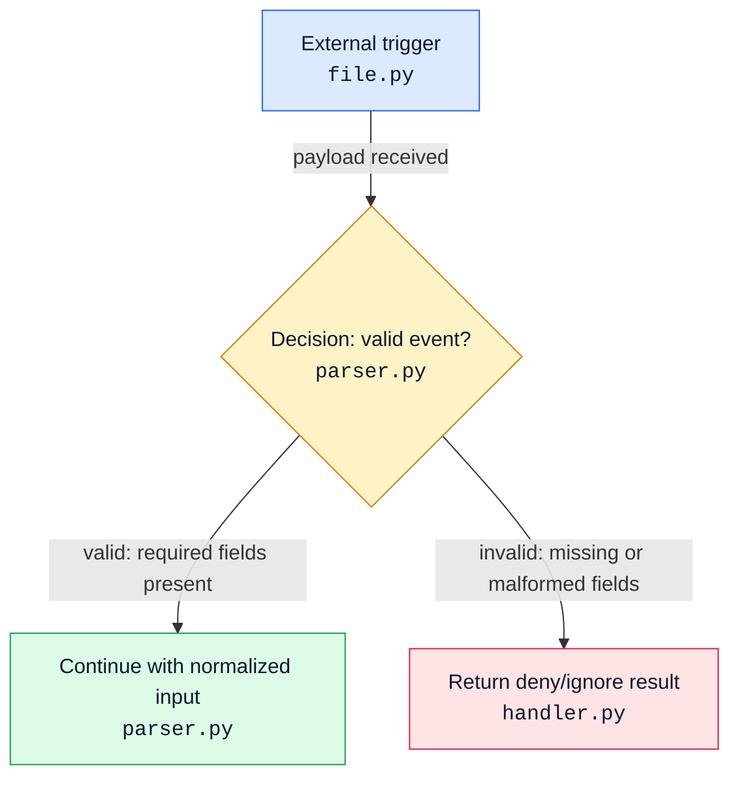

# Codebase Diagrams

Create diagrams that are grounded in code, readable in Markdown, and useful to the next engineer.

## Core Rules

- Ground every meaningful claim in source files, tests, config, or generated artifacts.
- Prefer `rg` / `rg --files` to find entrypoints, handlers, routers, schemas, tests, and config.
- Read the relevant files before drawing; do not infer runtime behavior from names alone.
- Show file names in diagram nodes. Include line anchors in a separate table when possible.
- Prefer vertical diagrams: Mermaid `flowchart TD` over `LR`.
- Keep diagrams readable: fewer wide branches, short labels, and grouped subgraphs.
- Every multi-arm node must have labeled branches.
- Every decision box must have at least two outgoing outcomes, and every decision outcome must be labeled with the condition that selects it.
- Every outgoing arm must describe the condition unless the source node has only one outgoing arm.
- Use color classes consistently; include a color key.
- Include an ASCII code tree with one short line describing each file.
- Mark uncertain items as `Unknown` or `Inferred`; never let uncertainty masquerade as fact.

## Workflow

1. **Scope the subsystem**
   - Identify the user-facing behavior, entrypoint, background workers, API routes, config, storage, and tests.
   - Search names, route paths, env vars, collection names, event names, and status codes.

2. **Trace the runtime path**
   - Start from the external trigger or CLI/API entrypoint.
   - Follow calls across modules until persistence, network calls, dispatch, or output.
   - Note decision points and fail-closed/fallback paths.

3. **Build the file map**
   - Record each file's purpose in one line.
   - Include tests only when they document important behavior or edge cases.

4. **Write the diagram**
   - Use `flowchart TD`.
   - Quote Mermaid labels that contain punctuation.
   - Put the filename on each node label.
   - Put the behavior description in the node, not only in surrounding prose.
   - Keep each node label short enough to scan.
   - Label every branch from any node with multiple outgoing arms.
   - Give each decision box at least two labeled outcomes grounded in code conditions.

5. **Validate the diagram**
   - Check each edge against code.
   - Ensure every multi-arm node has labeled branches.
   - Ensure every decision has at least two labeled outcomes.
   - Ensure branch labels describe code-grounded conditions.
   - Ensure the ASCII tree and file map agree with the diagram.

## Markdown Output Shape

Use this order unless the user asks otherwise:

1. Title
2. One-paragraph scope note
3. Color key
4. Mermaid flow chart
5. ASCII code tree with one-line file summaries
6. Code anchors table
7. Current-state notes and gotchas
8. Open questions / unknowns

## Mermaid Style Template



## Color Guidance

- Blue `entry`: entrypoints, bootstraps, webhooks, CLIs, schedulers.
- Green `process`: normal processing, parsing, enrichment, dispatch.
- Amber `decision`: conditionals, gates, feature flags, fallback choices.
- Purple `storage`: databases, caches, queues, persisted config.
- Cyan `external`: third-party services, HTTP APIs, identity providers.
- Rose `deny`: denied, ignored, failed, or error paths.
- Gray `utility`: helpers that are important but not control-flow owners.

## ASCII Code Tree Format

Keep it tight and decision-relevant:

```text
subsystem/
├── app.py                         # Runtime gate: parse, auth, route, dispatch.
├── utils/routes.py                # Resolves resource routes from DB and OpenFGA.
├── utils/identity.py              # Maps external user IDs to internal users.
└── tests/test_runtime_gate.py     # Covers allow/deny branches for the gate.
```

Rules:

- One line per file.
- Include only files used by the explanation.
- Prefer exact paths from the repo root.
- Use verbs: "resolves", "writes", "checks", "dispatches".

## Code Anchors

Include a table like this:

| Step | File | Anchor | What the code proves |
| --- | --- | --- | --- |
| Parse event | `path/to/app.py` | `:120` | Required fields are normalized before auth. |
| Deny malformed | `path/to/app.py` | `:145` | Malformed payloads return an ignored result. |

When line numbers shift, use function/class names instead of pretending an old line is exact.

## Quality Bar

- The diagram should let a reader understand the system without reading all files first.
- The prose should state where behavior is confirmed by code, inferred from adjacent code, or unknown.
- The final artifact should be a Markdown file when the user asks to write it down.
- Avoid decorative complexity; color is for cognition, not confetti.
