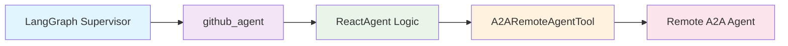
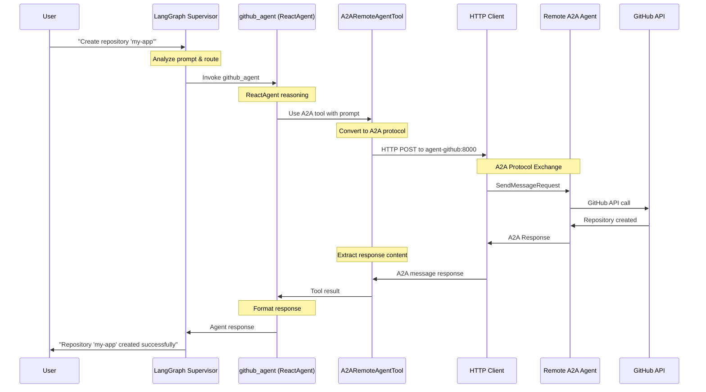
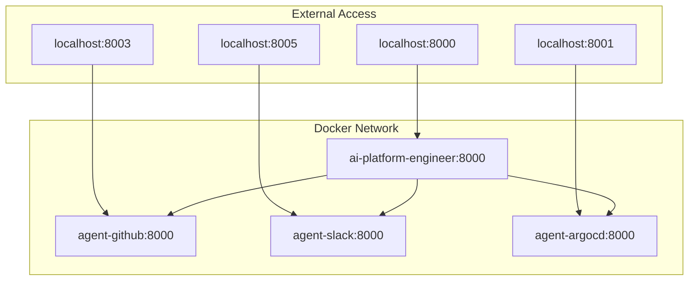

# 🏗️ A2A Integration Architecture - LangGraph to A2A Protocol

## 📋 Overview

This document explains how the AI Platform Engineering Multi-Agent System (MAS) integrates **LangGraph's supervisor pattern** with **A2A (Agent-to-Agent) protocol** for distributed agent communication. The architecture bridges two different paradigms through an elegant abstraction layer.

---

## 🎯 Architecture Layers

```
┌─────────────────────────────────────────────────────────────────┐
│                    LangGraph Supervisor                         │
│                   (Orchestration Layer)                         │
└─────────────────────┬───────────────────────────────────────────┘
                      │
          ┌───────────┴───────────┐
          │   LangChain Agents    │
          │   (Abstraction Layer) │
          └───────────┬───────────┘
                      │
          ┌───────────┴───────────┐
          │ A2ARemoteAgentTools   │
          │   (Bridge Layer)      │
          └───────────┬───────────┘
                      │
          ┌───────────┴───────────┐
          │   A2A Protocol        │
          │ (Communication Layer) │
          └───────────┬───────────┘
                      │
          ┌───────────┴───────────┐
          │  Remote A2A Agents    │
          │  (Service Layer)      │
          └───────────────────────┘
```

---

## 🔗 Connection Flow Analysis

### **1. Supervisor Level - LangGraph Orchestration**

**File**: `mas/platform_engineer/supervisor_agent.py`

```python
class AIPlatformEngineerMAS:
    def build_graph(self) -> CompiledStateGraph:
        graph = create_supervisor(
            model=model,
            agents=[
                argocd_agent,      # ← LangChain ReactAgents
                atlassian_agent,   # ← NOT direct A2A connections
                pagerduty_agent,   # ← Bridge through tools
                github_agent,
                slack_agent,
                backstage_agent,
            ],
            prompt=system_prompt,
            # ...
        )
```

**Key Points**:
- Uses standard LangGraph `create_supervisor()` function
- Agents are **LangChain ReactAgents**, not A2A agents directly
- Supervisor handles request routing and orchestration

### **2. Agent Level - LangChain ReactAgent Wrapper**

**File**: `agents/github/agent.py`

```python
# Step 1: Create A2A connection tool
github_a2a_remote_agent = A2ARemoteAgentConnectTool(
    name="github_tools_agent",
    description="Handles tasks related to GitHub repositories...",
    remote_agent_card=github_agent_card,  # ← A2A configuration
    skill_id=github_agent_skill.id,
)

# Step 2: Create LangChain ReactAgent with A2A tool
github_agent = create_react_agent(
    model=model,
    tools=[github_a2a_remote_agent],  # ← A2A tool as LangChain tool
    name="github_agent",
)
```

**Architecture Pattern**:


### **3. Tool Level - A2A Protocol Bridge**

**File**: `utils/a2a/a2a_remote_agent_connect.py`

```python
class A2ARemoteAgentConnectTool(BaseTool):
    """Bridges LangChain tools with A2A protocol"""
    
    def __init__(self, remote_agent_card, skill_id, **kwargs):
        # Configuration for A2A connection
        self._remote_agent_card = remote_agent_card
        self._skill_id = skill_id
        
    async def _arun(self, input: Input) -> Any:
        """LangChain tool interface → A2A protocol"""
        prompt = input.prompt
        response = await self.send_message(prompt)
        return Output(response=response)
        
    async def send_message(self, prompt: str) -> str:
        """Pure A2A protocol communication"""
        request = SendMessageRequest(
            id=str(uuid4()),
            params=MessageSendParams(...)
        )
        response = await self._client.send_message(request)
        return self._extract_response(response)
```

**Bridge Functions**:
1. **LangChain Interface**: Implements `BaseTool` for LangChain compatibility
2. **A2A Protocol**: Uses `A2AClient` for remote communication
3. **Data Translation**: Converts between LangChain and A2A formats

### **4. Configuration Level - A2A Agent Cards**

**File**: `agents/github/a2a_agentcards.py`

```python
# A2A Agent Card defines connection parameters
github_agent_card = AgentCard(
    name='GitHub',
    id='github-tools-agent',
    description='An AI agent that interacts with GitHub...',
    url=f'http://{GITHUB_AGENT_HOST}:{GITHUB_AGENT_PORT}',  # ← Connection endpoint
    version='0.1.0',
    capabilities=AgentCapabilities(streaming=False),
    skills=[github_agent_skill],
)

# Skill definition for A2A protocol
github_agent_skill = AgentSkill(
    id="github_agent_skill",
    name="GitHub Agent Skill",
    description="Handles tasks related to GitHub repositories...",
    examples=[
        "Create a new GitHub repository named 'my-repo'.",
        "List all open pull requests in the 'frontend' repository.",
        # ...
    ]
)
```

**Environment Mapping**:
```yaml
# docker-compose.yaml
environment:
  - GITHUB_AGENT_HOST=agent-github    # Docker service name
  - GITHUB_AGENT_PORT=8000           # Internal container port
  
services:
  agent-github:
    image: ghcr.io/cnoe-io/agent-github:a2a-stable
    ports:
      - "8003:8000"  # External:Internal port mapping
```

---

## 🚀 Complete Request Flow

### **Detailed Sequence Diagram**



### **Step-by-Step Breakdown**

#### **Step 1: Request Initiation**
```python
# User input received by supervisor
async def serve(self, prompt: str):
    result = await self.graph.ainvoke({
        "messages": [{"role": "user", "content": prompt}]
    }, {"configurable": {"thread_id": uuid.uuid4()}})
```

#### **Step 2: LangGraph Routing**
```python
# Supervisor analyzes prompt and routes to github_agent
# Based on system_prompt routing logic in prompts.py
```

#### **Step 3: ReactAgent Processing**
```python
# github_agent (ReactAgent) decides to use A2A tool
# Invokes A2ARemoteAgentConnectTool with refined prompt
```

#### **Step 4: A2A Protocol Translation**
```python
# A2ARemoteAgentConnectTool converts LangChain input to A2A format
send_message_payload = {
    'message': {
        'role': 'user',
        'parts': [{'kind': 'text', 'text': prompt}],
        'messageId': uuid4().hex,
    },
}
request = SendMessageRequest(
    id=str(uuid4()),
    params=MessageSendParams(**send_message_payload)
)
```

#### **Step 5: HTTP Communication**
```python
# HTTP client sends A2A request to remote agent
response = await self._client.send_message(request)
```

#### **Step 6: Remote Agent Processing**
- Remote A2A agent receives request
- Processes GitHub operations
- Returns A2A formatted response

#### **Step 7: Response Processing**
```python
# Extract text from A2A response artifacts
texts = extract_text_from_parts(response.root.result.artifacts)
return " ".join(texts)
```

---

## 🏛️ Architectural Benefits

### **1. Separation of Concerns**

| Layer | Responsibility | Technology |
|-------|---------------|------------|
| **Orchestration** | Request routing, conversation state | LangGraph |
| **Reasoning** | Agent logic, tool selection | LangChain ReactAgent |
| **Communication** | Protocol handling, network calls | A2A Protocol |
| **Service** | Domain-specific operations | Specialized A2A Agents |

### **2. Scalability Patterns**

#### **Horizontal Scaling**
```yaml
# Multiple instances of same agent type
services:
  agent-github-1:
    image: ghcr.io/cnoe-io/agent-github:a2a-stable
  agent-github-2:
    image: ghcr.io/cnoe-io/agent-github:a2a-stable
  agent-github-3:
    image: ghcr.io/cnoe-io/agent-github:a2a-stable
```

#### **Service Distribution**
```yaml
# Agents on different machines/clusters
environment:
  - GITHUB_AGENT_HOST=github-cluster.internal
  - SLACK_AGENT_HOST=slack-cluster.internal
  - ARGOCD_AGENT_HOST=devops-cluster.internal
```

### **3. Protocol Abstraction**

```python
# Same LangChain interface works with different protocols
agents = [
    create_react_agent(tools=[a2a_tool]),      # A2A protocol
    create_react_agent(tools=[rest_api_tool]), # REST API
    create_react_agent(tools=[grpc_tool]),     # gRPC
]
```

---

## 🔧 Configuration Management

### **Environment Variables**

```bash
# A2A Protocol Selection
AGENT_PROTOCOL=a2a  # vs 'fastapi' for direct REST

# Agent Endpoints (Docker service names)
GITHUB_AGENT_HOST=agent-github
GITHUB_AGENT_PORT=8000
SLACK_AGENT_HOST=agent-slack
SLACK_AGENT_PORT=8000
ARGOCD_AGENT_HOST=agent-argocd
ARGOCD_AGENT_PORT=8000
```

### **Docker Compose Integration**

```yaml
services:
  # Main supervisor
  ai-platform-engineer:
    environment:
      - AGENT_PROTOCOL=a2a
      - GITHUB_AGENT_HOST=agent-github
    depends_on:
      - agent-github  # Ensures A2A agents start first
      
  # A2A agent services
  agent-github:
    image: ghcr.io/cnoe-io/agent-github:a2a-stable
    container_name: agent-github
    ports:
      - "8003:8000"  # External access for debugging
```

### **Network Communication**



---

## 🐛 Debugging and Monitoring

### **Key Debug Points**

#### **1. Agent Card Resolution**
```python
# Check if A2A agent is reachable
logger.info(f"Connecting to remote agent: {remote_agent_card.name}")
logger.info(f"Agent URL: {remote_agent_card.url}")
```

#### **2. A2A Protocol Exchange**
```python
# Log A2A request/response
logger.info(f"Request to send message: {request}")
logger.info(f"Response received from A2A agent: {response}")
```

#### **3. Tool Invocation**
```python
# LangChain tool debugging
logger.debug(f"A2A tool invoked with input: {input}")
logger.debug(f"A2A tool response: {output}")
```

### **Common Issues and Solutions**

| Issue | Symptom | Solution |
|-------|---------|----------|
| **Agent Not Found** | Connection timeout | Check Docker service names and ports |
| **Protocol Mismatch** | Invalid A2A response | Verify agent image versions |
| **Tool Not Invoked** | No A2A calls | Check ReactAgent reasoning and prompts |
| **Response Parsing** | Empty responses | Debug A2A artifact extraction |

---

## 🚀 Extension Patterns

### **Adding New A2A Agents**

#### **1. Create Agent Card**
```python
# agents/newservice/a2a_agentcards.py
newservice_agent_card = AgentCard(
    name='NewService',
    id='newservice-tools-agent',
    url=f'http://{NEWSERVICE_AGENT_HOST}:{NEWSERVICE_AGENT_PORT}',
    skills=[newservice_agent_skill],
)
```

#### **2. Create Bridge Tool**
```python
# agents/newservice/agent.py
newservice_a2a_remote_agent = A2ARemoteAgentConnectTool(
    name="newservice_tools_agent",
    remote_agent_card=newservice_agent_card,
    skill_id=newservice_agent_skill.id,
)
```

#### **3. Create ReactAgent**
```python
newservice_agent = create_react_agent(
    model=model,
    tools=[newservice_a2a_remote_agent],
    name="newservice_agent",
)
```

#### **4. Register with Supervisor**
```python
# supervisor_agent.py
agents=[
    existing_agents...,
    newservice_agent,  # Add to supervisor
]
```

#### **5. Update Docker Compose**
```yaml
services:
  agent-newservice:
    image: ghcr.io/cnoe-io/agent-newservice:a2a-stable
    ports:
      - "8007:8000"
```

### **Alternative Protocols**

The architecture supports multiple communication protocols:

```python
# A2A Protocol (current)
a2a_tool = A2ARemoteAgentConnectTool(...)

# REST API Protocol (alternative)
rest_tool = RESTApiTool(...)

# gRPC Protocol (future)
grpc_tool = GRPCTool(...)

# Same ReactAgent interface
agent = create_react_agent(tools=[chosen_tool])
```

---

## 📊 Performance Considerations

### **Network Latency**
- **Local Docker**: ~1-5ms between containers
- **Cross-Host**: Depends on network infrastructure
- **Mitigation**: Connection pooling, caching

### **Memory Usage**
- **LangGraph State**: Managed by InMemorySaver
- **A2A Connections**: HTTP connection pooling
- **Tool Instances**: Shared across agent invocations

### **Scalability Metrics**
- **Concurrent Requests**: Limited by LangGraph threading
- **Agent Instances**: Horizontally scalable via Docker
- **Protocol Overhead**: ~100-200 bytes per A2A message

---

## 🎯 Key Takeaways

1. **Abstraction Power**: LangGraph doesn't know about A2A - it just uses tools
2. **Protocol Bridge**: `A2ARemoteAgentConnectTool` elegantly bridges paradigms  
3. **Service Isolation**: Each agent runs independently with clear boundaries
4. **Extensibility**: Easy to add new agents following established patterns
5. **Debugging**: Multiple layers provide different debugging entry points

This architecture demonstrates how to successfully integrate **centralized orchestration** (LangGraph) with **distributed service architecture** (A2A protocol) while maintaining clean abstractions and extensibility.

---

*This document provides a comprehensive understanding of how LangGraph supervision patterns integrate with A2A protocol for distributed agent communication in the AI Platform Engineering system.*