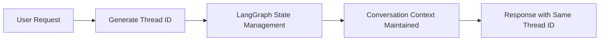
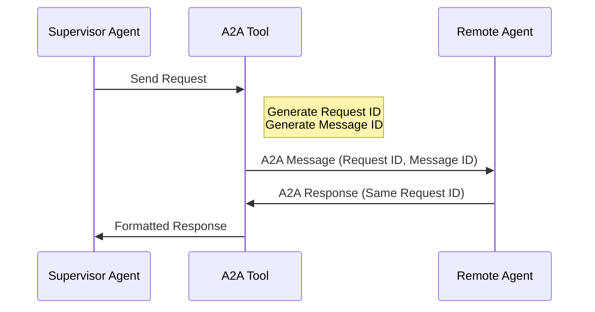
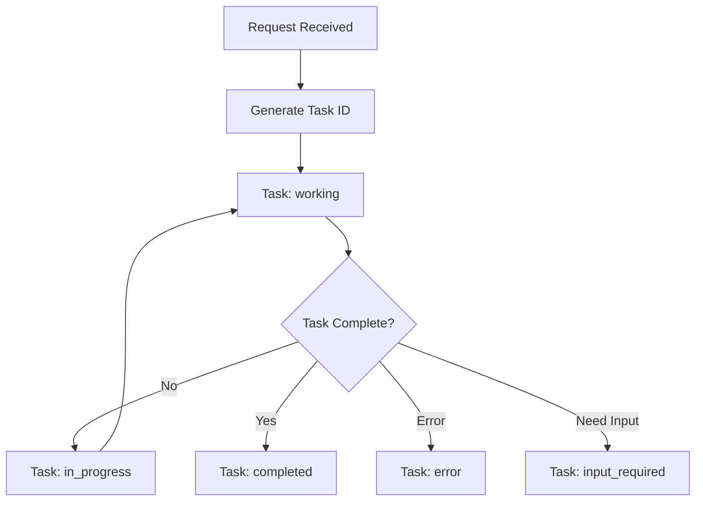
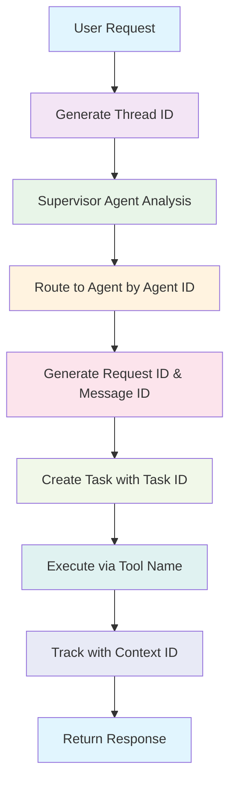

# 🆔 AI Platform Engineering - ID Systems Analysis

## 📋 Overview

The AI Platform Engineering Multi-Agent System (MAS) employs a sophisticated, multi-layered identifier system to manage distributed agent communication, state tracking, and task coordination. This document provides a comprehensive analysis of all ID types used throughout the codebase.

---

## 🏗️ ID Architecture Overview

```
┌─────────────────────────────────────────────────────────────────┐
│                 AI Platform Engineer MAS                        │
│                    ID Hierarchy                                 │
└─────────────────────┬───────────────────────────────────────────┘
                      │
          ┌───────────┴───────────┐
          │   Agent Level IDs     │
          │   (Static/Config)     │
          └───────────┬───────────┘
                      │
          ┌───────────┴───────────┐
          │  Session Level IDs    │
          │   (Dynamic/Runtime)   │
          └───────────┬───────────┘
                      │
          ┌───────────┴───────────┐
          │  Message Level IDs    │
          │   (Protocol/Comm)     │
          └───────────┬───────────┘
                      │
          ┌───────────┴───────────┐
          │   Task Level IDs      │
          │  (Execution/State)    │
          └───────────────────────┘
```

---

## 🤖 Agent Level IDs

### Agent IDs (kebab-case)

**Purpose**: Unique identification for each specialized agent in the A2A protocol

**Format**: `{service}-tools-agent`

**Location**: Defined in `agents/{service}/a2a_agentcards.py`

| Agent | Agent ID | File Location |
|-------|----------|---------------|
| GitHub | `github-tools-agent` | `agents/github/a2a_agentcards.py:34` |
| Slack | `slack-tools-agent` | `agents/slack/a2a_agentcards.py:32` |
| PagerDuty | `pagerduty-tools-agent` | `agents/pagerduty/a2a_agentcards.py:32` |
| ArgoCD | `argocd-tools-agent` | `agents/argocd/a2a_agentcards.py:32` |
| Atlassian | `atlassian-tools-agent` | `agents/atlassian/a2a_agentcards.py:32` |
| Backstage | `backstage-tools-agent` | `agents/backstage/a2a_agentcards.py:32` |

**Example Code**:
```python
# agents/github/a2a_agentcards.py
github_agent_card = AgentCard(
  name='GitHub',
  id='github-tools-agent',  # ← Agent ID
  description='An AI agent that interacts with GitHub...',
  url=f'http://{GITHUB_AGENT_HOST}:{GITHUB_AGENT_PORT}',
  # ...
)
```

### Skill IDs (snake_case)

**Purpose**: Identifies specific capabilities/skills that agents can perform

**Format**: `{service}_agent_skill`

**Location**: Same files as Agent IDs

| Service | Skill ID | Capabilities |
|---------|----------|--------------|
| GitHub | `github_agent_skill` | Repository management, pull requests, workflows |
| Slack | `slack_agent_skill` | Channel management, messaging, notifications |
| PagerDuty | `pagerduty_agent_skill` | Incident management, alerts, on-call schedules |
| ArgoCD | `argocd_agent_skill` | Application deployment, GitOps operations |
| Atlassian | `atlassian_agent_skill` | Project management, ticket tracking |
| Backstage | `backstage_agent_skill` | Service catalog, metadata management |
| Platform Engineer | `ai_platform_engineer` | Multi-agent orchestration |

**Example Code**:
```python
# agents/github/a2a_agentcards.py
github_agent_skill = AgentSkill(
  id="github_agent_skill",  # ← Skill ID
  name="GitHub Agent Skill",
  description="Handles tasks related to GitHub repositories...",
  tags=["github", "repository management", "pull requests", "workflows"],
  examples=[
    "Create a new GitHub repository named 'my-repo'.",
    "List all open pull requests in the 'frontend' repository.",
    # ...
  ]
)
```

---

## 🧵 Session Level IDs

### Thread IDs (UUID4)

**Purpose**: Maintains conversation state across multiple interactions in LangGraph

**Format**: UUID4 string (e.g., `f47ac10b-58cc-4372-a567-0e02b2c3d479`)

**Generation**: Dynamic, created for each new conversation

**Location**: `mas/platform_engineer/supervisor_agent.py:116`

**Example Code**:
```python
# supervisor_agent.py
async def serve(self, prompt: str):
    result = await self.graph.ainvoke({
        "messages": [
            {
                "role": "user",
                "content": prompt
            }
        ],
    }, {"configurable": {"thread_id": uuid.uuid4()}})  # ← Thread ID
```

**Usage Flow**:


### Context IDs

**Purpose**: Links messages and tasks within a conversation context in A2A protocol

**Format**: Inherited from A2A protocol message context

**Location**: `mas/platform_engineer/protocol_bindings/a2a/agent_executor.py:34`

**Example Code**:
```python
# agent_executor.py
async def execute(self, context: RequestContext, event_queue: EventQueue):
    context_id = context.message.contextId if context.message else None  # ← Context ID
    
    # Used throughout task execution
    await event_queue.enqueue_event(
        TaskStatusUpdateEvent(
            contextId=context_id,  # ← Context ID propagation
            taskId=task.id,
            # ...
        )
    )
```

---

## 📨 Message Level IDs

### Message IDs (UUID4 hex)

**Purpose**: Unique identifier for individual messages in A2A protocol communication

**Format**: 32-character hexadecimal string (e.g., `a1b2c3d4e5f6789012345678901234ab`)

**Generation**: `uuid4().hex`

**Location**: `utils/a2a/a2a_remote_agent_connect.py:157`

**Example Code**:
```python
# a2a_remote_agent_connect.py
send_message_payload = {
    'message': {
        'role': 'user',
        'parts': [
            {'kind': 'text', 'text': prompt}
        ],
        'messageId': uuid4().hex,  # ← Message ID
    },
}
```

### Request IDs (UUID4)

**Purpose**: Correlates requests and responses in A2A protocol

**Format**: UUID4 string

**Generation**: `str(uuid4())`

**Location**: `utils/a2a/a2a_remote_agent_connect.py:162`

**Example Code**:
```python
# a2a_remote_agent_connect.py
request = SendMessageRequest(
    id=str(uuid4()),  # ← Request ID
    params=MessageSendParams(**send_message_payload)
)
```

**A2A Communication Flow**:


---

## 🎯 Task Level IDs

### Task IDs

**Purpose**: Tracks individual tasks/operations within the A2A protocol execution

**Format**: Generated by A2A protocol utilities

**Generation**: `new_task(context.message)` utility function

**Location**: `mas/platform_engineer/protocol_bindings/a2a/agent_executor.py:40-41`

**Example Code**:
```python
# agent_executor.py
if not task:
    task = new_task(context.message)  # ← Creates task with unique Task ID
    await event_queue.enqueue_event(task)

# Task ID used throughout execution
await event_queue.enqueue_event(
    TaskArtifactUpdateEvent(
        contextId=task.contextId,
        taskId=task.id,  # ← Task ID usage
        # ...
    )
)
```

**Task Lifecycle**:


---

## 🔧 Tool Level IDs

### Tool Names (snake_case)

**Purpose**: Internal LangChain tool identification

**Format**: `{service}_tools_agent`

**Location**: Each agent's `agent.py` file

| Service | Tool Name | File Location |
|---------|-----------|---------------|
| GitHub | `github_tools_agent` | `agents/github/agent.py:17` |
| Slack | `slack_tools_agent` | `agents/slack/agent.py:20` |
| PagerDuty | `pagerduty_tools_agent` | `agents/pagerduty/agent.py:17` |
| ArgoCD | `argocd_tools_agent` | `agents/argocd/agent.py:17` |
| Atlassian | `atlassian_tools_agent` | `agents/atlassian/agent.py:17` |
| Backstage | `backstage_tools_agent` | `agents/backstage/agent.py:17` |

**Example Code**:
```python
# agents/github/agent.py
github_a2a_remote_agent = A2ARemoteAgentConnectTool(
    name="github_tools_agent",  # ← Tool Name
    description="Handles tasks related to GitHub repositories...",
    remote_agent_card=github_agent_card,
    skill_id=github_agent_skill.id,
)
```

### Human-readable Names

**Purpose**: User-facing agent identification

**Format**: Capitalized service names

| Service | Display Name | Usage |
|---------|--------------|-------|
| GitHub | `GitHub` | UI display, logging |
| Slack | `Slack` | UI display, logging |
| PagerDuty | `PagerDuty` | UI display, logging |
| ArgoCD | `ArgoCD` | UI display, logging |
| Atlassian | `Jira` | UI display, logging |
| Backstage | `Backstage` | UI display, logging |

---

## 🔄 ID Flow and Relationships

### Complete Request Flow



### ID Relationships

| ID Type | Scope | Lifetime | Generated By | Used By |
|---------|-------|----------|--------------|---------|
| Agent ID | System | Static | Configuration | A2A Protocol, Supervisor |
| Skill ID | Agent | Static | Configuration | A2A Protocol, Tools |
| Thread ID | Conversation | Session | LangGraph | State Management |
| Context ID | Request | Request | A2A Protocol | Task Tracking |
| Message ID | Message | Message | A2A Tool | Protocol Communication |
| Request ID | Request | Request | A2A Tool | Response Correlation |
| Task ID | Task | Task | A2A Protocol | Execution Tracking |
| Tool Name | Agent | Static | Configuration | LangChain Framework |

---

## 🛠️ Configuration and Environment

### Environment Variables Affecting IDs

```bash
# Agent Host/Port Configuration (affects Agent Card URLs)
GITHUB_AGENT_HOST=localhost
GITHUB_AGENT_PORT=8003
SLACK_AGENT_HOST=localhost  
SLACK_AGENT_PORT=8005
# ... (similar for other agents)

# Protocol Selection
AGENT_PROTOCOL=a2a  # Affects which ID systems are used
```

### Docker Compose Service Names

```yaml
# docker-compose.yaml
services:
  ai-platform-engineer:    # Main supervisor
  agent-argocd:            # ArgoCD agent service
  agent-atlassian:         # Atlassian agent service  
  agent-github:            # GitHub agent service
  agent-pagerduty:         # PagerDuty agent service
  agent-slack:             # Slack agent service
  agent-backstage:         # Backstage agent service
```

**Service Name → Agent ID Mapping**:
- `agent-github` → `github-tools-agent`
- `agent-slack` → `slack-tools-agent`
- `agent-pagerduty` → `pagerduty-tools-agent`
- etc.

---

## 🔍 Debugging and Monitoring

### Logging ID Information

The system logs various IDs for debugging purposes:

```python
# Example logging patterns found in the codebase
logger.debug(f"Received prompt: {prompt}")
logger.info(f"Selected agent protocol: {agent_protocol}")
logger.info(f"Request to send message: {request}")  # Contains Request ID
logger.info(f"Response received from A2A agent: {response}")
```

### Key Files for ID Debugging

1. **Agent Configuration**: `agents/*/a2a_agentcards.py`
2. **Supervisor Logic**: `mas/platform_engineer/supervisor_agent.py`
3. **A2A Communication**: `utils/a2a/a2a_remote_agent_connect.py`
4. **Task Execution**: `mas/platform_engineer/protocol_bindings/a2a/agent_executor.py`

---

## 📚 Best Practices

### ID Generation Guidelines

1. **Static IDs**: Use descriptive, consistent naming conventions
   - Agent IDs: `kebab-case` with `-tools-agent` suffix
   - Skill IDs: `snake_case` with `_agent_skill` suffix

2. **Dynamic IDs**: Use UUID4 for uniqueness across distributed systems
   - Thread IDs: Full UUID4 strings
   - Message IDs: UUID4 hex for compact representation
   - Request IDs: Full UUID4 strings for correlation

3. **Environment Configuration**: Use environment variables for host/port configuration affecting Agent Card URLs

### Troubleshooting Common ID Issues

1. **Agent Not Found**: Check Agent ID spelling and case sensitivity
2. **Message Correlation Failures**: Verify Request ID and Message ID generation
3. **State Management Issues**: Ensure Thread ID consistency across conversation
4. **Task Tracking Problems**: Validate Task ID propagation through event queue

---

## 🚀 Future Considerations

### Planned MAS Expansions

The project structure indicates future MAS systems:
```
mas/
├── incident_engineer/    # Future: Incident response MAS
├── platform_engineer/   # Current: Platform operations MAS  
└── product_owner/       # Future: Product management MAS
```

Each will require its own ID namespace and coordination mechanisms.

### Scalability Considerations

- **ID Collision Prevention**: UUID4 provides sufficient entropy for distributed systems
- **Performance**: Consider ID indexing strategies for large-scale deployments  
- **Monitoring**: Implement ID-based distributed tracing for complex workflows

---

*This document provides a comprehensive overview of the ID systems used throughout the AI Platform Engineering Multi-Agent System. For technical implementation details, refer to the specific source files mentioned in each section.*