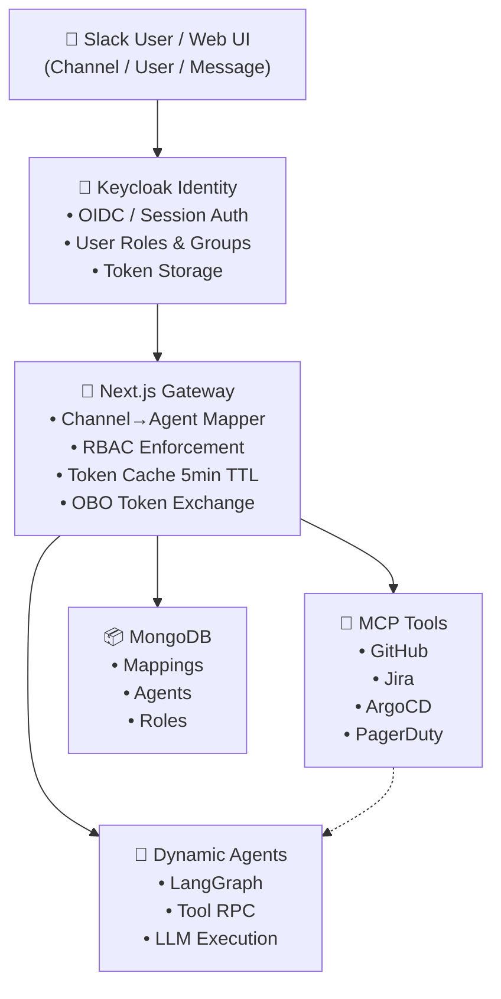
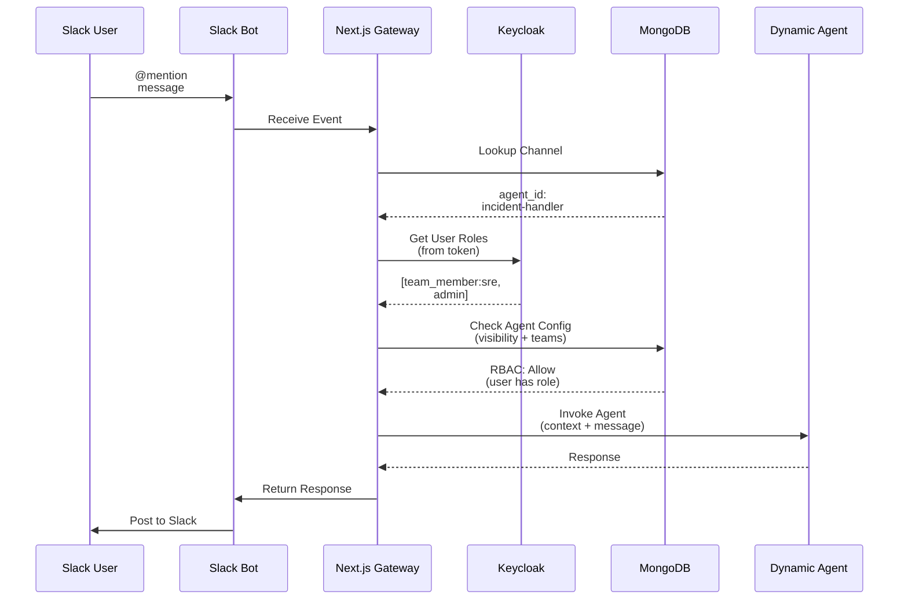
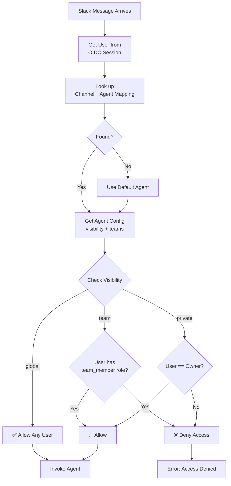
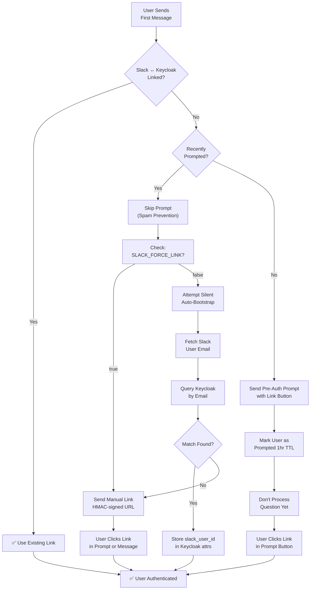
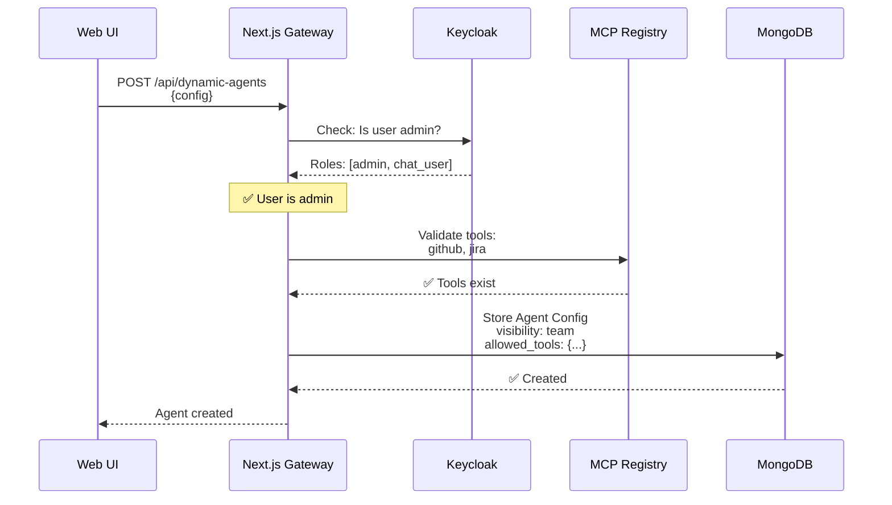
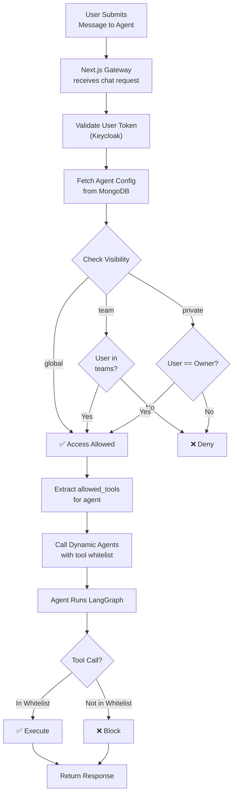
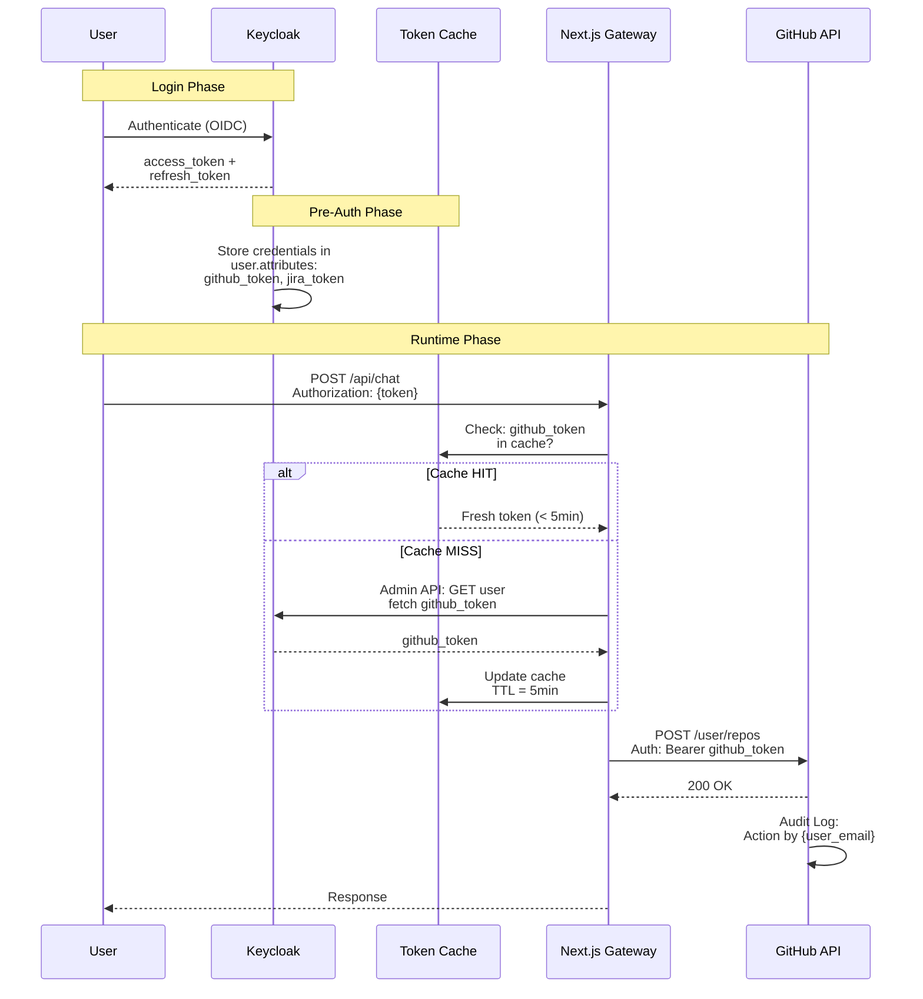
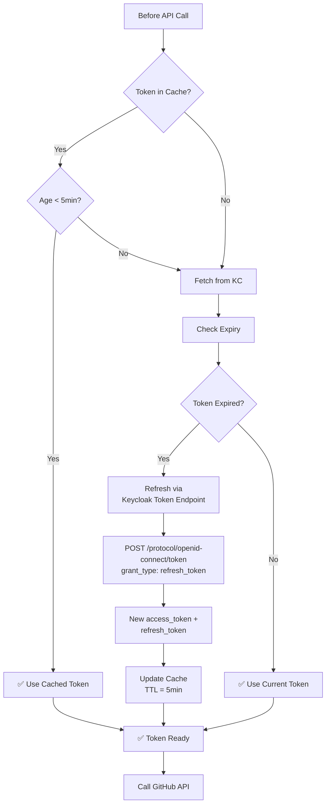
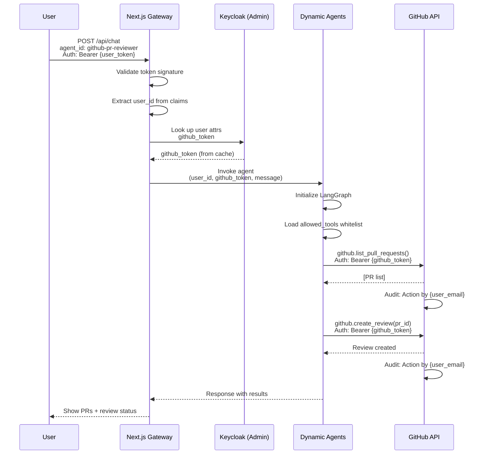

# CAIPE RBAC + Dynamic Agents: Architecture & Flows

## System Architecture



---

## Use Case 1: Slack Channel → Custom Agent Mapping + Pre-Auth

**Scenario:** Slack channel `#platform-incidents` routes to a PagerDuty agent. Only SRE team members access it.

**First Message Experience:** When a new user sends their first message to the bot, they receive a pre-auth prompt asking them to authenticate before their question is processed. This ensures they are linked to a Keycloak account and have proper RBAC permissions before accessing agents.

### Sequence Diagram: Message from Slack



### RBAC Authorization Decision Tree



### Auto-Bootstrap & Pre-Auth Prompt on First Message



**Pre-Auth Prompt Details:**
- Sent only when `RBAC_ENABLED=true` and user is unlinked
- Interactive Slack message with "Authenticate Now" button
- Button points to HMAC-signed linking URL (10min TTL)
- User marked as prompted (1hr TTL) to prevent spam
- Question processing deferred until user authenticates

---

## Use Case 2: User → Multiple Custom Agents + MCP Tool RBAC

**Scenario:** User creates agent "DevOps Helper" with GitHub + Jira tools. Only "engineers" role can use it.

### Agent Creation Flow



### Runtime: User Invokes Agent



### Tool RBAC Configuration

```yaml
# Allowed tools per agent (seed-config.yaml / MongoDB)
agents:
  - id: "devops-helper"
    name: "DevOps Helper"
    visibility: "team"
    shared_with_teams: ["platform"]
    allowed_tools:
      github:
        - "list_repos"        # Whitelist specific tools
        - "get_pr"
        - "list_issues"
      jira:
        - "list_issues"
        - "get_issue"
    # Tools NOT listed = denied at runtime
```

---

## Use Case 3: User Impersonation + Token Cache in Keycloak

**Scenario:** Agent calls GitHub API as the logged-in user (audit trail shows user, not bot).

### OBO (On-Behalf-Of) Token Exchange



### Token Refresh Logic



### API Call Flow with User Credentials



---

## Quick Demo Script

### 1. Create Agent with Tools

```bash
curl -X POST http://localhost:3000/api/dynamic-agents \
  -H "Authorization: Bearer $USER_TOKEN" \
  -H "Content-Type: application/json" \
  -d '{
    "name": "DevOps Helper",
    "system_prompt": "Help with deployments using GitHub and Jira",
    "allowed_tools": {
      "github": ["list_repos", "get_pr"],
      "jira": ["list_issues"]
    },
    "visibility": "team",
    "shared_with_teams": ["platform"]
  }'
```

### 2. Map Slack Channel to Agent

```bash
curl -X POST http://localhost:3000/api/admin/slack/channel-mappings \
  -H "Authorization: Bearer $ADMIN_TOKEN" \
  -H "Content-Type: application/json" \
  -d '{
    "slack_channel_id": "C123456",
    "agent_id": "devops-helper"
  }'
```

### 3. User Sends Message in Slack

```
User in #platform-incidents: @caipe-bot help me review recent PRs
   │
   └─ Slack Bot receives message
      ├─ User has team_member:platform role? ✅ YES
      ├─ Agent visibility is team? ✅ YES
      ├─ Invoke agent with GitHub + Jira tools
      └─ Response posted to Slack
```

### 4. Verify OBO in GitHub Audit Log

```bash
# GitHub API shows:
# "Action performed by {user_email} using token {last_4_digits}"
# NOT "Action performed by caipe-bot"
```

---

## Key Architecture Decisions

| Component | Role | Technology |
|-----------|------|-----------|
| **Keycloak** | Identity, roles, token storage | OIDC broker + Admin API |
| **Channel Mapper** | Slack channel → agent routing | MongoDB `channel_agent_mappings` |
| **RBAC Enforcer** | Visibility checks (global/team/private) | Next.js Gateway middleware |
| **Token Cache** | OBO pre-auth + memory caching | In-memory (5min TTL) |
| **Dynamic Agents** | LangGraph execution + MCP tool filtering | Python service + MongoDB config |

---

## Deployment Considerations

- **Multi-tenant**: Each team sees only agents shared with them
- **Audit trail**: All API calls logged with actual user identity (not bot)
- **Fallback**: If channel unmapped, use `defaults.default_agent_id`
- **Scalability**: Token cache TTL allows graceful cache misses
