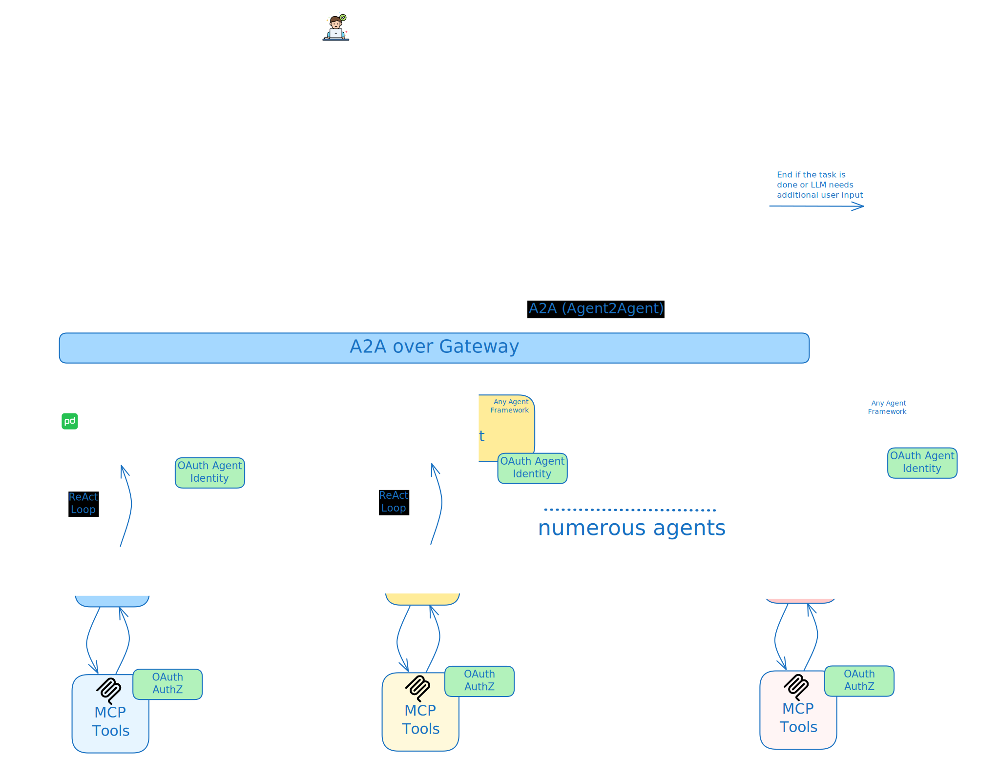
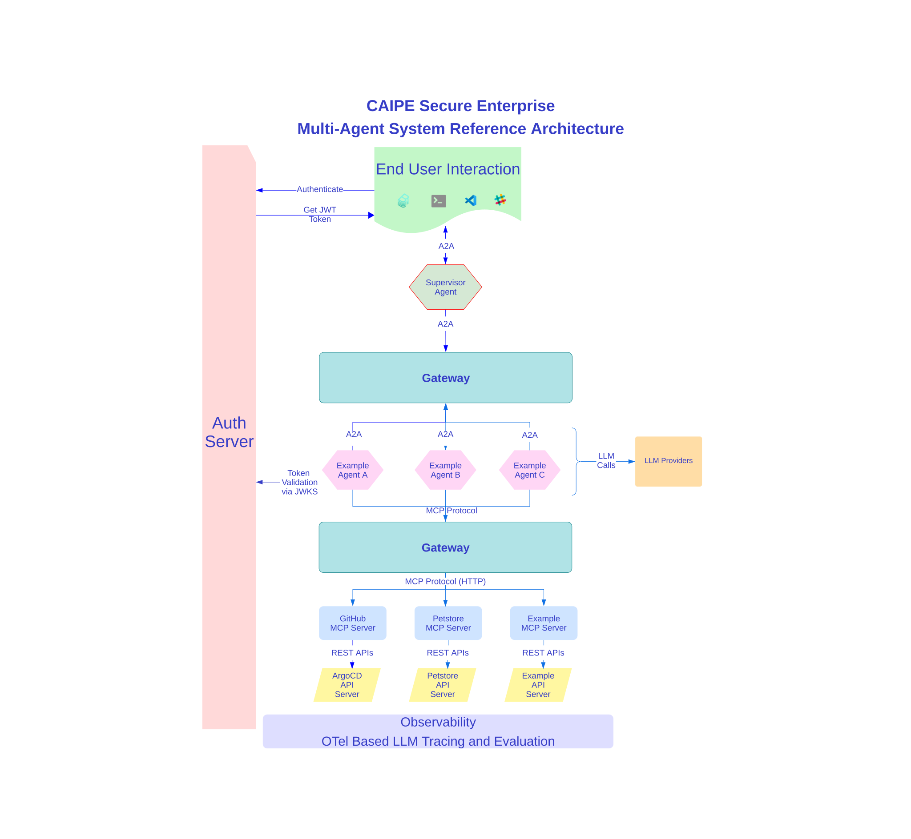

# 🤖 CAIPE: Community AI Platform Engineering Multi-Agent System

[](https://www.python.org/)
[](https://github.com/cnoe-io/ai-platform-engineering/actions/workflows/publish-gh-pages.yml)
[](LICENSE)

## Agentic AI SIG Community

🚀 [Getting Started](https://cnoe-io.github.io/ai-platform-engineering/getting-started/quick-start) | 🎥 [Meeting Recordings](https://github.com/cnoe-io/agentic-ai/wiki/Meeting-Recordings) | 🏛️ [Governance](https://github.com/cnoe-io/governance/tree/main/sigs/agentic-ai) | 🗺️ [Roadmap](https://github.com/orgs/cnoe-io/projects/9)

### 🗓️ Weekly Meetings

* **Every Monday**
  * 🕕 19:00–20:00 CET | 🕔 18:00–19:00 GMT (London) | 🕘 10:00–11:00 PST
* 🔗 [Webex Meeting](https://go.webex.com/meet/cnoe) | 📅 [Google Calendar](https://calendar.google.com/calendar/u/0/embed?src=064a2adfce866ccb02e61663a09f99147f22f06374e7a8994066bdc81e066986@group.calendar.google.com&ctz=America/Los_Angeles) | 📥 [.ics Download](https://github.com/cnoe-io/ai-platform-engineering/raw/main/docs/docs/community/cnoe-sig-agentic-ai-community-meeting.ics)

### 💬 Slack

* Not in CNCF Slack? [Join here first](https://communityinviter.com/apps/cloud-native/cncf)
* [Join #cnoe-sig-agentic-ai channel](https://cloud-native.slack.com/archives/C08N0AKR52S)

## [Note: Use latest docs to get started](https://cnoe-io.github.io/ai-platform-engineering)

## What is AI Platform Engineering?

As Platform Engineering, SRE, and DevOps environments grow in complexity, traditional approaches often lead to delays, increased operational overhead, and developer frustration. By adopting Multi-Agentic Systems and Agentic AI, Platform Engineering teams can move from manual, task-driven processes to more adaptive and automated operations, better supporting development and business goals.


**Community AI Platform Engineering (CAIPE)** (pronounced as `cape`) is an open-source, Multi-Agentic AI System (MAS) championed by the [CNOE (Cloud Native Operational Excellence)](http://cnoe.io/) forum. CAIPE provides a secure, scalable, persona-driven reference implementation with built-in knowledge base retrieval that streamlines platform operations, accelerates workflows, and fosters innovation for modern engineering teams. It integrates seamlessly with Internal Developer Portals like Backstage and developer environments such as VS Code, enabling frictionless adoption and extensibility.

CAIPE is empowered by a set of specialized sub-agents that integrate seamlessly with essential engineering tools. Below are some common platform agents leveraged by the MAS agent:

* 🚀 ArgoCD Agent for continuous deployment
* 🚨 PagerDuty Agent for incident management
* 🐙 GitHub Agent for version control
* 🗂️ Jira/Confluence Agent for project management
* 💬 Slack/Webex Agents for team communication

*...and many more platform agents are available for additional tools and use cases.*

Together, these sub-agents enable users to perform complex operations using agentic workflows by invoking relavant APIs using MCP tools. The system also includes:

* **A curated prompt library**: A carefully evaluated collection of prompts designed for high accuracy and optimal workflow performance in multi-agent systems. These prompts guide persona agents (such as "Platform Engineer" or "Incident Engineer") using standardized instructions and questions, ensuring effective collaboration, incident response, platform operations, and knowledge sharing.
* **Multiple End-user interfaces**: Easily invoke agentic workflows programmatically using standard A2A protocol or through intuitive UIs, enabling seamless integration with existing systems like Backstage (Internal Developer Portals).
* **End-to-end security**: Secure agentic communication and task execution across all agents, ensuring API RBACs to meet enterprise requirements.
* **Enterprise-ready cloud deployment architecture**: Reference deployment patterns for scalable, secure, and resilient multi-agent systems in cloud and hybrid environments

*For detailed information on project goals and our community, head to our [documentation site](https://cnoe-io.github.io/ai-platform-engineering/).*






## 💡 Examples

**AI Platform Engineer** can handle a wide range of operational requests. Here are some sample prompts you can try:

* 🚨 *Acknowledge the PagerDuty incident with ID 12345*
* 🚨 *List all on-call schedules for the DevOps team*
* 🐙 *Create a new GitHub repository named 'my-repo'*
* 🐙 *Merge the pull request #42 in the ‘backend’ repository*
* 🗂️ *Create a new Jira ticket for the ‘AI Project’*
* 🗂️ *Assign ticket 'PE-456' to user 'john.doe'*
* 💬 *Send a message to the ‘devops’ Slack channel*
* 💬 *Create a new Slack channel named ‘project-updates’*
* 🚀 *Sync the ‘production’ ArgoCD application to the latest commit*
* 🚀 *Get the status of the 'frontend' ArgoCD application*

## 🚀 Quick Start with Docker Compose

Run CAIPE locally with a single command:

```bash
# Clone the repository
git clone https://github.com/cnoe-io/ai-platform-engineering.git
cd ai-platform-engineering

# Copy and configure environment variables
cp .env.example .env
# Edit .env with your API keys (OPENAI_API_KEY, etc.)

# Run CAIPE with the web UI
docker compose --profile caipe-ui up
```

Access the UI at **http://localhost:3001** and the API at **http://localhost:8000**.

### Optional Profiles

Enable additional features with profiles:

```bash
# With tracing (Langfuse)
docker compose --profile caipe-ui --profile tracing up

# With RAG (knowledge base)
docker compose --profile caipe-ui --profile rag up

# Development mode (build from source)
docker compose -f docker-compose.dev.yaml --profile caipe-ui up --build
```

### Deployment Modes

CAIPE supports two deployment modes:

| Mode | Description | Use Case |
|------|-------------|----------|
| **Multi-Node** (default) | Supervisor orchestrates multiple remote sub-agents via A2A protocol | Production, scalable deployments |
| **Single-Node** | All agents run in-process with MCP tools via stdio transport | Development, simpler deployments |

#### Single-Node Mode

Single-node mode runs everything in a single container, making it ideal for development and simpler deployments:

```bash
# Run single-node mode
docker compose -f docker-compose.single-node.yaml --profile caipe-ui up

# Development mode with single-node (build from source)
docker compose -f docker-compose.single-node.dev.yaml --profile caipe-ui up --build
```

Single-node mode uses the `deepagents` library for task-based execution with workflows defined in `task_config.yaml`.

##### Single-Node with RAG (Knowledge Base)

Enable RAG services to give the agent access to ingested knowledge bases:

```bash
# Single-node with RAG (no graph database)
docker compose -f docker-compose.single-node.dev.yaml --profile rag --profile caipe-ui up --build

# Single-node with full Graph RAG (includes Neo4j)
docker compose -f docker-compose.single-node.dev.yaml --profile graph_rag --profile caipe-ui up --build
```

**RAG Profiles:**

| Profile | Services Included | Use Case |
|---------|-------------------|----------|
| `rag` | rag_server, web_ingestor, milvus, redis | Vector search without graph relationships |
| `graph_rag` | All `rag` services + Neo4j, agent_ontology | Full knowledge graph with entity relationships |

**Ingesting Content:**

Once RAG services are running, you can ingest web content via the RAG server API:

```bash
# Ingest a website (uses sitemap if available)
curl -X POST http://localhost:9446/v1/datasources \
  -H "Content-Type: application/json" \
  -d '{"url": "https://cnoe-io.github.io/ai-platform-engineering/"}'
```

The agent will automatically use the knowledge base when answering questions about ingested content.

#### Multi-Node Mode (Default)

Multi-node mode runs a supervisor agent that orchestrates specialized sub-agents as separate services:

```bash
# Run multi-node mode (default docker-compose.yaml)
docker compose --profile caipe-ui up

# Development mode with multi-node
docker compose -f docker-compose.dev.yaml --profile caipe-ui up --build
```

### Kubernetes Deployment

For Kubernetes, use the Helm chart:

```bash
# Multi-node mode (default) - deploys supervisor + sub-agents
helm install caipe charts/ai-platform-engineering \
  --set tags.caipe-ui=true \
  --set caipe-ui.env.NEXT_PUBLIC_A2A_BASE_URL="https://your-caipe-api.example.com"

# Single-node mode - deploys single unified agent
helm install caipe charts/ai-platform-engineering \
  --set global.deploymentMode=single-node \
  --set tags.caipe-ui=true \
  --set caipe-ui.env.NEXT_PUBLIC_A2A_BASE_URL="https://your-caipe-api.example.com"
```

## 📦 Documentation

- [Quick Start Guide](https://cnoe-io.github.io/ai-platform-engineering/getting-started/quick-start)
- Setup
    - [Docker Compose](https://cnoe-io.github.io/ai-platform-engineering/getting-started/docker-compose/setup)
- [Local Development setup](https://cnoe-io.github.io/ai-platform-engineering/getting-started/local-development)
- [Run Agents for Tracing & Evaluation](https://cnoe-io.github.io/ai-platform-engineering/getting-started/local-development#-run-agents-for-tracing--evaluation)
- [Adding new agents](https://cnoe-io.github.io/ai-platform-engineering/getting-started/local-development#%EF%B8%8F-adding-new-agents)

## 🤝 Contributing

We’d love your contributions! To get started:

1. **Fork** this repo
2. **Create a branch** for your changes
3. **Open a Pull Request**—just add a clear description so we know what you’re working on

Thinking about a big change? Feel free to [start a discussion](https://github.com/cnoe-io/ai-platform-engineering/discussions) first so we can chat about it together.

* Browse our [open issues](https://github.com/cnoe-io/ai-platform-engineering/issues) to see what needs doing
* New here? Check out the [good first issues](https://github.com/cnoe-io/ai-platform-engineering/issues?q=is%3Aissue%20state%3Aopen%20label%3A%22good%20first%20issue%22) for some beginner-friendly tasks

We’re excited to collaborate with you!

## Star History

[](https://www.star-history.com/#cnoe-io/ai-platform-engineering&Date)

## Contributors

<a href="https://github.com/cnoe-io/ai-platform-engineering/graphs/contributors">
  
</a>

## 📄 License

Licensed under the [Apache-2.0 License](LICENSE).

---

*Made with ❤️ by the [CNOE Contributors](https://cnoe.io/)*
