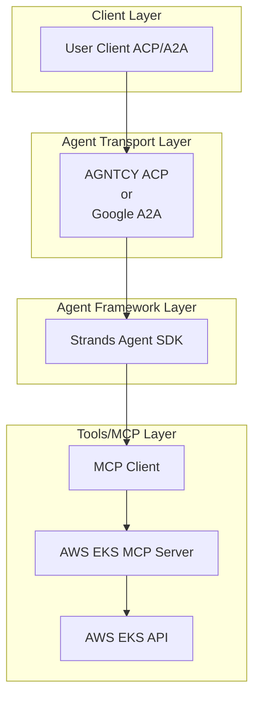

# 🚀 AWS EKS AI Agent

[](https://www.python.org/)
[](https://python-poetry.org/)
[](LICENSE)

---

## 🧪 Evaluation Badges

| Claude | Gemini | OpenAI | Llama |
|--------|--------|--------|-------|
| [](https://github.com/cnoe-io/agent-aws/actions/workflows/claude-evals.yml) | [](https://github.com/cnoe-io/agent-aws/actions/workflows/gemini-evals.yml) | [](https://github.com/cnoe-io/agent-aws/actions/workflows/openai-evals.yml) | [](https://github.com/cnoe-io/agent-aws/actions/workflows/openai-evals.yml) |

---

- 🤖 **AWS EKS Agent** is an LLM-powered agent built using the [Strands Agents SDK](https://strandsagents.com/0.1.x/documentation/docs/) and the official [AWS EKS MCP Server](https://awslabs.github.io/mcp/servers/eks-mcp-server).
- 🌐 **Protocol Support:** Compatible with [ACP](https://github.com/agntcy/acp-spec) and [A2A](https://github.com/google/A2A) protocols for integration with external user clients.
- 🛡️ **Secure by Design:** Enforces AWS IAM-based RBAC and supports external authentication for strong access control.
- 🔌 **EKS Management:** Uses the official AWS EKS MCP server for comprehensive Amazon EKS cluster management and Kubernetes operations.
- 🏭 **Production Ready:** Built with Strands Agents SDK for lightweight, production-ready AI agent deployment.

---

## 🚦 Getting Started

### 1️⃣ Configure Environment

- Ensure your `.env` file is set up with AWS credentials and region configuration.
- Refer to [.env.example](.env.example) as an example.

**Example .env file:**

```env
# Agent Configuration
AGENT_NAME=aws-eks

# AWS Configuration
AWS_PROFILE=your-aws-profile
AWS_REGION=us-west-2
AWS_ACCESS_KEY_ID=your-access-key-id
AWS_SECRET_ACCESS_KEY=your-secret-access-key

# LLM Configuration (Default: Amazon Bedrock Claude)
# Refer to: https://strandsagents.com/0.1.x/documentation/docs/user-guide/quickstart/#model-providers

# Optional: Strands Agent Configuration
STRANDS_LOG_LEVEL=INFO

# Optional: EKS MCP Server Configuration
FASTMCP_LOG_LEVEL=ERROR
```

### 2️⃣ Prerequisites

- **Python 3.11+**: [Install Python](https://www.python.org/downloads/release/python-3110/)
- **uv package manager**: [Install uv](https://docs.astral.sh/uv/getting-started/installation/)
- **AWS CLI**: [Install and configure AWS CLI](https://docs.aws.amazon.com/cli/latest/userguide/cli-chap-configure.html)
- **AWS Credentials**: Configure AWS credentials with appropriate EKS permissions
- **Amazon Bedrock Access**: Enable Claude model access in Amazon Bedrock console

### 3️⃣ Start the Agent (A2A Mode)

Run the agent in a Docker container using your `.env` file:

```bash
docker run -p 0.0.0.0:8000:8000 -it\
   -v "$(pwd)/.env:/app/.env"\
   ghcr.io/cnoe-io/agent-aws:a2a-stable
```

### 4️⃣ Run the Client

Use the [agent-chat-cli](https://github.com/cnoe-io/agent-chat-cli) to interact with the agent:

```bash
uvx https://github.com/cnoe-io/agent-chat-cli.git a2a
```

## 🏗️ Architecture



## 🛠️ Features

### **EKS Cluster Management**
- Create, describe, and delete EKS clusters with CloudFormation
- Generate EKS cluster templates with best practices
- Full lifecycle management of EKS infrastructure

### **Kubernetes Resource Operations**
- Manage individual Kubernetes resources (CRUD operations)
- Apply YAML manifests to EKS clusters
- List and query Kubernetes resources with filtering
- Generate application deployment manifests

### **Monitoring & Troubleshooting**
- Retrieve pod logs and Kubernetes events
- CloudWatch logs and metrics integration
- EKS troubleshooting guide integration
- Performance monitoring and alerting

### **Security & IAM**
- IAM role and policy management
- Add inline policies for EKS resources
- AWS credential-based authentication
- Kubernetes RBAC integration

### **Application Deployment**
- Generate Kubernetes deployment manifests
- Deploy containerized applications
- Load balancer and service configuration
- Multi-environment support

## 🎯 Example Use Cases

Ask the agent natural language questions like:

- **Cluster Management**: "Create a new EKS cluster called 'production' in us-west-2"
- **Application Deployment**: "Deploy a nginx application with 3 replicas to the 'dev' namespace"
- **Monitoring**: "Show me the CPU metrics for pods in the 'frontend' namespace"
- **Troubleshooting**: "Get the logs for the failing pod in the 'backend' namespace"
- **Resource Management**: "List all services in the 'default' namespace"

## 📋 AWS Permissions

### Read-Only Operations (Default)
```json
{
  "Version": "2012-10-17",
  "Statement": [
    {
      "Effect": "Allow",
      "Action": [
        "eks:DescribeCluster",
        "cloudformation:DescribeStacks",
        "cloudwatch:GetMetricData",
        "logs:StartQuery",
        "logs:GetQueryResults",
        "iam:GetRole",
        "iam:GetRolePolicy",
        "iam:ListRolePolicies",
        "iam:ListAttachedRolePolicies",
        "iam:GetPolicy",
        "iam:GetPolicyVersion",
        "eks-mcpserver:QueryKnowledgeBase"
      ],
      "Resource": "*"
    }
  ]
}
```

### Write Operations (with --allow-write)
For write operations, the following managed policies are recommended:
- **IAMFullAccess**: For creating and managing IAM roles and policies
- **AmazonVPCFullAccess**: For VPC resource creation and configuration
- **AWSCloudFormationFullAccess**: For CloudFormation stack management
- **EKS Full Access**: Custom policy for EKS cluster operations

## 🔒 Security Best Practices

- Use dedicated IAM roles with least privilege access
- Enable AWS CloudTrail for API call auditing
- Use separate roles for read-only and write operations
- Implement resource tagging for better access control
- Never pass secrets directly to the agent - use AWS Secrets Manager or Parameter Store

## 🚀 Development

### Local Development Setup

```bash
# Clone the repository
git clone https://github.com/cnoe-io/agent-aws.git
cd agent-aws

# Create virtual environment
python -m venv .venv
source .venv/bin/activate  # On Windows: .venv\Scripts\activate

# Install dependencies
pip install -r requirements.txt

# Run the agent locally
python -u agent_aws/agent.py
```

### Running with Poetry

```bash
# Install dependencies with Poetry
poetry install

# Run the agent
poetry run python agent_aws/agent.py
```

## 📦 Dependencies

- **strands-agents**: Lightweight AI agent framework
- **awslabs.eks-mcp-server**: Official AWS EKS MCP Server
- **boto3**: AWS SDK for Python
- **pydantic**: Data validation and settings management
- **click**: Command-line interface creation toolkit

## 🧪 Testing

Run the evaluation suite:

```bash
make test
```

Run specific provider evaluations:

```bash
make test-claude
make test-openai
make test-gemini
```

## 📄 License

This project is licensed under the Apache License 2.0 - see the [LICENSE](LICENSE) file for details.

## 🤝 Contributing

Contributions are welcome! Please read our [Contributing Guide](CONTRIBUTING.md) for details on our code of conduct and the process for submitting pull requests.

## 📚 Documentation

- [Strands Agents SDK Documentation](https://strandsagents.com/0.1.x/documentation/docs/)
- [AWS EKS MCP Server Documentation](https://awslabs.github.io/mcp/servers/eks-mcp-server)
- [Model Context Protocol](https://modelcontextprotocol.io/introduction)
- [Amazon EKS User Guide](https://docs.aws.amazon.com/eks/latest/userguide/)
