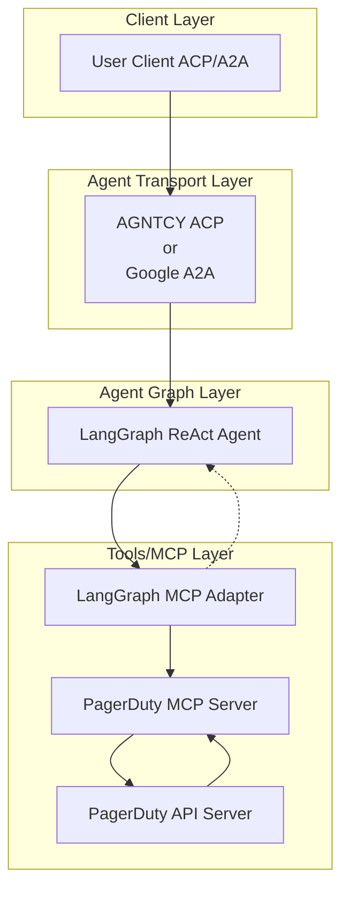

# 🚀 PagerDuty AI Agent

[](https://www.python.org/)
[](https://python-poetry.org/)
[](LICENSE)

[](https://github.com/cnoe-io/openapi-mcp-codegen/actions/workflows/conventional_commits.yml)
[](https://github.com/cnoe-io/openapi-mcp-codegen/actions/workflows/ruff.yml)
[](https://github.com/cnoe-io/openapi-mcp-codegen/actions/workflows/superlinter.yml)
[](https://github.com/cnoe-io/agent-pagerduty/actions/workflows/unit-tests.yml)

[](https://github.com/cnoe-io/agent-pagerduty/actions/workflows/acp-docker-build.yml)
[](https://github.com/cnoe-io/agent-pagerduty/actions/workflows/a2a-docker-build.yml)
---

## 🧪 Evaluation Badges

| Claude | Gemini | OpenAI | Llama |
|--------|--------|--------|-------|
| [](https://github.com/cnoe-io/agent-pagerduty/actions/workflows/claude-evals.yml) | [](https://github.com/cnoe-io/agent-pagerduty/actions/workflows/gemini-evals.yml) | [](https://github.com/cnoe-io/agent-pagerduty/actions/workflows/openai-evals.yml) | [](https://github.com/cnoe-io/agent-pagerduty/actions/workflows/openai-evals.yml) |

---

- 🤖 **PagerDuty Agent** is an LLM-powered agent built using the [LangGraph ReAct Agent](https://langchain-ai.github.io/langgraph/agents/agents/) workflow and [MCP tools](https://modelcontextprotocol.io/introduction).
- 🌐 **Protocol Support:** Compatible with [ACP](https://github.com/agntcy/acp-spec) and [A2A](https://github.com/google/A2A) protocols for integration with external user clients.
- 🛡️ **Secure by Design:** Enforces PagerDuty API token-based authentication and supports external authentication for strong access control.
- 🔌 **Integrated Communication:** Uses [langchain-mcp-adapters](https://github.com/langchain-ai/langchain-mcp-adapters) to connect with the PagerDuty MCP server within the LangGraph ReAct Agent workflow.
- 🏭 **First-Party MCP Server:** The MCP server is generated by our first-party [openapi-mcp-codegen](https://github.com/cnoe-io/openapi-mcp-codegen/tree/main) utility, ensuring version/API compatibility and software supply chain integrity.

---

## 🏗️ Architecture



## ✨ Features

- 🤖 **LangGraph + LangChain MCP Adapter** for agent orchestration
- 🧠 **Azure OpenAI GPT-4o** as the LLM backend
- 🔗 Connects to PagerDuty via a dedicated [PagerDuty MCP agent](https://github.com/cnoe-io/agent-pagerduty/tree/main/agent_pagerduty/protocol_bindings/mcp_server)
- 🔄 **Multi-protocol support:** Compatible with both **ACP** and **A2A** protocols for flexible integration and multi-agent orchestration
- 📊 **Comprehensive PagerDuty API Support:**
  - Incident Management (create, update, resolve)
  - Service Management
  - Schedule Management
  - Team Management
  - User Management
  - Escalation Policy Management

---

## 🛠️ Setup

### 1️⃣ Create/Update `.env`

```env
LLM_PROVIDER=<azure-openai|google-gemini>
AGENT_NAME=PagerDuty

## ACP Agent Configuration
CNOE_AGENT_PAGERDUTY_API_KEY=
CNOE_AGENT_PAGERDUTY_ID=
CNOE_AGENT_PAGERDUTY_PORT=

## A2A Agent Configuration
A2A_AGENT_HOST=localhost
A2A_AGENT_PORT=8000

## MCP Server Configuration
MCP_HOST=localhost
MCP_PORT=9000

## Azure OpenAI Configuration
AZURE_OPENAI_API_KEY=
AZURE_OPENAI_API_VERSION=
AZURE_OPENAI_DEPLOYMENT=
AZURE_OPENAI_ENDPOINT=

## Google Gemini Configuration
GOOGLE_API_KEY=

## PagerDuty Configuration
PAGERDUTY_API_KEY=
PAGERDUTY_API_URL=
```

---

### 2️⃣ Start Workflow Server (ACP or A2A)

You can start the workflow server in either ACP or A2A mode:

- **ACP Mode:**
  ```bash
  make run-acp
  ```
- **A2A Mode:**
  ```bash
  make run-a2a
  ```

---

## 🧪 Usage

### ▶️ Test with PagerDuty API

#### 🏃 Quick Start: Set Up PagerDuty Access

1. **Create a PagerDuty Account:**
   If you don't have one, sign up at [PagerDuty](https://www.pagerduty.com/).

2. **Generate an API Key:**
   - Log in to your PagerDuty account
   - Go to Configuration → API Access
   - Create a new API key with appropriate permissions
   - Save the API key securely

3. **Get Your PagerDuty Domain:**
   - Your API URL will be `https://<your-subdomain>.pagerduty.com/api/v1`
   - Replace `<your-subdomain>` with your actual PagerDuty subdomain

### 1️⃣ Run the ACP Client

To interact with the agent in **ACP mode**:

```bash
make run-acp-client
```

**Configure Environment Variables**

Create or update a `.env` file in your project root with the following:

```env
AGENT_ID="<YOUR_AGENT_ID>"
API_KEY="<YOUR_API_KEY>"
WFSM_PORT="<YOUR_ACP_SERVER_PORT>"
```

**Example Interaction**

```
> Your Question: how can you help?
Agent: I can assist you with managing PagerDuty resources and operations, including:

- **Incidents**: Create, update, resolve, and acknowledge incidents
- **Services**: Create, update, and manage service configurations
- **Schedules**: View and manage on-call schedules and rotations
- **Teams**: Create and manage team assignments
- **Users**: Manage user information and notification rules
- **Escalation Policies**: Configure and update escalation policies
```

---

### 2️⃣ Run the A2A Client

To interact with the agent in **A2A mode**:

```bash
make run-a2a-client
```

**Sample Streaming Output**

When running in A2A mode, you'll see streaming responses like:

```
============================================================
RUNNING STREAMING TEST
============================================================

--- Single Turn Streaming Request ---
--- Streaming Chunk ---
I can help you manage your PagerDuty resources. Here are some examples of what I can do:

1. Incident Management:
   - Create new incidents
   - Update incident status
   - Resolve incidents
   - Add notes to incidents

2. Service Management:
   - List available services
   - Create new services
   - Update service configurations
   - Get service details

[Response continues with more capabilities...]
```

---

## 🧬 Internals

- 🛠️ Uses [`create_react_agent`](https://docs.langchain.com/langgraph/agents/react/) for tool-calling
- 🔌 Tools loaded from the **PagerDuty MCP server** (submodule)
- ⚡ MCP server launched via `uv run` with `stdio` transport
- 🕸️ Single-node LangGraph for inference and action routing

---

## 📚 Documentation

For more detailed information about the project, please refer to:

- [API Documentation](docs/api.md) - Detailed API reference
- [Architecture Overview](docs/architecture.md) - System design and components
- [Development Guide](docs/development.md) - Setup and development workflow
- [Deployment Guide](docs/deployment.md) - Production deployment instructions
- [Contributing Guide](CONTRIBUTING.md) - How to contribute to the project
- [Security Policy](SECURITY.md) - Security practices and vulnerability reporting
- [License](LICENSE) - Project license details
- [Changelog](CHANGELOG.md) - Version history and changes
- [Code of Conduct](CODE_OF_CONDUCT.md) - Community guidelines

## 👥 Maintainers

See [MAINTAINERS.md](MAINTAINERS.md) for the list of maintainers.

## 🤝 Contributing

We welcome contributions! Please see our [Contributing Guide](CONTRIBUTING.md) for details on how to get started.

## 📄 License

This project is licensed under the Apache License 2.0 - see the [LICENSE](LICENSE) file for details. 