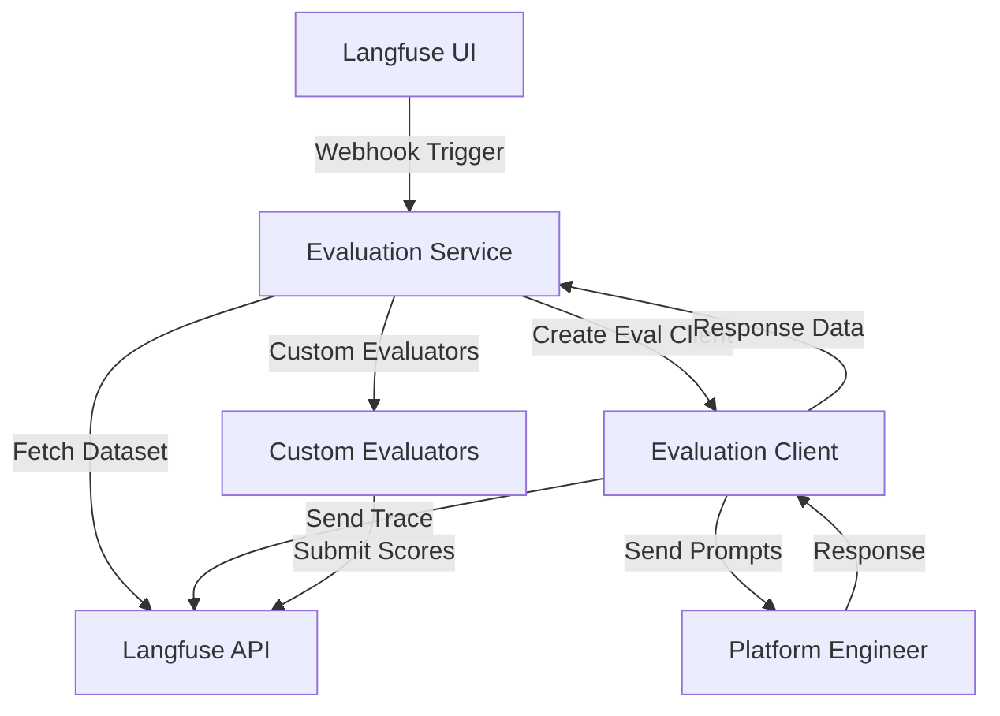

# Platform Engineer Evaluation System

A remote evaluation system for the Platform Engineer agent that integrates with Langfuse for dataset management and evaluation orchestration.

## Overview

This system allows you to run evaluations remotely via the Langfuse UI using webhooks. It evaluates agent performance based on:
- **Execution Time**: How quickly the agent responds
- **Trajectory Matching**: Whether the correct agents are used for each task

## Quick Start

### 1. Upload Test Dataset

```bash
uv run python ai_platform_engineering/evaluation/platform_engineer/datasets/upload_datasets.py
```

### 2. Start Evaluation Webhook

```bash
# Using Docker Compose
docker-compose -f docker-compose.dev.yaml --profile slim-tracing up eval-webhook
```

### 3. Trigger Evaluation

1. Open Langfuse UI at `http://localhost:3000`
2. Go to **Datasets** section
3. Select `platform_engineer_quick_test` dataset
4. Create new experiment → Custom experiment
5. Set URL to: `http://eval-webhook:8000/evaluate`
6. Start evaluation

## Remote Evaluation Flow



1. **Dataset Upload**: Test cases are uploaded to Langfuse via `upload_datasets.py`
2. **Remote Trigger**: Evaluations are triggered from Langfuse UI using webhooks
3. **Evaluation Client**: Creates evaluation client to send prompts to Platform Engineer
4. **Tracing**: Evaluation client sends traces to Langfuse during execution
5. **Scoring**: Evaluation service uses custom evaluators to analyze traces and calculate performance metrics
6. **Results**: Scores are submitted back to Langfuse for analysis

## Key Components

- **`upload_datasets.py`**: Uploads test datasets to Langfuse
- **`langfuse_webhook.py`**: FastAPI webhook service for remote evaluation triggers
- **`evaluation_runner.py`**: Orchestrates evaluation execution
- **`evaluators.py`**: Custom scoring logic for trajectory and timing
- **`eval_client.py`**: Client for communicating with Platform Engineer

## API Endpoints

- `POST /evaluate` - Trigger evaluation from Langfuse webhook
- `GET /health` - Health check for Platform Engineer and Langfuse connectivity
- `GET /evaluations/{id}` - Get specific evaluation status
- `GET /evaluations` - List all evaluation runs

## Learn More

For detailed information about remote evaluation concepts, see the [Langfuse Remote Evaluation Documentation](https://langfuse.com/docs/evaluation/dataset-runs/remote-run).