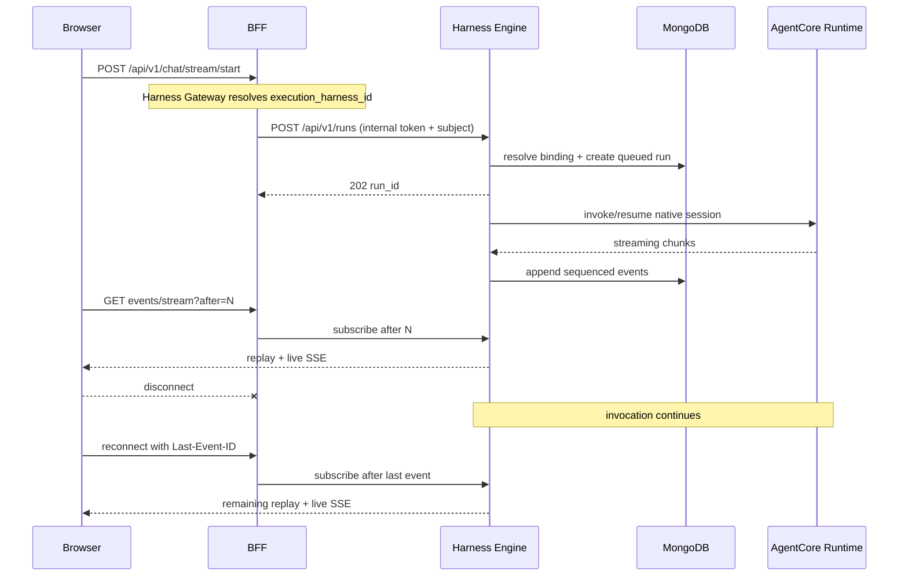

# Harness Engine

Independent execution control plane for non-Dynamic-Agents harnesses. AgentCore
and Claude Agent SDK exercise the same portable blueprint and adapter contract.

## Boundary

- Dynamic Agents source, API, database documents, and streams are unchanged.
- Complete agent blueprints and immutable versions are stored separately in
  `harness_agents` and `harness_agent_versions`.
- Durable `harness_sessions` bind an owner, agent version, and conversation to
  one native provider session. Existing conversations remain pinned when an
  agent is edited.
- `CAIPEAgentSessionManager` owns opaque binding IDs, ownership, version pinning,
  epochs, persistence, and clear. Each adapter supplies a narrow
  `ProviderSessionManager` for native open/observe/close behavior.
- Runs and replayable events are stored in `harness_runs` and `harness_events`.
- The same caller/agent/conversation tuple receives the same opaque binding.
  AgentCore derives a stable `runtimeSessionId`; Claude persists the SDK result
  session ID and supplies it through `resume` on the next turn.
- The Next.js BFF authenticates and authorizes callers, then uses an internal service credential. User bearer tokens never reach Harness Engine or AgentCore.
- A provider invocation belongs to Harness Engine, not to an SSE subscriber. Closing a browser or BFF connection only removes that subscription.
- The existing BFF `/api/v1/chat/*` routes form Harness Gateway. They read the
  BFF-owned `execution_harness_id`, preserve Dynamic Agents for missing/default
  values, and translate Harness Engine canonical events for existing clients.

## Session flow



Web UI, Slack, and Webex use the same gateway routes and AG-UI contract. They
do not load provider SDKs or implement harness-specific routing. Current
non-default adapters support start, detached execution, replay, invoke, and
active-run cancellation. Human-input resume and attachments return an explicit
capability error until their portable contracts are implemented.

The BFF remains horizontally stateless. Harness Engine is session-aware through
durable bindings and owns each provider task after returning `202`. `run_id`, an
event cursor, MongoDB, and the provider session ID form the reconnect contract.
This avoids sticky BFF sessions and keeps execution alive when a browser or BFF
subscriber disconnects. Process-failure takeover of an in-flight provider call
is not implemented yet; completed event replay and subsequent thread resume are.

## Portable contract

- `AgentBlueprint` owns portable prompt, model, tool, thread, memory, workspace,
  streaming, delegation, and run-limit policy.
- `HarnessDescriptor` advertises sanitized operator profiles, a bounded JSON
  Schema, and `native`/`emulated`/`unsupported`/`unavailable` capabilities.
- `HarnessRegistry` validates and normalizes a draft, returns a catalog revision
  and configuration fingerprint, then resolves the selected adapter at run time.
- Adapters receive `RunContext` and emit canonical events only.
- Adapters expose a provider-specific session manager; they do not persist or
  derive CAIPE binding ownership themselves.
- Broker protocols isolate thread state, memory, tools, sandboxes, prompts,
  delegation, and telemetry from SDK-specific code.

See [Portable abstractions](../../docs/docs/specs/2026-08-17-harness-engine/portable-abstractions.md)
for the full contract, UI flow, persistence model, and sandbox target architecture.

## Configuration

Harness Engine variables use the `HARNESS_ENGINE_` prefix:

- `HARNESS_ENGINE_INTERNAL_TOKEN`: required BFF-to-engine credential.
- `HARNESS_ENGINE_STORAGE_BACKEND`: `mongodb` for durable/replayable production sessions; `memory` for tests and local development.
- `HARNESS_ENGINE_MONGODB_URI` and `HARNESS_ENGINE_MONGODB_DATABASE`.
- `HARNESS_ENGINE_AGENTCORE_RUNTIMES_JSON`: alias-to-operator-owned target map. Targets can be custom AgentCore Runtime ARNs or managed AgentCore Harness ARNs. Example: `{"primary":{"arn":"arn:aws:bedrock-agentcore:us-east-1:111122223333:harness/example-AbCdEf1234","qualifier":"DEFAULT","region":"us-east-1"}}`.
- `HARNESS_ENGINE_CLAUDE_SDK_PROFILES_JSON`: alias-to-operator-owned Claude
  policy, for example `{"safe":{"model":"claude-example","cwd":"/workspace","permission_mode":"dontAsk"}}`.
- `HARNESS_ENGINE_EVENT_RETENTION_SECONDS`: TTL for replay events.

With the MongoDB backend, the Claude adapter mirrors the SDK's provider
transcript into `claude_session_transcripts`. CAIPE stores the opaque Claude
session ID in `harness_sessions`; the transcript is the other half of the
resume contract. Keeping both in shared storage lets another Harness Engine
replica resume the thread without depending on a container's local
`~/.claude` directory. The SDK's local working copy lives under `/tmp` and is
disposable.

The UI BFF requires:

- `HARNESS_ENGINE_URL`, for example `http://harness-engine:8010`.
- `HARNESS_ENGINE_INTERNAL_TOKEN`, matching the service value.

Run locally:

```bash
uv sync --all-extras
uv run uvicorn harness_engine.main:app --host 0.0.0.0 --port 8010
```

Quality gates:

```bash
uv run ruff check src tests
uv run pytest -q
```
