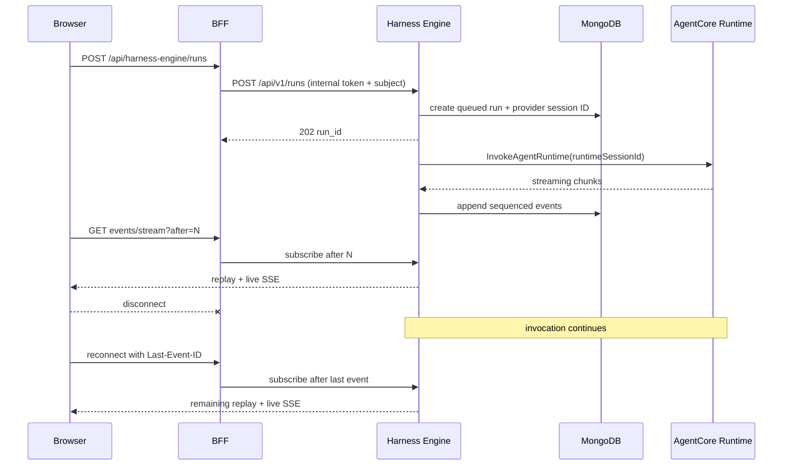

# Harness Engine

Independent execution control plane for non-Dynamic-Agents harnesses. The first adapter invokes an operator-allowlisted Amazon Bedrock AgentCore runtime.

## Boundary

- Dynamic Agents source, API, database documents, and streams are unchanged.
- Harness selection is stored separately in `harness_agent_configs`.
- Runs and replayable events are stored in `harness_runs` and `harness_events`.
- The same caller/agent/conversation tuple receives the same opaque AgentCore `runtimeSessionId`, preserving provider thread context across turns without exposing identity values.
- The Next.js BFF authenticates and authorizes callers, then uses an internal service credential. User bearer tokens never reach Harness Engine or AgentCore.
- A provider invocation belongs to Harness Engine, not to an SSE subscriber. Closing a browser or BFF connection only removes that subscription.

## Session flow



The BFF remains horizontally stateless. `run_id`, an event cursor, MongoDB, and AgentCore's stable `runtimeSessionId` form the session contract. W3C `traceparent` is validated, stored with the run, and included in the AgentCore request payload for runtime-side continuation. This avoids sticky sessions and losing work when a particular BFF replica disappears. A Harness Engine process failure is a separate recovery problem; this initial slice guarantees client-disconnect survival, not provider invocation takeover by another engine replica.

## Configuration

Harness Engine variables use the `HARNESS_ENGINE_` prefix:

- `HARNESS_ENGINE_INTERNAL_TOKEN`: required BFF-to-engine credential.
- `HARNESS_ENGINE_STORAGE_BACKEND`: `mongodb` for durable/replayable production sessions; `memory` for tests and local development.
- `HARNESS_ENGINE_MONGODB_URI` and `HARNESS_ENGINE_MONGODB_DATABASE`.
- `HARNESS_ENGINE_AGENTCORE_RUNTIMES_JSON`: alias-to-operator-owned target map, for example `{"primary":{"arn":"arn:aws:bedrock-agentcore:us-east-1:111122223333:runtime/example","qualifier":"DEFAULT","region":"us-east-1"}}`.
- `HARNESS_ENGINE_EVENT_RETENTION_SECONDS`: TTL for replay events.

The UI BFF requires:

- `HARNESS_ENGINE_URL`, for example `http://harness-engine:8010`.
- `HARNESS_ENGINE_INTERNAL_TOKEN`, matching the service value.

Run locally:

```bash
uv sync --all-extras
uv run uvicorn harness_engine.main:app --host 0.0.0.0 --port 8010
```

Quality gates:

```bash
uv run ruff check src tests
uv run pytest -q
```
