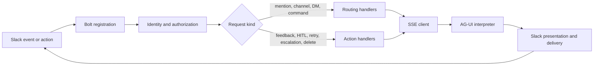

# Slack bot

The Slack integration is a Bolt application that routes Slack requests to
dynamic agents over AG-UI.

## Request path

- Authorization runs before every registered handler and fails closed.
- Mention routing takes precedence over ambient channel-message routing.
- Direct messages and slash commands use the personal agent-resolution chain.
- AG-UI events become protocol-neutral updates before Slack rendering or API calls.

## Module ownership

| Module | Owns | Must not own |
|---|---|---|
| `app.py` | Early redaction, dependency composition, handler registration | Request policy |
| `bootstrap.py` | Environment parsing, clients, health retry, process startup | Handler behavior |
| `handler_dependencies.py` | Narrow dependency contracts for each handler group | Construction or I/O |
| `handlers.py` | Bolt middleware/event/action/view registration | Business policy |
| `authorization.py` | Identity enrichment, OBO binding, deduplication, fail-closed RBAC | Bolt app construction |
| `routing.py` | Composition of channel and personal routing dependencies | Request policy |
| `channel_routing.py` | Channel, mention, and ambient-message dispatch | Personal agent selection |
| `personal_routing.py` | Direct-message agent selection and slash commands | Channel route selection |
| `conversation.py` | Conversation creation, interaction telemetry, and agent invocation | Slack route selection |
| `actions.py` | HITL, feedback, retry, escalation, deletion, and passive events | Route selection |
| `utils/agui_events.py` | AG-UI event and control-marker interpretation | Slack blocks or API calls |
| `utils/ai.py` | Streaming orchestration and Slack delivery | AG-UI wire-type mapping |
| `utils/slack_formatter.py` | Slack block construction and limits | Agent invocation |

## Startup ordering

1. `app.py` installs log redaction before importing Slack Bolt or Slack SDK.
2. `bootstrap.build_runtime()` parses settings and constructs process dependencies.
3. `handlers.configure_handlers()` supplies those dependencies to each handler group.
4. `handlers.register_handlers()` attaches the request boundary to Bolt.
5. `bootstrap.run_runtime()` waits for the API, starts the admin endpoint, and serves Slack.

Importing authorization, routing, action, or AG-UI interpretation modules does
not construct a Bolt app, call the platform API, retry, sleep, or exit the process.

## Tests

- Put domain behavior tests beside the owning extracted module.
- Keep application-boundary tests limited to construction, registration, and startup ordering.
- Preserve Slack-visible text, routing precedence, retry behavior, authorization denials, and audit calls with characterization tests.
