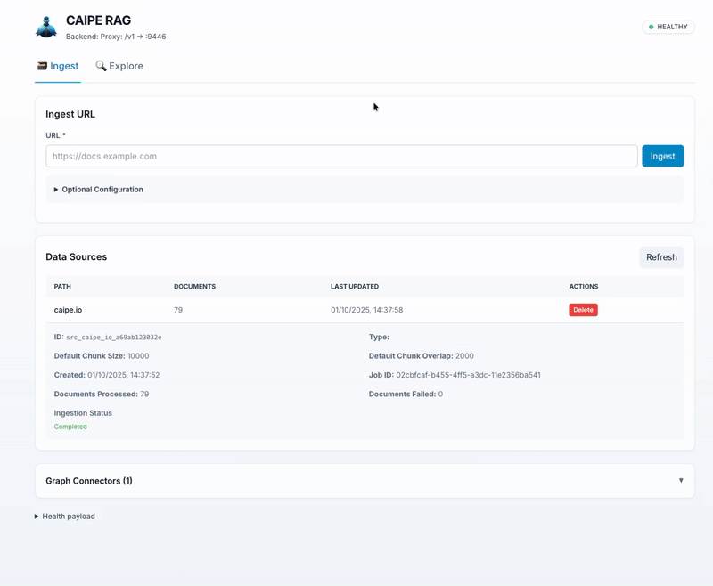

# 🚀 CAIPE RAG

[](https://www.python.org/)
[](https://github.com/astral-sh/uv)
[](LICENSE)

---

## Overview

- 🤖 **Intelligent Knowledge Platform** with autonomous ontology discovery and RAG-powered question answering across multiple data sources.
- 🧠 **Ontology Agent:** AI agent that automatically discovers and evaluates entity relationships from graph data using heuristics and LLM evaluation.
- 🔍 **RAG/GraphRAG Agent:** Retrieval-augmented generation system for answering questions using vector embeddings and graph traversal.
- 🌐 **Ingestion and Indexing:** Supports ingestion of URLs, as well as ingestors for AWS, Kubernetes, Backstage, and other data sources.
- 📊 **Graph Database Integration:** Uses Neo4j for both data storage and ontology relationship management.




## Quick Start

```bash
# Start all services
docker compose --profile apps up
```

**Access Points:**
- Web UI: [http://localhost:9447/knowledge-bases](http://localhost:9447/knowledge-bases)
- API Docs: [http://localhost:9446/docs](http://localhost:9446/docs)
- Neo4j Browser: [http://localhost:7474](http://localhost:7474)

### Authentication

Configure environment variables for JWT authentication and OpenFGA authorization:

```bash
# UI authentication (OIDC)
OIDC_ISSUER=https://your-keycloak.com/realms/production
OIDC_CLIENT_ID=rag-ui
OIDC_CLIENT_SECRET=xxx

# Ingestor authentication (OAuth2 client credentials)
INGESTOR_OIDC_ISSUER=https://your-keycloak.com/realms/production
INGESTOR_OIDC_CLIENT_ID=rag-ingestor
INGESTOR_OIDC_CLIENT_SECRET=xxx

# Human KB authorization
OPENFGA_HTTP=http://openfga:8080
```

**Supported OIDC Providers:** Keycloak, Azure AD, Okta, AWS Cognito

RAG treats human JWTs as identity-only. KB, data-source, and tool authorization
comes from OpenFGA relationships rather than AD/OIDC groups or Keycloak realm
roles.

If you have Claude code, VS code, Cursor etc. you can connect upto the MCP server running at http://localhost:9446/mcp

**Documentation:**
- [Architecture Overview](Architecture.md) - System architecture and data flows
- [Server](server/README.md) - Core API and orchestration layer
- [Ontology Agent](agent_ontology/README.md) - Autonomous schema discovery
- [Ingestors](ingestors/README.md) - Data source integrations

## Connections

DEFAULT port configurations between components:

**Server (Port 9446):**
- Connects to Neo4j over `7687` (bolt protocol)
- Connects to Redis over `6379`
- Connects to Milvus over `19530`
- Proxies to agent_ontology over `8098`
- Exposes REST API

**Ontology Agent (Port 8098):**
- Connects to Neo4j over `7687`
- Connects to Redis over `6379`
- Proxies queries from Server

**CAIPE Agent (MCP):**
- Connects to Server over `9446` (MCP tools)

**Ingestors:**
- Connect to Server over `9446` (REST)
- Connect to Redis over `6379` (webloader ingestor)

**Databases:**
- Neo4j Data: `7687` (bolt), `7474` (browser)
- Neo4j Ontology: `7687` (bolt) - separate database
- Milvus: `19530` (gRPC)
- Redis: `6379`

---

## Local Development

Start dependent services only:

```bash
docker compose --profile deps up
```

Run components individually:

```bash
# Server
cd server && uv sync && source .venv/bin/activate && python3 src/server/__main__.py

# Ontology Agent
cd agent_ontology && uv sync && source .venv/bin/activate && python3 src/agent_ontology/restapi.py
```