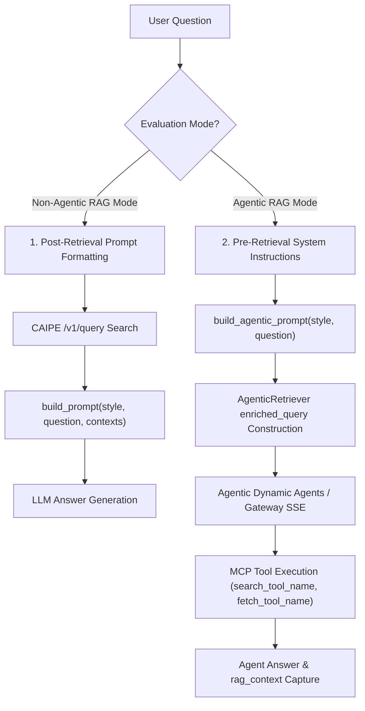

# Agentic RAG Client

This page documents the agentic RAG client implemented in `src/deepeval_eval/engine/agentic_rag.py`. It provides a full agentic retriever that queries the CAIPE streaming BFF gateway to capture rag_context artifacts emitted during agent tool calls.

## Overview

The agentic RAG client is designed for evaluating CAIPE's agentic chat capabilities — specifically, how an AI agent retrieves and uses documents to answer questions through tool calls, rather than through a direct REST API.

It communicates with the CAIPE platform via the **SSE Streaming Gateway Protocol**:

| Protocol | Endpoint | Description |
| --- | --- | --- |
| **SSE Streaming Gateway** | `POST /api/chat/conversations` + `POST /api/v1/chat/stream/start` | Two-step BFF gateway flow with server-sent events for streaming tool outputs and final answer. |

The agentic mode is the platform default (`agentic=True`). To evaluate in non-agentic mode (direct `SearchRagClient` query to RAG Server), pass `--no-agentic` in the CLI or set `"agentic": false` in the REST API.

## Architecture

~~~mermaid
flowchart TD
    A[Question] --> D[Create conversation POST /api/chat/conversations]
    D --> E[Stream POST /api/v1/chat/stream/start]
    E --> G[Parse SSE events for rag_context & content]
    G --> H[Deduplicate & merge contexts]
    H --> I[Return contexts + answer + token usage]
~~~

## Core Classes

### `AgenticRetriever`

The primary retriever that queries the CAIPE BFF gateway.

| Attribute | Default | Description |
| --- | --- | --- |
| `agent_api_url` | `http://localhost:8000` | CAIPE agent/gateway URL. Read from `CAIPE_AGENT_URL` / `CAIPE_API_URL` env var or `--agent-url`. |
| `agent_id` | `hello-world` | CAIPE target agent identifier. |
| `timeout` | `200.0` | Request timeout in seconds. |
| `insecure` | `False` | Skip SSL verification. Also controlled by `INSECURE_SSL` env var. |
| `trace_log` | `False` | Enable trace logging. Also controlled by `CAIPE_TRACE_LOG` env var. |
| `fail_on_error` | `False` | Raise exception on retrieval failure. |

#### Key Methods

| Method | Purpose |
| --- | --- |
| `get_top_k(query, k, run_id, trace_log)` | Main retrieval entry point. Queries the agent gateway and extracts contexts. Populates `self.documents` and `self.documents_metadata`. |
| `retrieve(question, k)` | Backward-compatible method returning `AgenticRAGResult`. Used by DeepEval evaluation loops. |
| `fit(documents)` | No-op stub for compatibility. AgenticRetriever does not support local fitting. |
| `_query_gateway(question, k, run_id, trace_log)` | Sends SSE streaming query through the BFF gateway. |
| `_get_oidc_token()` | Fetches OIDC token dynamically via client credentials grant. Falls back to static tokens. |

### `AgenticRAG`

A higher-level RAG pipeline class that wraps `AgenticRetriever` and provides a unified query interface.

| Attribute | Default | Description |
| --- | --- | --- |
| `llm_client` | `None` | No LLM client needed — the agent generates answers itself. |
| `model_name` | `"agentic"` | Model name identifier. |
| `retriever` | `AgenticRetriever` instance | The underlying retriever. |
| `log_dir` | `None` | Directory for trace logs. |

#### Key Methods

| Method | Purpose |
| --- | --- |
| `query(question, top_k, run_id, trace_log)` | Single-call query returning contexts, answer, and usage metadata. |
| `export_traces_to_log(run_id, question, result)` | Exports trace events to a JSON log file. |

### `AgenticRAGResult`

A `dataclass` representing the result of an agentic retrieval:

| Field | Type | Description |
| --- | --- | --- |
| `answer` | `str` | The agent-generated answer. |
| `contexts` | `list[str]` | Retrieved document contexts. |
| `latency_ms` | `float` | Total latency in milliseconds. |
| `task_id` | `str` | UUID for the retrieval task. |
| `input_tokens` | `int` | Prompt tokens used by the agent. |
| `output_tokens` | `int` | Completion tokens used by the agent. |
| `total_tokens` | `int` | Total tokens. |
| `error` | `Optional[str]` | Error message if retrieval failed. |

## Protocol Details

### SSE Streaming Gateway Protocol

The gateway protocol uses a two-step flow:

**Step 1: Create Conversation Session**

```
POST /api/chat/conversations
{
  "title": "Agentic Session",
  "client_type": "webui",
  "agent_id": "hello-world"
}
```

Returns a `conversation_id`.

**Step 2: Stream Chat**

```
POST /api/v1/chat/stream/start
{
  "message": "What is CAIPE?",
  "conversation_id": "uuid",
  "agent_id": "hello-world",
  "protocol": "custom",
  "client_context": {
    "source": "eval",
    "tool_result_display_limit": -1
  }
}
```

The response is an SSE stream with events:

| Event | Meaning |
| --- | --- |
| `event: content` | Final answer text pieces (`data.text`). |
| `event: tool_end` | Tool outputs / RAG contexts (`data.result`). Parsed for `rag_context` artifacts. |
| `event: tool_start` | Tool invocation start (no output captured). |

SSE events are parsed and logged (if `trace_log=True`):

```
event: tool_end
data: {"result": {"rag_context": {...}}}
```

## Context Parsing

The agentic client parses rag_context artifacts from both protocols into `(content, doc_id)` tuples:

### From `knowledge-base_search` Tool

The search tool MCP server response dictionary **must** return result items under a key with the `results` suffix (e.g., `results`, `semantic_results`, or `keyword_results`). If the response dictionary uses a non-matching key name, `_parse_rag_context_artifact` will skip context parsing and `retrieved_doc_ids` will be empty (`[]`).

> [!IMPORTANT]
> **MCP Tool Response Key Requirement**:
> Search tool MCP responses must format their top-level response payload with a `*results` dictionary key (e.g. `results: [...]`, `semantic_results: [...]`, `keyword_results: [...]`). Standard search tools should return `{"results": [...]}`.

```json
{
  "results": [
    {
      "text_content": "CAIPE is a RAG system...",
      "metadata": {
        "document_id": "doc_123"
      }
    }
  ],
  "semantic_results": [...],
  "keyword_results": [...]
}
```

### From `knowledge-base_fetch_document` Tool

```json
[
  {
    "document": {
      "page_content": "CAIPE is a RAG system...",
      "document_id": "doc_123",
      "metadata": {...}
    }
  }
]
```

### Markdown Cleaning

Search tool snippets often contain UI-formatted markup like `**Snippet:** ...**CAIPE** uses nomic-embed-text...`. The `clean_snippet_markdown()` function strips this:

1. Removes `**Snippet:**` prefix.
2. Replaces ellipsis (`...`) with spaces.
3. Strips bold markup (`**...**`).
4. Normalizes whitespace.

### Deduplication

Two deduplication strategies are applied:

| Function | Purpose |
| --- | --- |
| `_dedupe_preserve_order(items)` | Deduplicates by content, preserving first-seen order. |
| `_dedupe_and_merge_contexts(items)` | Deduplicates and merges by `doc_id`, preferring longer/full content. |

## OIDC Authentication

The agentic client fetches OIDC tokens dynamically:

1. **Environment Variables**: Checks `CAIPE_CLIENT_ID`, `CAIPE_CLIENT_SECRET`.
2. **Kubernetes Secret**: If not in environment, attempts `kubectl get secret caipe-ui-secret -n caipe`.
3. **Keycloak**: Sends client credentials grant to Keycloak.

Default Keycloak URL:
- Production: `https://keycloak.example.com/realms/caipe/protocol/openid-connect/token`
- Local: `http://localhost:7080/realms/caipe/protocol/openid-connect/token`

The fetched token is cached in `CAIPE_OIDC_TOKEN` environment variable.

## System Prompts & Query Formatting Architecture

The evaluation engine supports **two distinct types of system prompts** depending on whether queries execute in **Non-Agentic RAG Mode** or **Agentic RAG Mode**.



### 1. Non-Agentic RAG Mode Prompt Styles (Post-Retrieval)

In Non-Agentic RAG mode (`SearchRagClient` / `OracleRagClient`), prompt formatting occurs **after document retrieval**.

- **Function**: `build_prompt(style, question, contexts, prompt_args=None, db_manager=None)`
- **Input Placeholders**: `{question}`, `{context}` / `{contexts}`, and dynamic `prompt_args`.
- **Purpose**: Injects retrieved document chunks and question into a single prompt payload sent to the LLM generation endpoint.
- **Built-in Styles**:
  - `generation`: Standard post-retrieval context-grounded prompt.
  - `short`: Concise short answer prompt.
  - `custom`: Dynamic user-defined or database-stored prompt templates.

---

### 2. Agentic RAG Mode System Prompts (Pre-Retrieval)

In Agentic RAG mode (`AgenticRagAdapter` / `AgenticRetriever`), prompt formatting occurs **before retrieval**. System instructions consist of two layers:

#### A. Query Instruction Decorator (`build_agentic_prompt`)
Formats the query before dispatching to the agentic supervisor/gateway.
- **Function**: `build_agentic_prompt(style, question, prompt_args=None, db_manager=None)`
- **Behavior**: If `style` is `None` or empty, returns the user question as-is without any prompt wrapper.
- **Built-in Styles**:
  - `agentic_generation`: Standard pre-retrieval instruction ("Answer the following question using available search tools...").
  - `agentic_short`: Concise pre-retrieval instruction ("Answer the user query concisely using available search tools...").

#### B. System-Level Query Prompt (`enriched_query`)
The system-level query prompt (`enriched_query`) is constructed dynamically by `AgenticRetriever.get_top_k` and wraps the user query with explicit **system-level operational guardrails**:

1. **Tool Invocation Routing**: Directs the agent to invoke specific MCP tools (`search_tool` and `fetch_tool`).
2. **Datasource Scoping & Filters**: Instructs the agent to pass `filters={"datasource_id": "<effective_datasource_id>"}` when executing searches to strictly isolate the target knowledge base.
3. **Search Term Sanitization**: Explicitly orders the agent to keep the search `query` string argument clean and avoid including system prompt instructions inside search queries.
4. **Retrieval Limit Controls**: Caps document search and reading actions up to `k` items to prevent context blowup and runaway tool calls.

- **Configurable Tool Names**:
  - `search_tool_name`: Target MCP search tool name (Default: `DEFAULT_SEARCH_TOOL_NAME` = `"knowledge-base_search"`, configurable via `CAIPE_SEARCH_TOOL_NAME`, `--search-tool-name`, or REST API).
  - `fetch_tool_name`: Target MCP document fetch tool name (Default: `DEFAULT_FETCH_TOOL_NAME` = `"knowledge-base_fetch_document"`, configurable via `CAIPE_FETCH_TOOL_NAME`, `--fetch-tool-name`, or REST API).

```python
# System-Level Query Prompt (enriched_query) generated dynamically by AgenticRetriever
Instructions: You are answering a question that belongs to the 'enterprise_rag_bench' datasource.
When calling the `knowledge-base_search` tool, you MUST pass `filters={"datasource_id": "enterprise_rag_bench"}`
to restrict your search to this knowledge base, and set the `limit` parameter to up to 5.
Keep the `query` argument of the search tool clean and do not include these instructions in it.
Importantly, only fetch and read (using the `knowledge-base_fetch_document` tool) the specific documents
you actually need to confidently answer the question, up to a maximum of 5 documents.

Question: What is CAIPE?
```

---

## Datasource & Tool Enrichment

When `CAIPE_DATASOURCE_ID` or `--datasource-id` is set, the query is enriched with instructions for the agent:

```
Instructions: You are answering a question that belongs to the 'enterprise_rag_bench' datasource.
When calling the `knowledge-base_search` tool, you MUST pass `filters={"datasource_id": "enterprise_rag_bench"}`
to restrict your search to this knowledge base, and set the `limit` parameter to up to 5.
Keep the `query` argument of the search tool clean and do not include these instructions in it.
Importantly, only fetch and read (using the `knowledge-base_fetch_document` tool) the specific documents
you actually need to confidently answer the question, up to a maximum of 5 documents.

Question: What is CAIPE?
```

## Trace Logging

When `trace_log=True` or `CAIPE_TRACE_LOG=true`:

- Trace events exported to JSON log file.
- SSE: Streams raw events to `logs/agentic_run_{run_id}.log`.

Trace events include:
| Event Type | Component | Data |
| --- | --- | --- |
| `query_start` | `agentic_rag` | run_id, question, agent_api_url |
| `query_complete` | `agentic_rag` | run_id, success, num_retrieved, answer_length |
| `error` | `agentic_rag` | run_id, error message |

## Usage in Evaluation

### 1. Standard Agentic Evaluation

The agentic client can be invoked with the default `knowledge-base_search` tool:

```bash
uv run python3 src/deepeval_eval/engine/deepeval_evaluator.py eval \
     --dataset-name enterprise \
     --datasource-id enterprise_rag_bench_deepeval \
     --questions-file data/enterprise_rag_bench_questions.jsonl \
     --rag-url https://caipe.example.com/api/rag \
     --agent-url https://caipe.example.com \
     --agentic \
     --top-k 5 \
     --max-items 10
```

---

### 2. Agentic Evaluation with Ephemeral Dynamic MCP Search Tools

Dynamic MCP tools allow evaluating custom retrieval settings (e.g. semantic weight, additional filters) by creating a temporary custom search tool on the RAG server, directing the agent to use it, and tearing it down automatically.

#### CLI Arguments

| Argument | Type | Default | Description |
| :--- | :--- | :--- | :--- |
| `--dynamic-tool` | flag | `False` | Enable dynamic MCP custom search tool creation and lifecycle management. |
| `--semantic-weight` | float | `0.5` | Hybrid search semantic vs keyword weight (`0.0` = purely keyword, `1.0` = purely vector). |
| `--extra-filters` | JSON string | `{}` | Additional metadata filters applied to the search (e.g. `'{"source_type": "confluence"}'`). |
| `--tool-description` | string | `None` | Custom description for the generated MCP search tool. |

#### Direct CLI Command

```bash
uv run python3 src/deepeval_eval/engine/deepeval_evaluator.py eval \
     --dataset-name enterprise \
     --datasource-id enterprise_rag_bench_deepeval \
     --questions-file data/enterprise_rag_bench_questions.jsonl \
     --rag-url https://caipe.example.com/api/rag \
     --agent-url https://caipe.example.com \
     --agentic \
     --trace-log \
     --top-k 2 \
     --max-items 5 \
     --dynamic-tool \
     --semantic-weight 0.75 \
     --tool-description "Ephemeral dynamic MCP search tool with 0.75 semantic weight"
```

#### Automated Script (Enterprise RAG Bench)

The repository provides an automated wrapper script that fetches the `admin@example.com` token from cluster secrets and executes the dynamic MCP evaluation:

```bash
./scripts/run_eval_enterprise_dynamic_mcp.sh --max-items 10 --semantic-weight 0.5
```

#### REST API Submission Payload

When submitting an asynchronous evaluation job via the REST API (`POST /eval/jobs` or `https://caipe.example.com/api/rag-evaluator/jobs`):

```json
{
  "dataset_name": "enterprise",
  "datasource_id": "enterprise_rag_bench_deepeval",
  "agentic": true,
  "dynamic_tool": true,
  "semantic_weight": 0.5,
  "extra_filters": {
    "organization": "caipe"
  },
  "tool_description": "Ephemeral 50/50 hybrid search tool",
  "top_k": 3,
  "max_items": 10
}
```

---

## Comparison With Standard CAIPE Client

| Aspect | `SearchRagClient` | `AgenticRetriever` |
| --- | --- | --- |
| Query method | Direct REST (`POST /v1/query`) | Agent tool calls via SSE gateway |
| Protocol | HTTP JSON | SSE streaming (`/api/v1/chat/stream/start`) |
| Answer source | LLM generated from retrieved context | Agent generates answer itself |
| Context source | CAIPE rag-server response | Agent's `rag_context` artifacts |
| Authentication | Bearer token (static or Keycloak) | Dynamic OIDC from env or K8s secret |
| Use case | Standard RAG retrieval evaluation | Agentic chat evaluation |
| Token tracking | Via LLM client | From agent `usage_metadata` in artifacts |
