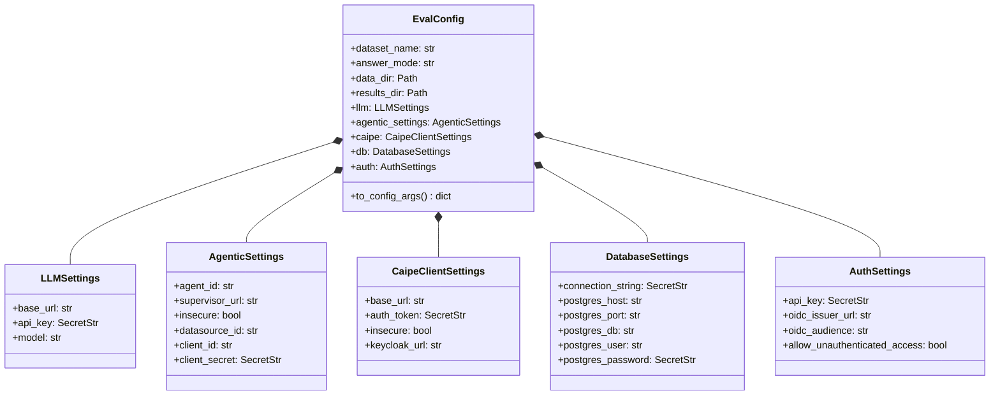

# Architecture

This project is a small evaluation harness around CAIPE rag-server. It does not implement CAIPE itself. It prepares benchmark data, sends documents to CAIPE ingestion endpoints, queries CAIPE retrieval, generates answers from retrieved context, and scores the result with DeepEval.

## High-Level Architecture

~~~mermaid
flowchart LR
    subgraph Benchmarks
        A[EnterpriseRAG-Bench]
        B[HotpotQA]
    end

    subgraph DatasetModules
        C[enterprise_dataset.py]
        D[hotpotqa_dataset.py]
    end

    subgraph LocalOutputs
        E[data corpus files]
        F[data question files]
    end

    subgraph BFF ["Next.js BFF (caipe-ui:3000)"]
        BFF1["/api/rag → RAG Server"]
        BFF2["/api/dynamic-agents → Supervisor"]
    end

    subgraph CAIPE
        G[rag-server ingest endpoints]
        H[rag-server query endpoint]
        SV[Dynamic Agents Supervisor]
    end

    subgraph Evaluation
        I[retrieved contexts]
        J[LLM answer generation]
        K[DeepEval judge]
        L[metrics.py]
    end

    subgraph ResultSinks ["Result Sinks (dual)"]
        M[FileResultSink — JSON + CSV]
        N[PostgresResultSink — evaluation_runs + evaluation_results]
    end

    A --> C
    B --> D
    C --> E
    C --> F
    D --> E
    D --> F
    E --> G
    F --> BFF1
    F --> BFF2
    BFF1 --> H
    BFF2 --> SV
    H --> I
    SV --> I
    I --> J
    J --> K
    I --> L
    K --> L
    L --> M
    L --> N
~~~

## Runtime Components

| Component | File | Responsibility |
| --- | --- | --- |
| REST API Service & Ingress | [`src/deepeval_eval/api/app.py`](../src/deepeval_eval/api/app.py) | FastAPI REST application entry point with OpenAPI/Swagger UI, route registration, error handlers, and lifecycle hooks. |
| API Auth & ReBAC Guards | [`src/deepeval_eval/api/auth.py`](../src/deepeval_eval/api/auth.py) | JWT / Bearer token validation against Keycloak OIDC, API key authentication, and OpenFGA ReBAC permission dependency guards. |
| Persistent Job Queue | [`src/deepeval_eval/api/job_queue.py`](../src/deepeval_eval/api/job_queue.py) | Background evaluation job state machine, worker concurrency control (`EVAL_MAX_CONCURRENT_JOBS`), in-memory bounded cache, and PostgreSQL sync. |
| Question Sets API Router | [`src/deepeval_eval/api/question_sets.py`](../src/deepeval_eval/api/question_sets.py) | REST endpoints for Question Sets and Questions CRUD, batch uploading, CSV/JSONL parsing, and dataset export. |
| Prompt Styles API Router | [`src/deepeval_eval/api/prompt_styles.py`](../src/deepeval_eval/api/prompt_styles.py) | REST endpoints for prompt style template CRUD; admin-guarded mutation, visibility-filtered listing. |
| Telemetry & Metrics | [`src/deepeval_eval/api/telemetry.py`](../src/deepeval_eval/api/telemetry.py) | Prometheus metrics instrumentation (`/metrics` endpoint) for evaluation jobs, durations, errors, and throughput. |
| Token Manager | [`src/deepeval_eval/auth/token_manager.py`](../src/deepeval_eval/auth/token_manager.py) | M2M Keycloak service account token acquisition and proactive token refresh (refreshes 30s before expiry). |
| OBO Token Exchange | [`src/deepeval_eval/auth/obo_exchange.py`](../src/deepeval_eval/auth/obo_exchange.py) | OAuth2 token exchange (RFC 8693) handling On-Behalf-Of (OBO) user-delegated token minting for downstream queries. |
| CAIPE Search Client | [`src/deepeval_eval/clients/search_rag.py`](../src/deepeval_eval/clients/search_rag.py) | Wraps rag-server REST query calls; extracts retrieved contexts and source metadata; enforces proactive token authentication. |
| Ingest RAG Client | [`src/deepeval_eval/clients/ingest_rag.py`](../src/deepeval_eval/clients/ingest_rag.py) | Handles batched document ingestion jobs against CAIPE RAG Server ingestion endpoints. |
| RAG Client Adapter | [`src/deepeval_eval/clients/rag.py`](../src/deepeval_eval/clients/rag.py) | Unified RAG client interfaces (`AgenticRagAdapter`, `BaseRagClient`) for non-agentic CAIPE and Agentic RAG endpoints. |
| Precomputed Oracle Client | [`src/deepeval_eval/clients/oracle.py`](../src/deepeval_eval/clients/oracle.py) | Precomputed evaluation client handling offline or reference modes (oracle query using question + reference). |
| Dynamic MCP Tool Manager | [`src/deepeval_eval/clients/mcp_tool_manager.py`](../src/deepeval_eval/clients/mcp_tool_manager.py) | Context-manager that provisions and tears down ephemeral custom MCP search tools with deterministic naming and TTL. |
| LLM Adapter | [`src/deepeval_eval/clients/llm.py`](../src/deepeval_eval/clients/llm.py) | Calls OpenAI-compatible LLM endpoints for generation and adapts the model to DeepEval's judge interface. |
| Configuration Manager | [`src/deepeval_eval/core/config.py`](../src/deepeval_eval/core/config.py) | Centralized Pydantic-based configuration management (`EvalConfig`, domain settings models), secret masking, and environment resolution. |
| Prompt Style Template Engine | [`src/deepeval_eval/core/prompt_style.py`](../src/deepeval_eval/core/prompt_style.py) | System and query prompt templating, dynamic variable substitution (`{query}`, `{context}`), and default style templates. |
| IO & Cache Utilities | [`src/deepeval_eval/core/io_utils.py`](../src/deepeval_eval/core/io_utils.py) | Download helpers, file caching, and JSONL question dataset readers/writers. |
| Base Dataset Interface | [`src/deepeval_eval/datasets/base.py`](../src/deepeval_eval/datasets/base.py) | Base abstractions and data models for benchmark dataset providers and items. |
| Enterprise Dataset Logic | [`src/deepeval_eval/datasets/enterprise.py`](../src/deepeval_eval/datasets/enterprise.py) | Downloads, parses, and samples EnterpriseRAG-Bench questions and source document slices. |
| HotpotQA Dataset Logic | [`src/deepeval_eval/datasets/hotpotqa.py`](../src/deepeval_eval/datasets/hotpotqa.py) | Reads preprocessed HotpotQA archives and extracts gold context documents along with distractors. |
| Dataset Loaders | [`src/deepeval_eval/datasets/loader.py`](../src/deepeval_eval/datasets/loader.py) | Flexible dataset loaders for JSONL/CSV disk files, in-memory datasets, and database Question Sets (`QuestionSetDataLoader`). |
| Database Manager (Base) | [`src/deepeval_eval/db/db_manager.py`](../src/deepeval_eval/db/db_manager.py) | Base PostgreSQL connection manager delegating to domain-specific DB managers. |
| Question DB Manager | [`src/deepeval_eval/db/question_db_manager.py`](../src/deepeval_eval/db/question_db_manager.py) | PostgreSQL manager for `question_sets` and `questions` schema, queries, search indexing, and batch transactions. |
| Evaluation DB Manager | [`src/deepeval_eval/db/evaluation_db_manager.py`](../src/deepeval_eval/db/evaluation_db_manager.py) | PostgreSQL manager for evaluation job queue (`eval_job_queue`), runs (`evaluation_runs`), and results (`evaluation_results`). |
| Prompt DB Manager | [`src/deepeval_eval/db/prompt_db_manager.py`](../src/deepeval_eval/db/prompt_db_manager.py) | PostgreSQL manager for custom prompt styles, access visibility, and template persistence. |
| Evaluation Pipeline Engine | [`src/deepeval_eval/engine/eval_engine.py`](../src/deepeval_eval/engine/eval_engine.py) | High-level evaluation runner orchestrating dataset loading, prompt styling, retrieval, generation, scoring, and sink dispatch. |
| DeepEval Test Runner | [`src/deepeval_eval/engine/deepeval_evaluator.py`](../src/deepeval_eval/engine/deepeval_evaluator.py) | Adapts questions to DeepEval `LLMTestCase` instances and executes the metric evaluation test suite. |
| Agentic Retriever | [`src/deepeval_eval/engine/agentic_rag.py`](../src/deepeval_eval/engine/agentic_rag.py) | AgenticRetriever and AgenticRAG: SSE streaming protocol parser, `rag_context` artifact parsing, deduplication, and trace logging. |
| Shared Metrics Engine | [`src/deepeval_eval/engine/metrics.py`](../src/deepeval_eval/engine/metrics.py) | Builds DeepEval metrics and computes deterministic retrieval checks (Recall, Precision, MRR, nDCG, hit rate). |
| Quality Gate | [`src/deepeval_eval/engine/gate.py`](../src/deepeval_eval/engine/gate.py) | Threshold comparison engine (hard/soft criteria) producing gate reports; callable via CLI or programmatically. |
| Ingestion Pipeline | [`src/deepeval_eval/ingest/ingest.py`](../src/deepeval_eval/ingest/ingest.py) | Unified ingestion pipeline orchestrating datasource registration, document batching, progress tracking, and job finalization. |
| File Result Sink | [`src/deepeval_eval/sinks/file_sink.py`](../src/deepeval_eval/sinks/file_sink.py) | Persists evaluation summaries and detailed itemized results to local JSON and CSV files. |
| PostgreSQL Result Sink | [`src/deepeval_eval/sinks/psql_sink.py`](../src/deepeval_eval/sinks/psql_sink.py) | Persists evaluation runs, summary metrics, and per-question score records to PostgreSQL tables. |
| Composite Result Sink | [`src/deepeval_eval/sinks/composite_sink.py`](../src/deepeval_eval/sinks/composite_sink.py) | Dual-sink dispatcher fanning out result persistence to multiple sinks (e.g. disk + PostgreSQL). |
| Metrics Aggregator | [`src/deepeval_eval/sinks/metrics_aggregator.py`](../src/deepeval_eval/sinks/metrics_aggregator.py) | Aggregates individual question evaluation results into overall dataset run summaries and metric statistics. |
| Sink Protocol Definition | [`src/deepeval_eval/sinks/protocol.py`](../src/deepeval_eval/sinks/protocol.py) | Python `Protocol` defining the standard interface for evaluation result sinks. |

## Database Schema & Question Sets

The PostgreSQL evaluator database maintains two primary domain areas: **Evaluation Runs** and **Question Sets**.

### `questions` Table Schema

The `questions` table defines dedicated first-class columns for fast indexing, filtering, and metric calculation:

- `id` (`BIGSERIAL PRIMARY KEY`): Unique database record ID.
- `question_set_id` (`BIGINT REFERENCES question_sets(id) ON DELETE CASCADE`): Owning question set.
- `question_id` (`TEXT`): String identifier (e.g. `"qst_0001"`).
- `input` (`TEXT NOT NULL`): Question prompt or query.
- `expected_output` (`TEXT`): Ground truth target answer.
- `category` (`TEXT`): Categorization tag (indexed with `idx_questions_set_category`).
- `level` (`TEXT`): Difficulty classification (e.g. `"easy"`, `"medium"`, `"hard"`).
- `expected_doc_ids` (`TEXT[] NOT NULL DEFAULT '{}'`): Ground-truth source document IDs required by retrieval metrics (Recall, Precision, MRR, nDCG).
- `context` (`JSONB`): Ground-truth / golden context chunks.
- `extra` (`JSONB`): Auxiliary metadata (e.g. `supporting_facts`, `answer_facts`).

> **Note on `additional_metadata` Compatibility**: When uploading question sets where attributes are nested under an `additional_metadata` sub-dictionary, `QuestionDBManager.add_questions` extracts `category`, `level`, `expected_doc_ids`, and `context` directly into their designated top-level SQL columns while retaining any remaining metadata in `extra`.

## CAIPE Interaction

All evaluation traffic to CAIPE routes through the **Next.js BFF** (`CAIPE_API_URL/api/rag` or `CAIPE_API_URL/api/dynamic-agents`). Direct service access to `rag-server:9446` or `dynamic-agents:8001` has been **removed** from cluster deployments — see [api_access_patterns.md](api_access_patterns.md) for the decision rationale.

### Ingestion Endpoints (RAG Server, direct — local dev only)

| Endpoint | Used for |
| --- | --- |
| POST /v1/ingestor/heartbeat | Register the ingestion source and obtain batch limits. |
| POST /v1/datasource | Create or update a datasource record. |
| DELETE /v1/datasource | Reset a datasource when requested. |
| POST /v1/job | Open an ingestion job. |
| POST /v1/ingest | Send document batches into CAIPE. |
| POST /v1/job/{job_id}/increment-document-count | Update CAIPE job document count after each batch. |
| POST /v1/job/{job_id}/increment-progress | Update CAIPE job progress after each batch. |
| PATCH /v1/job/{job_id} | Mark ingestion complete. |

### Retrieval Endpoints (via BFF in cluster deployments)

| Topology | URL Pattern | Evaluator Env Var |
| :--- | :--- | :--- |
| Local dev | `http://localhost:9446/v1/query` | `CAIPE_BASE_URL=http://localhost:9446` |
| Docker Compose | `http://caipe-ui:3000/api/rag/v1/query` | `CAIPE_BASE_URL=http://caipe-ui:3000/api/rag` |
| Kubernetes | `http://caipe-caipe-ui:3000/api/rag/v1/query` | Injected via Helm values |
| Remote/CI | `https://<domain>/api/rag/v1/query` | `CAIPE_API_URL=https://<domain>` |

Authentication is enforced. `SearchRagClient.ensure_authenticated()` is called before every `query_raw()` call; it checks the token expiry clock and triggers `refresh_access_token()` if the token is within 30 seconds of expiry. This prevents job timeouts on long benchmark sweeps. If no credentials are configured, requests are sent without an auth header and the RAG Server will enforce its own auth policy.

## LLM and DeepEval Interaction

The evaluation step uses two model-facing roles:

| Role | Implementation |
| --- | --- |
| Answer generation | OpenAICompatibleClient sends a prompt containing the question and retrieved contexts. |
| DeepEval judge | DeepEvalJudge adapts the same OpenAI compatible client to DeepEval expected model interface. |

Both use the resolved OPENAI_ENDPOINT, OPENAI_API_KEY, and OPENAI_MODEL_NAME values.

## Data Flow Summary

1. Dataset-specific modules build a bounded local corpus and a matching question set.
2. The corpus is ingested into CAIPE via the RAG Server ingest endpoints.
3. For each question, the evaluation client routes through the **Next.js BFF** (not directly to the RAG Server or Supervisor):
   - Non-agentic: `SearchRagClient` → `{CAIPE_API_URL}/api/rag/v1/query`
   - Agentic: `AgenticRagAdapter` → `{CAIPE_API_URL}/api/v1/chat/stream/start` (SSE streaming)
4. Retrieved contexts are passed to the LLM to generate an answer.
5. DeepEval metrics and retrieval checks are computed.
6. Results are persisted via configured sinks:
   - **CLI / Local Evaluations**: Uses **Dual-Sink** persistence — writes timestamped JSON + CSV to `results/` via `FileResultSink` (always) and persists to PostgreSQL via `PostgresResultSink` (when `DATABASE_URL` is configured).
   - **REST API Workers**: Persists directly to PostgreSQL (`evaluation_runs` + `evaluation_results`) via `PostgresResultSink`. Local filesystem disk writes are omitted, and results/exports (JSON/CSV) are streamed dynamically from database/memory via `GET /jobs/{job_id}/results`.
7. If `gate=true`, the quality gate runs after writing and raises `QualityGateError` if thresholds fail.

> [!IMPORTANT]
> **BFF is the required routing path for all cluster deployments.** Direct access to `rag-server:9446` or `dynamic-agents:8001` bypasses session management, OpenFGA checks, and custom tool lifecycle — see [api_access_patterns.md](api_access_patterns.md) for the full rationale.

## Configuration & Settings Architecture

Configuration management in [config.py](../src/deepeval_eval/core/config.py) is built around Pydantic `BaseSettings` (`pydantic-settings`) to provide a single, strongly-typed source of truth across CLI entrypoints, REST API endpoints, database sinks, and LLM/RAG clients.

### Domain Settings Hierarchy

Settings are structured into modular Pydantic models, combined into a top-level composite `EvalConfig`:



### Core Design Principles & Rules

1. **Dependency Injection Primacy**:
   - Core runtime classes (e.g., `CAIPEClient`, `AgenticRAGAdapter`, `PostgresResultSink`, `OpenAICompatibleClient`, `DatabaseManager`) MUST accept explicit domain settings objects or explicit parameters in their `__init__` constructors.
   - The global singleton `get_eval_config()` (backed by `@lru_cache`) is reserved for CLI entrypoints and default fallback parameter resolution. Internal classes and service handlers MUST NOT hardcode calls to `get_eval_config()` internally when injected settings can be passed.

2. **Environment Variable Fallback Order (`AliasChoices`)**:
   - Environment variables are resolved via Pydantic `AliasChoices` in strict precedence order (e.g., `DATABASE_URL` -> `LANGGRAPH_CHECKPOINT_POSTGRES_DSN` -> `POSTGRES_DSN` -> `DB_CONNECTION_STRING`).
   - `.env` file loading is disabled by default (`DEEPEVAL_DISABLE_DOTENV=1`) to prevent unexpected local `.env` pollution in production or CI environments.

3. **Security & Secret Masking (`SecretStr`)**:
   - All credentials (API keys, client secrets, database passwords, DSNs) MUST be typed as `SecretStr`.
   - `to_config_args()` produces sanitized, log-safe dictionaries by filtering out `SecretStr` fields and keys matching sensitive patterns (`key`, `secret`, `token`, `password`, `dsn`).

4. **Backward Compatibility Bridges**:
   - Flat property getters/setters on `EvalConfig` (e.g., `llm_base_url`, `supervisor_url`, `datasource_id`) and standalone resolver functions (`resolve_llm_settings`, `resolve_caipe_base_url`, `load_agentic_config`) bridge legacy signatures to domain settings objects.

5. **In-Memory Job Eviction Policy & PostgreSQL Fallback**:
   - The in-memory `JobManager` maintains a bounded lookup table (`MAX_IN_MEMORY_JOBS = 50`, configurable via `EVAL_IN_MEMORY_JOBS_MAX`).
   - When this limit is exceeded, an automated cleanup cycle dynamically evicts the oldest completed or failed jobs based on a configurable eviction rate (`EVAL_IN_MEMORY_JOBS_EVICTION_RATE`, defaulting to `0.10` / 10% of `MAX_IN_MEMORY_JOBS`, minimum 1 job) from process memory to keep runtime RAM strictly bounded.
   - Evicted jobs remain fully queryable via `GET /jobs/{id}` and `GET /jobs/{id}/results`: the API layer automatically falls back to querying the PostgreSQL `evaluation_runs` and `eval_job_queue` tables on in-memory cache misses.
   - Worker concurrency is controlled via `EVAL_MAX_CONCURRENT_JOBS` (default: `1`), allowing operators to scale background execution threads horizontally without starving cluster resources.

## Functional Component Architecture

```mermaid
flowchart TD
    %% =========================================================================
    %% TIER 1: GATEWAY INGRESS & REST CONTROL PLANE (LEFT)
    %% =========================================================================
    subgraph Tier1 ["1. Gateway Ingress & REST Control Plane"]
        direction TB
        UI["CAIPE Admin UI<br/><small>Web Browser Console</small>"]
        API["REST API Ingress<br/><small>api.app (/jobs, /sets)<br/><b>[Auth & ReBAC Guard api.auth]</b></small>"]
        QUEUE["Persistent Job Queue<br/><small>api.job_queue (State Machine)</small>"]

        API -->|Enqueue| QUEUE
    end

    %% =========================================================================
    %% TIER 2: CAIPE PLATFORM SERVICES, GATEWAY & SECURITY HUB (CENTER)
    %% =========================================================================
    subgraph Tier2 ["2. CAIPE Platform Services, Gateway & Security Hub"]
        direction TB
        BFF["Next.js BFF Gateway (caipe-ui)<br/><small>Session Auth | Scoped Proxy (/api/rag, /api/dynamic-agents)</small>"]
        SEC["Keycloak IdP & OpenFGA ReBAC<br/><small>User Token Validation | M2M Service Account Minting</small>"]
        
        subgraph RAG_BOX ["RAG Server (rag-server)"]
            RAG["Milvus, Neo4j, Document ACL<br/><b>[Multimodal Indexing & Retrieval]</b>"]
        end
        
        DYN["Dynamic Agents Supervisor<br/><small>dynamic_agents (LangGraph SSE / MCP)</small>"]
        LLM["LLM Model Endpoint<br/><small>OpenAI-Compatible API (Gen + Judge)</small>"]

        BFF -->|JWT / ReBAC| SEC
        BFF -->|/api/rag| RAG
        BFF -->|/api/dynamic-agents| DYN
    end

    %% =========================================================================
    %% TIER 3: EVALUATOR CORE LIBRARY (RIGHT)
    %% =========================================================================
    subgraph Tier3 ["3. Evaluator Core Library (deepeval_eval)"]
        direction TB
        CLI["CLI / Pytest Runner<br/><small>enterprise_deepeval / CI-CD</small>"]
        OBO["Token & SA Manager<br/><small>auth.token_manager (M2M Keycloak)</small>"]
        CFG["Unified Config<br/><small>core.config (Pydantic Settings)</small>"]
        WORKER["Evaluation Engine<br/><small>engine.eval_engine / agentic_rag<br/>(Normal RAG + Agentic SSE Stream)</small>"]

        CLI -.->|Direct Lib Execution| WORKER
        OBO -->|M2M Bearer Tokens| WORKER
        CFG -->|Injects Config| WORKER
    end

    %% =========================================================================
    %% TIER 4: PERSISTENCE & DUAL-SINK STORAGE LAYER (BOTTOM)
    %% =========================================================================
    subgraph Tier4 ["4. Persistence & Dual-Sink Storage Layer"]
        direction LR
        DB[("PostgreSQL Store<br/><small>eval_job_queue & caipe_eval</small>")]
        MEMO["SHA-256 Memoization<br/><small>Fingerprint Cache</small>"]
        DUAL["Dual-Sink Dispatcher<br/><small>sinks.composite_sink (Files + DB)</small>"]

        DB <--> MEMO
        MEMO <--> DUAL
    end

    %% =========================================================================
    %% CROSS-TIER FLOW ARROWS
    %% =========================================================================
    UI -->|HTTPS Session| BFF
    BFF -->|"1. /api/eval/jobs"| API
    API <-->|ReBAC Check| SEC

    QUEUE -->|"2. Dequeue Job"| WORKER
    OBO <-->|"3. M2M Token Refresh"| SEC
    WORKER -->|"4. Scoped Queries (via BFF)"| BFF
    WORKER <-->|"5. Answer Gen & Judge Scoring"| LLM

    QUEUE -->|State Sync| DB
    WORKER -->|Fingerprint| MEMO
    WORKER -->|"6. Persist Runs (Dual-Sink)"| DUAL

    %% =========================================================================
    %% STYLING
    %% =========================================================================
    style Tier1 fill:#f0f5ff,stroke:#2f54eb,stroke-width:1.5px
    style Tier2 fill:#e6fffb,stroke:#08979c,stroke-width:1.5px
    style Tier3 fill:#f9f0ff,stroke:#722ed1,stroke-width:1.5px
    style Tier4 fill:#fff7e6,stroke:#fa8c16,stroke-width:1.5px

    style UI fill:#ffffff,stroke:#2f54eb,stroke-width:1px
    style API fill:#fff0f6,stroke:#eb2f96,stroke-width:1.5px
    style QUEUE fill:#ffd6e7,stroke:#eb2f96,stroke-width:1.5px

    style BFF fill:#bae7ff,stroke:#1890ff,stroke-width:1.5px
    style SEC fill:#e6fffb,stroke:#13c2c2,stroke-width:1.5px
    style RAG_BOX fill:#ffffff,stroke:#08979c,stroke-width:1px
    style RAG fill:#e6fffb,stroke:#13c2c2,stroke-width:1px
    style DYN fill:#ffffff,stroke:#08979c,stroke-width:1px
    style LLM fill:#ffffff,stroke:#08979c,stroke-width:1px

    style CLI fill:#ffffff,stroke:#2f54eb,stroke-width:1px
    style OBO fill:#ffffff,stroke:#722ed1,stroke-width:1px
    style CFG fill:#ffffff,stroke:#722ed1,stroke-width:1px
    style WORKER fill:#efdbff,stroke:#722ed1,stroke-width:1.5px

    style DB fill:#ffe7ba,stroke:#fa8c16,stroke-width:1.5px
    style MEMO fill:#ffffff,stroke:#fa8c16,stroke-width:1px
    style DUAL fill:#ffd591,stroke:#fa8c16,stroke-width:1.5px
```


===============================================================================================================================================================================
                                                                    CAIPE EVALUATION PLATFORM ARCHITECTURE
===============================================================================================================================================================================

 [ TIER 1: CLIENTS & INGRESS CONTROL ]            [ TIER 2: CAIPE PLATFORM & SECURITY HUB ]                  [ TIER 3: EVALUATOR CORE LIBRARY ]

   +-----------------------------------+               +---------------------------------------------+               +-----------------------------------+
   |          CAIPE Admin UI           |               |           Next.js BFF Gateway               |               |        CLI / Pytest Runner        |
   |      (Web Browser Dashboard)      |               |      (caipe-ui Session Auth & Proxy)        |               |   (enterprise_deepeval / CI-CD)   |
   +-----------------+-----------------+               +------+-------------------------------+------+               +-----------------+-----------------+
                     |                                        ^                               ^                                        |
                     | (HTTPS Session)                        | (1. /api/eval/jobs)           | (4. Scoped Queries)                    | (Direct Library Execution)
                     +----------------------------------------+                               |                                        |
                                                                                              |                                        |
   +-----------------------------------+               +--------------------------------------+------+               +-----------------+-----------------+
   |        REST API Ingress           |               |        Keycloak IdP & OpenFGA        |      |               |       Token & SA Manager          |
   |    (api.app /jobs, /sets)         |<--------------|  (User ReBAC & M2M Service Accounts) |      |<-(3. M2M)-----| auth.token_manager (Keycloak)     |
   |   [ Auth & ReBAC Guard api.auth ] |               +----------------------+---------------+------+               +-----------------+-----------------+
   +-----------------+-----------------+                                      ^                                                        | (M2M Bearer)
                     |                                                        | (JWT / ReBAC Valid.)                                   v
                     | (Enqueue)                       +----------------------+----------------------+               +-----------------+-----------------+
                     v                                 |          RAG Server (rag-server)            |               |          Unified Config           |
   +-----------------------------------+               |   (Milvus, Neo4j, Document ACL)             |               |   core.config (Pydantic Settings) |
   |       Persistent Job Queue        |               |   +-------------------------------------+   |               +-----------------+-----------------+
   |   (api.job_queue State Machine)   |               |   | Multimodal Indexing & Retrieval     |   |                                 | (Injects Config)
   +-----------------+-----------------+               |   +-------------------------------------+   |                                 v
                     |                                 +---------------------------------------------+               +-----------------+-----------------+
                     |                                                                                               |        Evaluation Engine          |
                     | (2. Dequeue Job)                +---------------------------------------------+               |  engine.eval_engine / agentic_rag |
                     |                                 |          Dynamic Agents Supervisor          |               |    (Normal RAG + Agentic SSE)     |
                     |                                 |    dynamic_agents (LangGraph SSE / MCP)     |               +-----+-----------+-----------+-----+
                     |                                 +---------------------------------------------+                     ^           |           |
                     |                                                                                                     |           |           |
                     |                                 +---------------------------------------------+                     |           |           |
                     |                                 |              LLM Model Endpoint             |<-(5. Gen & Scoring)-+           |           |
                     |                                 |       OpenAI-Compatible API (Gen/Judge)     |                                 |           |
                     |                                 +---------------------------------------------+                                 |           |
                     |                                                                                                                 |           |
                     |                                                                                             (Fingerprint Lookup)|           | (6. Persist Runs)
                     |                                                                                                                 v           v
                     +-----------------------------------------------------------------------------------------------------------------+           |
                                                                                                                                                   |
---------------------------------------------------------------------------------------------------------------------------------------------------+---------------------------
 [ TIER 4: PERSISTENCE & DUAL-SINK STORAGE LAYER ]
   +-----------------------------------+                                  +---------------------------+                                +-----------------------------+
   |         PostgreSQL Store          | <------------------------------> |    SHA-256 Memoization    | <----------------------------- |    Dual-Sink Dispatcher     |
   |      (eval_job_queue / eval)      |         (Cache Sync)             |     Fingerprint Cache     |                                | (sinks.composite_sink Files)|
   +-----------------------------------+                                  +---------------------------+                                +-----------------------------+
===============================================================================================================================================================================
```

---

## See Also

- [integration_and_security.md](integration_and_security.md) — Deep dive into component integration, OIDC/Keycloak authentication, OpenFGA ReBAC enforcement, full API route table with auth dependencies, agentic protocol details (SSE streaming), and Kubernetes deployment topology.
- [evaluator_rebac_architecture.md](evaluator_rebac_architecture.md) — ReBAC sequence diagrams, OpenFGA DSL model, and verification scripts.
- [rest_api_service.md](rest_api_service.md) — Full REST API endpoint reference, DTOs, and error handling.


