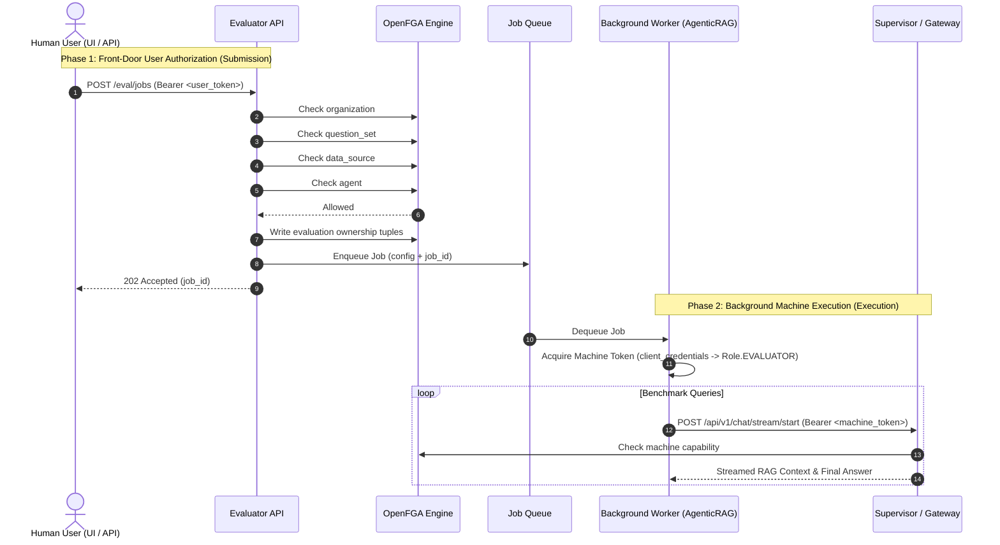

# RAG Evaluator ReBAC & Integration Architecture

This document describes the Relationship-Based Access Control (ReBAC) and OIDC integration design for the CAIPE RAG Evaluator service.

---

## 1. Overview & Core Design Goals

The RAG Evaluator service provides automated and user-triggered benchmark evaluations for RAG query pipelines and dynamic AI agents.

### Key Objectives
* **Fine-Grained Authorization**: Enforce OpenFGA ReBAC across evaluation jobs, question sets, target data sources, and dynamic agents.
* **Token Timeout Prevention**: Separate **Front-Door User Authorization** (short-lived human JWT) from **Background Machine Execution** (indefinite machine `client_credentials` refresh).
* **UI Parity**: Mirror the exact shareable-resource tuple structure (`creator`, `team:owner#member`, `team:owner#admin`, `user:*`) used by Knowledge Bases, Data Sources, and MCP Tools in the Next.js UI.

---

## 2. System Architecture



---

## 3. Role Hierarchy & OpenFGA Authorization Model

### RBAC Hierarchy Alignment
* `Role.EVALUATOR` is defined in `common/models/rbac.py` as a level-2 peer role alongside `INGESTONLY`:
  - Hierarchy: `READONLY (1)` < `EVALUATOR (2)` / `INGESTONLY (2)` < `ADMIN (3)`
* Client-credentials machine tokens belonging to the evaluator client are automatically assigned `Role.EVALUATOR`.

### OpenFGA DSL Model (`deploy/openfga/model.fga`)
```fga
type organization
  relations
    define admin: [user]
    define evaluator: [user, team#member]
    define can_evaluate: evaluator or admin

type evaluation
  relations
    define organization: [organization]
    define creator: [user]
    define reader: [user, user:*, team#member] or creator or manager
    define manager: [user, team#admin] or creator
    define can_read: reader
    define can_manage: manager

type question_set
  relations
    define organization: [organization]
    define creator: [user]
    define reader: [user, user:*, team#member] or creator or manager
    define manager: [user, team#admin] or creator
    define can_read: reader
    define can_manage: manager
```

---

## 4. Front-Door Authorization vs. Background Worker Execution

| Aspect | Front-Door Authorization | Background Worker Execution |
| :--- | :--- | :--- |
| **Trigger** | API request (`POST /eval/jobs`, `POST /eval/question-sets`) | Asynchronous job runner |
| **Token Type** | Human OIDC Bearer JWT (short-lived, 5-60m) | Machine Service Account JWT (`client_credentials`) or OBO Delegated JWT |
| **OpenFGA Checks** | `organization#can_evaluate`, `question_set#can_read`, `data_source#can_read`, `agent#can_read` | **JIT Re-check**: `organization#can_evaluate` on submitting subject |
| **Timeout Protection** | N/A (validates current user intent) | **Protected** (automatic Keycloak token refresh prevents job timeouts) |

### 4.1 Just-In-Time (JIT) Authorization Re-Check

To prevent revoked users from executing delayed queued jobs, the background job processor (`_run_queued_evaluation` in `api/app.py`) executes a **Just-In-Time (JIT) authorization re-check** immediately before initiating evaluation queries:

1. **Submitter Permission Validation**:
   - The worker inspects `job.user_info.subject` stored on the job record.
   - It queries OpenFGA: `is_authorized(user_subject, "can_evaluate", "organization:caipe")`.
2. **Revocation Handling**:
   - If authorization fails (e.g. user was removed from the organization or team between submission and execution), execution aborts immediately.
   - The job status transitions to `"failed"` with error message:
     ```
     Evaluation aborted: User '<subject>' is no longer authorized to execute evaluations (can_evaluate permission revoked in OpenFGA).
     ```
   - Prevents stale jobs from consuming LLM tokens and infrastructure resources when user privileges change.

---

## 5. Resource Listing & OpenFGA `list-objects` Filtering

Listing endpoints (`GET /jobs` and `GET /question-sets`) enforce ReBAC through OpenFGA's `list-objects` API:

* **Function**: `get_allowed_resource_ids(user_context, object_type, relation)` in `auth.py`.
* **Flow**:
  1. Calls OpenFGA `POST /stores/{id}/list-objects` with `{"user": "user:<sub_id>", "relation": "can_read", "type": "evaluation" | "question_set"}`.
  2. Strips object type prefixes (e.g. `evaluation:job-123` -> `job-123`) to extract permitted ID strings.
  3. Passes allowed ID lists down to database managers (`JobQueueManager` and `QuestionDBManager`) to apply SQL `WHERE id = ANY(...)` or in-memory filtering.
  4. If OpenFGA is unavailable, listing falls back to database-level ownership filtering (`created_by == user.email` OR `visibility == 'public'`).

---

## 6. Admin & Unrestricted Access Resolution Hierarchy

To guarantee operational bypass capabilities for service accounts and administrators without compromising security, `get_allowed_resource_ids()` and authorization checks evaluate a 3-tier resolution hierarchy:

| Tier | Access Condition | Mechanism | Result |
| :--- | :--- | :--- | :--- |
| **Tier 1: Service / Bypass Key** | `_has_unrestricted_eval_access(user_context)` | Static `DEEPEVAL_API_KEY`, machine tokens (`client:*`), or `CAIPE_UNSAFE_RBAC_BYPASS=true` | Returns `None` (unrestricted global access, no ID filtering) |
| **Tier 2: RBAC Admin Role** | `has_permission(user_context.role, Role.ADMIN)` | JWT claims containing elevated `Role.ADMIN` | Returns `None` (unrestricted global access) |
| **Tier 3: OpenFGA Org Admin** | `_openfga_check_org_admin(user_context)` | OpenFGA check: `user:<sub_id>` has `can_manage` on `organization:caipe` | Returns `None` (unrestricted global access) |
| **Standard User** | Standard OIDC user (`Role.READONLY` / `Role.EVALUATOR`) | OpenFGA `list-objects` query | Returns list of permitted resource IDs |

---

## 7. UI Convenience & Zero-DDL Schema Design

* To avoid mandatory SQL database migrations while providing UI scannability:
  - `owner_team` (team slug) and `visibility` (`private`, `team`, `public`) are stored inside the `config_json` JSONB field in `eval_job_queue`.
  - Endpoint responses (`JobResponse`, `QuestionSetResponse`) output `owner_team`, `visibility`, and `user_info` (`subject`, `email`, `role`, `client_id`).

---

## 8. Verification Scripts

Two automated shell scripts in `ai_platform_engineering/knowledge_bases/rag/evaluator/scripts/` provide live verification:

1. **`test_openfga_live.sh`**:
   - Verifies direct OpenFGA REST store resolution, initial denial, tuple writing, capability check, `list-objects` resolution, and cleanup.
   - Run: `./test_openfga_live.sh [OPENFGA_HOST]` (defaults to `openfga.example.com`)

2. **`test_evaluator_api.sh`**:
   - Extracts `caipe-local-admin` and `caipe-local-user` credentials from K3s cluster secrets.
   - Acquires Keycloak tokens and validates 403 Forbidden enforcement on unauthorized local users vs 202 Accepted on authorized admins.
   - Tests `GET /jobs` and `GET /question-sets` ReBAC listing filtering and verifies 403 Forbidden enforcement on unauthorized job results access.
   - Run: `./test_evaluator_api.sh [EVALUATOR_BASE_URL]`

---

## See Also

- [integration_and_security.md](integration_and_security.md) — Complete integration reference: component interaction map, OIDC JWKS caching, machine token detection, role hierarchy, all API routes with auth dependencies, agentic SSE streaming protocol details, PostgreSQL schema, and deployment topology.
- [architecture.md](architecture.md) — Configuration hierarchy (`EvalConfig`) and runtime component table.
- [rest_api_service.md](rest_api_service.md) — Full REST API endpoint reference with curl examples.

