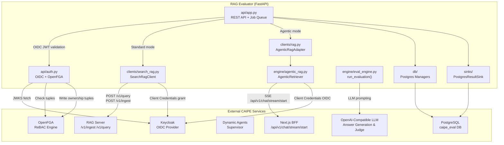
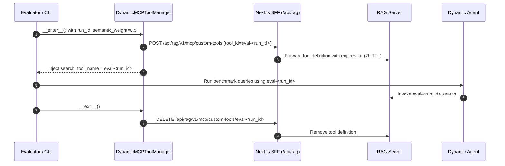
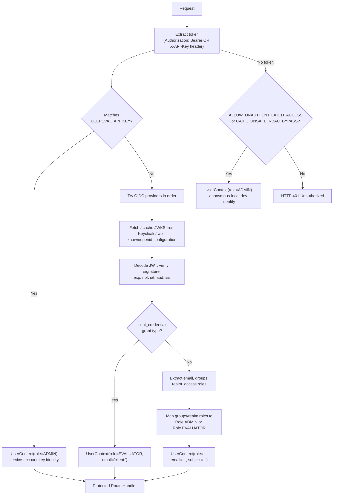
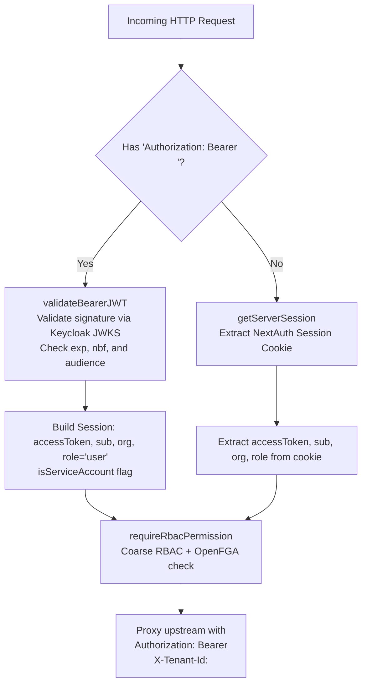
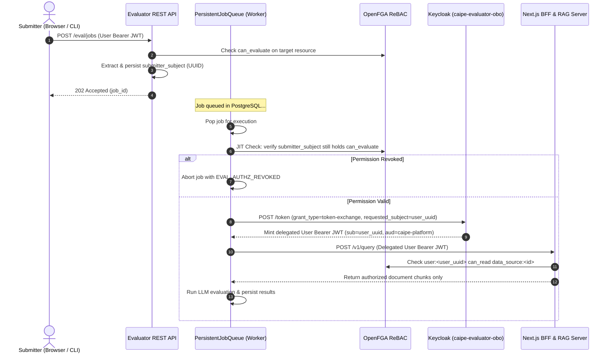
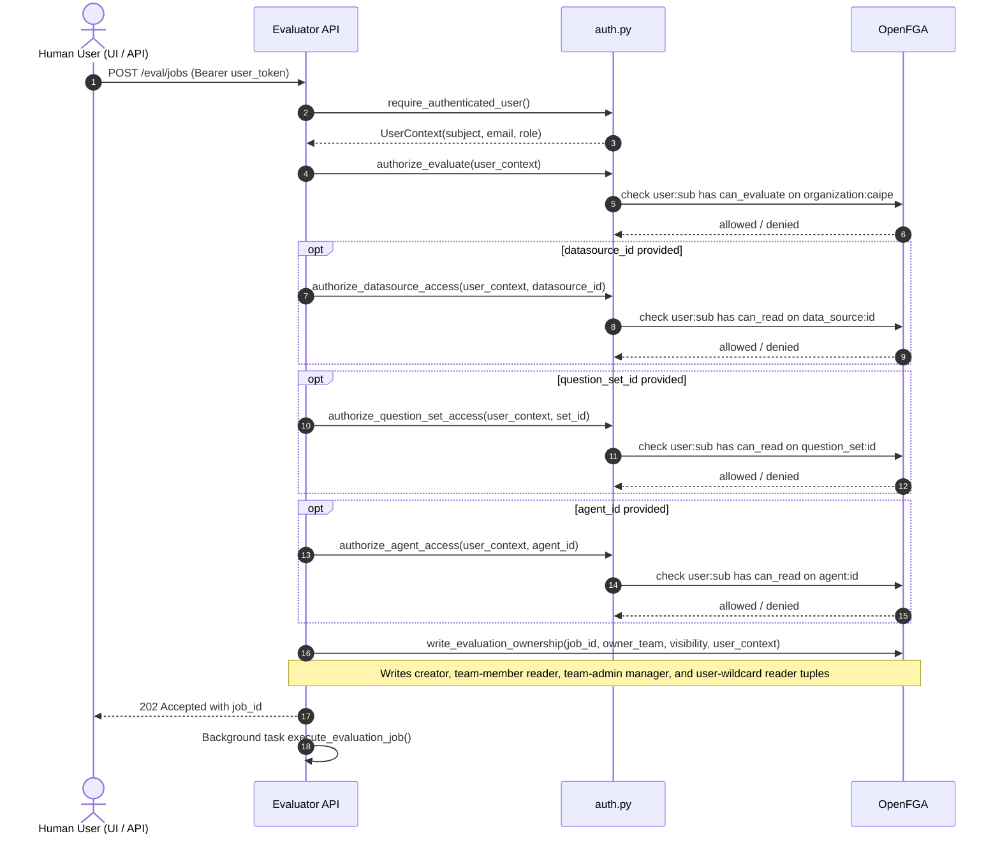

# RAG Evaluator — Integration, Security & Routing Reference

This document provides a deep technical reference for the CAIPE RAG Evaluator's integration with the wider AI Platform Engineering (CAIPE) platform. It covers component interactions, network routing, authentication, and Relationship-Based Access Control (ReBAC), and is intended as supporting material for academic or engineering analysis.

---

## 1. Platform Context

The RAG Evaluator is one service within the multi-component CAIPE platform. The following table positions each service it integrates with.

| Component | Role in CAIPE | Evaluator Relationship |
| :--- | :--- | :--- |
| **RAG Server** (`rag/server`) | FastAPI service: document ingestion, Milvus hybrid vector search, Neo4j graph RAG, MCP tools | Evaluator ingests benchmark corpora and queries for context retrieval |
| **Dynamic Agents** (`dynamic_agents`) | LangGraph multi-agent runtime over SSE/AG-UI; provides supervisor and per-tool MCP agent routing | Evaluator optionally routes benchmark queries through the supervisor for agentic evaluation |
| **Keycloak** | OIDC identity provider managing human user JWTs and machine client credentials | Both the evaluator REST API and the RAG Server validate JWT tokens from this issuer |
| **OpenFGA** | ReBAC engine storing relationship tuples for fine-grained resource ownership | Evaluator's `auth.py` queries OpenFGA for `can_evaluate`, `can_read`, and `can_manage` decisions |
| **PostgreSQL** (`caipe_eval`) | Relational store for evaluation job queue, run history, question sets, and questions | Evaluator writes/reads all persistent evaluation state here |
| **Next.js BFF** | Browser-facing API gateway; proxies chat and streaming to dynamic agents | In agentic SSE mode, evaluator queries the BFF's `/api/chat/conversations` and `/api/v1/chat/stream/start` endpoints |

---

## 2. Component Integration Map



---

## 3. RAG Server Integration

### 3.1 Ingestion Flow

The `SearchRagClient` (`clients/search_rag.py`) communicates directly with the RAG Server REST API. Ingestion follows this sequence:

| Step | HTTP Call | Purpose |
| :--- | :--- | :--- |
| 1 | `POST /v1/ingestor/heartbeat` | Register ingestor; receive `ingestor_id` and batch limit |
| 2 | `DELETE /v1/datasource?datasource_id=<id>` | Optionally reset existing datasource |
| 3 | `POST /v1/datasource` | Create/upsert datasource record in Redis metadata store |
| 4 | `POST /v1/job?datasource_id=<id>&job_status=in_progress` | Open ingestion job; receive `job_id` |
| 5 | `POST /v1/ingest` | Send documents in batches |
| 6 | `POST /v1/job/{job_id}/increment-document-count` | Update document counter per batch |
| 7 | `POST /v1/job/{job_id}/increment-progress` | Update progress per batch |
| 8 | `PATCH /v1/job/{job_id}?job_status=completed` | Close job |

The RAG Server's `DocumentProcessor` receives each batch and:
- Chunks documents using a paragraph-then-sentence strategy (capped at 60,000 characters per chunk for Milvus compatibility)
- Generates dense semantic embeddings (e.g. `text-embedding-3-small`) and sparse BM25 keyword vectors
- Stores both in Milvus for hybrid search, and optionally in Neo4j for graph traversal

### 3.2 Retrieval Flow

During evaluation, for each benchmark question:

```
SearchRagClient.query_raw(question, datasource_id, limit)
    → POST /v1/query { "query": "...", "limit": 3, "filters": { "datasource_id": "..." } }
    ← [ { "document": { "page_content": "...", "metadata": {...} }, "score": 0.92 }, ... ]
```

`extract_contexts_and_sources()` normalises the response into:
- `contexts: list[str]` — retrieved text passed to the LLM and DeepEval
- `sources: list[dict]` — document IDs, titles, source types, and scores for retrieval precision/recall metrics

The RAG Server performs **weighted hybrid reranking** (semantic 50% + BM25 50% by default) before returning results.

### 3.3 Auth Between Evaluator and RAG Server

The evaluator authenticates against the RAG Server using one of:
- A **static Bearer token** (`CAIPE_AUTH_TOKEN`)
- A **dynamic machine token** via Keycloak `client_credentials` grant (`CAIPE_KEYCLOAK_URL`, `CAIPE_CLIENT_ID`, `CAIPE_CLIENT_SECRET`)

`SearchRagClient.ensure_authenticated()` is called before every `query_raw()` call; it checks the token expiry clock and triggers `refresh_access_token()` if the token is within 30 seconds of expiry. This prevents job timeouts on long benchmark sweeps.

The RAG Server's own `auth.py` validates inbound tokens using its `AuthManager`, which supports two named OIDC providers:
- `"ui"` — for human browser sessions (configured via `OIDC_ISSUER_URL`, `OIDC_AUDIENCE`)
- `"ingestor"` — for machine ingestion clients (configured via `INGESTOR_OIDC_ISSUER`, `INGESTOR_OIDC_CLIENT_ID`)

Both providers fetch JWKS from Keycloak's well-known discovery endpoint and cache keys for one hour to avoid repeated discovery calls.

### 3.4 Ephemeral Custom MCP Search Tools (`DynamicMCPToolManager`)

To evaluate different retrieval parameterizations (such as custom semantic vs keyword weights or additional runtime filters) without permanently mutating server configuration, the evaluator provisions **ephemeral custom MCP tools** on demand:



* **Deterministic Naming**: Tools are identified as `eval-{run_id[:16]}` (e.g. `eval-cli-1786658436`) for traceability in audit logs and LangGraph traces.
* **Safety via TTL**: Every dynamic tool is stamped with an `expires_at` timestamp (default 2 hours) so tools automatically expire in Redis even if a job abruptly terminates.
* **Non-Blocking Cleanup**: `DELETE /v1/mcp/custom-tools/{tool_id}` is executed on job completion in `__exit__` in a best-effort manner.

---

## 4. CAIPE Supervisor / Gateway Integration

### 4.1 Agentic RAG Evaluation Mode

When a benchmark job is submitted with `agentic=true`, the evaluator does not query the RAG Server directly. Instead, it routes each question through the CAIPE dynamic agents streaming gateway, which internally invokes the `knowledge-base_search` and `knowledge-base_fetch_document` MCP tools against the RAG Server. This evaluates the full agentic pipeline end-to-end.

The `AgenticRetriever` (`engine/agentic_rag.py`) uses the SSE streaming gateway protocol:

| Protocol | Endpoint | Description |
| :--- | :--- | :--- |
| **SSE Streaming BFF** | `POST {bff_url}/api/chat/conversations` then `POST {bff_url}/api/v1/chat/stream/start` | Two-step flow: create conversation session, then stream SSE events |

### 4.2 SSE Streaming Protocol Detail

Step 1 — Create conversation:
```
POST /api/chat/conversations
{ "title": "Agentic Session", "client_type": "webui", "agent_id": "<agent_id>" }
← { "conversation_id": "<uuid>" }
```

Step 2 — Start streaming:
```
POST /api/v1/chat/stream/start
{
  "message": "<question>",
  "conversation_id": "<uuid>",
  "agent_id": "<agent_id>",
  "protocol": "custom",
  "client_context": { "source": "eval", "tool_result_display_limit": -1 }
}
← SSE stream
```

SSE event types parsed by the evaluator:

| Event | Content Extracted |
| :--- | :--- |
| `event: content` | Final answer text pieces (`data.text`) |
| `event: tool_end` | RAG context from tool results (`data.result.rag_context`) |

### 4.4 Datasource Enrichment

When `CAIPE_DATASOURCE_ID` is set, the question payload sent to the agent includes a prompt prefix instructing the agent to pass `filters={"datasource_id": "<id>"}` to the search tool and limit fetches to 5 documents. This ensures the agentic evaluation stays within the benchmark corpus rather than searching the global knowledge base.

### 4.5 OIDC Token Acquisition for Agentic Mode

The agentic client uses the following resolution order for obtaining its bearer token:
1. `CAIPE_CLIENT_ID` + `CAIPE_CLIENT_SECRET` from environment
2. `kubectl get secret caipe-ui-secret -n caipe` (Kubernetes cluster secret)
3. Keycloak client credentials grant to the configured token URL

The acquired token is cached in `CAIPE_OIDC_TOKEN`. The default Keycloak token URL is `https://keycloak.example.com/realms/caipe/protocol/openid-connect/token`.

---

## 5. Authentication Architecture (AuthN)

### 5.1 Evaluator API Authentication

The evaluator's `AuthManager` (`api/auth.py`) implements a multi-mode authentication pipeline for all protected endpoints.



### 5.2 Machine Token Detection

The `is_client_credentials_token()` function detects machine-to-machine tokens by checking for:
- `gty == "client-credentials"` claim
- `grant_type == "client-credentials"` claim
- `sub == client_id` (Keycloak service account pattern)
- `preferred_username` starting with `"service-account-"` or `"client-"`
- Absence of `email` and `preferred_username` claims when `client_id` is present

Machine tokens are automatically assigned `Role.EVALUATOR` (configurable via `RBAC_EVALUATOR_CLIENT_CREDENTIALS_ROLE`).

### 5.3 Role Hierarchy

| Role | Level | Description |
| :--- | :---: | :--- |
| `readonly` | 1 | Read-only access; subject to full OpenFGA listing filters |
| `evaluator` | 2 | Can submit evaluation jobs (if also granted `organization#can_evaluate` in OpenFGA) |
| `ingestonly` | 2 | Peer of evaluator; not used by evaluator API directly |
| `admin` | 3 | Unrestricted access to all resources and job management |

The helper `has_permission(user_role, required_role)` uses integer level comparisons, meaning `admin` satisfies any role requirement.

### 5.4 OIDC JWKS Caching

`OIDCProvider` caches the JWKS response for 3600 seconds (1 hour). On cache miss it:
1. Fetches the well-known OpenID configuration from `{OIDC_ISSUER_URL}/.well-known/openid-configuration`
2. Extracts `jwks_uri`
3. Fetches the JWKS

SSL verification is controlled by `OIDC_VERIFY_SSL` (defaults `true`). This parallels the RAG Server's identical JWKS caching implementation, as both were modelled on the same `OIDCProvider` pattern.

### 5.5 Next.js BFF Gateway Authentication (`getAuthFromBearerOrSession`)

The Next.js UI Backend-for-Frontend (BFF) acts as the reverse proxy for browser interactions and external tool integrations across `/api/rag/*`, `/api/rag-evaluator/*`, and `/api/dynamic-agents/*`.

To support both interactive browser sessions and headless CLI / evaluation tooling, the BFF routes use the unified `getAuthFromBearerOrSession(request)` middleware helper:



1. **Bearer Token Path (`Authorization: Bearer <JWT>`)**:
   - The token is verified against Keycloak's remote JWKS endpoint using `jose.jwtVerify`.
   - The token's subject (`sub`), email, tenant (`org`), and service account markers are extracted.
   - The validated `accessToken` is preserved in `session.accessToken` and forwarded upstream to the RAG server / evaluator service.
2. **Session Cookie Path**:
   - For browser UI users, `getServerSession(authOptions)` resolves the NextAuth session cookie containing the Keycloak access token.
3. **Unified ReBAC & Coarse RBAC**:
   - Downstream `requireRbacPermission()` and OpenFGA object gates (`requireResourcePermission()`) evaluate identically regardless of whether authentication arrived via cookie or Bearer header.

### 5.6 Keycloak Client Audience Mapping (`caipe-platform` / `caipe-sa-*` ➔ `caipe-ui`)

In standard OAuth2/OIDC setups, JWT access tokens carry an Audience (`aud`) claim defining the intended resource server(s).

#### Problem: Audience Mismatch
When external scripts authenticate using machine `client_credentials` or CLI clients (`caipe-platform` or dedicated service accounts `caipe-sa-*`):
* Keycloak mints tokens with `aud: "<client_id>"`.
* When the token is presented to the Next.js UI BFF, `validateBearerJWT` enforces that the incoming token audience matches the BFF's client ID (`caipe-ui`), rejecting unmatched tokens with:
  ```json
  HTTP 401 {"success": false, "error": "Your sign-in token is not authorized for this service. Contact your admin.", "code": "BEARER_AUDIENCE_MISMATCH", "reason": "audience_mismatch"}
  ```

#### Solution: Keycloak Audience Protocol Mapper
To permit tokens to access the Next.js UI BFF (`https://caipe.example.com/api/rag/*` and `https://caipe.example.com/api/rag-evaluator/*`), configure an **Audience Protocol Mapper** in Keycloak:

1. In the Keycloak Admin Console, navigate to the **`caipe`** realm.
2. Go to **Clients** ➔ select the client (e.g. `caipe-platform` or `caipe-sa-evaluator-bot-...`) ➔ **Client scopes**.
3. Select the dedicated scope (e.g. `caipe-platform-dedicated` or `caipe-sa-evaluator-bot-...-dedicated`).
4. Click **Add mapper** ➔ **By configuration** ➔ **Audience**.
5. Configure the protocol mapper:
   - **Name**: `caipe-ui-audience`
   - **Included Client Audience** (or **Included Custom Audience**): `caipe-ui`
   - **Add to ID token**: `On`
   - **Add to access token**: `On` (Required: embeds `"aud": ["caipe-ui", ...]` in the JWT)
   - **Add to lightweight access token**: `On`
   - **Add to token introspection**: `On`
6. Save the mapper.

### 5.7 Service Account Machine Authorization in OpenFGA

While human users added to `team:super-admins` automatically inherit org admin powers via the `team:super-admins#admin -> admin -> organization:caipe` connector tuple, machine service accounts are distinct subjects (`service_account:<uuid>`).

To authorize a service account for administrative RAG operations (such as dynamically registering ephemeral MCP tools or running platform-wide queries via Next.js BFF proxy routes):

1. Retrieve the service account subject (`sub`) UUID from its decoded token.
2. Write the direct OpenFGA tuple:
   ```bash
   fga tuple write \
     --store-id <store_id> \
     service_account:<sa_sub_uuid> admin organization:caipe
   ```
   *(or `relation: member` to satisfy standard `can_use` checks)*

### 5.8 On-Behalf-Of (OBO) RFC 8693 Token Exchange Architecture

When benchmark evaluations are triggered by human users, relying on ambient machine credentials (M2M) creates an authorization disconnect: downstream RAG and Dynamic Agent services cannot enforce the submitting user's fine-grained ReBAC policies because they only see the generic service account principal. Conversely, forwarding static user tokens causes evaluations to fail mid-run due to JWT expiration.

To eliminate this trade-off, CAIPE provides **On-Behalf-Of (OBO) delegation** via OAuth 2.0 Token Exchange ([RFC 8693](https://datatracker.ietf.org/doc/html/rfc8693)).



#### How OBO Works

1. **Submitter Identity Capture**: On job submission, `app.py` extracts the caller's Keycloak `sub` UUID (e.g. `149b5873-fa68-4e72-802d-f1c9323c4031`), email, and role, recording them in `config_args` in PostgreSQL.
2. **Just-In-Time (JIT) Authorization Gate**: Before the background worker pops and runs the job in `_run_queued_evaluation()`, synchronous OpenFGA checks execute against the submitter's identity:
   - **Organization Access**: `sync_authorize_evaluate_subject()` verifies `can_evaluate` or `can_manage` on `organization:caipe`.
   - **Target Agent Access**: `sync_authorize_agent_subject()` verifies `agent:<agent_id>#can_read` (or `can_use`/`can_manage`) if an agent was configured.
   - **Target Datasource Access**: `sync_authorize_datasource_subject()` verifies `data_source:<datasource_id>#can_read` (or `can_manage`) if a datasource was configured.
   - **Target Question Set Access**: `sync_authorize_question_set_subject()` verifies `question_set:<set_id>#can_read` (or `can_manage`) if a question set was configured.
   If the submitter's role or any referenced resource tuple was revoked while queued, the job immediately aborts with `EVAL_AUTHZ_REVOKED`.
3. **Dedicated OBO Service Account (`caipe-evaluator-obo`)**:
   - Confidential client created specifically for evaluator user impersonation.
   - Assigned the `impersonation` realm-management role.
   - Associated with `caipe-evaluator-obo-token-exchange-policy` in Keycloak fine-grained management permissions.
   - Attached to the `token-exchange` permission on the backend audience target (`caipe-platform`).
4. **Dynamic Token Exchange Request**:
   When `EVALUATOR_OBO_ENABLED=true` and the submitter is a human user, `exchange_token_for_user()` posts to Keycloak's token endpoint:
   ```json
   POST /realms/caipe/protocol/openid-connect/token
   Content-Type: application/x-www-form-urlencoded

   grant_type=urn:ietf:params:oauth:grant-type:token-exchange
   &client_id=caipe-evaluator-obo
   &client_secret=caipe-evaluator-obo-dev-secret
   &requested_subject=149b5873-fa68-4e72-802d-f1c9323c4031
   &audience=caipe-platform
   ```
5. **Delegated Token Characteristics**:
   - `sub`: The submitting human user's UUID (`149b5873-...`).
   - `azp`: `caipe-evaluator-obo`.
   - `aud`: `["caipe-ui", "caipe-platform"]`.
   - `preferred_username` / `email`: The submitter's identity.
6. **Proactive Auto-Renewal & End-to-End Resource Authorization**:
   `OidcTokenManager` caches the delegated token and proactively re-exchanges it 30 seconds before expiration (`TOKEN_EXPIRY_BUFFER_SECONDS = 30`).
   - **Downstream ReBAC Enforcement**: Downstream RAG and Dynamic Agent services receive the delegated token and perform live OpenFGA checks on the *human user's* permissions for the specific `datasource:<id>`, `agent:<id>`, and individual document chunks at the exact time of query execution.
   - **M2M Mode Distinction**: When using pure M2M mode (`client_credentials` without OBO), downstream requests execute with the Service Account's identity. As a result, individual human user datasource and agent permissions are **not** re-checked at dispatch time in M2M mode; only the Service Account's permissions apply.

#### Mode Comparison: OBO Delegation vs Direct M2M

| Capability | RFC 8693 OBO Delegation (Recommended) | Direct M2M Service Account Mode |
| :--- | :--- | :--- |
| **Identity Sent Downstream** | Delegated Human User (`sub=user_uuid`) | Service Account (`sub=sa_client_id`) |
| **JIT Pre-Dispatch Check** | Validates Human User on `organization:caipe` | Validates Service Account on `organization:caipe` |
| **Datasource & Agent Revocation** | ✔️ **Enforced Live**: Downstream RAG/Agents reject access if user lost rights post-submission | ❌ **Not Enforced on User**: Downstream executes with Service Account's broad permissions |
| **Audit Trail Identity** | Attributed directly to Human User | Attributed to Service Account Client ID |

#### Configuration Parameters

| Environment Variable | Default | Description |
| :--- | :--- | :--- |
| `EVALUATOR_OBO_ENABLED` | `false` | Feature flag to enable RFC 8693 token exchange for user-submitted evaluation jobs |
| `EVALUATOR_OBO_CLIENT_ID` | `caipe-evaluator-obo` | Client ID of the confidential Keycloak client configured with token exchange permissions |
| `EVALUATOR_OBO_CLIENT_SECRET` | None | Client secret for `caipe-evaluator-obo` (mounted via `caipe-evaluator-obo-secret`) |
| `EVALUATOR_OBO_TOKEN_URL` | `http://caipe-keycloak:8080/realms/caipe/protocol/openid-connect/token` | Keycloak token endpoint for token exchange |
| `EVALUATOR_OBO_AUDIENCE` | `caipe-platform` | Audience target for minted delegated tokens |

---

## 6. Relationship-Based Access Control (ReBAC) with OpenFGA

### 6.1 Motivation

The evaluator inherits CAIPE's unified ReBAC model to solve two orthogonal problems:

1. **Cross-resource authorization**: an evaluation job can reference a `question_set`, a `data_source`, and an `agent` — each of which may be owned by different teams. ReBAC checks each resource independently against the submitting user's relationships.
2. **Token timeout prevention**: long-running benchmark jobs (potentially hours) cannot hold the submitting user's short-lived JWT. The "front-door" authorization model validates the human's intent at submission time; the background worker then acquires its own machine token with automatic Keycloak refresh.

### 6.2 OpenFGA DSL Authorization Model

The evaluator's OpenFGA model extends the platform's standard model with two new resource types. The existing `data_source` and `agent` types are shared with the rest of CAIPE.

```fga
type organization
  relations
    define admin: [user]
    define evaluator: [user, team#member]
    define can_evaluate: evaluator or admin

type evaluation
  relations
    define organization: [organization]
    define creator: [user]
    define reader: [user, user:*, team#member] or creator or manager
    define manager: [user, team#admin] or creator
    define can_read: reader
    define can_manage: manager

type question_set
  relations
    define organization: [organization]
    define creator: [user]
    define reader: [user, user:*, team#member] or creator or manager
    define manager: [user, team#admin] or creator
    define can_read: reader
    define can_manage: manager
```

The `user:*` wildcard expresses public visibility (no identity constraint). A team member who is also a creator automatically gains manager rights via the `or creator` clause.

### 6.3 ReBAC Enforcement Flow on Job Submission



### 6.4 Ownership Tuple Structure

When a new evaluation job is created, `write_evaluation_ownership()` writes up to four OpenFGA tuples:

| Tuple | Condition | Semantics |
| :--- | :--- | :--- |
| `(user:<sub>, creator, evaluation:<job_id>)` | Always (if subject known) | The submitter is the resource creator |
| `(team:<slug>#member, reader, evaluation:<job_id>)` | If `owner_team` provided | All team members can read the job |
| `(team:<slug>#admin, manager, evaluation:<job_id>)` | If `owner_team` provided | Team admins can manage the job |
| `(user:*, reader, evaluation:<job_id>)` | If `visibility == "public"` | Anyone can read the job |

The same tuple pattern is written for `question_set` resources via `write_question_set_ownership()`.

### 6.5 Resource Listing via `list-objects`

Listing endpoints (`GET /jobs`, `GET /api/v1/question-sets`) filter results through `get_allowed_resource_ids()`:

```python
async def get_allowed_resource_ids(
    user_context: UserContext, object_type: str, relation: str = "can_read"
) -> list[str] | None:
```

**Resolution tiers (evaluated in order):**

| Tier | Condition | Result |
| :--- | :--- | :--- |
| 1 — Service/bypass | `CAIPE_UNSAFE_RBAC_BYPASS=true` | `None` — unrestricted |
| 2 — RBAC Admin/Evaluator | JWT role >= `evaluator` | `None` — unrestricted |
| 3 — OpenFGA org-admin | `user:<sub> can_manage organization:caipe` | `None` — unrestricted |
| 3 — OpenFGA org-evaluator | `user:<sub> can_evaluate organization:caipe` | `None` — unrestricted |
| 4 — Standard user | OpenFGA `POST /stores/{id}/list-objects` | List of permitted IDs |

When `list-objects` returns a filtered list, the database query is narrowed with `WHERE job_id = ANY(allowed_ids)`. If OpenFGA is unavailable, the fallback applies database-level ownership filtering (`created_by == user.email OR visibility == 'public'`).

### 6.6 Admin Resolution Hierarchy in `require_role`

The `require_role(required_role)` dependency factory implements an OpenFGA admin promotion path that avoids hard-coding admin emails:

```python
if not has_permission(user.role, required_role):
    if required_role == Role.ADMIN and await _openfga_check_org_admin(user):
        return UserContext(..., role=Role.ADMIN)
    if required_role == Role.EVALUATOR and (
        await _openfga_check_object(user, "can_evaluate", "organization", org_key)
        or await _openfga_check_org_admin(user)
    ):
        return UserContext(..., role=Role.EVALUATOR)
    raise HTTPException(status_code=403, ...)
```

This allows a standard OIDC user to be elevated to `admin` purely through an OpenFGA tuple without changing their JWT claims.

### 6.7 Visibility Update Flow

`PATCH /jobs/{job_id}/visibility` calls `update_resource_visibility()` which:
1. Writes new team reader/manager tuples if `owner_team` changed
2. Writes `(user:*, reader, ...)` if `visibility == "public"`
3. Deletes `(user:*, reader, ...)` if `visibility != "public"`

This keeps the OpenFGA store as the single source of truth for resource visibility.

---

## 7. API Routing Reference

### 7.1 Evaluator REST API Route Table

All routes are served by the FastAPI application in `api/app.py`. Routes requiring the `get_current_user` dependency enforce authentication as described in Section 5.

| Method | Path | Auth Dependency | OpenFGA Checks | Description |
| :--- | :--- | :--- | :--- | :--- |
| `GET` | `/health` | None | None | Health check |
| `GET` | `/healthz`, `/livez`, `/readyz` | None | None | Kubernetes probe endpoints |
| `GET` | `/metrics` | None | None | Prometheus/OTLP metrics |
| `GET` | `/` | `get_current_user` | None | Service info |
| `GET` | `/docs`, `/redoc` | None | None | OpenAPI interactive UI |
| `POST` | `/eval/jobs` | `get_current_user` | `can_evaluate`, `can_read` on question_set/datasource/agent | Submit async evaluation job |
| `POST` | `/eval/jobs/upload` | `get_current_user` | `can_evaluate` | Upload dataset file and submit job |
| `POST` | `/eval/jobs/question-sets/{set_id}` | `get_current_user` | `can_evaluate`, `can_read` on question_set | Submit job targeting stored question set |
| `GET` | `/jobs` | `get_current_user` | `list-objects` for `evaluation#can_read` | List jobs (filtered by ownership) |
| `GET` | `/jobs/{job_id}` | `get_current_user` | `can_read` on `evaluation:<job_id>` | Poll job status |
| `GET` | `/jobs/{job_id}/results` | `get_current_user` | `can_read` on `evaluation:<job_id>` | Fetch results as JSON or CSV |
| `POST` | `/jobs/{job_id}/save-db` | `get_current_user` | `can_manage` on `evaluation:<job_id>` | Persist results to PostgreSQL |
| `PATCH` | `/jobs/{job_id}/visibility` | `get_current_user` | `can_manage` on `evaluation:<job_id>` | Update visibility/owner_team tuples |
| `GET` | `/results/db` | `get_current_user` | None (DB-level filter) | Query historical runs from PostgreSQL |
| `POST` | `/api/v1/question-sets` | `get_current_user` | Writes `question_set` ownership tuples | Create question set |
| `GET` | `/api/v1/question-sets` | `get_current_user` | `list-objects` for `question_set#can_read` | List question sets |
| `GET` | `/api/v1/question-sets/{set_id}` | `get_current_user` | `can_read` on `question_set:<set_id>` | Get question set details |
| `PUT` | `/api/v1/question-sets/{set_id}` | `get_current_user` | `can_manage` on `question_set:<set_id>` | Update question set metadata |
| `DELETE` | `/api/v1/question-sets/{set_id}` | `get_current_user` | `can_manage` on `question_set:<set_id>` | Delete question set and questions |
| `POST` | `/api/v1/question-sets/{set_id}/questions` | `get_current_user` | `can_manage` on `question_set:<set_id>` | Add questions |
| `POST` | `/api/v1/question-sets/{set_id}/questions/upload` | `get_current_user` | `can_manage` on `question_set:<set_id>` | Upload questions from file |
| `GET` | `/api/v1/question-sets/{set_id}/questions` | `get_current_user` | `can_read` on `question_set:<set_id>` | List questions |
| `GET` | `/api/v1/question-sets/{set_id}/questions/{qid}` | `get_current_user` | `can_read` on `question_set:<set_id>` | Get single question |
| `PUT` | `/api/v1/question-sets/{set_id}/questions/{qid}` | `get_current_user` | `can_manage` on `question_set:<set_id>` | Edit question |
| `DELETE` | `/api/v1/question-sets/{set_id}/questions/{qid}` | `get_current_user` | `can_manage` on `question_set:<set_id>` | Delete question |
| `POST` | `/api/v1/question-sets/{set_id}/questions/batch-delete` | `get_current_user` | `can_manage` on `question_set:<set_id>` | Batch delete questions |
| `GET` | `/api/v1/question-sets/{set_id}/export` | `get_current_user` | `can_read` on `question_set:<set_id>` | Export as JSONL or CSV |
| `GET` | `/api/v1/prompt-styles` | `get_current_user` | App-level visibility filtering | List accessible prompt styles |
| `GET` | `/api/v1/prompt-styles/{name}` | `get_current_user` | App-level visibility filtering | Get prompt style details |
| `POST` | `/api/v1/prompt-styles` | `require_role(Role.ADMIN)` | Admin-only role check | Create custom prompt style |
| `PUT` | `/api/v1/prompt-styles/{name}` | `require_role(Role.ADMIN)` | Admin-only role check | Update custom prompt style |
| `DELETE` | `/api/v1/prompt-styles/{name}` | `require_role(Role.ADMIN)` | Admin-only role check | Delete custom prompt style |

### 7.2 Routing Architecture

The FastAPI application is assembled from four router modules:

```
app (FastAPI)
├── telemetry_router      # /healthz, /livez, /readyz, /health, /metrics
├── prompt_styles_router   # /api/v1/prompt-styles
├── question_sets_router  # /api/v1/question-sets and nested routes
└── inline routes         # /eval/jobs, /jobs, /results/db, /
```

The application is served by `uvicorn` (ASGI). In Kubernetes/Docker deployments it is exposed through a Kubernetes Ingress or Traefik proxy at an evaluator-specific path prefix (e.g. `/evaluator`). The RAG Server, Dynamic Agents supervisor, and BFF each have their own separate Ingress rules.

### 7.3 Background Job Execution

Job submission returns `202 Accepted` immediately. Execution happens in one of two modes:

1. **FastAPI `BackgroundTasks`** — lightweight for low-concurrency use
2. **`PersistentJobQueue`** (`api/job_queue.py`) — PostgreSQL-backed queue with a background thread polling for pending jobs, enabling restarts without losing queued work

State machine transitions:
```
PENDING --> RUNNING --> COMPLETED
                   \--> FAILED
```

The in-memory `JobManager` holds up to 1000 jobs before evicting completed/failed entries to prevent memory growth on long-running instances.

---

## 8. LLM Integration

Two LLM roles are used in every evaluation run:

| Role | Implementation | Token Source |
| :--- | :--- | :--- |
| **Answer generation** | `OpenAICompatibleClient` sends a RAG-context-grounded prompt | `OPENAI_API_KEY`, `OPENAI_ENDPOINT`, `OPENAI_MODEL_NAME` |
| **DeepEval judge** | `DeepEvalJudge` wraps the same client; adapts to DeepEval's model interface | Same as above |

In agentic mode, the agent generates answers internally — no separate LLM call is made by the evaluator for answer generation, only for DeepEval scoring.

Context window protection: retrieved contexts are truncated to `max_context_chars` (default 12,000) before being inserted into LLM prompts. DeepEval itself has no built-in sliding-window chunking.

---

## 9. PostgreSQL Database Design

### 9.1 Schema Overview

Three managers encapsulate database access:

| Manager | Tables | Purpose |
| :--- | :--- | :--- |
| `DatabaseManager` (`db/db_manager.py`) | — | Base connection pool; configures `DATABASE_URL` with fallbacks `LANGGRAPH_CHECKPOINT_POSTGRES_DSN`, `POSTGRES_DSN`, `DB_CONNECTION_STRING` |
| `QuestionDBManager` (`db/question_db_manager.py`) | `question_sets`, `questions` | CRUD, search, pagination, batch upload |
| `EvaluationDBManager` (`db/evaluation_db_manager.py`) | `eval_job_queue`, `eval_runs`, `eval_results` | Job state persistence, historical run storage |

### 9.2 Zero-DDL JSONB Schema Pattern

To avoid mandatory database migrations while supporting UI-facing metadata like `owner_team` and `visibility`, these fields are stored inside the `config_json` JSONB column of `eval_job_queue`. The REST API reads and writes them transparently via `JobResponse` and `EvaluationRequest` DTOs.

---

## 10. Telemetry & Observability

The evaluator exposes:

- **OpenTelemetry OTLP tracing** — configured via `OTLP_ENDPOINT`; traces all incoming requests with span IDs
- **Prometheus-compatible metrics** — exposed at `/metrics`; records:
  - HTTP request count and latency per endpoint
  - Cache hit/miss ratio
  - Evaluation execution count and duration

The telemetry middleware in `app.py` intercepts every HTTP response and records the endpoint path and status code.

---

## 11. Environment Variables Reference

The following environment variables govern full integration with the platform. See `.env.example` for the complete list.

| Variable | Component | Purpose |
| :--- | :--- | :--- |
| `OIDC_ISSUER_URL` | Auth | Keycloak realm URL for JWT validation |
| `OIDC_AUDIENCE` | Auth | Expected `aud` claim (evaluator client ID or resource server) |
| `DEEPEVAL_API_KEY` | Auth | Static API key for service accounts and CI |
| `ALLOW_UNAUTHENTICATED_ACCESS` | Auth | `true` to bypass auth in local dev |
| `CAIPE_UNSAFE_RBAC_BYPASS` | ReBAC | `true` to bypass all OpenFGA checks |
| `OPENFGA_HTTP` | ReBAC | OpenFGA base URL (e.g. `http://openfga.example.com`) |
| `OPENFGA_STORE_ID` | ReBAC | Explicit store ID (skips `/stores` discovery) |
| `OPENFGA_STORE_NAME` | ReBAC | Store name for discovery lookup (default: `caipe-openfga`) |
| `CAIPE_ORG_KEY` | ReBAC | Organization ID in OpenFGA (default: `caipe`) |
| `CAIPE_RAG_SERVER_URL` | RAG Server | Base URL for `SearchRagClient` |
| `CAIPE_AUTH_TOKEN` | RAG Server | Static bearer token for evaluator to RAG Server calls |
| `CAIPE_KEYCLOAK_URL` | RAG Server | Token endpoint for client credentials refresh |
| `CAIPE_CLIENT_ID` | RAG Server / Agentic | Client ID for machine token acquisition |
| `CAIPE_CLIENT_SECRET` | RAG Server / Agentic | Client secret |
| `CAIPE_SUPERVISOR_URL` | Agentic | Dynamic agents supervisor URL |
| `CAIPE_AGENT_ID` | Agentic | Default agent ID for agentic evaluation |
| `DATABASE_URL` | PostgreSQL | Primary connection string |
| `OPENAI_ENDPOINT` | LLM | OpenAI-compatible API base URL |
| `OPENAI_API_KEY` | LLM | API key |
| `OPENAI_MODEL_NAME` | LLM | Model name (e.g. `gpt-4o`) |
| `EMBEDDINGS_MODEL` | LLM | Embeddings model name (e.g. `bedrock/amazon.titan-embed-text-v2:0`) |
| `OTEL_EXPORTER_OTLP_ENDPOINT` | Observability | OpenTelemetry OTLP gRPC collector endpoint URL (e.g. `http://localhost:4317`) |
| `OTEL_SERVICE_NAME` | Observability | Service name reported in OTel traces (default: `deepeval-evaluator`) |
| `ENABLE_OTEL_TRACING` | Observability | Set to `true` to enable OTel tracing even when `OTEL_EXPORTER_OTLP_ENDPOINT` is absent |

---

## 12. Deployment Topology

In a typical CAIPE Kubernetes deployment (K3s/Traefik):

```
Internet/VPN
    |
    v
[Traefik Ingress]
    |- /             --> Next.js BFF (caipe-ui)
    |- /api/         --> Dynamic Agents (dynamic-agents)
    |- /rag/         --> RAG Server (rag-server)
    +- /evaluator/   --> RAG Evaluator (rag-evaluator)

[Internal cluster network]
    |- Keycloak (keycloak.example.com)
    |- OpenFGA (openfga.example.com)
    |- Milvus (milvus-standalone)
    |- Neo4j (neo4j)
    |- Redis (redis)
    +- PostgreSQL (postgres)
```

The evaluator pod has outbound access to:
- The RAG Server on the internal cluster network
- Keycloak for JWKS and token refresh
- OpenFGA for relationship checks and tuple writes
- PostgreSQL for job persistence
- Dynamic Agents supervisor (within cluster) or the Next.js BFF (for SSE mode)
- The configured LLM endpoint (potentially external)

Docker Compose local development (`docker-compose.yml` in the evaluator root) runs the evaluator alongside a local PostgreSQL instance. The RAG Server, Keycloak, and OpenFGA are expected to run in the main platform `docker-compose/` stack and are reachable at their configured hostnames.

---

## 13. Critical Security Review

This section provides an end-to-end critical analysis of the evaluator's security posture. It is structured around trust boundaries, identifies design decisions that carry inherent risk, and documents which mitigations are already in place versus which residual risks remain open.

---

### 13.1 End-to-End Trust Boundary Map

The evaluator sits at the intersection of multiple trust domains. Each boundary crossing involves credential exchange, token delegation, or data exposure.

```
┌──────────────────────────────────────────────────────────────────────────┐
│  UNTRUSTED EXTERNAL                                                       │
│  ┌─────────────┐       Bearer JWT / API key                              │
│  │ Human User  │──────────────────────────────────────────────┐          │
│  │ (Browser)   │                                              ▼          │
│  └─────────────┘      ┌────────────────────────────────────────────┐    │
│                        │   EVALUATOR API (FastAPI)                  │    │
│  ┌─────────────┐       │   Trust: Keycloak JWKS (cryptographic)    │    │
│  │ CI / CLI    │──────►│   Trust: OpenFGA (ReBAC authorization)    │    │
│  │ (M2M token) │       │   Trust: PostgreSQL (internal network)    │    │
│  └─────────────┘       └────────────────┬─────────────────────────┘    │
│                                          │                               │
├──────────────────────────────────────────┼───────────────────────────────│
│  INTERNAL CLUSTER (semi-trusted)         │                               │
│                              ┌───────────┴─────────────────────────┐    │
│                              │ OUTBOUND WORKER CLIENTS              │    │
│                              │  [Mode A: M2M service account token]│    │
│                              │  [Mode B: OBO delegated user token] │    │
│                              │ SearchRagClient  ──► BFF ──► RAG    │    │
│   ┌─────────────┐            │ AgenticRagAdapter──► BFF ──► Supvsr │    │
│   │ Keycloak    │◄──────────►│ DynamicMCPMgr    ──► BFF ──► RAG    │    │
│   │ (RFC 8693)  │            └───────────────────────┬─────────────┘    │
│   └─────────────┘                                     │                  │
│                                                       │                  │
│   ┌─────────────┐                                     │                  │
│   │ OpenFGA     │◄─ JIT check / ReBAC user tuples ────┘                 │
│   └─────────────┘                                     │                  │
│   ┌─────────────┐                                     │                  │
│   │ PostgreSQL  │◄─ job queue / results ──────────────┘                 │
│   └─────────────┘                                                        │
│                                                                          │
├──────────────────────────────────────────────────────────────────────────│
│  EXTERNAL THIRD-PARTY                                                    │
│   ┌─────────────┐                                                        │
│   │ LLM API     │◄─ question + retrieved document contents               │
│   └─────────────┘                                                        │
│                                                                          │
└──────────────────────────────────────────────────────────────────────────┘
```

---

### 13.2 Authentication & Delegation Modes: M2M vs OBO

The evaluator supports two distinct execution identity models for background evaluation jobs:

```mermaid
flowchart LR
    subgraph ModeA["Traditional M2M Mode (Non-OBO)"]
        UserA["Submitter (user:123)"] -->|Front-door check only| WorkerA["Worker Thread"]
        WorkerA -->|Static M2M Credentials| RAGA["RAG Server"]
        RAGA -->|Evaluates SA Permissions| FGAA["OpenFGA (service_account:caipe-ui)"]
    end

    subgraph ModeB["RFC 8693 OBO Mode (Delegated User Identity)"]
        UserB["Submitter (user:123)"] -->|Persist submitter_subject| WorkerB["Worker Thread"]
        WorkerB -->|JIT OpenFGA Re-Check| FGAB1["OpenFGA (user:123)"]
        WorkerB -->|RFC 8693 Token Exchange| KCB["Keycloak (caipe-evaluator-obo)"]
        KCB -->|Delegated User JWT (sub: user:123)| WorkerB
        WorkerB -->|Delegated User JWT| RAGB["RAG Server"]
        RAGB -->|Enforces User ReBAC| FGAB2["OpenFGA (user:123)"]
    end
```

#### Comparison of Execution Modes

| Dimension | Mode A: Traditional M2M (`EVALUATOR_OBO_ENABLED=false`) | Mode B: RFC 8693 OBO (`EVALUATOR_OBO_ENABLED=true`) |
| :--- | :--- | :--- |
| **Outbound Identity** | Shared machine principal (`service_account:caipe-ui`) | True submitting user identity (`user:<subject_uuid>`) |
| **Token Acquisition** | Client credentials grant (`grant_type=client_credentials`) | RFC 8693 token exchange (`grant_type=urn:ietf:params:oauth:grant-type:token-exchange`) |
| **Downstream ReBAC Scope** | Ambient service account authority | Strictly bounded to submitter's per-resource OpenFGA tuples |
| **Token Expiry Resilience** | Proactively renewed via client credentials | Proactively renewed via `caipe-evaluator-obo` for user subject |
| **Audit Log Attribution** | Attributed to service account in downstream logs | Attributed directly to submitting human user (`sub`, `email`) |
| **TOCTOU Protection** | ❌ None (ambient SA credentials execute queued job) | ✅ Enforced via synchronous JIT check before execution |

#### Why OBO Resolves the Core Design Tension

Under traditional M2M execution, the human token is consumed at submission time, leaving background workers to execute with ambient service account permissions. 

**OBO eliminates this gap**:
1. **No Token Expiration Risk**: The background worker does not forward a static, expiring user token. Instead, the trusted `caipe-evaluator-obo` client exchanges its service account credentials for a freshly minted delegated user token with a dynamic 1-hour TTL, renewing proactively 30s before expiration.
2. **Real-time User-Level Authorization**: When `SearchRagClient` or `AgenticRetriever` queries the downstream RAG server or Next.js BFF, the downstream service extracts `sub=<user_uuid>` and enforces OpenFGA ReBAC (`user:<user_uuid> can_read data_source:<id>`). If the user does not have permission to view a document, it is never returned to the evaluation engine.
3. **Impersonation Safety Boundaries**: The `caipe-evaluator-obo` client is restricted by Keycloak fine-grained management permissions. Only `caipe-evaluator-obo` can impersonate submitters, and the resulting token is audience-constrained to `["caipe-ui", "caipe-platform"]`.

---

### 13.3 Security Risks and Mitigations

#### TR-1 — M2M Service Account Has Broad Scope

**Risk**: `SearchRagClient` / `AgenticRagAdapter` share a single `client_id + client_secret` pair. In Non-OBO mode, leaking this secret allows an attacker to acquire Keycloak tokens and query any datasource the service account can reach.

**Severity**: High in Non-OBO mode; Low in OBO mode.

| Mitigation | Status |
| :--- | :--- |
| `client_secret` typed as `SecretStr`; never logged or printed in repr | ✅ Implemented |
| `sanitize_config_dict()` strips `secret`, `key`, `token`, `password`, `dsn` keys before persisting job config to PostgreSQL | ✅ Implemented |
| Service account is a distinct `service_account:<uuid>` principal in OpenFGA | ✅ Implemented — `_openfga_user()` emits `service_account:<client_id>` for M2M users |
| M2M token scoped to `caipe-ui` audience via Keycloak protocol mapper | ✅ Required configuration (§5.6) |
| Token TTL-bounded; proactively refreshed 30 s before expiry | ✅ Implemented — `TOKEN_EXPIRY_BUFFER_SECONDS = 30` |
| **RFC 8693 OBO Delegation**: Scopes all downstream retrieval to the submitter's `user:<subject>` OpenFGA tuples instead of ambient service account authority | ✅ Implemented (`EVALUATOR_OBO_ENABLED=true`) |
| **Residual risk (Non-OBO only)**: a single leaked secret grants `evaluator` access across all SA OpenFGA tuples | ⚠️ Mitigated when OBO is enabled |

**Recommendation**: Enable `EVALUATOR_OBO_ENABLED=true` in production to enforce user-scoped OpenFGA ReBAC on all downstream retrieval calls.

---

#### TR-2 — Static `DEEPEVAL_API_KEY` Grants Unconditional `Role.ADMIN`

**Risk**: `AuthManager.validate_token()` checks the incoming token against `settings.api_key` (from `DEEPEVAL_API_KEY`) **before** OIDC validation. A match immediately returns `UserContext(role=Role.ADMIN)` — bypassing all OpenFGA checks — with a fixed synthetic identity:

```python
# auth.py:281–287
if expected_key and secrets.compare_digest(token, expected_key):
    return UserContext(
        subject="service-account-key",
        email="service-account@deepeval",
        role=Role.ADMIN,   # full admin; bypasses all OpenFGA checks
        ...
    )
```

Unlike OIDC tokens, this key has **no expiry, no Keycloak audit trail, and no per-resource scoping**.

**Severity**: Critical if set in production.

| Mitigation | Status |
| :--- | :--- |
| `secrets.compare_digest()` used — constant-time, prevents timing attacks | ✅ Implemented |
| Stored as `SecretStr` — never appears in logs or tracebacks | ✅ Implemented |
| Optional — if `DEEPEVAL_API_KEY` is unset, this code path is unreachable | ✅ By design |
| **Residual risk**: no rotation mechanism; grants indefinite admin access if leaked | ⚠️ Open |

**Recommendation**: Treat `DEEPEVAL_API_KEY` as a break-glass credential for local dev and CI bootstrap only. **Unset it in all cluster deployments.**

---

#### TR-3 — `CAIPE_UNSAFE_RBAC_BYPASS` Disables All Auth Enforcement

**Risk**: Setting `CAIPE_UNSAFE_RBAC_BYPASS=true` causes `allow_unauthenticated_access()` and `_has_unrestricted_eval_access()` to return `True`, disabling JWT validation and all OpenFGA checks. Unauthenticated callers receive `UserContext(role=Role.ADMIN, email="anonymous@local")`.

**Severity**: Critical in any non-isolated environment.

| Mitigation | Status |
| :--- | :--- |
| Named `UNSAFE` explicitly; function named `is_unsafe_rbac_bypass_enabled()` | ✅ Self-documenting by design |
| **Residual risk**: no cluster-level policy preventing this env var from reaching non-dev namespaces | ⚠️ Open |

**Recommendation**: Add a Kubernetes OPA/Gatekeeper policy that rejects Deployments setting `CAIPE_UNSAFE_RBAC_BYPASS=true` outside `dev` namespaces.

---

#### TR-4 — OpenFGA Misconfiguration Causes Silent Fail-Open

**Risk**: In all `authorize_*` functions, if OpenFGA is not configured (`OPENFGA_HTTP` unset) or if `_openfga_user()` returns `None` (client_id fails the alphanumeric pattern check), the check **silently passes**:

```python
# auth.py:609–610
if not _openfga_http_url() or not _openfga_user(user_context):
    return  # silently grants access — no OpenFGA check performed
```

If `OPENFGA_HTTP` is omitted in a cluster deployment, the evaluator runs in coarse RBAC-only mode: per-resource tenant isolation (datasource separation between teams) is silently lost.

**Severity**: Medium — JWT auth is still enforced; only resource-level isolation is bypassed.

| Mitigation | Status |
| :--- | :--- |
| JWT role check still enforced as the outer guard | ✅ Implemented |
| **Residual risk**: no startup health assertion verifying OpenFGA is reachable; misconfiguration is invisible | ⚠️ Open |

**Recommendation**: Add a readiness probe that verifies `OPENFGA_HTTP` is set and the store is queryable before the pod serves traffic.

---

#### TR-5 — OpenFGA Tuple Writes Are Best-Effort

**Risk**: `write_evaluation_ownership()` catches all exceptions and logs a warning. The job creation still succeeds even if ownership tuples were never written:

```python
# auth.py:840–841
except Exception as exc:
    logger.warning(f"Failed to write OpenFGA tuples for evaluation {job_id}: {exc}")
    # job creation succeeds anyway
```

The submitter may then be unable to see their own job when listing (`GET /jobs`) because the `list-objects` call returns no results for their identity.

**Severity**: Low to Medium — data integrity is preserved; only access visibility is affected.

| Mitigation | Status |
| :--- | :--- |
| Job still persisted and executable; admins can always see it | ✅ By design |
| **Residual risk**: submitter silently loses access to their own job with no notification | ⚠️ Open |

**Recommendation**: Return a `warnings` field in the `202 Accepted` response body when tuple writes fail so callers can detect and retry.

---

#### TR-6 — M2M Token Detection Relies on Heuristics

**Risk**: `is_client_credentials_token()` uses five heuristics for machine detection. The weakest — `preferred_username.startswith("service-account-")` — is Keycloak-specific. A human user with a username prefixed `service-account-` would be classified as M2M and assigned `Role.EVALUATOR` regardless of their actual group memberships.

**Severity**: Low — requires deliberate misconfiguration of the Keycloak realm, which is itself a privileged operation.

| Mitigation | Status |
| :--- | :--- |
| `gty == "client-credentials"` is the authoritative check; five independent heuristics cross-validate | ✅ Implemented |
| **Residual risk**: non-Keycloak OIDC providers that do not emit `gty` may misclassify edge-case accounts | ⚠️ Minor |

---

#### TR-7 — LLM Receives Benchmark Document Contents

**Risk**: Retrieved document chunks are sent verbatim to the configured LLM endpoint for answer generation and DeepEval scoring. If `OPENAI_ENDPOINT` resolves to an external commercial API, corpus contents leave the cluster on every query.

**Severity**: Varies — low for public benchmarks (EnterpriseRAG-Bench, HotpotQA); potentially high for enterprise-internal corpora with data residency requirements.

| Mitigation | Status |
| :--- | :--- |
| `max_context_chars` (default 12,000) bounds the volume sent per call | ✅ Implemented |
| `OPENAI_ENDPOINT` is configurable — supports self-hosted models (Ollama, vLLM) | ✅ By design |
| **Residual risk**: no startup warning or policy enforcement when endpoint resolves to an external host | ⚠️ Open |

**Recommendation**: For regulated corpora, mandate a self-hosted LLM endpoint. Log a startup warning when `OPENAI_ENDPOINT` resolves to a non-cluster hostname.

---

#### TR-8 — PostgreSQL Credential Leakage Vectors

**Risk**: `DATABASE_URL` embeds credentials in the URI. The `DatabaseManager` resolves from a multi-var fallback chain (`DATABASE_URL`, `LANGGRAPH_CHECKPOINT_POSTGRES_DSN`, `POSTGRES_DSN`, `DB_CONNECTION_STRING`) — if multiple are set, resolution order may pick up an unexpected value.

**Severity**: Medium — standard practice but requires Kubernetes Secret discipline.

| Mitigation | Status |
| :--- | :--- |
| `sanitize_config_dict()` strips `dsn` keys before persisting `config_json` to `eval_job_queue` | ✅ Implemented — credentials never written into Postgres job records |
| `DatabaseSettings.connection_string` typed as `SecretStr` | ✅ Implemented — not printed in repr or tracebacks |
| **Residual risk**: fallback chain may silently pick up an unintended env var | ⚠️ Minor |

---

#### TR-9 — No Rate Limiting or Upload Size Cap

**Risk**: The FastAPI application has no built-in rate limiting. A caller with a valid token can submit arbitrarily many evaluation jobs, exhausting worker threads and the job queue. `POST /eval/jobs/upload` accepts arbitrary file uploads with no enforced `Content-Length` limit.

**Severity**: Medium — denial of service against the evaluator; does not laterally compromise other platform services.

| Mitigation | Status |
| :--- | :--- |
| `PersistentJobQueue` limits concurrent execution via `MAX_CONCURRENT_JOBS` (thread pool bound) | ✅ Implemented |
| `max_items` / `limit_per_category` in `EvaluationRequest` bound individual job size | ✅ Implemented |
| **Residual risk**: no per-user job submission rate limit; no max upload file size | ⚠️ Open |

**Recommendation**: Add per-user rate limiting at the Traefik ingress layer. Add `max_upload_bytes` validation in `POST /eval/jobs/upload`.

---

#### TR-10 — JWKS Cache Has No Emergency Invalidation

**Risk**: `OIDCProvider` caches JWKS for 3600 seconds. If Keycloak performs an emergency key rotation (revoke-and-replace), previously issued tokens signed with the revoked key remain accepted by the evaluator for up to one hour.

**Severity**: Low — Keycloak key rotation is rare and typically scheduled with a grace period. Emergency revocation windows are the main risk.

| Mitigation | Status |
| :--- | :--- |
| JWKS re-fetched after TTL expiry | ✅ Implemented |
| Keycloak retains old keys in JWKS during normal rotation, preventing immediate breakage | ✅ By Keycloak design |
| **Residual risk**: emergency revoke-and-replace leaves up to a 1-hour acceptance window | ⚠️ Open |

**Recommendation**: Implement an admin-only `POST /auth/jwks-flush` endpoint that clears the in-process JWKS cache for emergency key rotation scenarios.

---

#### TR-11 — TOCTOU Gap & Multi-Resource Post-Submission Permission Revocation

**Risk**: Time-of-Check to Time-of-Use (TOCTOU) vulnerability between job submission and execution. When a job is submitted via `POST /eval/jobs`, the caller's OpenFGA tuples and role are verified at the front door. The job is then inserted into `eval_job_queue` with status `pending`.

If an administrator subsequently revokes the user's team membership, deletes their OpenFGA tuple (e.g. `user:<sub> can_read data_source:<id>`, `user:<sub> can_read agent:<id>`, `user:<sub> can_read question_set:<id>`), or strips their organization evaluator role **while the job sits queued in PostgreSQL**, executing the job without re-verification would allow a revoked user's submitted job to complete and persist results.

**Severity**: High in unmitigated architectures; **Remediated** in current implementation.

| Mitigation | Scope / Mechanism | Status |
| :--- | :--- | :--- |
| **Front-Door Authorization** | Validates caller permissions for `organization:caipe`, `data_source:<id>`, `agent:<id>`, and `question_set:<id>` at submission time | ✅ Implemented |
| **Multi-Resource JIT Pre-Dispatch Gates** | Background worker thread executes synchronous OpenFGA re-checks before popping and executing the job:<br>• `sync_authorize_evaluate_subject(subject)` $\rightarrow$ `organization:caipe#can_evaluate`<br>• `sync_authorize_agent_subject(subject, agent_id)` $\rightarrow$ `agent:<id>#can_read`<br>• `sync_authorize_datasource_subject(subject, datasource_id)` $\rightarrow$ `data_source:<id>#can_read`<br>• `sync_authorize_question_set_subject(subject, qset_id)` $\rightarrow$ `question_set:<id>#can_read`<br>If any referenced resource tuple was revoked post-submission, the job aborts immediately with `EVAL_AUTHZ_REVOKED` | ✅ Implemented |
| **RFC 8693 OBO Token Delegation** | For human user submissions, mints a fresh delegated user JWT carrying the submitter's identity (`sub`), forcing downstream RAG and Dynamic Agent services to evaluate live OpenFGA ReBAC on every search query | ✅ Implemented (`EVALUATOR_OBO_ENABLED=true`) |
| **Result Access Authorization** | Job result access (`GET /jobs/{job_id}/results`) checks OpenFGA `evaluation#can_read` at retrieval time | ✅ Implemented |
| **Tamper-Proof Identity Isolation** | `submitter_subject` is extracted server-side directly from verified JWT claims (`claims["sub"]`) and sanitized; it cannot be overridden or forged via user payloads or query parameters | ✅ Implemented |
| **Residual Risk (Indirect Prompt Injection)** | Adversarial prompts in evaluated datasets or malicious context documents retrieved from datasources could attempt prompt injection against target agents (e.g. jailbreaks or unauthorized tool-calling instructions).<br>**Mitigation**: Agent tool execution is gated by OpenFGA caller ReBAC (`tool#can_call`); evaluator treats model responses strictly as passive text strings for metric calculation (never `eval()`'d or interpolated into control flow) | ⚠️ Residual LLM safety risk (mitigated by downstream tool-level ReBAC and read-only evaluation sinks) |

---

### 13.4 Summary: Decision Rationale vs Trade-offs

| Decision | Justification | Trade-off |
| :--- | :--- | :--- |
| **RFC 8693 OBO Delegation** (`caipe-evaluator-obo`) | Propagates submitter identity to downstream RAG/agents without token expiry risk | Requires Keycloak fine-grained permissions and `impersonation` role on `caipe-evaluator-obo` |
| **Synchronous Multi-Resource JIT OpenFGA Re-Check** | Eliminates TOCTOU gap on queued jobs by re-verifying submitter permissions for org, agent, datasource, and question sets | Adds lightweight synchronous HTTP checks to OpenFGA on job pickup |
| Static `DEEPEVAL_API_KEY` grants `Role.ADMIN` | Bootstrap / local dev convenience | Single static secret with no expiry, rotation, or per-resource scoping; must be disabled in production |
| OpenFGA unavailability causes fail-open (not fail-closed) | Prevents OpenFGA downtime from taking down all evaluations | Per-resource tenant isolation is silently lost when OpenFGA is unreachable |
| Ownership tuple writes are best-effort | Prevents tuple write failure from blocking job execution | Submitter can silently lose access to their own job |
| BFF routing is mandatory for cluster deployments | Centralises auth, audit, and custom tool lifecycle | One additional JWT validation hop; slightly higher latency |
| Credentials stripped from JSONB before persistence | Prevents secrets appearing in PostgreSQL job records | Job replay from DB config requires live env vars; cannot reconstruct full credentials from DB alone |

---

### 13.5 Production Hardening Checklist

> [!CAUTION]
> Items marked ❌ represent gaps that must be resolved before the evaluator is exposed to untrusted users or multi-tenant corpora.

| # | Control | Required Action | Status |
| :--- | :--- | :--- | :--- |
| 1 | **Disable static API key** | Unset `DEEPEVAL_API_KEY` in all cluster deployments | ❌ Must verify per deployment |
| 2 | **Disable RBAC bypass** | Confirm `CAIPE_UNSAFE_RBAC_BYPASS` is unset or `false` | ❌ Must verify per deployment |
| 3 | **Disable unauthenticated access** | Confirm `ALLOW_UNAUTHENTICATED_ACCESS=false` | ❌ Must verify per deployment |
| 4 | **Enable OBO Delegation** | Set `EVALUATOR_OBO_ENABLED=true` to enforce submitter-scoped ReBAC | ✅ Recommended for multi-tenant deployments |
| 5 | **JIT Pre-Execution Re-Check** | Validate submitter tuple in worker dispatch to eliminate TOCTOU gap | ✅ Implemented |
| 6 | **OpenFGA health gate** | Startup assertion: OpenFGA reachable before serving traffic | ⚠️ Recommended |
| 7 | **TLS on all internal calls** | `OIDC_VERIFY_SSL=true` (default); confirm no `verify=False` in scripts | ✅ Default is safe |
| 8 | **Service account scoping** | Dedicated `caipe-evaluator-obo` confidential client configured in Keycloak | ✅ Implemented via Helm / setup script |
| 9 | **LLM egress control** | Self-hosted LLM endpoint for corpora with data residency requirements | ⚠️ Depends on corpus |
| 10 | **Secret management** | `EVALUATOR_OBO_CLIENT_SECRET`, `DATABASE_URL`, `OPENAI_API_KEY` in Kubernetes Secrets | ✅ Mounted via `caipe-evaluator-obo-secret` |
| 11 | **Ingress rate limiting** | Traefik `rateLimitMiddleware` on `/evaluator/*` | ⚠️ Recommended |
| 12 | **Audit tracing** | `ENABLE_OTEL_TRACING=true` with correlated trace IDs on submission and result access | ⚠️ Recommended |
| 13 | **Token audience validation** | Keycloak audience mapper (`caipe-platform` / `caipe-ui`) configured for OBO client | ✅ Implemented |
| 14 | **OpenFGA SA tuples** | `service_account:<uuid> admin organization:caipe` written for fallback SA | ❌ Must configure per M2M SA |
