# Demystifying A2A, A2UI, AG-UI, and Copilotkit: Building Truly Fluid AI-Native UIs

## From Theory to Production: Deep Technical Insights from Building CAIPE

Over the past several months, I've been architecting and implementing a completely new AI-native UI for [CAIPE (Community AI Platform Engineering)](https://cnoe-io.github.io/ai-platform-engineering/), an open-source platform for orchestrating multi-agent systems with MCP (Model Context Protocol) integration. This journey has taken me deep into the emerging landscape of agent-to-agent communication protocols, AI-native UI frameworks, and the fascinating challenges of building interfaces that feel truly **fluid** when working with AI agents.

What makes this different from typical chat interfaces? Traditional UIs treat AI responses as black boxes—you send a message, wait, and get a response. But modern agentic systems are **dynamic, parallel, and introspective**. They:

- Execute multiple sub-agents concurrently
- Stream partial results as they work
- Request user input mid-execution
- Generate structured UI components based on context
- Provide real-time visibility into their reasoning and tool usage

This article dives deep into the technical implementation details—with actual production code—showing how A2A, A2UI, AG-UI, and Copilotkit work together to enable this new paradigm.

---

## The Challenge: Building Responsive UIs for Multi-Agent Systems

Traditional request-response patterns fall apart when dealing with agentic systems. Consider this real-world scenario from CAIPE:

**User:** "List all pull requests in the cnoe-io/ai-platform-engineering repository, check AWS costs for the past week, and create a Jira ticket summarizing any issues."

In a traditional system, you'd:
1. Wait for the entire response
2. Show a spinner
3. Display results

But modern agents work differently:

```
[Agent Activity Timeline]
0s:   Supervisor Agent receives request
0.1s: Supervisor creates execution plan with 3 TODOs
0.2s: Supervisor delegates to 3 sub-agents in parallel
      ├── GitHub Agent starts (queries GitHub Copilot MCP)
      ├── AWS Agent starts (queries CloudWatch)
      └── Jira Agent waits (needs input from others)
2s:   GitHub Agent streams first 20 PRs (pagination)
3s:   AWS Agent returns cost summary
5s:   Supervisor synthesizes findings
6s:   Jira Agent creates ticket
7s:   Supervisor sends final result
```

**The UI needs to reflect ALL of this in real-time.**

That's where A2A, A2UI, and the supporting ecosystem come in.

### Architecture Overview


---

## Part 1: The Agent2Agent (A2A) Protocol - Communication Backbone

### What is A2A?

**[Agent2Agent (A2A)](https://github.com/a2a-protocol/a2a-spec)** is an open standard for agent communication, similar to HTTP but designed specifically for AI agent interactions. It defines:

- **Messages**: User and agent text exchanges
- **Tasks**: Work units with lifecycle management
- **Artifacts**: Structured data with semantic meaning
- **Status Updates**: Real-time progress signals

### A2A in Production: The CAIPE Implementation

Let's dive into how CAIPE implements A2A streaming on both the backend and frontend.

#### Backend: A2A Event Generation in Agents

Here's how a GitHub agent in CAIPE inherits A2A capabilities through our common base class:

```python
# agents/github/agent_github/protocol_bindings/a2a_server/agent.py
from ai_platform_engineering.utils.a2a_common.base_langgraph_agent import BaseLangGraphAgent

class GitHubAgent(BaseLangGraphAgent):
    """GitHub Agent using GitHub Copilot MCP Server."""
    
    def get_agent_name(self) -> str:
        return "github"
    
    def get_mcp_http_config(self) -> Dict[str, Any]:
        """
        Configure GitHub Copilot MCP Server via HTTP.
        
        GitHub provides an MCP server at api.githubcopilot.com/mcp
        that exposes tools for:
        - Repository management (list_repos, get_repo_info)
        - Pull request operations (list_pull_requests, create_pull_request)
        - Issue management (list_issues, create_issue)
        - Workflow runs (list_workflow_runs, get_workflow_run)
        - And more...
        """
        return {
            "url": "https://api.githubcopilot.com/mcp",
            "headers": {
                "Authorization": f"Bearer {self.github_token}",
            },
        }
    
    async def stream(self, query: str, sessionId: str, trace_id: str = None):
        """
        Stream responses with GitHub-specific error handling.
        
        The base class automatically:
        - Connects to GitHub Copilot MCP server
        - Converts LangGraph state to A2A events
        - Tracks tool calls as TaskArtifactUpdateEvents
        - Manages conversation history with contextId
        - Handles errors gracefully
        """
        try:
            async for event in super().stream(query, sessionId, trace_id):
                yield event
        except Exception as e:
            logger.error(f"GitHub agent error: {str(e)}", exc_info=True)
            
            # Parse GitHub-specific errors
            if "404" in str(e):
                error_msg = "Repository not found. Please check the repository name."
            elif "401" in str(e) or "403" in str(e):
                error_msg = "GitHub authentication failed. Check your token."
            elif "rate limit" in str(e).lower():
                error_msg = "GitHub API rate limit exceeded. Try again later."
            else:
                error_msg = f"❌ Error in GitHub: {str(e)}"
            
            yield {
                'is_task_complete': True,
                'kind': 'error',
                'content': error_msg,
            }
```

Under the hood, the `BaseLangGraphAgent` converts LangGraph's streaming events into A2A artifacts:

```python
# Key artifact types emitted:
# 1. Tool Notifications (when calling GitHub Copilot MCP tools)
{
    'artifact': {
        'name': 'tool_notification_start',
        'description': 'Calling list_pull_requests',
        'text': '🔧 Querying GitHub for pull requests...'
    }
}

# 2. Execution Plans (TODO-based tracking)
{
    'artifact': {
        'name': 'execution_plan_update',
        'text': '''
- [ ] Connect to GitHub Copilot MCP server
- [ ] Query pull requests for repository
- [ ] Filter by status and labels
- [ ] Format results for user
'''
    }
}

# 3. Streaming Results (from MCP tool responses)
{
    'type': 'artifact-update',
    'result': {
        'artifact': {
            'name': 'streaming_result',
            'parts': [{'text': 'Found 23 pull requests...'}],
            'metadata': {
                'sourceAgent': 'github'
            }
        }
    }
}

# 4. Final Result (structured data)
{
    'artifact': {
        'name': 'final_result',
        'description': 'Pull requests from cnoe-io/ai-platform-engineering',
        'parts': [{
            'kind': 'text',
            'text': '''## Pull Requests

| # | Title | Author | Status |
|---|-------|--------|--------|
| 123 | Add A2A streaming | sraradhy | Open |
| 122 | Fix MCP connection | contributor | Merged |
...'''
        }]
    },
    'is_task_complete': True
}
```

#### Frontend: A2A SDK Client (TypeScript)

On the frontend, CAIPE UI uses the official `@a2a-js/sdk` to consume these events:

```typescript
// ui/src/lib/a2a-sdk-client.ts
import { JsonRpcTransport } from "@a2a-js/sdk/client";
import type { 
  Message, Task, TaskStatusUpdateEvent, TaskArtifactUpdateEvent 
} from "@a2a-js/sdk";

export class A2ASDKClient {
  private transport: JsonRpcTransport;
  
  /**
   * Send a message and stream the response using AsyncGenerator.
   * This is the SAME pattern agent-forge uses for consistency.
   */
  async *sendMessageStream(
    message: string,
    contextId?: string
  ): AsyncGenerator<ParsedA2AEvent, void, undefined> {
    
    // Prepend user email for agent context
    const messageWithContext = this.userEmail
      ? `by user: ${this.userEmail}\n\n${message}`
      : message;
    
    const params: MessageSendParams = {
      message: {
        kind: "message",
        messageId: uuidv4(),
        role: "user",
        parts: [{ kind: "text", text: messageWithContext }],
        ...(contextId && { contextId }),
      },
    };

    console.log(`[A2A SDK] 📤 Sending message with contextId: ${contextId || "new"}`);

    // Use the SDK's streaming method - returns AsyncGenerator
    const stream = this.transport.sendMessageStream(params, {
      signal: this.abortController.signal,
    });

    for await (const event of stream) {
      eventCount++;
      
      // Parse and yield the event
      const parsed = this.parseEvent(event, eventCount);
      
      if (parsed) {
        yield parsed;
      }

      // Check for completion
      if (this.isStreamComplete(event)) {
        console.log(`[A2A SDK] 🏁 Stream complete after ${eventCount} events`);
        break;
      }
    }
  }
  
  /**
   * Parse a TaskArtifactUpdateEvent from GitHub agent
   */
  private parseArtifactEvent(event: TaskArtifactUpdateEvent, eventNum: number): ParsedA2AEvent {
    const artifact = event.artifact;
    const artifactName = artifact?.name || "";
    const textContent = artifact?.parts ? this.extractTextFromParts(artifact.parts) : "";

    // Extract sourceAgent from artifact metadata
    const sourceAgent = artifact?.metadata?.sourceAgent as string | undefined;
    
    // Log GitHub-specific events
    if (sourceAgent === "github") {
      console.log(`[A2A SDK] #${eventNum} GitHub Agent: ${artifactName}`);
    }

    return {
      raw: event,
      type: "artifact",
      artifactName,
      displayContent: textContent,
      isFinal: artifactName === "final_result",
      shouldAppend: event.append !== false,
      contextId: event.contextId,
      taskId: event.taskId,
      sourceAgent,
    };
  }
}
```

#### The Magic: React Component Consuming A2A Stream

Here's the core streaming logic in CAIPE UI's `ChatPanel` component:

```typescript
// ui/src/components/chat/ChatPanel.tsx (simplified for clarity)
const submitMessage = useCallback(async (messageToSend: string) => {
  // Create A2A SDK client
  const client = new A2ASDKClient({
    endpoint: "/api/a2a",  // CAIPE UI backend endpoint
    accessToken: session?.accessToken,  // SSO token
    userEmail: session?.user?.email,
  });

  // AGENT-FORGE PATTERN: Use local variables for streaming state
  let accumulatedText = "";        // Final content for display
  let rawStreamContent = "";       // Raw streaming output (for debugging)
  let eventCounter = 0;
  let hasReceivedCompleteResult = false;

  // Mark conversation as streaming (enables cancel button)
  setConversationStreaming(convId, { 
    conversationId: convId, 
    messageId: assistantMsgId, 
    client 
  });

  try {
    // ═══════════════════════════════════════════════════════════════
    // AGENT-FORGE PATTERN: for await loop over async generator
    // ═══════════════════════════════════════════════════════════════
    for await (const event of client.sendMessageStream(messageToSend, convId)) {
      eventCounter++;
      const artifactName = event.artifactName || "";
      const newContent = event.displayContent;

      // Store ALL events for A2A Debug panel
      const storeEvent = toStoreEvent(event, `event-${eventCounter}-${Date.now()}`);
      addA2AEvent(storeEvent, convId);
      
      // ═══════════════════════════════════════════════════════════════
      // DETECT USER INPUT FORM REQUEST (for interactive agents)
      // ═══════════════════════════════════════════════════════════════
      if (artifactName === "UserInputMetaData" && event.metadata) {
        console.log(`[ChatPanel] 📝 USER INPUT FORM REQUESTED`);
        const metadata = event.metadata as UserInputMetadata;
        if (metadata.input_fields && metadata.input_fields.length > 0) {
          setPendingUserInput({
            messageId: assistantMsgId,
            metadata,
          });
        }
      }
      
      // ═══════════════════════════════════════════════════════════════
      // PRIORITY 1: Handle final_result/partial_result IMMEDIATELY
      // ═══════════════════════════════════════════════════════════════
      if (artifactName === "partial_result" || artifactName === "final_result") {
        console.log(`\n${'🎉'.repeat(20)}`);
        console.log(`[A2A SDK] 🎉 ${artifactName.toUpperCase()} RECEIVED!`);
        console.log(`[A2A SDK] 📄 Content: ${newContent.length} chars`);
        console.log(`[A2A SDK] 🏷️ Source: ${event.sourceAgent || "supervisor"}`);
        
        accumulatedText = newContent; // Replace with complete final text
        rawStreamContent += `\n\n[${artifactName}]\n${newContent}`;
        hasReceivedCompleteResult = true;
        
        updateMessage(convId, assistantMsgId, { 
          content: accumulatedText, 
          rawStreamContent, 
          isFinal: true 
        });
      }

      // ═══════════════════════════════════════════════════════════════
      // PRIORITY 2: Handle status events (completion signals)
      // ═══════════════════════════════════════════════════════════════
      if (event.type === "status" && event.isFinal) {
        console.log(`[A2A SDK] 🏁 Stream complete (final status)`);
        setConversationStreaming(convId, null);
        break;
      }

      if (!newContent) continue;

      // ═══════════════════════════════════════════════════════════════
      // ACCUMULATE RAW STREAM CONTENT (for "Thinking" view)
      // ═══════════════════════════════════════════════════════════════
      const isToolOrPlanArtifact = 
        artifactName === "tool_notification_start" ||
        artifactName === "tool_notification_end" ||
        artifactName === "execution_plan_update" ||
        artifactName === "execution_plan_status_update";

      if ((event.type === "message" || event.type === "artifact") && !isToolOrPlanArtifact) {
        // Only accumulate actual streaming content (not tool notifications)
        rawStreamContent += newContent;
      }

      // Skip tool notifications from FINAL content (shown in Tasks panel)
      if (isToolOrPlanArtifact) continue;

      // GUARD: Don't accumulate after receiving complete result
      if (hasReceivedCompleteResult) continue;

      // ═══════════════════════════════════════════════════════════════
      // ACCUMULATE FINAL CONTENT (Agent-forge pattern)
      // ═══════════════════════════════════════════════════════════════
      if (event.type === "message" || event.type === "artifact") {
        if (event.shouldAppend === false) {
          // append=false means start fresh
          console.log(`[A2A SDK] append=false - starting fresh`);
          accumulatedText = newContent;
        } else {
          // Default: append to accumulated text
          accumulatedText += newContent;
        }

        // Throttle UI updates (100ms for smooth rendering)
        const now = Date.now();
        if (now - lastUIUpdate >= UI_UPDATE_INTERVAL) {
          updateMessage(convId, assistantMsgId, { 
            content: accumulatedText, 
            rawStreamContent 
          });
          lastUIUpdate = now;
        }
      }
    }

    // ═══════════════════════════════════════════════════════════════
    // FINALIZE (Agent-forge's finishStreamingMessage pattern)
    // ═══════════════════════════════════════════════════════════════
    console.log(`[A2A SDK] 🏁 STREAM COMPLETE - ${eventCounter} events`);
    console.log(`[A2A SDK] 📊 Final: ${accumulatedText.length} chars, Raw: ${rawStreamContent.length} chars`);
    
    if (!hasReceivedCompleteResult && accumulatedText.length > 0) {
      updateMessage(convId, assistantMsgId, { 
        content: accumulatedText, 
        rawStreamContent, 
        isFinal: true 
      });
    }

    setConversationStreaming(convId, null);

  } catch (error) {
    console.error("[A2A SDK] Stream error:", error);
    appendToMessage(convId, assistantMsgId, `\n\n**Error:** ${error.message}`);
    setConversationStreaming(convId, null);
  }
}, [endpoint, session, /* ... */]);
```

### Key Insights from Production A2A Implementation

1. **AsyncGenerator Pattern**: Using JavaScript's `async *` generators for streaming provides backpressure handling and clean cancellation.

2. **Dual Content Streams**:
   - `accumulatedText`: Clean final content for markdown rendering
   - `rawStreamContent`: Complete streaming log for debugging (visible in "Thinking" panel)

3. **Artifact Priority Handling**: `final_result` artifacts take precedence over accumulated streaming content, ensuring the agent's polished output is displayed.

4. **Context ID Continuity**: Every message includes a `contextId` (conversation ID) so agents maintain memory across turns.

5. **Source Agent Tracking**: Artifacts include `sourceAgent` metadata so the UI can display which agent (GitHub, AWS, Jira) produced each result.

6. **Tool Notification Separation**: Tool calls are NOT accumulated in the final response—they're shown in a separate "Agent Streams" panel for transparency without cluttering the answer.

---

## Part 2: Multi-Agent Orchestration with A2A

### The Platform Engineer: A Multi-Agent Supervisor

CAIPE's "Platform Engineer" agent is a **supervisor** that orchestrates multiple specialized agents (GitHub, AWS, Jira, ArgoCD, etc.). Here's how A2A enables transparent multi-agent coordination:

#### Backend: A2A Executor for Multi-Agent Streaming

```python
# multi_agents/platform_engineer/protocol_bindings/a2a/agent_executor.py
class AIPlatformEngineerA2AExecutor(AgentExecutor):
    """
    A2A Executor for Platform Engineer multi-agent system.
    
    Key responsibilities:
    - Convert internal multi-agent events to A2A protocol
    - Track execution plan (TODO-based) progress
    - Aggregate results from multiple sub-agents
    - Handle user input requests mid-execution
    """
    
    async def execute(self, context: RequestContext, event_queue: EventQueue) -> None:
        """Execute the multi-agent system."""
        query = context.get_user_input()
        task = context.current_task
        
        # Extract trace_id for distributed tracing (Langfuse)
        trace_id = extract_trace_id_from_context(context)
        
        # Initialize streaming state
        state = StreamState()  # Tracks supervisor and sub-agent content
        
        try:
            async for event in self.agent.stream(query, context_id, trace_id):
                
                # ═══════════════════════════════════════════════════════════════
                # HANDLE TYPED A2A EVENTS (from sub-agents like GitHub)
                # ═══════════════════════════════════════════════════════════════
                if isinstance(event, (TaskArtifactUpdateEvent, TaskStatusUpdateEvent)):
                    # Transform and forward with correct task ID
                    if isinstance(event, TaskArtifactUpdateEvent):
                        use_append = state.first_artifact_sent
                        if not state.first_artifact_sent:
                            state.first_artifact_sent = True
                        
                        # Forward sub-agent artifact to client
                        transformed = TaskArtifactUpdateEvent(
                            append=use_append,
                            context_id=event.context_id,
                            task_id=task.id,  # Use parent task ID
                            lastChunk=event.lastChunk,
                            artifact=event.artifact
                        )
                        await self._safe_enqueue_event(event_queue, transformed)
                    continue

                # ═══════════════════════════════════════════════════════════════
                # HANDLE DICT EVENTS (from supervisor)
                # ═══════════════════════════════════════════════════════════════
                if not isinstance(event, dict):
                    continue

                # Handle execution plan artifacts
                artifact_payload = event.get('artifact')
                if artifact_payload:
                    artifact_name = artifact_payload.get('name', 'agent_artifact')
                    artifact_text = artifact_payload.get('text', '')

                    artifact = new_text_artifact(
                        name=artifact_name,
                        description=artifact_payload.get('description', 'Artifact from Platform Engineer'),
                        text=artifact_text,
                    )

                    # Track execution plan for progress updates
                    if artifact_name in ('execution_plan_update', 'execution_plan_status_update'):
                        self._execution_plan_emitted = True
                        if artifact_name == 'execution_plan_update':
                            self._execution_plan_artifact_id = artifact.artifact_id
                        parsed = self._parse_execution_plan_text(artifact_text)
                        if parsed:
                            self._latest_execution_plan = parsed

                    await self._send_artifact(event_queue, task, artifact, append=False)
                    state.first_artifact_sent = True
                    continue

                # ═══════════════════════════════════════════════════════════════
                # SUB-AGENT ARTIFACT UPDATE (forwarded from GitHub, AWS, Jira)
                # ═══════════════════════════════════════════════════════════════
                if event.get('type') == 'artifact-update':
                    await self._handle_sub_agent_artifact(event, state, task, event_queue)
                    continue

                content = self._normalize_content(event.get('content', ''))

                # ═══════════════════════════════════════════════════════════════
                # TASK COMPLETE
                # ═══════════════════════════════════════════════════════════════
                if event.get('is_task_complete'):
                    state.task_complete = True
                    
                    # Ensure execution plan shows all steps completed
                    await self._ensure_execution_plan_completed(event_queue, task)
                    
                    # Get final content (prioritizes sub-agent data)
                    final_content, is_datapart = self._get_final_content(state)
                    
                    # Create appropriate artifact
                    if is_datapart:
                        artifact = new_data_artifact(
                            name='final_result',
                            description='Complete structured result',
                            data=final_content,
                        )
                    else:
                        artifact = new_text_artifact(
                            name='final_result',
                            description='Complete result from Platform Engineer',
                            text=final_content,
                        )

                    await self._send_artifact(event_queue, task, artifact, append=False, last_chunk=True)
                    await self._send_completion(event_queue, task)
                    return

                # ═══════════════════════════════════════════════════════════════
                # USER INPUT REQUIRED (mid-execution)
                # Example: GitHub agent needs repo name clarification
                # ═══════════════════════════════════════════════════════════════
                if event.get('require_user_input'):
                    state.user_input_required = True
                    metadata = event.get('metadata')
                    
                    # Send user input form as DataPart artifact
                    if metadata and metadata.get("input_fields"):
                        form_artifact = new_data_artifact(
                            name="UserInputMetaData",
                            description="Structured user input form definition",
                            data=metadata
                        )
                        await self._safe_enqueue_event(
                            event_queue,
                            TaskArtifactUpdateEvent(
                                artifact=form_artifact,
                                append=False,
                                last_chunk=False,
                                context_id=task.context_id,
                                task_id=task.id,
                            )
                        )
                    return

                # ═══════════════════════════════════════════════════════════════
                # STREAMING CHUNK (from supervisor thinking)
                # ═══════════════════════════════════════════════════════════════
                await self._handle_streaming_chunk(event, state, content, task, event_queue)

        except Exception as e:
            logger.error(f"Execution error: {e}")
            await self._send_error(event_queue, task, f"Agent execution failed: {e}")
```

### Content Aggregation Strategy

The executor implements a **smart content aggregation strategy** for multi-agent scenarios:

```python
def _get_final_content(self, state: StreamState) -> tuple:
    """
    Get final content with priority order:
    1. Sub-agent DataPart (structured data - e.g., GitHub PR tables, forms)
    2. Supervisor content (synthesis from multiple agents)
    3. Sub-agent text content (single agent fallback)
    
    Returns: (content, is_datapart)
    """
    # Priority 1: Structured data (e.g., GitHub PR table, Jira form)
    if state.sub_agent_datapart:
        return state.sub_agent_datapart, True
    
    # Priority 2: Multi-agent synthesis (supervisor summarizes all sub-agents)
    if state.sub_agents_completed > 1 and state.supervisor_content:
        raw_content = ''.join(state.supervisor_content)
        logger.debug(f"Multi-agent scenario ({state.sub_agents_completed} agents): using supervisor synthesis")
        return self._extract_final_answer(raw_content), False
    
    # Priority 3: Single agent content (direct passthrough)
    if state.sub_agent_content:
        raw_content = ''.join(state.sub_agent_content)
        return self._extract_final_answer(raw_content), False
    
    # Fallback
    if state.supervisor_content:
        raw_content = ''.join(state.supervisor_content)
        return self._extract_final_answer(raw_content), False
    
    return '', False
```

This enables:
- **Single-agent queries**: "List GitHub PRs" → Direct response from GitHub agent
- **Multi-agent queries**: "Check GitHub PRs, AWS costs, and Jira tickets" → Supervisor synthesizes all three
- **Structured responses**: "Create a GitHub issue" → Returns form data as DataPart for dynamic UI rendering

---

## Part 3: Task Multiplexing - Running Multiple Agents in Parallel

One of A2A's killer features is **task multiplexing**: handling multiple concurrent tasks within a single connection.

### A2A Event Flow Diagram


### Example: Parallel Agent Execution

```
User: "List pull requests from GitHub, check AWS costs, and open Jira tickets"

[A2A Stream - Real-time visualization in CAIPE UI]
→ Task Created: task_abc123 (supervisor)
→ Artifact: execution_plan_update
   - [ ] Query GitHub pull requests
   - [ ] Check AWS costs  
   - [ ] List open Jira tickets
   
→ TaskArtifactUpdate: tool_notification_start (sourceAgent: github)
   "🔧 Calling GitHub Copilot MCP: list_pull_requests..."
   
→ TaskArtifactUpdate: tool_notification_start (sourceAgent: aws)
   "🔧 Querying CloudWatch costs..."
   
→ TaskArtifactUpdate: tool_notification_start (sourceAgent: jira)
   "🔧 Fetching Jira issues..."
   
→ TaskArtifactUpdate: streaming_result (sourceAgent: github)
   "Found 23 pull requests: 15 open, 8 merged..."
   
→ TaskArtifactUpdate: streaming_result (sourceAgent: aws)
   "AWS costs for past 7 days: $1,234.56 (EC2: $890, S3: $234, Lambda: $110)..."
   
→ TaskArtifactUpdate: streaming_result (sourceAgent: jira)
   "Found 12 open tickets: 3 critical, 9 normal..."
   
→ TaskArtifactUpdate: execution_plan_status_update
   - [x] Query GitHub pull requests
   - [x] Check AWS costs
   - [x] List open Jira tickets
   
→ TaskArtifactUpdate: final_result
   "## Platform Status Summary
   
   ### GitHub Activity
   - 23 pull requests (15 open, 8 recently merged)
   - Top contributors: sraradhy, contributor1, contributor2
   
   ### AWS Costs
   - Weekly total: $1,234.56
   - Primary: EC2 ($890), S3 ($234), Lambda ($110)
   
   ### Jira Backlog
   - 12 open tickets (3 critical requiring attention)
   - Oldest critical: PLAT-456 (5 days old)
   ..."
   
→ TaskStatusUpdate: completed (final: true)
```

### UI Rendering: Per-Agent Stream Boxes in CAIPE UI

CAIPE UI renders each agent's output in a **separate stream box** for maximum transparency:

```typescript
// ui/src/components/chat/AgentStreamBox.tsx
export function AgentStreamBox({ 
  agentName, 
  events, 
  isStreaming 
}: AgentStreamBoxProps) {
  const [isExpanded, setIsExpanded] = useState(true);
  
  // Aggregate content from all events for this agent
  const content = useMemo(() => {
    const textParts: string[] = [];
    for (const event of events) {
      // Skip tool notifications - they're UI chrome, not content
      if (event.type === "tool_start" || event.type === "tool_end") {
        continue;
      }
      if (event.displayContent) {
        textParts.push(event.displayContent);
      }
    }
    return textParts.join("");
  }, [events]);
  
  // Get latest status (for indicator animation)
  const latestStatus = useMemo(() => {
    const toolEndEvents = events.filter((e) => e.type === "tool_end");
    if (toolEndEvents.length > 0) return "completed";
    
    const toolStartEvents = events.filter((e) => e.type === "tool_start");
    if (toolStartEvents.length > 0) return "running";
    
    return isStreaming ? "streaming" : "idle";
  }, [events, isStreaming]);
  
  return (
    <div className={cn(
      "rounded-lg border bg-card shadow-sm overflow-hidden",
      "transition-all duration-200",
      isStreaming && "border-primary/50 ring-1 ring-primary/20"
    )}>
      {/* Header with agent logo and real-time status */}
      <div 
        className="flex items-center justify-between px-4 py-3 bg-muted/30 border-b cursor-pointer"
        onClick={() => setIsExpanded(!isExpanded)}
      >
        <div className="flex items-center gap-3">
          {/* Dynamic agent logos (GitHub, AWS, Jira, etc.) */}
          <AgentLogo agent={agentName.toLowerCase()} size="sm" />
          <span className="font-medium text-sm">{displayName}</span>
          
          {/* Real-time status indicator */}
          {latestStatus === "streaming" && (
            <div className="flex items-center gap-1.5 text-xs text-primary animate-pulse">
              <Radio className="h-3 w-3" />
              <span>Streaming</span>
            </div>
          )}
          {latestStatus === "running" && (
            <div className="flex items-center gap-1.5 text-xs text-amber-500">
              <div className="h-2 w-2 rounded-full bg-amber-500 animate-pulse" />
              <span>Processing</span>
            </div>
          )}
          {latestStatus === "completed" && !isStreaming && (
            <div className="flex items-center gap-1.5 text-xs text-green-500">
              <Check className="h-3 w-3" />
              <span>Completed</span>
            </div>
          )}
        </div>
        
        <div className="flex items-center gap-2">
          {/* Copy button */}
          {content && (
            <button
              onClick={(e) => {
                e.stopPropagation();
                handleCopy();
              }}
              className="p-1.5 hover:bg-muted rounded-md"
              title="Copy response"
            >
              {copied ? (
                <Check className="h-4 w-4 text-green-500" />
              ) : (
                <Copy className="h-4 w-4 text-muted-foreground" />
              )}
            </button>
          )}
          
          {/* Expand/collapse chevron */}
          <button className="p-1.5 hover:bg-muted rounded-md">
            {isExpanded ? (
              <ChevronUp className="h-4 w-4" />
            ) : (
              <ChevronDown className="h-4 w-4" />
            )}
          </button>
        </div>
      </div>
      
      {/* Agent's streaming content with markdown rendering */}
      {isExpanded && content && (
        <div className="px-4 py-3">
          <ReactMarkdown 
            remarkPlugins={[remarkGfm]}
            components={{
              // Custom renderers for tables, code blocks, etc.
              table: ({ children }) => (
                <div className="overflow-x-auto my-3 rounded-lg border">
                  <table className="w-full text-sm">{children}</table>
                </div>
              ),
              // ... more custom renderers
            }}
          >
            {content}
          </ReactMarkdown>
        </div>
      )}
    </div>
  );
}
```

This creates a fluid, responsive UI where users can **watch multiple agents work simultaneously**—a dramatic improvement over traditional linear chat interfaces.

### CAIPE UI Component Architecture


**Visual Example (CAIPE UI):**

```
┌─────────────────────────────────────────────────┐
│ 🤖 Supervisor                      ● Streaming  │
├─────────────────────────────────────────────────┤
│ Creating plan for your request...               │
└─────────────────────────────────────────────────┘

┌─────────────────────────────────────────────────┐
│ 🐙 GitHub Agent                    ● Processing │
├─────────────────────────────────────────────────┤
│ Found 23 pull requests:                         │
│ - feat: Add A2A streaming (PR #123, @sraradhy) │
│ - fix: MCP connection timeout (PR #122, ...)   │
└─────────────────────────────────────────────────┘

┌─────────────────────────────────────────────────┐
│ ☁️ AWS Agent                       ● Processing │
├─────────────────────────────────────────────────┤
│ Weekly costs: $1,234.56                         │
│ - EC2: $890 (72%)                               │
│ - S3: $234 (19%)                                │
└─────────────────────────────────────────────────┘

┌─────────────────────────────────────────────────┐
│ 📋 Jira Agent                      ✓ Completed  │
├─────────────────────────────────────────────────┤
│ 12 open tickets found                           │
│ 3 critical issues require attention             │
└─────────────────────────────────────────────────┘
```

---

## Part 4: A2UI - Agent-Generated Native UIs

### The Security Problem with AI-Generated UIs

Letting agents execute arbitrary JavaScript in user browsers is a **security nightmare**:

```javascript
// ❌ DANGEROUS: Agent sends JavaScript code
agent.send(`
  <script>
    // Malicious code could:
    // - Access localStorage/sessionStorage
    // - Make unauthorized API calls with user's credentials
    // - Steal session tokens
    // - Modify the DOM arbitrarily
    // - Exfiltrate sensitive data
  </script>
`);
```

### The A2UI Solution: Declarative UI Components

**A2UI** solves this by defining a **declarative UI component schema**. Agents describe *what* they want to show, and the client framework handles *how* to render it securely.

#### Example: GitHub Agent Returning Structured PR Data

```python
# GitHub agent returns structured data as DataPart
artifact = {
    "name": "final_result",
    "parts": [{
        "kind": "data",
        "data": {
            "type": "table",
            "title": "Pull Requests - cnoe-io/ai-platform-engineering",
            "columns": [
                {"key": "number", "label": "#", "width": "60px"},
                {"key": "title", "label": "Title"},
                {"key": "author", "label": "Author", "width": "120px"},
                {"key": "status", "label": "Status", "width": "100px"},
                {"key": "labels", "label": "Labels", "width": "150px"}
            ],
            "rows": [
                {
                    "number": "123",
                    "title": "feat: Add A2A streaming support",
                    "author": "sraradhy",
                    "status": "open",
                    "labels": "enhancement, a2a"
                },
                {
                    "number": "122",
                    "title": "fix: MCP connection timeout",
                    "author": "contributor",
                    "status": "merged",
                    "labels": "bug, mcp"
                }
            ],
            "actions": [
                {
                    "label": "Merge PR",
                    "actionId": "merge_pull_request",
                    "variant": "primary",
                    "requiresConfirmation": true,
                    "confirmationMessage": "Are you sure you want to merge this PR?"
                },
                {
                    "label": "Close PR",
                    "actionId": "close_pull_request",
                    "variant": "destructive"
                }
            ]
        }
    }]
}
```

#### Frontend: Safe Rendering of Agent-Generated UI

```typescript
// ui/src/components/chat/ArtifactRenderer.tsx (conceptual)
function ArtifactRenderer({ artifact }: { artifact: DataPart }) {
  const data = artifact.data;
  
  // Safely render based on schema type
  switch (data.type) {
    case "table":
      return (
        <DataTable
          title={data.title}
          columns={data.columns}
          rows={data.rows}
          actions={data.actions?.map(action => ({
            label: action.label,
            onClick: () => handleAction(action.actionId),
            variant: action.variant,
            requiresConfirmation: action.requiresConfirmation,
            confirmationMessage: action.confirmationMessage,
          }))}
        />
      );
      
    case "form":
      return (
        <DynamicForm
          title={data.title}
          fields={data.fields}
          onSubmit={(values) => handleFormSubmit(values)}
        />
      );
      
    case "chart":
      return (
        <Chart
          type={data.chartType} // "line", "bar", "pie"
          data={data.dataPoints}
          options={data.chartOptions}
        />
      );
      
    case "kanban":
      return (
        <KanbanBoard
          columns={data.columns}
          cards={data.cards}
          onCardMove={(cardId, newColumn) => handleCardMove(cardId, newColumn)}
        />
      );
      
    default:
      // Fallback to markdown for text content
      return <ReactMarkdown>{artifact.text}</ReactMarkdown>;
  }
}
```

This approach provides:
- ✅ **Security**: No arbitrary code execution
- ✅ **Consistency**: UI components use the app's design system (shadcn/ui in CAIPE)
- ✅ **Flexibility**: New component types can be added without changing agents
- ✅ **Accessibility**: Native components support keyboard navigation, screen readers, ARIA labels
- ✅ **Performance**: Optimized React components with virtualization for large datasets

### A2UI Component Rendering Flow


---

## Part 5: User Input Requests - Interactive Agents Mid-Execution

Modern agents need to ask clarifying questions **mid-execution**. A2A handles this with `TaskState.input_required` and structured metadata:

### Backend: Requesting User Input

```python
# multi_agents/tools/request_user_input.py
async def request_user_input(
    input_title: str,
    input_description: str,
    input_fields: List[Dict[str, Any]]
) -> None:
    """
    Request structured user input mid-execution.
    
    Example use case: GitHub agent needs repository details to create an issue.
    
    Args:
        input_title: Form title
        input_description: Instructions for user
        input_fields: List of field definitions:
            - field_name: Unique identifier (e.g., "repo_name")
            - field_label: Display label (e.g., "Repository Name")
            - field_description: Help text
            - field_type: "text", "select", "textarea", "number", etc.
            - required: bool
            - field_values: List of options (for select)
            - placeholder: Example value
            - default_value: Pre-filled value
    """
    metadata = {
        "user_input": True,
        "input_title": input_title,
        "input_description": input_description,
        "input_fields": input_fields,
    }
    
    # Emit event that executor will convert to A2A artifact
    yield {
        'require_user_input': True,
        'metadata': metadata,
        'content': f"**{input_title}**\n\n{input_description}"
    }


# Example usage in GitHub agent
async def create_github_issue(self, query: str):
    """Create a GitHub issue - requests user input for details."""
    
    # Request repository and issue details from user
    await request_user_input(
        input_title="Create GitHub Issue",
        input_description="Please provide issue details for the GitHub repository",
        input_fields=[
            {
                "field_name": "repository",
                "field_label": "Repository",
                "field_description": "Format: owner/repo (e.g., cnoe-io/ai-platform-engineering)",
                "field_type": "text",
                "required": True,
                "placeholder": "cnoe-io/ai-platform-engineering"
            },
            {
                "field_name": "title",
                "field_label": "Issue Title",
                "field_type": "text",
                "required": True,
                "placeholder": "Brief description of the issue"
            },
            {
                "field_name": "body",
                "field_label": "Issue Body",
                "field_type": "textarea",
                "required": True,
                "placeholder": "Detailed description..."
            },
            {
                "field_name": "labels",
                "field_label": "Labels",
                "field_type": "select",
                "required": False,
                "field_values": ["bug", "enhancement", "documentation", "question"],
                "default_value": "bug"
            },
            {
                "field_name": "assignee",
                "field_label": "Assignee",
                "field_type": "text",
                "required": False,
                "placeholder": "GitHub username"
            }
        ]
    )
```

### A2A Event Stream

```
→ TaskArtifactUpdate: UserInputMetaData
  {
    "name": "UserInputMetaData",
    "parts": [{
      "kind": "data",
      "data": {
        "input_title": "Create GitHub Issue",
        "input_description": "Please provide issue details for the GitHub repository",
        "input_fields": [
          {
            "field_name": "repository",
            "field_label": "Repository",
            "field_description": "Format: owner/repo",
            "field_type": "text",
            "required": true,
            "placeholder": "cnoe-io/ai-platform-engineering"
          },
          {
            "field_name": "title",
            "field_label": "Issue Title",
            "field_type": "text",
            "required": true
          },
          {
            "field_name": "body",
            "field_label": "Issue Body",
            "field_type": "textarea",
            "required": true
          },
          {
            "field_name": "labels",
            "field_label": "Labels",
            "field_type": "select",
            "field_values": ["bug", "enhancement", "documentation"],
            "default_value": "bug"
          }
        ]
      }
    }]
  }

→ TaskStatusUpdate: input_required (final: true)
```

### Frontend: Dynamic Form Rendering in CAIPE UI

```typescript
// ui/src/components/chat/MetadataInputForm.tsx
export function MetadataInputForm({
  title,
  description,
  inputFields,
  onSubmit,
  onCancel,
  disabled,
}: MetadataInputFormProps) {
  const [formData, setFormData] = useState<Record<string, string>>(() => {
    // Initialize with default values
    const initial: Record<string, string> = {};
    inputFields.forEach(field => {
      initial[field.field_name] = field.default_value || '';
    });
    return initial;
  });

  const handleSubmit = (e: React.FormEvent) => {
    e.preventDefault();
    
    // Validate required fields
    const missing = inputFields
      .filter(f => f.required && !formData[f.field_name]?.trim())
      .map(f => f.field_label || f.field_name);
      
    if (missing.length > 0) {
      alert(`Please fill in required fields: ${missing.join(', ')}`);
      return;
    }
    
    onSubmit(formData);
  };

  return (
    <motion.div
      initial={{ opacity: 0, y: 20 }}
      animate={{ opacity: 1, y: 0 }}
      className="rounded-lg border-2 border-primary/50 bg-card p-6 shadow-lg"
    >
      <div className="flex items-center gap-2 mb-3">
        <Activity className="h-5 w-5 text-primary animate-pulse" />
        <h3 className="text-lg font-semibold">{title}</h3>
      </div>
      
      {description && (
        <p className="text-sm text-muted-foreground mb-4">{description}</p>
      )}
      
      <form onSubmit={handleSubmit} className="space-y-4">
        {inputFields.map(field => (
          <div key={field.field_name}>
            <label className="block text-sm font-medium mb-1">
              {field.field_label || field.field_name}
              {field.required && <span className="text-destructive ml-1">*</span>}
            </label>
            
            {field.field_description && (
              <p className="text-xs text-muted-foreground mb-2">
                {field.field_description}
              </p>
            )}
            
            {/* Render appropriate input type */}
            {field.field_type === "select" ? (
              <select
                value={formData[field.field_name]}
                onChange={(e) => setFormData(prev => ({
                  ...prev,
                  [field.field_name]: e.target.value
                }))}
                className="w-full px-3 py-2 border rounded-md bg-background"
                required={field.required}
                disabled={disabled}
              >
                <option value="">Select...</option>
                {field.field_values?.map(val => (
                  <option key={val} value={val}>{val}</option>
                ))}
              </select>
            ) : field.field_type === "textarea" ? (
              <textarea
                value={formData[field.field_name]}
                onChange={(e) => setFormData(prev => ({
                  ...prev,
                  [field.field_name]: e.target.value
                }))}
                placeholder={field.placeholder}
                className="w-full px-3 py-2 border rounded-md bg-background"
                rows={4}
                required={field.required}
                disabled={disabled}
              />
            ) : (
              <input
                type={field.field_type || "text"}
                value={formData[field.field_name]}
                onChange={(e) => setFormData(prev => ({
                  ...prev,
                  [field.field_name]: e.target.value
                }))}
                placeholder={field.placeholder}
                className="w-full px-3 py-2 border rounded-md bg-background"
                required={field.required}
                disabled={disabled}
              />
            )}
          </div>
        ))}
        
        <div className="flex gap-2 pt-2">
          <button
            type="submit"
            disabled={disabled}
            className="px-4 py-2 bg-primary text-primary-foreground rounded-md hover:bg-primary/90 disabled:opacity-50"
          >
            {disabled ? "Processing..." : "Submit"}
          </button>
          <button
            type="button"
            onClick={onCancel}
            disabled={disabled}
            className="px-4 py-2 bg-muted text-foreground rounded-md hover:bg-muted/80 disabled:opacity-50"
          >
            Cancel
          </button>
        </div>
      </form>
    </motion.div>
  );
}
```

When the user submits the form, it sends a new message with the form data:

```typescript
const handleUserInputSubmit = async (formData: Record<string, string>) => {
  console.log("[ChatPanel] 📝 User input form submitted:", formData);
  
  // Format as text (agents receive it like any user message)
  const formattedMessage = Object.entries(formData)
    .map(([key, value]) => `${key}: ${value}`)
    .join("\n");
  
  // Clear pending input
  setPendingUserInput(null);
  
  // Submit as new message - agent resumes with this context
  await submitMessage(formattedMessage);
};
```

The GitHub agent receives this and **continues execution where it left off**:

```python
# Agent receives:
"""
repository: cnoe-io/ai-platform-engineering
title: Add A2A debugging panel
body: Need a panel to visualize all A2A events for debugging
labels: enhancement
assignee: sraradhy
"""

# Agent continues and creates the issue
issue = await self.github_mcp.create_issue(
    repo="cnoe-io/ai-platform-engineering",
    title="Add A2A debugging panel",
    body="Need a panel to visualize all A2A events for debugging",
    labels=["enhancement"],
    assignee="sraradhy"
)

yield {
    'is_task_complete': True,
    'content': f"✅ Created GitHub issue #{issue.number}: {issue.html_url}"
}
```

**No state loss, no restart.** This is the power of A2A's conversation continuity with `contextId`.

### User Input Request Flow

```mermaid
sequenceDiagram
    participant User
    participant UI as CAIPE UI
    participant Agent as GitHub Agent
    participant Executor
    
    User->>UI: "Create a GitHub issue"
    UI->>Agent: A2A Message
    
    Agent->>Agent: Needs more info
    Agent->>Executor: require_user_input<br/>with metadata
    
    Executor->>UI: UserInputMetaData<br/>DataPart artifact
    Executor->>UI: TaskStatus: input_required
    
    UI->>UI: Render MetadataInputForm
    Note over UI: Shows inline form with:<br/>- Repository<br/>- Title<br/>- Body<br/>- Labels
    
    User->>UI: Fill form & submit
    
    UI->>Agent: New A2A Message<br/>(formatted form data)
    Note over Agent: Conversation continues<br/>with contextId preserved
    
    Agent->>Agent: Create GitHub issue<br/>via Copilot MCP
    Agent->>Executor: final_result
    Executor->>UI: Display success
    
    UI->>User: ✅ Issue created!
```



---

## Part 6: A2A Debug Panel - Transparent Agent Inspection

One of CAIPE UI's most powerful features for developers is the **A2A Debug panel** that shows **every single A2A event** in real-time:

### Why A2A Debug Matters

When building and debugging agents, you need to see:
- What events are being emitted
- In what order
- With what content
- From which agent
- With what metadata

Traditional chat UIs hide all this. CAIPE UI exposes everything.

### Implementation

```typescript
// ui/src/store/chat-store.ts
interface A2AEvent {
  id: string;
  timestamp: Date;
  type: "task" | "artifact" | "status" | "message" | "tool_start" | "tool_end";
  raw: unknown;  // Raw SDK event
  taskId?: string;
  contextId?: string;
  artifact?: unknown;
  sourceAgent?: string;
  displayName: string;
  displayContent: string;
  color: string;
  icon: string;
}

// Store ALL A2A events for debugging
const useChatStore = create<ChatStore>((set, get) => ({
  // ... other state
  a2aEvents: [],
  
  addA2AEvent: (event: A2AEvent, conversationId: string) => {
    set((state) => ({
      a2aEvents: [...state.a2aEvents, event]
    }));
  },
  
  clearA2AEvents: (conversationId: string) => {
    set({ a2aEvents: [] });
  },
}));
```

```typescript
// ui/src/components/chat/A2ADebugPanel.tsx
export function A2ADebugPanel({ events }: { events: A2AEvent[] }) {
  const [expandedEventId, setExpandedEventId] = useState<string | null>(null);
  const [filterAgent, setFilterAgent] = useState<string | null>(null);
  const [filterType, setFilterType] = useState<string | null>(null);

  // Filter events
  const filteredEvents = useMemo(() => {
    return events.filter(event => {
      if (filterAgent && event.sourceAgent !== filterAgent) return false;
      if (filterType && event.type !== filterType) return false;
      return true;
    });
  }, [events, filterAgent, filterType]);

  // Get unique agents
  const agents = useMemo(() => {
    const agentSet = new Set(
      events
        .map(e => e.sourceAgent)
        .filter((a): a is string => a !== undefined)
    );
    return Array.from(agentSet);
  }, [events]);

  return (
    <div className="h-full flex flex-col bg-background">
      {/* Header with filters */}
      <div className="border-b p-4">
        <div className="flex items-center justify-between mb-3">
          <h3 className="text-lg font-semibold">A2A Debug</h3>
          <span className="text-sm text-muted-foreground">
            {filteredEvents.length} events
          </span>
        </div>
        
        <div className="flex gap-2">
          {/* Agent filter */}
          <select
            value={filterAgent || ""}
            onChange={(e) => setFilterAgent(e.target.value || null)}
            className="px-2 py-1 text-sm border rounded"
          >
            <option value="">All Agents</option>
            {agents.map(agent => (
              <option key={agent} value={agent}>{agent}</option>
            ))}
          </select>
          
          {/* Type filter */}
          <select
            value={filterType || ""}
            onChange={(e) => setFilterType(e.target.value || null)}
            className="px-2 py-1 text-sm border rounded"
          >
            <option value="">All Types</option>
            <option value="task">Tasks</option>
            <option value="artifact">Artifacts</option>
            <option value="status">Status</option>
            <option value="tool_start">Tool Start</option>
            <option value="tool_end">Tool End</option>
          </select>
        </div>
      </div>
      
      {/* Event list */}
      <ScrollArea className="flex-1">
        <div className="p-4 space-y-2">
          {filteredEvents.map((event, index) => (
            <motion.div
              key={event.id}
              initial={{ opacity: 0, x: -20 }}
              animate={{ opacity: 1, x: 0 }}
              transition={{ delay: index * 0.02 }}
              className={cn(
                "border rounded-lg p-3 cursor-pointer hover:bg-muted/50",
                expandedEventId === event.id && "bg-muted"
              )}
              onClick={() => setExpandedEventId(
                expandedEventId === event.id ? null : event.id
              )}
            >
              {/* Event header */}
              <div className="flex items-center justify-between mb-2">
                <div className="flex items-center gap-2">
                  <span className={cn(
                    "px-2 py-0.5 text-xs font-medium rounded",
                    `bg-${event.color}/10 text-${event.color}`
                  )}>
                    {event.displayName}
                  </span>
                  {event.sourceAgent && (
                    <span className="text-xs text-muted-foreground">
                      {event.sourceAgent}
                    </span>
                  )}
                </div>
                <span className="text-xs text-muted-foreground">
                  {event.timestamp.toLocaleTimeString()}
                </span>
              </div>
              
              {/* Event content preview */}
              <div className="text-sm text-foreground/80 line-clamp-2">
                {event.displayContent}
              </div>
              
              {/* Expanded view - raw JSON */}
              {expandedEventId === event.id && (
                <div className="mt-3 p-2 bg-muted rounded text-xs font-mono overflow-x-auto">
                  <pre>{JSON.stringify(event.raw, null, 2)}</pre>
                </div>
              )}
            </motion.div>
          ))}
        </div>
      </ScrollArea>
    </div>
  );
}
```

This debug panel is **invaluable** during development. You can:
- See exact event order
- Debug why content isn't appearing
- Verify sourceAgent metadata is correct
- Inspect raw A2A protocol events
- Filter by agent or event type
- Export events for bug reports

### A2A Debug Panel Architecture


---

## Part 7: Copilotkit - The React Framework Tying It All Together

While A2A and A2UI define *what* should happen, [**Copilotkit**](https://www.copilotkit.ai/) provides a React framework that makes implementing these patterns practical.

### What Copilotkit Provides

1. **Pre-built Chat Components**: Hooks and components for building chat UIs
2. **Action Handlers**: Easy integration of agent actions with React state
3. **Streaming Support**: Built-in handling of SSE/WebSocket streams
4. **State Management**: Coordination between UI and agent state

### How CAIPE UI Uses Copilotkit Patterns

While CAIPE UI implements its own A2A client for full protocol compliance, we follow similar patterns inspired by Copilotkit:

```typescript
// Copilotkit-inspired patterns in CAIPE UI

// 1. Custom hook for chat management
const {
  messages,
  sendMessage,
  isStreaming,
  cancelRequest,
  a2aEvents  // CAIPE-specific: debug events
} = useChatStore();

// 2. Action registration (conceptual)
const actions = [
  {
    name: "create_github_issue",
    description: "Create a new GitHub issue",
    parameters: [
      { name: "repository", type: "string", required: true },
      { name: "title", type: "string", required: true },
      { name: "body", type: "string", required: true },
    ],
    handler: async (params) => {
      // Call backend GitHub agent via A2A
      await submitMessage(
        `Create GitHub issue in ${params.repository}: ${params.title}\n\n${params.body}`
      );
    }
  },
  {
    name: "list_github_prs",
    description: "List pull requests from a GitHub repository",
    parameters: [
      { name: "repository", type: "string", required: true },
      { name: "state", type: "string", enum: ["open", "closed", "all"] },
    ],
    handler: async (params) => {
      await submitMessage(
        `List ${params.state || 'all'} pull requests from ${params.repository}`
      );
    }
  }
];

// 3. Streaming with cancellation
const handleSubmit = async (message: string) => {
  const client = new A2ASDKClient({ endpoint, accessToken, userEmail });
  
  setConversationStreaming(convId, {
    conversationId: convId,
    messageId: msgId,
    client: { abort: () => client.abort() }
  });
  
  for await (const event of client.sendMessageStream(message, convId)) {
    // Process streaming events
    addA2AEvent(toStoreEvent(event), convId);  // CAIPE-specific
    updateMessage(convId, msgId, { content: event.displayContent });
  }
};

// 4. Agent mentions (Copilotkit-inspired @mention syntax)
const handleInputChange = (e: React.ChangeEvent<HTMLTextAreaElement>) => {
  const value = e.target.value;
  setInput(value);
  
  // Detect @mentions for agent selection
  const cursorPos = e.target.selectionStart;
  const textBeforeCursor = value.slice(0, cursorPos);
  const lastAtSymbol = textBeforeCursor.lastIndexOf('@');
  
  if (lastAtSymbol !== -1) {
    const textAfterAt = textBeforeCursor.slice(lastAtSymbol + 1);
    if (!textAfterAt.includes(' ')) {
      // Show agent autocomplete
      setShowMentionMenu(true);
      setMentionFilter(textAfterAt.toLowerCase());
    }
  }
};
```

Copilotkit would handle many of these details automatically, but implementing our own client gives us:
- **Full A2A protocol compliance**: Direct support for all A2A features
- **Custom event handling**: Fine-grained control over artifact rendering
- **Multi-agent awareness**: Native support for supervisor/sub-agent patterns
- **Debug capabilities**: A2A event inspection panel
- **SSO integration**: Bearer token authentication for enterprise

---

## Part 8: Real-World Benefits - Why This Matters

### 1. **Transparency Builds Trust**

Traditional chatbots feel like black boxes. CAIPE UI's A2A-driven interface shows:
- Which agents are working (GitHub, AWS, Jira)
- What tools they're calling (list_pull_requests, get_workflow_runs)
- Progress through execution plans (TODO-based tracking)
- Intermediate results (streaming content from each agent)

Users **see** the agent thinking and working, which dramatically improves trust.

**Example:** Instead of a spinner for 30 seconds, users see:
```
🔧 GitHub Agent: Querying pull requests...
🔧 AWS Agent: Fetching cost data...
✅ GitHub Agent: Found 23 PRs
✅ AWS Agent: Weekly cost $1,234.56
🤔 Supervisor: Synthesizing results...
✅ Complete!
```

### 2. **Parallel Execution Improves Latency**

Instead of sequential operations:
```
GitHub query (3s) → AWS query (2s) → Jira query (2s) = 7s total
```

A2A multiplexing enables:
```
GitHub query (3s) ┐
AWS query (2s)    ├→ All in parallel = 3s total
Jira query (2s)   ┘
```

**2.3x faster** for this example, and the gap widens with more agents.

### Performance Comparison: Sequential vs Parallel


### 3. **Structured Data Enables Rich UIs**

Text-only responses are limiting. With A2UI:
- **Tables** for structured data (pull requests, issues, workflows)
- **Forms** for user input (create issue, deploy application)
- **Charts** for metrics and trends (cost over time, PR velocity)
- **Interactive buttons** for actions (merge PR, close issue, rerun workflow)

### 4. **Context Continuity Enables Natural Conversations**

Every message includes `contextId`, so agents remember:
- Previous queries
- Partial results
- User preferences
- Work in progress

This enables natural follow-ups:
```
User: "List GitHub PRs for ai-platform-engineering"
Agent: [Shows 23 pull requests]

User: "Show me the open ones"  ← Agent knows what "ones" means
Agent: [Filters to 15 open PRs]

User: "Merge PR #123"  ← Agent knows which repo
Agent: [Merges PR, shows confirmation]
```

No need to repeat context—the conversation flows naturally.

### 5. **Mid-Execution Input Enables Complex Workflows**

Agents can pause and ask for clarification:

```
User: "Create a GitHub issue"
Agent: [Shows form requesting title, body, labels]
User: [Fills form and submits]
Agent: ✅ Created issue #456
```

This enables workflows that traditional APIs can't handle without multiple round-trips.

---

## Part 9: Lessons Learned & Best Practices

### 1. **Prioritize Streaming from Day One**

Don't bolt streaming on later. It's fundamental to the UX:

```typescript
// ❌ Bad: Wait for complete response
const response = await fetch('/api/agent', { 
  method: 'POST', 
  body: JSON.stringify({ message }) 
});
const result = await response.json();
setContent(result.text);

// ✅ Good: Stream from the start
for await (const event of client.sendMessageStream(message)) {
  updateContent(event.displayContent);
}
```

### 2. **Make Agent Actions Visible**

Users need transparency. Show:
- Tool calls: "🔧 Querying GitHub Copilot MCP: list_pull_requests..."
- Execution plans: "Step 1 of 3: Fetching repository metadata"
- Progress: "Processing 23 pull requests..."
- Source agent: "GitHub Agent" vs "AWS Agent" vs "Supervisor"

### 3. **Design for Interruptions**

Agents will need clarification. Make user input requests feel natural:
- Use inline forms (not modal dialogs that block the view)
- Pre-fill sensible defaults
- Show form in context of the conversation
- Allow cancellation without losing progress

### 4. **Handle Errors Gracefully**

Agents can fail. Show:
- What went wrong ("GitHub API rate limit exceeded")
- Which agent/tool failed ("GitHub Agent → list_pull_requests")
- Suggestions for recovery ("Try again in 5 minutes")
- Option to retry or modify the request

### 5. **Implement Debug Tools Early**

Build A2A debug panel from day one:
- See all events in real-time
- Filter by agent or event type
- Inspect raw protocol events
- Export for bug reports

This saves **hours** during development.

### 6. **Version Your Protocols**

A2A artifacts, agent prompts, MCP tools—they all evolve. Build versioning in:

```python
artifact = {
    "name": "execution_plan_update",
    "version": "1.0",  # Add version field
    "parts": [...]
}
```

### 7. **Test with Real Users Early**

Agentic UIs feel very different from traditional UIs. Get feedback:
- Is the streaming too fast/slow?
- Are tool notifications helpful or noisy?
- Should sub-agent cards be collapsed by default?
- Is the A2A debug panel too technical?

### 8. **Optimize for Large Datasets**

GitHub repos can have thousands of PRs. Implement:
- **Pagination** in MCP tools (default 20, max 100)
- **Virtualization** in UI tables (only render visible rows)
- **Lazy loading** for expanded content
- **Debouncing** for search/filter inputs

### 9. **Secure Your A2A Endpoints**

Production deployments need:
- **Bearer token authentication** (SSO integration)
- **Rate limiting** per user
- **Input validation** on all parameters
- **CORS configuration** for web clients
- **Audit logging** for compliance

### 10. **Monitor and Trace Everything**

Use distributed tracing (Langfuse, LangSmith):
- Track requests across agents
- Measure latency per agent/tool
- Identify bottlenecks
- Debug production issues

---

## Conclusion: The Future is Collaborative

What excites me most about A2A, A2UI, and this ecosystem is that it's **open and standardized**. We're not building isolated chatbots—we're building a foundation for agents to collaborate with each other and with humans in increasingly sophisticated ways.

In CAIPE, we're seeing this vision come to life:
- A **supervisor agent** coordinates specialized agents (GitHub, AWS, Jira, ArgoCD)
- Each agent communicates via **A2A** with standardized **MCP tools** (GitHub Copilot MCP, AWS MCP, etc.)
- The UI **dynamically renders** agent outputs using A2UI patterns
- Users can **interrupt, guide, and collaborate** with the multi-agent system in real-time
- **Full transparency** via agent stream boxes and A2A debug panel

This is just the beginning. As these protocols mature and adoption grows, we'll see entirely new interaction patterns emerge—ones we can barely imagine with today's traditional UI paradigms.

### What's Next for CAIPE?

We're actively building:
- **Advanced A2UI components**: Charts, kanban boards, network diagrams, workflow visualizations
- **Agent marketplace**: Plug-and-play agents from the community
- **Evaluation framework**: Automated testing of multi-agent workflows with LangSmith
- **Prompt versioning**: Managed prompt evolution with A/B testing
- **Knowledge base integration**: RAG-powered agents with authenticated search

---

## Recording Demo Videos

To showcase CAIPE UI's capabilities, here are the key scenarios to record:

### Video 1: Multi-Agent Task Execution (2-3 minutes)
- **Query**: "List GitHub PRs from cnoe-io/ai-platform-engineering, check AWS costs, and summarize in Jira format"
- **Show**:
  - Execution plan appearing with TODOs
  - Three agent stream boxes appearing simultaneously
  - Real-time updates from each agent
  - Final synthesis from supervisor
  - Smooth transitions between states

### Video 2: A2A Debug Panel (1-2 minutes)
- **Query**: Same as above
- **Show**:
  - Split screen: Chat on left, A2A Debug on right
  - Events streaming in real-time
  - Filtering by agent (GitHub, AWS, Jira)
  - Filtering by type (artifacts, status, tools)
  - Expanding raw JSON for inspection
  - Highlighting key events (tool_notification_start, final_result)

### Video 3: Interactive User Input (1-2 minutes)
- **Query**: "Create a GitHub issue"
- **Show**:
  - Agent requesting user input mid-execution
  - Form appearing inline with animation
  - User filling out fields (repo, title, body, labels)
  - Agent resuming and completing task
  - Confirmation with issue link

### Video 4: Conversation Continuity (1 minute)
- **Query sequence**:
  1. "List GitHub PRs"
  2. "Show me the open ones" (contextual follow-up)
  3. "Which has the most comments?" (further refinement)
- **Show**: Agent maintaining context across turns

---

## Try It Yourself

CAIPE is **fully open-source**. If you're interested in AI agents, MCP, or building AI-native UIs, I'd love to connect and share notes.

**Check out the project:**
- 📚 **Documentation**: https://cnoe-io.github.io/ai-platform-engineering/
- 💻 **GitHub**: https://github.com/cnoe-io/ai-platform-engineering
- 📖 **Blog**: https://cnoe-io.github.io/ai-platform-engineering/blog
- 💬 **Slack**: Join the CNOE Agentic AI SIG

**And if you're building with A2A, A2UI, or Copilotkit**, I'd love to hear about your experiences. What patterns are you discovering? What challenges are you facing? Let's build the future of human-AI interaction together.

---

**Links & Resources:**
- **A2A Protocol**: https://github.com/a2a-protocol/a2a-spec
- **Model Context Protocol (MCP)**: https://modelcontextprotocol.io/
- **GitHub Copilot MCP**: https://docs.github.com/en/copilot/using-github-copilot/using-extensions-to-integrate-external-tools-with-copilot-chat
- **Copilotkit**: https://www.copilotkit.ai/
- **LangGraph**: https://www.langchain.com/langgraph
- **CAIPE Project**: https://cnoe-io.github.io/ai-platform-engineering/
- **Langfuse**: https://langfuse.com/

---

#AI #AgenticAI #A2A #A2UI #OpenSource #PlatformEngineering #LLM #MachineLearning #SoftwareArchitecture #DeveloperExperience #MultiAgent #MCP #LangGraph #React #TypeScript #Python #Copilotkit #GitHub #GitHubCopilot
