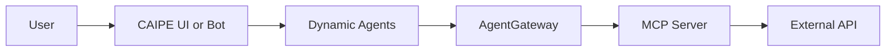

# MCP Servers

CAIPE uses MCP servers as tool backends for Dynamic Agents.

## Packaged Integrations

The Helm chart can deploy MCP servers with `mcp-*` aliases:

| Alias | Purpose |
|---|---|
| `mcp-argocd` | ArgoCD and GitOps operations |
| `mcp-backstage` | Backstage catalog access |
| `mcp-confluence` | Confluence content access |
| `mcp-github` | GitHub repository operations |
| `mcp-gitlab` | GitLab repository operations |
| `mcp-jira` | Jira issue operations |
| `mcp-komodor` | Kubernetes troubleshooting |
| `mcp-pagerduty` | PagerDuty incident data |
| `mcp-slack` | Slack workspace operations |
| `mcp-splunk` | Splunk search and observability |
| `mcp-victorops` | VictorOps incident data |
| `mcp-webex` | Webex workspace operations |
| `mcp-netutils` | Network utility tools |

## Runtime Flow

```mermaid
flowchart LR
  User[User] --> UI[CAIPE UI or Bot]
  UI --> DA[Dynamic Agents]
  DA --> AG[AgentGateway]
  AG --> MCP[MCP Server]
  MCP --> API[External API]
```

Dynamic Agents select and call MCP tools directly or through AgentGateway. Use
the UI admin settings or Helm values to configure which MCP servers are
available to each agent.

## Add Another MCP Server

Use the [Creating an MCP Server](../development/creating-mcp-server.md) guide
for new integrations.
