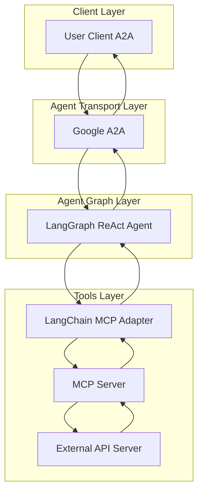

# Agents

## Platform and DevOps Tools Agents

The CAIPE (Community AI Platform Engineering) project provides a comprehensive suite of LLM-powered agents designed for Platform and DevOps tools. Each agent is built using the [LangGraph ReAct Agent](https://langchain-ai.github.io/langgraph/agents/agents/) workflow and [MCP Server](https://modelcontextprotocol.io/introduction) architecture, ensuring consistent, secure, and scalable AI-powered automation.

### 🤖 Available Agents

| Agent | Description | Status | Protocol Support |
|-------|-------------|--------|------------------|
| [ArgoCD](argocd.md) | GitOps continuous delivery for Kubernetes | ✅ Production Ready | A2A |
| [Backstage](backstage.md) | Developer portal and service catalog | ✅ Production Ready | A2A |
| [Confluence](confluence.md) | Team collaboration and documentation | ✅ Production Ready | A2A |
| [GitHub](github.md) | Source code management and collaboration | ✅ Production Ready | A2A |
| [Jira](jira.md) | Project management and issue tracking | ✅ Production Ready | A2A |
| [Komodor](komodor.md) | Kubernetes troubleshooting and monitoring | ✅ Production Ready | A2A |
| [AWS](aws.md) | Cloud infrastructure and EKS management | ✅ Production Ready | A2A |
| [PagerDuty](pagerduty.md) | Incident management and on-call scheduling | ✅ Production Ready | A2A |
| [Slack](slack.md) | Team communication and collaboration | ✅ Production Ready | A2A |
| [Weather](weather.md) | Weather information and forecasting | ✅ Production Ready | A2A |
| [Petstore](petstore.md) | Pet store API with mock server | 🛠️ Development | A2A |

### 🏗️ Architecture Overview

All agents follow a consistent architecture pattern:

### Common Documentation Structure

All agent documentation follows a consistent structure with these common elements:

#### 🏗️ Architecture Section
- **System Diagram**: Mermaid flowchart showing the overall system architecture
- **Sequence Diagram**: Mermaid sequence diagram showing the interaction flow

#### ⚙️ Local Development Setup
- Environment configuration
- API token setup
- Local testing instructions
- Sanity test commands

#### ✨ Features
- Agent-specific capabilities
- API integration details
- Use case examples

#### 🎯 Example Use Cases
- Natural language query examples
- Common operations
- Agent-specific workflows

### ✨ Key Features

- **🤖 LangGraph Integration**: Built on the powerful LangGraph ReAct Agent framework
- **🔌 MCP Server Architecture**: Uses Model Context Protocol for tool integration
- **🌐 A2A Protocol Support**: Compatible with Google's A2A protocol for agent communication
- **🛡️ Security First**: Token-based RBAC and external authentication support
- **🏭 First-Party MCP Servers**: Generated using our openapi-mcp-codegen utility
- **📊 Comprehensive API Coverage**: Full API coverage through MCP tools
- **🚀 Production Ready**: Docker support, CI/CD pipelines, and evaluation frameworks

### 🎯 Use Cases

#### Platform Engineering
- **Cloud Infrastructure**: Deploy, scale, and manage AWS EKS clusters
- **GitOps Operations**: Automate continuous delivery with ArgoCD
- **Service Discovery**: Manage service catalogs with Backstage
- **Monitoring & Alerting**: Set up comprehensive monitoring with Komodor

#### DevOps Operations
- **Issue Tracking**: Manage projects and issues with Jira
- **Code Management**: Collaborate on code with GitHub
- **Documentation**: Create and manage documentation with Confluence
- **Communication**: Coordinate teams with Slack
- **Incident Response**: Handle incidents with PagerDuty

#### Development Workflows
- **Code Reviews**: Automate pull request management
- **Deployment Automation**: Streamline deployment processes
- **Monitoring Setup**: Configure monitoring and alerting
- **Team Collaboration**: Enhance team communication and coordination

#### Utility Services
- **Weather Information**: Get weather forecasts and current conditions
- **API Testing**: Test APIs with mock servers and sample data

### 🚀 Getting Started

1. **Choose an Agent**: Select the agent that matches your use case
2. **Configure Environment**: Set up API credentials and configuration
3. **Deploy**: Use Docker or run locally for development
4. **Interact**: Use the A2A client to interact with the agent

### 🔧 Development

#### Creating New Agents

Use the [Petstore/Template Agent](template.md) as a starting point for creating new agents:

1. Clone the template repository
2. Configure your API integration
3. Generate MCP server using openapi-mcp-codegen
4. Customize prompts and functionality
5. Test and deploy

#### Contributing

We welcome contributions! Please see our [Contributing Guide](../../contributing/README.md) for details on how to get started.