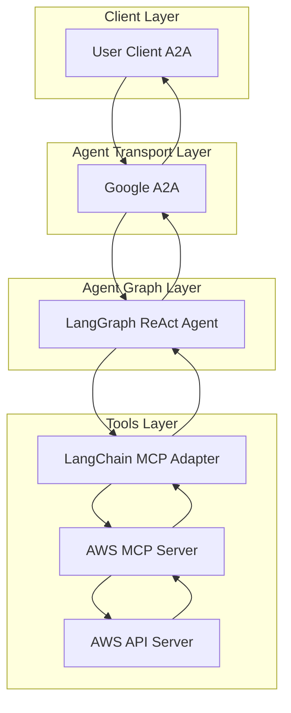

# AWS Agent

- 🤖 **AWS Agent** is an LLM-powered agent built using the [LangGraph ReAct Agent](https://langchain-ai.github.io/langgraph/agents/agents/) workflow and AWS [MCP Server](https://modelcontextprotocol.io/introduction).
- 🌐 **Protocol Support:** Compatible with [A2A](https://github.com/google/A2A) protocol for integration with external user clients.
- 🛡️ **Secure by Design:** Enforces AWS IAM token-based RBAC and supports secondary external authentication for strong access control.
- 🏭 **MCP Server:** The MCP server is generated by our first-party [openapi-mcp-codegen](https://github.com/cnoe-io/openapi-mcp-codegen/tree/main) utility, ensuring version/API compatibility and software supply chain integrity.
- 🔌 **MCP Tools:** Uses [langchain-mcp-adapters](https://github.com/langchain-ai/langchain-mcp-adapters) to glue the tools from AWS MCP server to LangGraph ReAct Agent Graph.

## 🏗️ Architecture

### System Diagram



### Sequence Diagram

```mermaid
sequenceDiagram
  participant User
  participant A2A
  participant Agent as LangGraph ReAct Agent
  participant LLM
  participant MCP as AWS MCP Server
  participant APIServer as AWS API Server

  note over Agent,MCP: 🛠️ Agent Setup Phase
  rect rgb(245, 245, 220)
    Agent->>MCP: Get Tools
    Agent->>LLM: Bind Tools
  end

  rect rgb(220, 232, 243)
    note over User,A2A: 🧑‍💻 User Input Phase
    User->>A2A: Send request
    A2A->>Agent: Forward to LangGraph Agent

    note over Agent,LLM: 🧠 Agent Reasoning & Tool Selection
    Agent->>LLM: [Reason] User Input
    LLM-->>Agent: [Act] Execute MCP Tool

    note over MCP,APIServer: 🛠️ API Invocation Phase
    Agent->>MCP: Invoke tool
    MCP->>APIServer: Call API
    APIServer-->>MCP: Return data
    MCP-->>Agent: Return data

    note over Agent,LLM: 🧠 Agent Reasoning & Output Structuring
    Agent->>LLM: Input API result data for further ReAct loop
    LLM-->>Agent: Return Structured Output

    note over User,A2A: 📤 User Output Phase
    Agent-->>A2A: Respond with Structured Output
    A2A-->>User: Respond to user (Non-stream or streaming)
  end
```



---

## ⚙️ Local Development Setup

Use this setup to test the agent against AWS services.

### 🔑 Get AWS Credentials

1. **AWS CLI Configuration:**
   ```bash
   aws configure
   # Enter your AWS Access Key ID, Secret Access Key, and region
   ```

2. **IAM Permissions:**
   Ensure your AWS credentials have the following permissions:
   - `eks:*` (for EKS cluster management)
   - `cloudformation:*` (for CloudFormation operations)
   - `iam:*` (for IAM role and policy management)
   - `ec2:*` (for VPC and security group management)
   - `ce:*` (for Cost Explorer, if enabled)
   - `logs:*` (for CloudWatch logs access)

3. **Environment Variables:**
   Add to your `.env`:
   ```env
   AWS_ACCESS_KEY_ID=<your-access-key>
   AWS_SECRET_ACCESS_KEY=<your-secret-key>
   AWS_DEFAULT_REGION=us-east-1
   ENABLE_EKS_MCP=true
   ENABLE_COST_EXPLORER_MCP=false
   ```

### 🚀 Deploy EKS Cluster (Optional)

```bash
# Create a basic EKS cluster for testing
aws eks create-cluster \
  --name test-cluster \
  --role-arn arn:aws:iam::ACCOUNT:role/eksServiceRole \
  --resources-vpc-config subnetIds=subnet-12345,subnet-67890
```

### Run AWS Sanity tests

```
make aws-sanity
```

## ✨ Features

### EKS Cluster Management
- **Cluster Operations**: Create, describe, and delete EKS clusters using CloudFormation
- **Template Generation**: Generate CloudFormation templates with best practices
- **Lifecycle Management**: Manage cluster lifecycle and configuration
- **Networking**: Handle VPC, networking, and security group setup

### Kubernetes Resource Operations
- **Resource Management**: Create, read, update, and delete Kubernetes resources
- **Manifest Application**: Apply YAML manifests to EKS clusters
- **Query Capabilities**: List and query resources with filtering capabilities
- **Workload Management**: Manage deployments, services, pods, and other workloads

### Application Deployment
- **Manifest Generation**: Generate Kubernetes deployment and service manifests
- **Container Deployment**: Deploy containerized applications with proper configuration
- **Load Balancing**: Configure load balancers and ingress controllers
- **Multi-Environment**: Handle multi-environment deployments

### Monitoring & Troubleshooting
- **Log Retrieval**: Retrieve pod logs and Kubernetes events
- **CloudWatch Integration**: Query CloudWatch logs and metrics
- **Troubleshooting**: Access EKS troubleshooting guidance
- **Performance Monitoring**: Monitor cluster and application performance

### Security & IAM
- **IAM Management**: Manage IAM roles and policies for EKS
- **RBAC Configuration**: Configure Kubernetes RBAC
- **Service Accounts**: Handle service account permissions
- **Security Best Practices**: Implement security best practices

### Cost Management & FinOps (Optional)
- **Cost Analysis**: Analyze AWS costs by service, region, and time period
- **Reporting**: Generate detailed cost reports and breakdowns
- **Optimization**: Identify cost optimization opportunities
- **Trend Analysis**: Track cost trends and forecasts
- **Budget Monitoring**: Monitor budget alerts and cost anomalies

## 🎯 Example Use Cases

Ask the agent natural language questions like:

### EKS Operations
- **Cluster Management**: "Create a new EKS cluster called 'production-cluster' in us-west-2"
- **Template Generation**: "Generate a CloudFormation template for a 3-node EKS cluster"
- **Cluster Status**: "Show me the status of all EKS clusters in my account"

### Kubernetes Operations
- **Resource Management**: "Create a deployment for nginx with 3 replicas"
- **Service Configuration**: "Expose the nginx deployment on port 80"
- **Resource Queries**: "List all pods in the default namespace"

### Application Deployment
- **App Deployment**: "Deploy a sample web application to the EKS cluster"
- **Load Balancer Setup**: "Configure an Application Load Balancer for my service"
- **Multi-Environment**: "Deploy the same app to both dev and prod clusters"

### Monitoring & Troubleshooting
- **Log Analysis**: "Show me the logs for the nginx pod"
- **Event Monitoring**: "List all events in the kube-system namespace"
- **Performance Check**: "Check the resource utilization of my cluster"

### Security Operations
- **IAM Setup**: "Create an IAM role for EKS cluster access"
- **RBAC Configuration**: "Set up RBAC for the development team"
- **Security Audit**: "Check the security groups for my EKS cluster"

### Cost Management
- **Cost Analysis**: "Show me the AWS costs for the last 30 days"
- **Service Breakdown**: "Break down costs by AWS service"
- **Optimization**: "Identify opportunities to reduce EKS costs"
