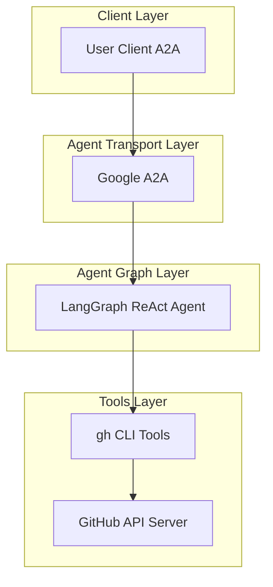
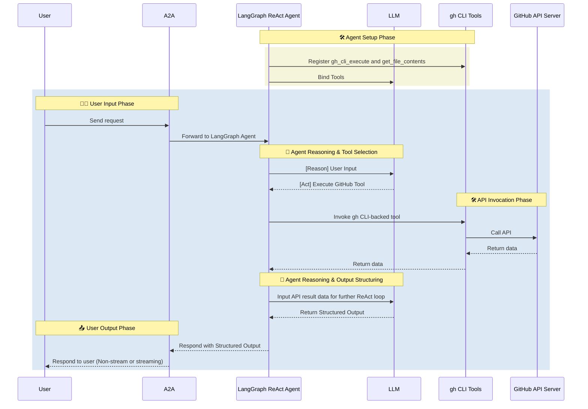

# GitHub Agent

- 🤖 **GitHub Agent** is an LLM-powered agent built using the [LangGraph ReAct Agent](https://langchain-ai.github.io/langgraph/agents/agents/) workflow and gh CLI-backed tools.
- 🌐 **Protocol Support:** Compatible with [A2A](https://github.com/google/A2A) protocol for integration with external user clients.
- 🛡️ **Secure by Design:** Enforces GitHub API token-based RBAC and supports secondary external authentication for strong access control.
- 🔌 **Integrated Communication:** Uses gh CLI for GitHub API operations, including workflow logs, pull requests, issues, and repository metadata.
- 📄 **File Reads:** Provides `get_file_contents` as a gh-backed helper for reading a specific repository file without a GitHub MCP server.

## 🏗️ Architecture

**[Detailed Sequence Diagram with Agentgateway](../architecture/gateway.md)**

### System Diagram



### Sequence Diagram



---

## ⚙️ Local Development Setup

Use this setup to test the agent against GitHub.

### 🔑 Get GitHub API Token

1. Go to GitHub.com → Settings → Developer Settings → Personal Access Tokens → Tokens (classic)
2. Click "Generate new token (classic)"
3. Give your token a descriptive name
4. Set an expiration date (recommended: 90 days)
5. Select the required permissions:
   > **⚠️ Note:** Always grant the minimum required permissions (principle of least privilege) when generating your GitHub API token. Only select the scopes necessary for your use case to enhance security.
   - `repo` (Full control of private repositories)
   - `workflow` (Update GitHub Action workflows)
   - `admin:org` (Full control of orgs and teams)
   - `admin:public_key` (Full control of public keys)
   - `admin:repo_hook` (Full control of repository hooks)
   - `admin:org_hook` (Full control of organization hooks)
   - `gist` (Create gists)
   - `notifications` (Access notifications)
   - `user` (Update ALL user data)
   - `delete_repo` (Delete repositories)
   - `write:packages` (Upload packages to GitHub Package Registry)
   - `delete:packages` (Delete packages from GitHub Package Registry)
   - `admin:gpg_key` (Full control of GPG keys)
   - `admin:ssh_signing_key` (Full control of SSH signing keys)
6. Click "Generate token"
7. Copy the token immediately (you won't be able to see it again)

Add to your `.env`:

```env
GITHUB_PERSONAL_ACCESS_TOKEN=<your_token>
GITHUB_API_URL=https://api.github.com
```

### Local Development

```bash
# Navigate to the GitHub agent directory
cd ai_platform_engineering/agents/github

# Run the A2A agent
make run-a2a
```
