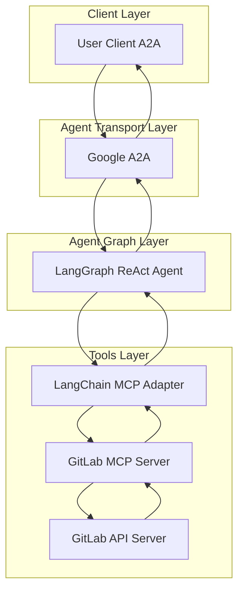
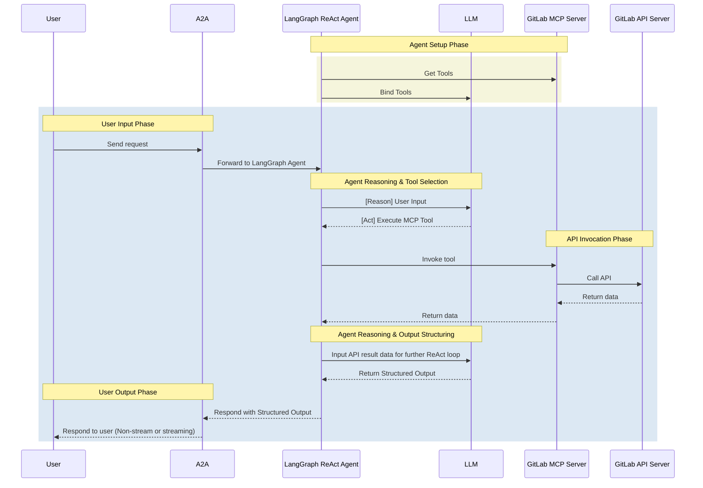

# GitLab Agent

- **GitLab Agent** is an LLM-powered agent built using the [LangGraph ReAct Agent](https://langchain-ai.github.io/langgraph/agents/agents/) workflow and the [@zereight/mcp-gitlab](https://github.com/zereight/mcp-gitlab) MCP Server.
- **Protocol Support:** Compatible with [A2A](https://github.com/google/A2A) protocol for integration with external user clients.
- **Secure by Design:** Enforces GitLab API token-based RBAC, supports read-only mode, and provides fine-grained tool filtering via regex patterns.

## Architecture

**[Detailed Sequence Diagram with Agentgateway](../architecture/gateway.md)**

### System Diagram



### Sequence Diagram



---

## Configuration

### Required Environment Variables

| Variable | Description | Example |
|----------|-------------|---------|
| `GITLAB_PERSONAL_ACCESS_TOKEN` | GitLab Personal Access Token | `glpat-xxxxxxxxxxxx` |
| `GITLAB_API_URL` | GitLab API endpoint | `https://gitlab.com/api/v4` |

### Optional Environment Variables

#### Agent Environment Variables

| Variable | Description | Default |
|----------|-------------|---------|
| `GIT_AUTHOR_NAME` | Git author name for commits | `AI Agent` |
| `GIT_AUTHOR_EMAIL` | Git author email for commits | `ai-agent@cnoe.io` |
| `GIT_COMMITTER_NAME` | Git committer name for commits | `AI Agent` |
| `GIT_COMMITTER_EMAIL` | Git committer email for commits | `ai-agent@cnoe.io` |
| `MCP_MODE` | MCP connection mode | `stdio` or `http` |

#### MCP Server Environment Variables

| Variable | Description | Default |
|----------|-------------|---------|
| `GITLAB_READ_ONLY_MODE` | Enable simple read-only mode | `true` |
| `GITLAB_DENIED_TOOLS_REGEX` | Regex pattern to block specific tools | See below |
| `MAX_SESSIONS` | Maximum concurrent sessions (HTTP mode) | `1000` |
| `MAX_REQUESTS_PER_MINUTE` | Rate limit per minute | `60` |
| `USE_PIPELINE` | Enable pipeline features | `true` |

---

## Tool Filtering

The GitLab agent supports two methods for controlling which tools are available:

### Option 1: Simple Read-Only Mode

Set `GITLAB_READ_ONLY_MODE=true` to block all write operations. This is the simplest and recommended approach for most deployments.

```env
GITLAB_READ_ONLY_MODE=true
```

### Option 2: Fine-Grained Control with Regex

Use `GITLAB_DENIED_TOOLS_REGEX` for granular control over which tools are blocked. The regex uses prefix matching with `^prefix_` patterns.

#### Example Patterns

**READ-ONLY** - blocks all write operations:
```env
GITLAB_DENIED_TOOLS_REGEX=^(delete_|remove_|create_|fork_|new_|update_|edit_|merge_|push_|publish_|retry_|cancel_|play_|promote_|upload_|resolve_|bulk_)|^(execute_graphql)$
```

**ALLOW CREATE** - allows creating MRs, issues, etc. but blocks delete/update:
```env
GITLAB_DENIED_TOOLS_REGEX=^(delete_|remove_|update_|edit_|merge_|push_|publish_|retry_|cancel_|play_|promote_|upload_|resolve_|bulk_)|^(execute_graphql)$
```

**ALLOW UPDATE** - allows updating MRs, issues, etc. but blocks delete/create:
```env
GITLAB_DENIED_TOOLS_REGEX=^(delete_|remove_|create_|fork_|new_)|^(execute_graphql)$
```

**ALLOW CREATE + UPDATE** - full write access except delete:
```env
GITLAB_DENIED_TOOLS_REGEX=^(delete_|remove_)|^(execute_graphql)$
```

#### Blocking Specific Tools

To block specific tools by exact name, add them as exact matches:
```env
GITLAB_DENIED_TOOLS_REGEX=...|^(execute_graphql|approve_merge_request|unapprove_merge_request)$
```

> **Note:** `execute_graphql` should always be blocked as it bypasses prefix-based permission controls.

---

## Local Development Setup

Use this setup to test the agent against GitLab.

### Get GitLab API Token

1. Go to GitLab → User Settings → Access Tokens
2. Click "Add new token"
3. Give your token a descriptive name
4. Set an expiration date
5. Select the required scopes:
   > **Note:** Always grant the minimum required permissions (principle of least privilege). Only select the scopes necessary for your use case.
   - `api` (Full API access)
   - `read_api` (Read-only API access - for read-only deployments)
   - `read_repository` (Read repository)
   - `write_repository` (Write repository - if creating branches/commits)
6. Click "Create personal access token"
7. Copy the token immediately (you won't be able to see it again)

Add to your `.env`:

```env
GITLAB_TOKEN=<your_token>
GITLAB_HOST=gitlab.com
```

### Run with Docker Compose

```bash
# Start the GitLab agent and MCP server
docker compose --profile gitlab up
```

### Local Development (stdio mode)

```bash
# Navigate to the GitLab agent directory
cd ai_platform_engineering/agents/gitlab

# Run the agent in stdio mode
make run-a2a
```

---

## Kubernetes Deployment

### Prerequisites

Create a Kubernetes secret with your GitLab credentials:

```bash
kubectl create secret generic gitlab-agent-secret \
  --from-literal=GITLAB_PERSONAL_ACCESS_TOKEN=<your_token> \
  --from-literal=GITLAB_API_URL=https://gitlab.com/api/v4
```

### Helm Values

Enable the GitLab agent in your `values.yaml`:

```yaml
tags:
  agent-gitlab: true

agent-gitlab:
  agentSecrets:
    secretName: "gitlab-agent-secret"
  env:
    # Git identity for commits made by the agent
    GIT_AUTHOR_NAME: "AI Agent"
    GIT_AUTHOR_EMAIL: "ai-agent@example.com"
    GIT_COMMITTER_NAME: "AI Agent"
    GIT_COMMITTER_EMAIL: "ai-agent@example.com"
  mcp:
    env:
      # Option 1: Simple read-only mode (recommended)
      GITLAB_READ_ONLY_MODE: "true"
      # Option 2: Fine-grained control (uncomment to use instead)
      # GITLAB_DENIED_TOOLS_REGEX: "^(delete_|remove_)|^(execute_graphql)$"
```

### Install

```bash
helm upgrade --install ai-platform-engineering \
  oci://ghcr.io/cnoe-io/ai-platform-engineering \
  -f values.yaml
```

---

## Multi-Tenant Deployment (Remote Authorization)

For multi-tenant deployments where each user should use their own GitLab credentials, the MCP server supports **Remote Authorization** mode.

### How It Works

Instead of configuring a single shared `GITLAB_PERSONAL_ACCESS_TOKEN`, the MCP server accepts per-session tokens via HTTP headers. Each user authenticates with GitLab independently, and their token is passed through to the MCP server for API calls.

```
┌─────────┐      ┌─────────┐      ┌──────────────┐      ┌──────────────┐      ┌────────┐
│  User   │──────│ CAIPE   │──────│ GitLab Agent │──────│ MCP Server   │──────│ GitLab │
│         │      │   UI    │      │              │      │ (REMOTE_AUTH)│      │  API   │
└─────────┘      └─────────┘      └──────────────┘      └──────────────┘      └────────┘
     │                │                  │                     │                   │
     │ 1. User authenticates to GitLab (OAuth or PAT)         │                   │
     │                │                  │                     │                   │
     │ 2. User sends request + token     │                     │                   │
     │ ───────────────>───────────────────>                    │                   │
     │                │                  │  Authorization:     │                   │
     │                │                  │  Bearer <user_tok>  │                   │
     │                │                  │ ────────────────────>                   │
     │                │                  │                     │ ─────────────────>│
     │                │                  │                     │  (user's perms)   │
```

### Benefits

- **User-scoped access**: Users only see repositories and resources they have permission to access
- **Proper audit trails**: GitLab API logs show the actual user, not a service account
- **No shared secrets**: No single admin token with broad access
- **Per-user permissions**: Each user's GitLab RBAC is respected

### MCP Server Configuration

Enable Remote Authorization on the MCP server:

```yaml
mcp:
  env:
    REMOTE_AUTHORIZATION: "true"
    # No GITLAB_PERSONAL_ACCESS_TOKEN needed - tokens come from users
```

### Current Status

> **Note:** The MCP server fully supports Remote Authorization. However, the agent-side token passthrough is not yet implemented. See [issue #762](https://github.com/cnoe-io/ai-platform-engineering/issues/762) for progress on this feature.

Once implemented, the agent will automatically forward user tokens from incoming A2A requests to the MCP server, enabling seamless multi-tenant deployments.
