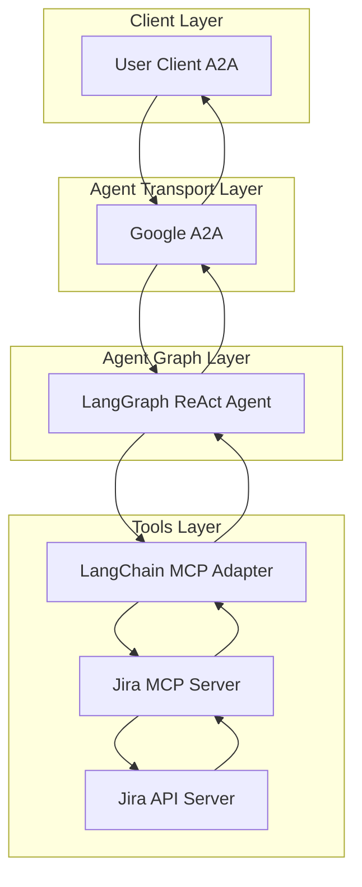

---
sidebar_position: 5
---

# Jira Agent

- 🤖 **Jira Agent** is an LLM-powered agent built using the [LangGraph ReAct Agent](https://langchain-ai.github.io/langgraph/agents/agents/) workflow and Jira [MCP Server](https://modelcontextprotocol.io/introduction).
- 🌐 **Protocol Support:** Compatible with [A2A](https://github.com/google/A2A) protocol for integration with external user clients.
- 🛡️ **Secure by Design:** Enforces Jira API token-based RBAC and supports secondary external authentication for strong access control.
- 🏭 **MCP Server:** The MCP server is generated by our first-party [openapi-mcp-codegen](https://github.com/cnoe-io/openapi-mcp-codegen/tree/main) utility, ensuring version/API compatibility and software supply chain integrity.
- 🔌 **MCP Tools:** Uses [langchain-mcp-adapters](https://github.com/langchain-ai/langchain-mcp-adapters) to glue the tools from Jira MCP server to LangGraph ReAct Agent Graph.

## 🏗️ Architecture

### System Diagram



### Sequence Diagram

```mermaid
sequenceDiagram
  participant User
  participant A2A
  participant Agent as LangGraph ReAct Agent
  participant LLM
  participant MCP as Jira MCP Server
  participant APIServer as Jira API Server

  note over Agent,MCP: 🛠️ Agent Setup Phase
  rect rgb(245, 245, 220)
    Agent->>MCP: Get Tools
    Agent->>LLM: Bind Tools
  end

  rect rgb(220, 232, 243)
    note over User,A2A: 🧑‍💻 User Input Phase
    User->>A2A: Send request
    A2A->>Agent: Forward to LangGraph Agent

    note over Agent,LLM: 🧠 Agent Reasoning & Tool Selection
    Agent->>LLM: [Reason] User Input
    LLM-->>Agent: [Act] Execute MCP Tool

    note over MCP,APIServer: 🛠️ API Invocation Phase
    Agent->>MCP: Invoke tool
    MCP->>APIServer: Call API
    APIServer-->>MCP: Return data
    MCP-->>Agent: Return data

    note over Agent,LLM: 🧠 Agent Reasoning & Output Structuring
    Agent->>LLM: Input API result data for further ReAct loop
    LLM-->>Agent: Return Structured Output

    note over User,A2A: 📤 User Output Phase
    Agent-->>A2A: Respond with Structured Output
    A2A-->>User: Respond to user (Non-stream or streaming)
  end
```



---

## ⚙️ Local Development Setup

Use this setup to test the agent against a local Jira instance.

### ▶️ Start Jira with Docker

> **Note:** Jira can be run locally using Docker for development and testing.

```bash
# Start Jira with Docker Compose
docker-compose up -d jira
```

### 🛂 Retrieve Admin Credentials

```bash
# Get the admin password from Jira logs
docker-compose logs jira | grep "admin password"
```

### 📦 Install CLI (Optional)

```bash
# Install Jira CLI
npm install -g jira-cli
```

### 🚀 Create Test Project

```bash
# Create a test project using Jira CLI
jira-cli project create --name "Test Project" --key "TEST"
```

### 🔑 Get API Token

1. Log in to your Jira instance
2. Go to Settings → Personal Access Tokens
3. Create a new API token with appropriate permissions
4. Save the token for your `.env` file

Add to your `.env`:

```env
ATLASSIAN_TOKEN=<your_token>
ATLASSIAN_EMAIL=<your_email>
ATLASSIAN_API_URL=http://localhost:8080
ATLASSIAN_VERIFY_SSL=false
```

### Run Jira Sanity tests

```
make jira-sanity
```

## ✨ Features

- **Issue Management**: Create, update, assign, and track issues
- **Project Management**: Create and manage Jira projects
- **Sprint Management**: Plan and manage sprints
- **User Management**: Manage users, groups, and permissions
- **Workflow Management**: Configure and manage workflows
- **Custom Fields**: Manage custom fields and their values
- **Dashboard Management**: Create and manage dashboards
- **Filter Management**: Create and manage JQL filters
- **Comment System**: Add and manage comments on issues
- **Attachment Management**: Upload and manage attachments
- **API Integration**: Full Jira API coverage through MCP tools

## 🎯 Example Use Cases

Ask the agent natural language questions like:

- **Issue Operations**: "Create a new bug issue titled 'Login button not working' in the 'Frontend' project"
- **Sprint Management**: "Create a new sprint called 'Sprint 1' starting next Monday"
- **Project Management**: "Create a new project called 'Mobile App' with key 'MOB'"
- **User Management**: "Add user 'john.doe' to the 'Developers' group"
- **Filter Management**: "Create a filter to show all open bugs assigned to me"
- **Dashboard Management**: "Create a dashboard showing sprint progress"
- **Workflow Management**: "Configure the bug workflow to require testing before closing"