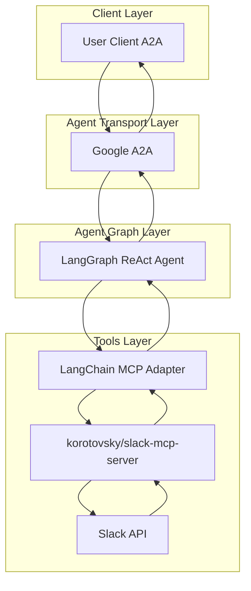
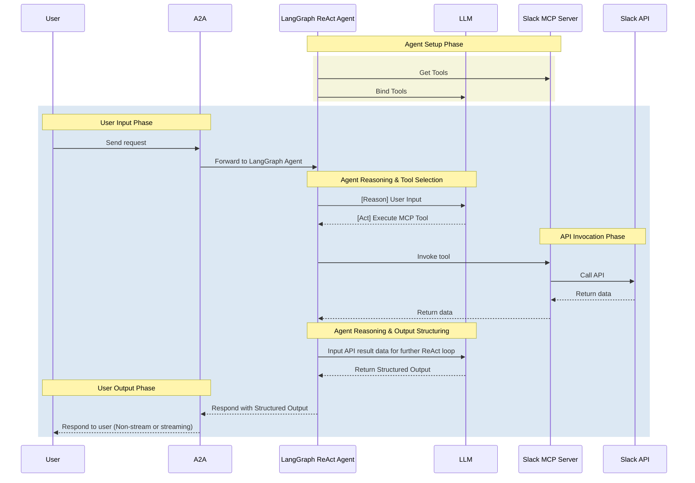

# Slack Agent

- **Slack Agent** is an LLM-powered agent built using the [LangGraph ReAct Agent](https://langchain-ai.github.io/langgraph/agents/agents/) workflow and [MCP Server](https://modelcontextprotocol.io/introduction).
- **Protocol Support:** Compatible with [A2A](https://github.com/google/A2A) protocol for integration with external user clients.
- **Secure by Design:** Enforces Slack API token-based RBAC and supports secondary external authentication for strong access control.
- **MCP Server:** Uses the OSS [korotovsky/slack-mcp-server](https://github.com/korotovsky/slack-mcp-server) — a Go-based Slack MCP server supporting multiple auth modes, transports (stdio/SSE/HTTP), and stealth mode.
- **MCP Tools:** Uses [langchain-mcp-adapters](https://github.com/langchain-ai/langchain-mcp-adapters) to glue the tools from the Slack MCP server to the LangGraph ReAct Agent Graph.

## Architecture

**[Detailed Sequence Diagram with Agentgateway](../architecture/gateway.md)**

### System Diagram



### Sequence Diagram



---

## Local Development Setup

Use this setup to test the agent against Slack.

### Get Slack API Credentials

1. Go to [Slack API](https://api.slack.com/apps)
2. Create a new Slack app
3. Configure Bot Token Scopes:
   - `channels:read` (required — channel listing and cache)
   - `channels:history` (required — read channel messages)
   - `users:read` (required — user search and cache)
   - `groups:history` (private channel history)
   - `im:history` (direct message history)
   - `mpim:history` (group DM history)
   - `search:read` (message search)
   - `chat:write` (only if enabling message posting)
   - `reactions:write` (only if enabling reactions)
   - `app_mentions:read` (optional — for event subscriptions)
4. Enable Socket Mode and generate an app-level token
5. Install the app to your workspace
6. Save the Bot User OAuth Token

Add to your `.env`:

```env
SLACK_BOT_TOKEN=<your-bot-token>
```

### Local Development

```bash
# Navigate to the Slack agent directory
cd ai_platform_engineering/agents/slack

# Run the A2A agent (requires the MCP server to be running separately)
make run-a2a
```

To run the MCP server locally via Docker:

```bash
docker run -p 3001:3001 \
  -e SLACK_MCP_HOST=0.0.0.0 \
  -e SLACK_MCP_PORT=3001 \
  -e SLACK_MCP_XOXB_TOKEN=$SLACK_BOT_TOKEN \
  -e SLACK_MCP_ADD_MESSAGE_TOOL=true \
  ghcr.io/korotovsky/slack-mcp-server:v1.2.3 --transport http
```

## MCP Server

The Slack agent uses the OSS [korotovsky/slack-mcp-server](https://github.com/korotovsky/slack-mcp-server) which provides:

### Read-Only Tools (enabled by default)
- `conversations_history` — Fetch channel messages with pagination by date/count
- `conversations_replies` — Retrieve thread messages
- `conversations_unreads` — Get all unread messages across channels
- `channels_list` — List workspace channels
- `users_search` — Find users by name/email
- `conversations_search_messages` — Search messages with multiple filters
- `usergroups_list` — List user groups/subteams

### Write Tools (opt-in via env vars)
- `conversations_add_message` — Post messages (requires `SLACK_MCP_ADD_MESSAGE_TOOL=true`)
- `reactions_add` / `reactions_remove` — Manage emoji reactions
- `conversations_mark` — Mark channels as read (requires `SLACK_MCP_MARK_TOOL=true`)
- `usergroups_create` / `usergroups_update` / `usergroups_users_update` — Manage groups

### Authentication Modes
- **Bot token**: Set `SLACK_MCP_XOXB_TOKEN` (maps from `SLACK_BOT_TOKEN` in docker-compose)
- **User token**: Set `SLACK_MCP_XOXP_TOKEN`
- **Browser tokens**: Set `SLACK_MCP_XOXC_TOKEN` + `SLACK_MCP_XOXD_TOKEN` (stealth mode, no bot install required)

### Environment Variables

| Variable | Description | Default |
|---|---|---|
| `SLACK_MCP_XOXB_TOKEN` | Slack bot token | (required, one of xoxb/xoxp/xoxc+xoxd) |
| `SLACK_MCP_HOST` | Listen host | `127.0.0.1` |
| `SLACK_MCP_PORT` | Listen port | `13080` |
| `SLACK_MCP_ADD_MESSAGE_TOOL` | Enable message posting | `false` |
| `SLACK_MCP_MARK_TOOL` | Enable mark-as-read | `false` |
| `SLACK_MCP_LOG_LEVEL` | Log level | `info` |
| `SLACK_MCP_API_KEY` | Bearer token for SSE/HTTP auth | — |
| `SLACK_MCP_ENABLED_TOOLS` | Comma-separated tool whitelist | (all read tools) |

### Safety Guardrails

The korotovsky/slack-mcp-server has built-in safety controls:

1. **Write tools disabled by default** — Message posting, reactions, and group management require explicit opt-in via environment variables.

2. **Channel restrictions** — `SLACK_MCP_ADD_MESSAGE_TOOL` supports three modes:
   - `true` — allow posting to all channels
   - `C123,C456` — whitelist: only allow posting to specific channel IDs
   - `!C789,!C012` — blacklist: allow all channels except these

3. **Tool whitelisting** — `SLACK_MCP_ENABLED_TOOLS` restricts which tools are registered (e.g. `conversations_history,channels_list` to allow only read operations).

**Note:** There is no built-in regex filtering or rate limiting. For additional protection, rely on Slack API token scopes (e.g., remove `chat:write` scope to prevent posting entirely) and the channel restriction features above.

## Example Use Cases

Ask the agent natural language questions like:

- **Channel Operations**: "List all channels in the workspace"
- **Message Management**: "Send a message to #general saying 'Hello team!'"
- **User Management**: "Show me information about user 'john.doe'"
- **Reaction Management**: "Add a thumbs up reaction to the latest message in #announcements"
- **Thread Management**: "Reply to the message in #bug-reports about the login issue"
- **Search Operations**: "Find all messages containing 'deployment' in the last week"
