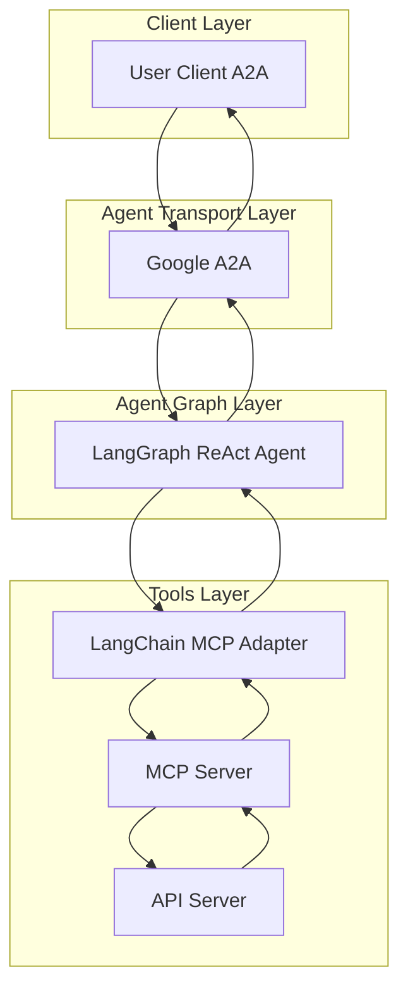

---
sidebar_position: 9
---

# Template Agent

- 🤖 **Template Agent** is a template for creating new LLM-powered agents using the [LangGraph ReAct Agent](https://langchain-ai.github.io/langgraph/agents/agents/) workflow and [MCP Server](https://modelcontextprotocol.io/introduction).
- 🌐 **Protocol Support:** Compatible with [A2A](https://github.com/google/A2A) protocol for integration with external user clients.
- 🛡️ **Secure by Design:** Enforces API token-based RBAC and supports secondary external authentication for strong access control.
- 🏭 **MCP Server:** The MCP server is generated by our first-party [openapi-mcp-codegen](https://github.com/cnoe-io/openapi-mcp-codegen/tree/main) utility, ensuring version/API compatibility and software supply chain integrity.
- 🔌 **MCP Tools:** Uses [langchain-mcp-adapters](https://github.com/langchain-ai/langchain-mcp-adapters) to glue the tools from MCP server to LangGraph ReAct Agent Graph.

## 🏗️ Architecture

### System Diagram



### Sequence Diagram

```mermaid
sequenceDiagram
  participant User
  participant A2A
  participant Agent as LangGraph ReAct Agent
  participant LLM
  participant MCP as MCP Server
  participant APIServer as API Server

  note over Agent,MCP: 🛠️ Agent Setup Phase
  rect rgb(245, 245, 220)
    Agent->>MCP: Get Tools
    Agent->>LLM: Bind Tools
  end

  rect rgb(220, 232, 243)
    note over User,A2A: 🧑‍💻 User Input Phase
    User->>A2A: Send request
    A2A->>Agent: Forward to LangGraph Agent

    note over Agent,LLM: 🧠 Agent Reasoning & Tool Selection
    Agent->>LLM: [Reason] User Input
    LLM-->>Agent: [Act] Execute MCP Tool

    note over MCP,APIServer: 🛠️ API Invocation Phase
    Agent->>MCP: Invoke tool
    MCP->>APIServer: Call API
    APIServer-->>MCP: Return data
    MCP-->>Agent: Return data

    note over Agent,LLM: 🧠 Agent Reasoning & Output Structuring
    Agent->>LLM: Input API result data for further ReAct loop
    LLM-->>Agent: Return Structured Output

    note over User,A2A: 📤 User Output Phase
    Agent-->>A2A: Respond with Structured Output
    A2A-->>User: Respond to user (Non-stream or streaming)
  end
```



---

## 🚀 Getting Started

### 1️⃣ Use the Template

To create a new agent based on this template:

```bash
# Clone the template
git clone <template-repo-url> my-new-agent
cd my-new-agent

# Update the agent name in configuration files
# Replace "template" with your agent name throughout the codebase
```

### 2️⃣ Configure Environment

Create a `.env` file with your specific configuration:

```env
# Agent Configuration
AGENT_NAME=your_agent_name
LLM_PROVIDER=azure-openai

# API Configuration
YOUR_API_KEY=<your-api-key>
YOUR_API_URL=<your-api-url>

# A2A Configuration
A2A_AGENT_HOST=localhost
A2A_AGENT_PORT=8000

# MCP Configuration
MCP_HOST=localhost
MCP_PORT=9000
```

### 3️⃣ Generate MCP Server

Use the openapi-mcp-codegen utility to generate your MCP server:

```bash
# Generate MCP server from OpenAPI spec
openapi-mcp-codegen generate \
  --openapi-spec your-api-spec.yaml \
  --output-dir mcp_server \
  --package-name mcp_your_agent
```

### 4️⃣ Customize the Agent

1. Update the agent description and capabilities
2. Modify the prompts and system messages
3. Add agent-specific tools and utilities
4. Update the documentation and examples

## ✨ Template Features

- **LangGraph Integration**: Built-in LangGraph ReAct Agent workflow
- **MCP Server Support**: Automatic MCP server integration
- **A2A Protocol**: Ready-to-use A2A protocol implementation
- **Docker Support**: Docker configuration for easy deployment
- **Testing Framework**: Built-in testing and evaluation framework
- **Documentation**: Comprehensive documentation template
- **CI/CD Ready**: GitHub Actions workflows for testing and deployment

## 🎯 Customization Guide

### Agent-Specific Configuration

1. **Update Agent Name**: Replace "template" with your agent name
2. **Configure API Integration**: Add your specific API endpoints and authentication
3. **Customize Prompts**: Modify system prompts and user interactions
4. **Add Tools**: Implement agent-specific tools and utilities
5. **Update Documentation**: Customize README and documentation

### MCP Server Customization

1. **API Specification**: Provide your OpenAPI specification
2. **Tool Selection**: Choose which API endpoints to expose as tools
3. **Authentication**: Configure authentication methods
4. **Error Handling**: Implement custom error handling logic

### Testing and Evaluation

1. **Unit Tests**: Add tests for your specific functionality
2. **Integration Tests**: Test against your API endpoints
3. **Evaluation Suite**: Create evaluation prompts and expected outputs
4. **Performance Testing**: Test agent performance and response times

## 📚 Documentation

For more detailed information about creating agents, please refer to:

- [Agent Development Guide](../development/agent-development.md)
- [MCP Server Creation](../tools-utils/mcp-server-creation.md)
- [A2A Protocol Documentation](../architecture/a2a-protocol.md)
- [Testing and Evaluation](../evaluations/agent-evaluation.md)