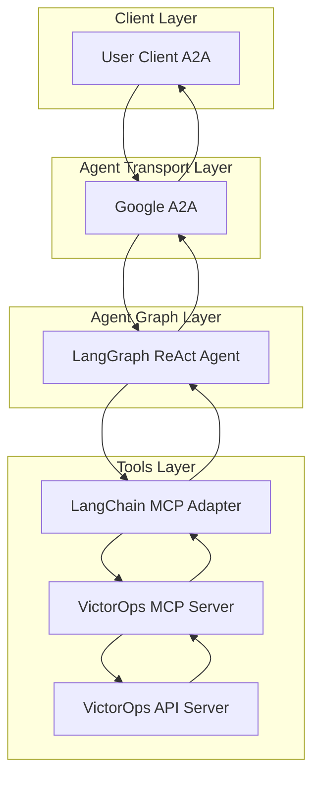

# VictorOps Agent

- 🤖 **VictorOps Agent** is an LLM-powered agent built using the [LangGraph ReAct Agent](https://langchain-ai.github.io/langgraph/agents/agents/) workflow and VictorOps [MCP Server](https://modelcontextprotocol.io/introduction).
- 🌐 **Protocol Support:** Compatible with [A2A](https://github.com/google/A2A) protocol for integration with external user clients.
- 🛡️ **Secure by Design:** Enforces VictorOps API token-based RBAC and supports secondary external authentication for strong access control.
- 🏭 **MCP Server:** The MCP server is generated by our first-party [openapi-mcp-codegen](https://github.com/cnoe-io/openapi-mcp-codegen/tree/main) utility, ensuring version/API compatibility and software supply chain integrity.
- 🔌 **MCP Tools:** Uses [langchain-mcp-adapters](https://github.com/langchain-ai/langchain-mcp-adapters) to glue the tools from VictorOps MCP server to LangGraph ReAct Agent Graph.

---

## Architecture

**[Detailed Sequence Diagram with Agentgateway](../architecture/gateway.md)**



---

## ⚙️ Local Development Setup

### 🔑 Get VictorOps API Credentials

- Retrieve your VictorOps API key and API ID from the VictorOps portal under **Settings > API**

Add to your `.env`:

```env
VICTOROPS_API_URL=https://api.victorops.com
X_VO_API_KEY=<your_api_key>
X_VO_API_ID=<your_api_id>
```

### Local Development

```bash
# Navigate to the VictorOps agent directory
cd ai_platform_engineering/agents/victorops

# Run the MCP server in stdio mode
make run-a2a
```

## ✨ Features

- **Incident Management**: Create, update, resolve, and track incidents across your organization
- **Incident Notes**: Add, update, list, and delete notes on incidents for collaboration
- **Incident Reporting**: Query incident history and generate reports via the reporting API
- **User Management**: List and look up users, contact methods, and on-call details
- **Chat**: Send real-time chat messages to VictorOps timelines

## 🎯 Example Use Cases

Ask the agent natural language questions like:

### Incident Operations
- **Incident Creation**: "Create a new incident for the database service that's experiencing high latency"
- **Incident Listing**: "List all currently open incidents"
- **Incident Details**: "Get details of incident #456"
- **Incident Update**: "Update the urgency of incident #123 to high"

### Incident Notes
- **Add Note**: "Add a note to incident #123 saying the root cause was identified"
- **List Notes**: "Show me all notes for incident #123"
- **Update Note**: "Update note 'my-note' on incident #123"
- **Delete Note**: "Delete note 'my-note' from incident #123"

### User & On-Call Management
- **List Users**: "List all users in VictorOps"
- **User Details**: "Show me the contact details for user john.doe"

### Chat & Collaboration
- **Send Message**: "Send a chat message to the VictorOps timeline about the ongoing database incident"
