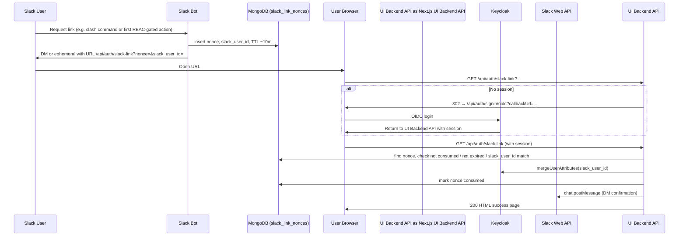

# Slack Integration API

This page describes the **Slack integration** surface area: Next.js UI Backend API (Backend-for-Frontend) routes under `ui/src/app/api`, and the **Slack Bolt** bot (`ai_platform_engineering/integrations/slack_bot`) as a non-HTTP reference.

---

## Slack User Bootstrapping Dashboard API (admin)

Admin-only JSON APIs used by the CAIPE admin UI to list Slack-linked identities, metrics, and to trigger re-link or revoke.

### GET `/api/admin/slack/users`

**Auth:** Session (NextAuth) — admin role required | **Service:** UI Backend API

Returns a **paginated** list of Slack users merged from Keycloak (`slack_user_id` attribute), pending nonces in MongoDB (`slack_link_nonces`), and optional orphans from `slack_user_metrics`.

**Query parameters**

| Name | Type | Default | Description |
|------|------|---------|-------------|
| `page` | integer | `1` | Page number (≥ 1). |
| `page_size` | integer | `20` | Page size (1–100). |
| `status` | string | `all` | Filter: `all`, `linked`, `pending`, `unlinked`. |

**Response `200`:**

```json
{
  "success": true,
  "data": {
    "items": [
      {
        "keycloak_user_id": "a1b2c3d4-e5f6-7890-abcd-ef1234567890",
        "username": "jdoe",
        "email": "jdoe@example.com",
        "display_name": "Jane Doe",
        "slack_user_id": "U012ABCDEF",
        "link_status": "linked",
        "enabled": true,
        "roles": ["offline_access", "uma_authorization", "team-member-507f1f77bcf86cd799439011"],
        "teams": ["Platform"],
        "last_interaction": "2026-03-25T14:22:01.000Z",
        "obo_success_count": 42,
        "obo_fail_count": 1,
        "active_channels": ["C01ABC", "C02DEF"]
      },
      {
        "keycloak_user_id": "",
        "slack_user_id": "U099ZZZZ",
        "link_status": "unlinked",
        "roles": [],
        "teams": [],
        "last_interaction": "2026-03-20T09:00:00.000Z",
        "obo_success_count": 0,
        "obo_fail_count": 3,
        "active_channels": ["C01ABC"]
      }
    ],
    "total": 2,
    "page": 1,
    "page_size": 20,
    "has_more": false
  }
}
```

**Errors**

| Status | Body (typical) |
|--------|----------------|
| `401` | `{ "success": false, "error": "Authentication required" }` |
| `403` | `{ "success": false, "error": "Admin access required - must be member of admin group" }` |
| `400` | Invalid `page` / `page_size` |

---

### POST `/api/admin/slack/users/[id]`

**Auth:** Session (admin) | **Service:** UI Backend API

Creates a **new single-use linking nonce** for the Keycloak user identified by `[id]` (URL-encoded Keycloak user UUID). Requires the user to already have a `slack_user_id` attribute (re-link scenario).

**Path parameters**

| Name | Description |
|------|-------------|
| `id` | Keycloak user ID (encode reserved characters in the path). |

**Response `200`:**

```json
{
  "success": true,
  "data": {
    "relink_url": "https://caipe.example.com/api/auth/slack-link?nonce=AbCdEf123&slack_user_id=U012ABCDEF",
    "slack_user_id": "U012ABCDEF",
    "expires_at": "2026-03-25T15:10:00.000Z",
    "message": "Share this URL with the Slack user; they must open it while signed into CAIPE with their own account."
  }
}
```

**Errors**

| Status | Condition |
|--------|-----------|
| `400` | User has no `slack_user_id` in Keycloak — `{ "success": false, "error": "User has no Slack ID to re-link" }` |
| `401` / `403` | Same as other admin routes |

---

### DELETE `/api/admin/slack/users/[id]`

**Auth:** Session (admin) | **Service:** UI Backend API

Removes the `slack_user_id` Keycloak user attribute for the given Keycloak user (revokes the link).

**Path parameters**

| Name | Description |
|------|-------------|
| `id` | Keycloak user ID. |

**Response `200`:**

```json
{
  "success": true,
  "data": {
    "revoked": true,
    "keycloak_user_id": "a1b2c3d4-e5f6-7890-abcd-ef1234567890"
  }
}
```

**Errors:** `401`, `403` as above.

---

## Channel-to-Team Mapping API

Maps Slack channels to platform teams in MongoDB collection `channel_team_mappings`.

### GET `/api/admin/slack/channel-mappings`

**Auth:** Session (admin) | **Service:** UI Backend API

Lists up to 500 mappings (newest first), enriched with team names from `teams` where possible.

**Response `200`:**

```json
{
  "success": true,
  "data": {
    "items": [
      {
        "id": "67e2f1a2b3c4d5e6f7a8b9c0",
        "slack_channel_id": "C01ABCDEF",
        "team_id": "507f1f77bcf86cd799439011",
        "team_name": "Platform",
        "slack_workspace_id": "T0AAA111",
        "channel_name": "caipe-alerts",
        "created_by": "admin@example.com",
        "created_at": "2026-03-01T12:00:00.000Z",
        "active": true,
        "stale_team": false,
        "stale_channel_archived": false
      }
    ]
  }
}
```

**Errors**

| Status | Condition |
|--------|-----------|
| `503` | MongoDB not configured — `{ "success": false, "error": "MongoDB is not configured" }` |
| `401` / `403` | Auth failures |

---

### POST `/api/admin/slack/channel-mappings`

**Auth:** Session (admin) | **Service:** UI Backend API

Upserts a mapping keyed by `slack_channel_id`.

**Request body (JSON)**

```json
{
  "slack_channel_id": "C01ABCDEF",
  "team_id": "507f1f77bcf86cd799439011",
  "channel_name": "caipe-alerts",
  "workspace_id": "T0AAA111"
}
```

| Field | Required | Description |
|-------|----------|-------------|
| `slack_channel_id` | Yes | Slack channel ID. |
| `team_id` | Yes | MongoDB `teams._id` as string (24-char hex ObjectId). |
| `channel_name` | No | Defaults to `slack_channel_id` if omitted/empty. |
| `workspace_id` | No | Defaults to `"unknown"`. |

**Response `201`:**

```json
{
  "success": true,
  "data": {
    "id": "67e2f1a2b3c4d5e6f7a8b9c0",
    "slack_channel_id": "C01ABCDEF",
    "team_id": "507f1f77bcf86cd799439011",
    "slack_workspace_id": "T0AAA111",
    "channel_name": "caipe-alerts",
    "created_by": "admin@example.com",
    "created_at": "2026-03-25T16:00:00.000Z",
    "active": true
  }
}
```

**Errors**

| Status | Condition |
|--------|-----------|
| `400` | Missing `slack_channel_id` / `team_id`, or team does not exist |
| `503` | MongoDB not configured |

---

### DELETE `/api/admin/slack/channel-mappings`

**Auth:** Session (admin) | **Service:** UI Backend API

Soft-deactivates a mapping (`active: false`). Pass the mapping document id.

**Query or body**

- Query: `?id=<24-char-hex>`
- Or JSON body: `{ "id": "<24-char-hex>" }`

**Response `200`:**

```json
{
  "success": true,
  "data": {
    "deactivated": true
  }
}
```

**Errors**

| Status | Condition |
|--------|-----------|
| `400` | Missing or invalid `id` |
| `404` | No document matched |
| `503` | MongoDB not configured |

---

## Slack Identity Linking (OAuth callback flow)

### GET `/api/auth/slack-link`

**Auth:** Unauthenticated for the first hit; after redirect, **session** via Keycloak OIDC (NextAuth) | **Service:** UI Backend API

Browser entry point for linking a Slack user to the signed-in Keycloak user. Validates a nonce from MongoDB `slack_link_nonces`, then writes `slack_user_id` on the Keycloak user via Admin API.

**Query parameters**

| Name | Required | Description |
|------|----------|-------------|
| `nonce` | Yes | Single-use token from bot or admin re-link API. |
| `slack_user_id` | Yes | Slack user ID; must match the nonce document. |

**Behavior**

1. If `nonce` or `slack_user_id` is missing → **`400`** JSON: `{ "error": "missing nonce" }` or `{ "error": "missing slack_user_id" }`.
2. If nonce invalid, consumed, expired, or `slack_user_id` mismatch → **`400`** plain text: `This link is invalid or has expired.`
3. If no NextAuth session → **`302`** redirect to `/api/auth/signin/oidc?callbackUrl=<encoded return URL>`.
4. On success: merge Keycloak attribute `slack_user_id`, mark nonce consumed, call Slack `chat.postMessage` as a DM (if `SLACK_BOT_TOKEN` is set), return **`200`** HTML success page.

**Response `200` (HTML)**

`Content-Type: text/html` — styled “Account Linked!” page (not JSON).

**Response `500`:**

```json
{
  "error": "Server error"
}
```

---

## Slack Bot Event Handlers (reference)

Slack Bolt registrations in `app.py`. These are **not** HTTP routes; payloads follow Slack’s Events API / Socket Mode shapes (`body.event`, etc.).

| Handler type | Registration | Description | Payload (brief) | Response / side effects |
|--------------|--------------|-------------|-----------------|-------------------------|
| Event | `@app.event("app_mention")` | Invokes CAIPE when the bot is @mentioned in a configured channel. | `event.channel`, `event.user`, `event.text`, `thread_ts` / `ts` | Streams A2A reply in thread; may post “Retry” blocks on failure. |
| Event | `@app.event("message")` | Router for DMs, Q&A mode, bot alerts, and subtypes filter. | `event.channel_type`, `event.channel`, `event.user`, `event.text`, `bot_id` | Dispatches to DM handler, Q&A, or AI alert pipeline; ignores edited/deleted subtypes. |
| (internal) | `handle_dm_message` | DMs to the bot (from `message` when `channel_type == "im"`). | IM `event` | `stream_a2a_response`; retry UI on errors. |
| (internal) | `handle_qanda_message` | Auto-reply in channels with Q&A enabled. | Channel `event` | `stream_a2a_response`; may mark thread “skipped” (overthink). |
| Event | `@app.event("reaction_added")` | Placeholder. | `reaction` event | No-op. |
| Event | `@app.event("reaction_removed")` | Placeholder. | `reaction` event | No-op. |
| Error | `@app.error` | Global error logging. | `error`, `body` | Logs exception. |

---

## Slack Bot Action Handlers (reference)

| Handler type | Registration | Description | Payload (brief) | Response / side effects |
|--------------|--------------|-------------|-----------------|-------------------------|
| Action | `@app.action({"action_id": "hitl_form_.*"})` | Human-in-the-loop form interactions. | Interactive payload with `actions`, `user`, `channel` | `HITLCallbackHandler.handle_interaction`. |
| Action | `@app.action("caipe_feedback")` | Thumbs up/down on bot messages. | `actions[0].value`, `message.ts` | `submit_feedback_score`; ephemeral follow-up or refinement buttons. |
| Action | `@app.action("caipe_feedback_more_detail")` | Request more detailed answer. | `value` → `channel_id\|thread_ts` | Submits score; triggers follow-up A2A stream. |
| Action | `@app.action("caipe_feedback_less_verbose")` | Request shorter answer. | `value` → `channel_id\|thread_ts` | Submits score; triggers concise A2A stream. |
| Action | `@app.action("caipe_retry")` | Retry after transient failure. | `value` → `channel_id\|thread_ts` | Rebuilds thread context; `stream_a2a_response`. |
| Action | `@app.action("caipe_feedback_wrong_answer")` | Opens modal for correction. | `trigger_id`, `value` | `views_open` with correction modal. |
| Action | `@app.action("caipe_feedback_other")` | Opens modal (other feedback). | Same pattern | `views_open`. |
| View | `@app.view("caipe_wrong_answer_modal")` | Modal submit for wrong answer / other. | `view.state.values`, `private_metadata` | `submit_feedback_score` with comment; A2A correction stream. |

---

## RBAC Middleware (reference)

### Global Bolt middleware — `@app.middleware` → `rbac_global_middleware`

**Enabled when:** `SLACK_RBAC_ENABLED=true`.

| Step | Behavior |
|------|----------|
| Identity | Reads Slack user id from `body.event.user`, `body.user.id`, or `body.user_id`. |
| Resolve | Async: `resolve_slack_user` → Keycloak user by `slack_user_id` attribute; resolves channel team via `resolve_effective_team_for_user` and realm roles. |
| Unlinked | Generates URL via `generate_linking_url(slack_user_id)` (Mongo nonce + UI Backend API URL); `chat_postEphemeral` with link when `channel` is present; then **`next()`** — downstream handlers still run. |
| Deny | Team/role mismatch → ephemeral denial; **`return` without `next()`** — handler chain stops. |
| OK | Sets `context["keycloak_user_id"]`, `context["platform_team_id"]`, optional `context["slack_channel_id"]`; calls `next()`. |

> **Note:** The middleware docstring mentions OBO token exchange; the **enrichment function** in `app.py` focuses on identity + team + realm roles. OBO exchange is implemented in `obo_exchange.py` for callers that obtain a user token and call `exchange_token`; `require_permission` (below) expects an `access_token` kwarg for Keycloak AuthZ.

### Decorator — `require_permission` (`rbac_middleware.py`)

| Aspect | Detail |
|--------|--------|
| Purpose | Async decorator for handlers that need Keycloak Authorization Services (`check_permission`). |
| Args | `resource`, `scope`, optional `tenant_id` (default `default`). |
| Token | Expects `access_token` and `user_sub` in kwargs; uses `context["obo_token"]` / `access_token` for tenant (`org` claim). |
| On deny | Returns human-readable string for Slack ephemeral; logs via `log_authz_decision`. |
| Team gate | If `context["rbac_enabled"]` and `platform_team_id`, verifies JWT realm roles include team membership before PDP call. |

### Keycloak PDP — `keycloak_authz.py`

| Function | Description |
|----------|-------------|
| `check_permission(RbacCheckRequest)` | POST to realm token endpoint: `grant_type=urn:ietf:params:oauth:grant-type:uma-ticket`, `audience=KEYCLOAK_RESOURCE_SERVER_ID`, `permission={resource}#{scope}`, `response_mode=decision`. Returns `RbacCheckResult(allowed, reason)`. |
| `get_effective_permissions` | UMA ticket with `response_mode=permissions` for RPT-style permission listing. |

**Env (typical):** `KEYCLOAK_URL`, `KEYCLOAK_REALM`, `KEYCLOAK_RESOURCE_SERVER_ID`, `KEYCLOAK_CLIENT_SECRET`.

### OBO token exchange — `obo_exchange.py`

| Function | Description |
|----------|-------------|
| `exchange_token(subject_token)` | RFC 8693 token exchange to bot client (`KEYCLOAK_BOT_CLIENT_ID` / `KEYCLOAK_BOT_CLIENT_SECRET`). Returns `OboToken` (`access_token`, `expires_in`, …). |
| `downstream_auth_headers(access_token, team_id?)` | `Authorization: Bearer …` plus optional `X-Team-Id` for RAG/agents. |

### Audit — `audit.py`

| Function | Description |
|----------|-------------|
| `log_authz_decision(...)` | Emits JSON log line on logger `caipe.rbac.audit` with: `ts`, `tenant_id`, `subject_hash` (SHA-256 of salted sub), `capability` (`resource#scope`), `component`, `outcome` (`allow`/`deny`), `reason_code`, `pdp`, `correlation_id`, optional `actor_hash`, `resource_ref`. |

### Identity linker — `identity_linker.py` (bot-side)

| Function | Description |
|----------|-------------|
| `generate_linking_url(slack_user_id)` | Inserts nonce into `slack_link_nonces` (CSPRNG `secrets.token_urlsafe(32)`); TTL from `SLACK_LINK_TTL_SECONDS` (default **600**); Mongo TTL index on `created_at`. URL: `{SLACK_LINK_BASE_URL or CAIPE_URL}/api/auth/slack-link?nonce=…&slack_user_id=…`. |
| `validate_nonce` / `complete_linking` | Validate-and-consume nonce; set Keycloak attribute via Admin API (used when linking is finalized from the bot stack). |
| `resolve_slack_user` | Lookup Keycloak user by `slack_user_id` attribute; returns `None` if disabled or missing. |

---

## Identity Linking Flow

End-to-end behavior (conceptual UX **“/caipe link”**): product teams may expose linking as a slash command; the **current** `app.py` triggers the same nonce + URL flow when `SLACK_RBAC_ENABLED=true` and the user is **unlinked** (ephemeral message with link), or via **admin** `POST /api/admin/slack/users/[id]` for re-link.



**Step-by-step**

1. User requests linking in Slack (e.g. **`/caipe link`** if configured, or interaction while unlinked under RBAC).
2. Bot generates a cryptographically random nonce and stores a document in **`slack_link_nonces`** with **~10 minute** validity (TTL via `SLACK_LINK_TTL_SECONDS` / `expires_at` from admin flow).
3. Bot sends a **DM or ephemeral** message containing `https://<NEXTAUTH_URL>/api/auth/slack-link?nonce=…&slack_user_id=…`.
4. User opens the link; if not signed in, UI Backend API redirects to **Keycloak OIDC** (`/api/auth/signin/oidc`) with `callbackUrl` back to the same slack-link URL.
5. After login, UI Backend API validates the nonce (exists, not consumed, not expired, `slack_user_id` matches), then sets Keycloak user attribute **`slack_user_id`** for the session subject.
6. UI Backend API marks the nonce **consumed** (single-use).
7. UI Backend API sends a **confirmation DM** via `https://slack.com/api/chat.postMessage` using **`SLACK_BOT_TOKEN`** (optional; skipped if unset).
8. UI Backend API returns a **success HTML** page to the browser.

---

## Related environment variables

| Variable | Used by |
|----------|---------|
| `NEXTAUTH_URL` | UI Backend API absolute URLs for slack-link and sign-in callback |
| `SLACK_BOT_TOKEN` | UI Backend API confirmation DM after link |
| `MONGODB_URI` / DB name | Nonces, metrics, channel mappings |
| `SLACK_RBAC_ENABLED` | Bot global RBAC middleware |
| `SLACK_LINK_BASE_URL` / `CAIPE_URL` | Bot-generated linking URL base |
| `SLACK_LINK_TTL_SECONDS` | Bot nonce TTL (default 600) |
| `KEYCLOAK_*` | Admin API + AuthZ + OBO (`keycloak_authz.py`, `obo_exchange.py`) |
