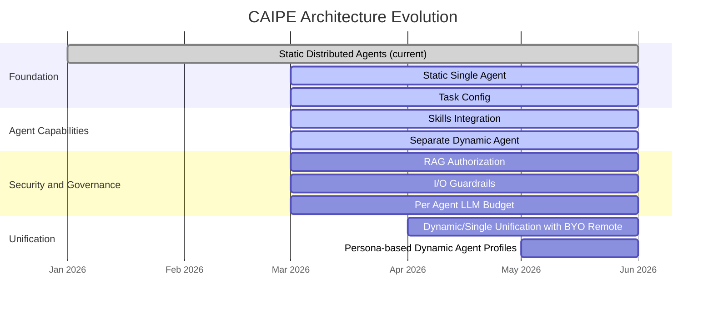

# CAIPE Architecture Evolution

This document tracks the architecture evolution roadmap for the Cisco AI Platform Engineering (CAIPE) system, from the current static distributed model through dynamic agent unification and persona-based profiles.

## Roadmap

## Phases

### Phase 1: Current — Static Distributed Agents

The baseline CAIPE architecture.

- Remote distributed agents and MCP servers
- Customized via Agent Registry and Helm config

### Phase 2: March 2026 — Single Node and Dynamic Agents

Consolidation and extensibility in parallel.

| Feature | Description |
|---------|-------------|
| **Static Single Agent** | Single node architecture for more efficient agent communication and tracing; continue remote BYO agent support |
| **Task Config** | Support for deterministic task configuration |
| **Skills Integration** | Skills middleware with CAIPE supervisor |
| **Separate Dynamic Agent** | Users can create their own dynamic agents with custom personas and chosen MCP tools |

### Phase 3: March 2026 — Security and Governance

Cross-cutting concerns that apply to all agent types.

| Feature | Description |
|---------|-------------|
| **RAG Authorization** | Per knowledge-base RBAC; user context authorization |
| **I/O Guardrails** | Slackbot input/output compliance guardrails |
| **Per Agent LLM Budget** | Per agent LLM configuration and budget controls |

### Phase 4: April 2026 — Unification

| Feature | Description |
|---------|-------------|
| **Dynamic/Single Unification with BYO Remote** | Unify the static single agent and dynamic agent architecture |

### Phase 5: May 2026 — Persona-based Profiles

| Feature | Description |
|---------|-------------|
| **Persona-based Dynamic Agent Profiles** | Support team-based default dynamic agents; team/user-based MCP tool access |

## Related Documents

- [Solution Architecture](./index.md) — CAIPE architecture evolution narrative
- [Gateway Architecture](./gateway.md) — Gateway transport and agent identity
- [Enterprise Identity Federation](./enterprise-identity-federation.md) — OAuth and Keycloak integration
