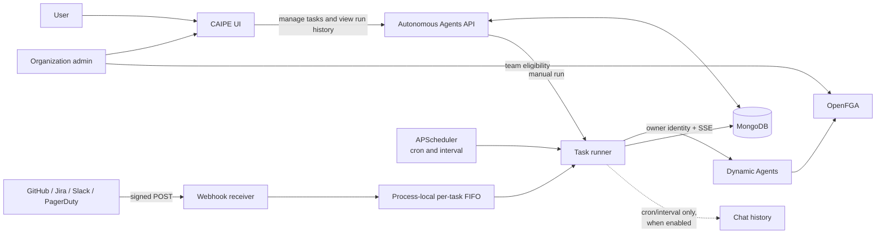

# Autonomous Agents

Autonomous Agents run Dynamic Agent tasks without a live user request. A task
can fire from a cron schedule, fixed interval, manual request, or signed
webhook. The service records every run for the task owner.

The feature is disabled by default. Enabling it installs the
`caipe-autonomous-agents` service and enables the CAIPE UI server-side
`/api/autonomous` proxy. The service remains cluster-internal except for the
public webhook receiver path.

## Current architecture


```mermaid
flowchart LR
  User[User] --> UI[CAIPE UI]
  Admin[Organization admin] --> UI
  UI -->|manage tasks and view run history| API[Autonomous Agents API]
  Admin -->|team eligibility| FGA[OpenFGA]
  API <--> DB[(MongoDB)]

  Provider[GitHub / Jira / Slack / PagerDuty] -->|signed POST| Hook[Webhook receiver]
  Hook --> FIFO[Process-local per-task FIFO]

  APS[APScheduler<br/>cron and interval] --> Runner[Task runner]
  FIFO --> Runner
  API -->|manual run| Runner
  Runner -->|owner identity + SSE| Dynamic[Dynamic Agents]
  Dynamic --> FGA
  Runner --> DB
  Runner -. cron/interval only,<br/>when enabled .-> Chat[Chat history]
```

The current Helm deployment runs all of these components in one process and
one pod:

- FastAPI task-management and webhook routes.
- APScheduler with its default in-memory job store.
- The in-memory webhook task registry and per-task FIFO queues.
- Task execution against Dynamic Agents.

MongoDB is the source of truth for task definitions, run history, webhook
delivery deduplication, and optional Chat history. At startup, the service
loads all tasks from MongoDB into APScheduler or the webhook registry. Creating,
editing, disabling, or deleting a task updates those process-local runtimes
without a restart.

## Access and enablement

Autonomous access has two independent checks:

1. **Team eligibility:** an organization admin enables one or more teams under
   **Admin → Security & Policy → Autonomous Enablement**. The page supports
   individual teams, selected teams, and all teams. Membership in any enabled
   team is sufficient. Organization admins are eligible through their admin
   role.
2. **Agent access:** an eligible user may automate every agent they already
   have `can_use` access to. This includes globally shared agents.

There is no separate per-agent Autonomous switch. Enabling a team does not
grant that team access to additional agents; existing agent RBAC remains the
boundary.

The user-facing **Autonomous** page:

- Shows the signed-in user's tasks only, grouped by usable agent.
- Keeps agent sections collapsed initially and remains vertically scrollable.
- Allows create, edit, enable/disable, manual run, delete, and run-history
  inspection.
- Does not contain an admin configuration tab or task-oversight view.

Every run is authorized again by Dynamic Agents as the task owner. If the
owner loses Autonomous eligibility or access to the target agent, the run
fails and the task is automatically disabled. Restoring access does not
automatically re-enable the task.

## Scheduling

Cron and interval tasks are registered directly with APScheduler and execute
in the service process; they do not use the webhook FIFO.

- Cron uses a standard five-field expression in UTC.
- Interval supports seconds, minutes, and hours.
- The default minimum gap is 1,800 seconds (30 minutes).
- `MINIMUM_SCHEDULE_INTERVAL_SECONDS` changes that floor for both trigger
  types.
- The API validates the floor on create/update and again when loading tasks at
  startup. Manual and webhook runs are exempt.
- Creating, editing, disabling, or deleting a task updates APScheduler without
  restarting the service.

## Webhook setup

The UI supports GitHub, Jira, Slack, and PagerDuty. The generic HMAC adapter
still exists in the service configuration but is not offered by the task form.

After the user creates a webhook task, the same modal displays its full public
URL:

```text
https://<public-host>/api/v1/hooks/<generated-task-id>
```

Task IDs are generated by the server as `slug(name)-<4 hex>`, are immutable,
and form part of the URL.

| Provider | Signing-secret setup |
|---|---|
| GitHub | The service generates the secret and displays it once. Copy it into the repository webhook's **Secret** field. |
| Jira | The service generates the secret and displays it once. Copy it into Jira's webhook **Secret** field. |
| Slack | Slack issues the app signing secret. Paste it into the setup modal before completing setup. |
| PagerDuty | PagerDuty issues the webhook secret. Paste it into the setup modal before completing setup. |

The modal includes provider-specific instructions and copy controls for the
URL and secret. A generated secret is never returned again after the creation
response. Normal task reads expose only `has_secret: true|false`.

### Secret storage

Per-task webhook secrets are never stored as plaintext in MongoDB. Each write
uses envelope encryption:

1. AWS KMS generates a fresh 256-bit data-encryption key.
2. AES-256-GCM encrypts the webhook secret.
3. MongoDB stores the ciphertext and the KMS-encrypted data key.
4. The task ID is bound into both AES authenticated data and the KMS
   encryption context, preventing an encrypted value from being moved to a
   different task.

`CREDENTIAL_KMS_CMK_ID` is therefore required for per-task webhook secrets.
On EKS, grant the pod's service account `kms:GenerateDataKey` and
`kms:Decrypt` for that key, normally through IRSA. Secret reads and writes fail
closed if KMS is unavailable or misconfigured.

`WEBHOOK_SECRET` is a Kubernetes/External Secret value used only as the global
fallback for tasks without a per-task key and by the first-party follow-up
bridge. New UI-created webhook tasks use per-task encrypted secrets.

## Webhook delivery pipeline

The receiver performs the following work before returning:

1. Resolve the enabled webhook task and provider adapter.
2. Enforce the request-body limit.
3. Verify the provider-specific HMAC and timestamp policy.
4. Ignore recognized configuration pings, such as GitHub `ping` events.
5. Reserve queue capacity.
6. Claim the delivery's deduplication key in MongoDB.
7. Append the run to the task's process-local FIFO and return `202 Accepted`
   with its preallocated run ID.

Duplicate deliveries return `200 OK` with the original run ID and do not run
again. Deduplication prefers a task-configured delivery header, then the
provider's default delivery header, then the verified signature. MongoDB keeps
deduplication records for seven days by default.

### Queueing and overload protection

Every webhook task has one FIFO consumer: deliveries for the same task never
execute concurrently. Different tasks may execute concurrently within owner
and process-wide limits.

Default limits are:

| Setting | Default | Behavior |
|---|---:|---|
| `WEBHOOK_MAX_PAYLOAD_BYTES` | 1 MiB | Reject with `413` before JSON parsing. Streaming enforcement also covers missing or false `Content-Length`. |
| `WEBHOOK_MAX_PENDING_PER_TASK` | 100 | Maximum queued + running deliveries for one task. |
| `WEBHOOK_MAX_PENDING_PER_OWNER` | 500 | Maximum queued + running deliveries for one owner. |
| `WEBHOOK_MAX_PENDING_GLOBAL` | 5,000 | Process-wide queued + running delivery ceiling. |
| `WEBHOOK_MAX_PENDING_PAYLOAD_BYTES_GLOBAL` | 64 MiB | Process-wide budget based on raw body sizes for queued + running deliveries. |
| `WEBHOOK_MAX_CONCURRENT_PER_OWNER` | 20 | Concurrent executions across an owner's different tasks. |
| `WEBHOOK_MAX_CONCURRENT_GLOBAL` | 100 | Concurrent executions across all different tasks. |

Capacity rejection returns `429 Too Many Requests` with `Retry-After: 1`.
Rejected requests create neither a run nor a deduplication claim, allowing the
sender to retry later. If the deduplication store is unavailable, the receiver
returns `503` instead of risking a duplicate run.

These controls protect application memory and execution capacity. They do not
replace TLS, WAF/rate limiting, request filtering, and network controls at the
public ingress.

## Run and Chat history

MongoDB stores each run's status, prompt, full final response, response
preview, captured streaming events, error, owner, and trigger-delivery link.
The Autonomous page polls active run history every five seconds.

- Webhook **Run history** renders the full final response as Markdown.
- Cron and interval Run history show the response preview and can link to the
  corresponding Chat thread when Chat publishing is enabled.
- Webhook runs are never published into Chat history.

`CHAT_HISTORY_PUBLISH_ENABLED` defaults to `false`. When enabled, cron and
interval activity is published as one stable Chat conversation per task, with
each run appended to that thread. Runs completed while publishing was disabled
are not backfilled.

The Chat sidebar separates conversations into:

- **Autonomous Runs** — violet task badge; collapsed by default.
- **Scheduled Runs** — cyan schedule badge; collapsed by default.
- **History** — ordinary conversations, shown normally.

Conversation queries retain their normal ownership and sharing checks; the
`source=autonomous` filter narrows content but does not bypass authorization.

## Helm configuration

```yaml
tags:
  caipe-ui: true
  dynamic-agents: true
  autonomous-agents: true
  keycloak: true

caipe-ui:
  config:
    ENABLE_AUTONOMOUS_AGENTS: "true"
    AUTONOMOUS_AGENTS_URL: "http://caipe-autonomous-agents:8002"

autonomous-agents:
  replicaCount: 1
  existingSecret: autonomous-agents-secret
  serviceAccount:
    annotations:
      eks.amazonaws.com/role-arn: arn:aws:iam::<account-id>:role/<kms-role>
  config:
    MONGODB_DATABASE: caipe
    CREDENTIAL_KMS_CMK_ID: arn:aws:kms:<region>:<account-id>:key/<key-id>
    CREDENTIAL_KMS_REGION: <region>
    MINIMUM_SCHEDULE_INTERVAL_SECONDS: "1800"
    CHAT_HISTORY_PUBLISH_ENABLED: "false"
  dynamicAgentsAuth:
    enabled: true
    clientId: caipe-platform
    clientSecretRef:
      name: caipe-platform-secret
      key: OIDC_CLIENT_SECRET
```

`autonomous-agents-secret` must provide `MONGODB_URI`. Add
`WEBHOOK_SECRET` only when using the global fallback or first-party follow-up
bridge. Add `WEBEX_BOT_TOKEN`, `WEBEX_WEBHOOK_SECRET`, and
`WEBEX_BOT_PUBLIC_URL` when using Webex inbound events.

### Public webhook ingress

External providers must be able to reach the webhook URL. Expose only
`/api/v1/hooks`, not the task-management API:

```yaml
autonomous-agents:
  ingress:
    enabled: true
    className: nginx
    hosts:
      - host: autonomous-hooks.example.com
        paths:
          - path: /api/v1/hooks
            pathType: Prefix
    tls:
      - hosts:
          - autonomous-hooks.example.com
        secretName: autonomous-hooks-tls
```

The task-management API has no direct public authentication boundary; the
CAIPE UI proxy supplies authenticated identity headers and enforces access.

## Current scaling limitation

Keep `replicaCount: 1` with the current implementation. The chart uses a
`Recreate` deployment strategy and intentionally has no HPA because:

- Each replica would run its own APScheduler and could double-fire cron and
  interval tasks.
- Webhook queues, concurrency counters, and the task registry are
  process-local, so replicas would not preserve per-task ordering globally.
- Task changes update only the replica that handled the request; another
  replica's runtime registry could remain stale.
- Accepted webhook work is not durable and is lost if the pod restarts.

The current implementation does not use SQS, DynamoDB, a distributed
scheduler lease, or a separate worker deployment.
