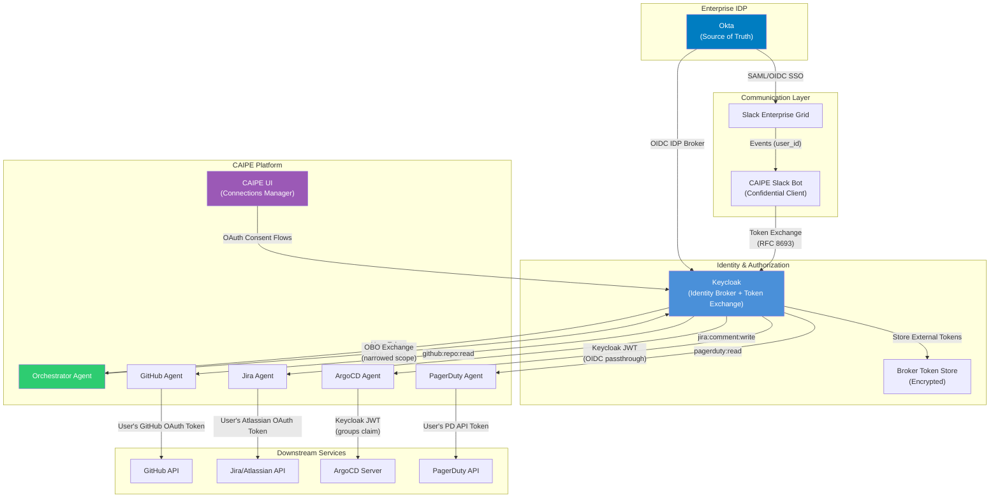
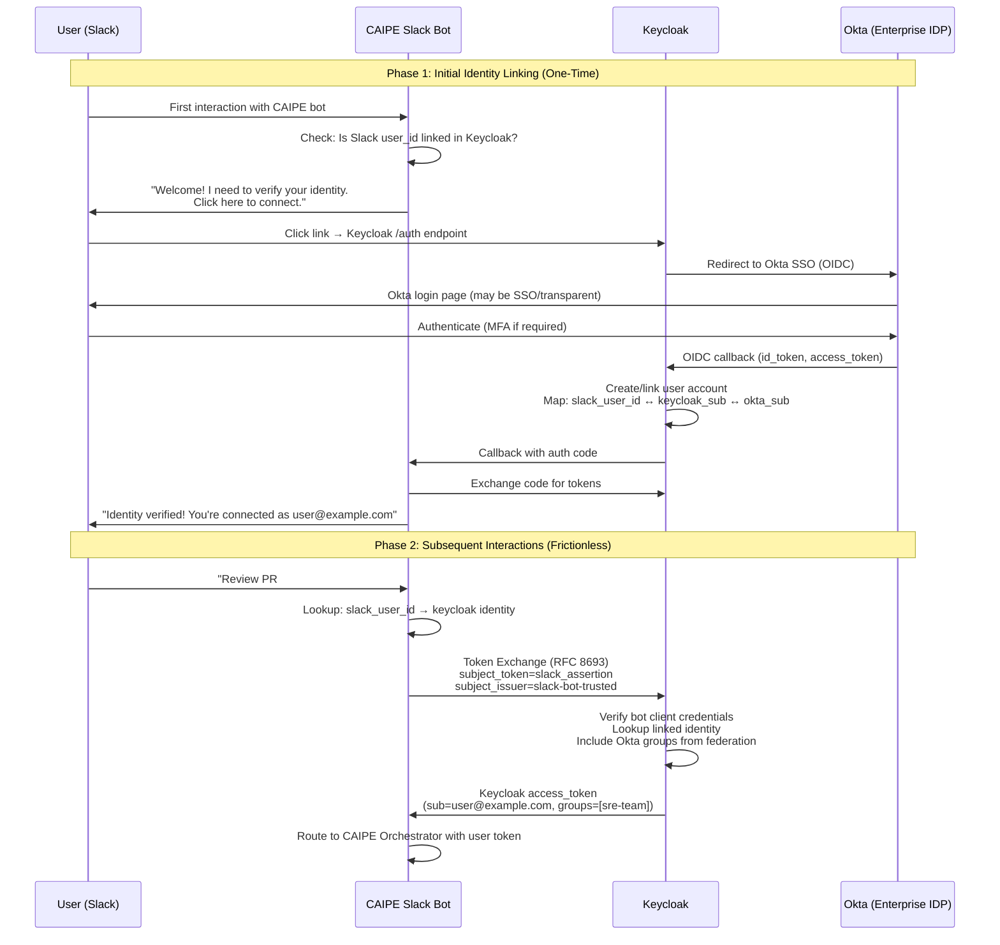
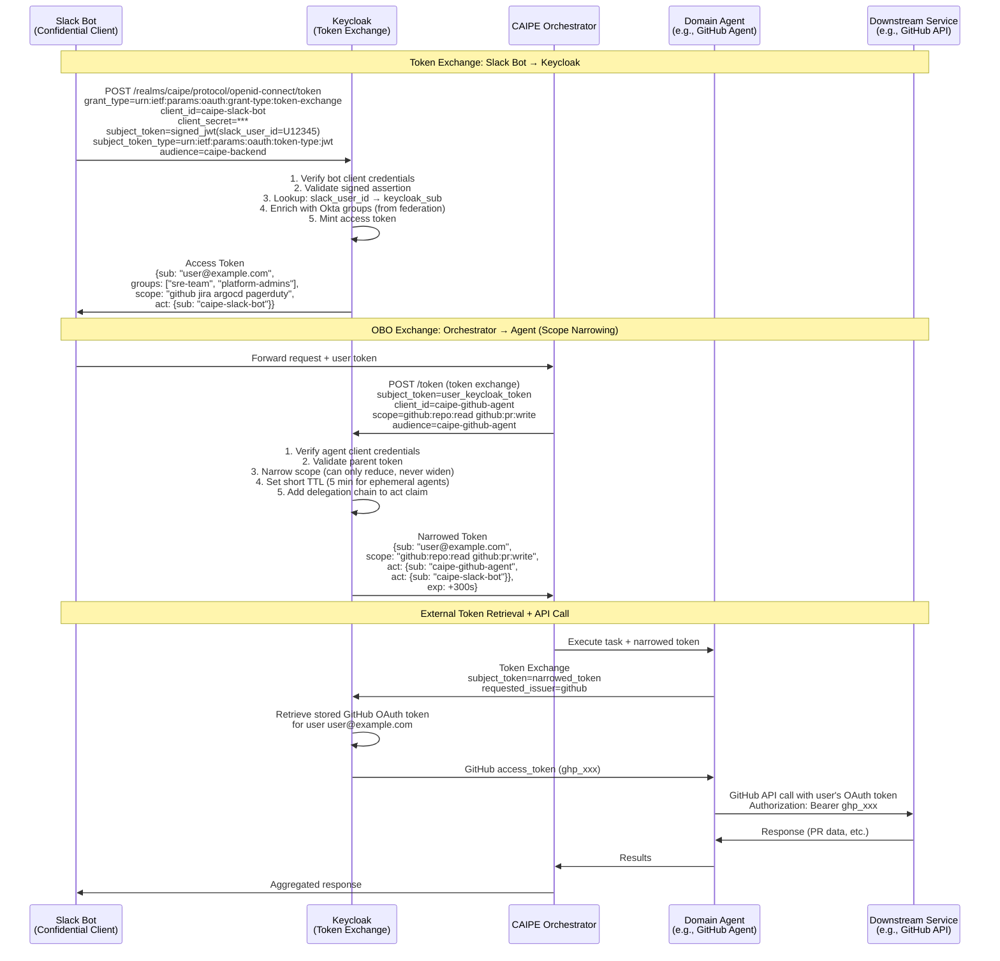
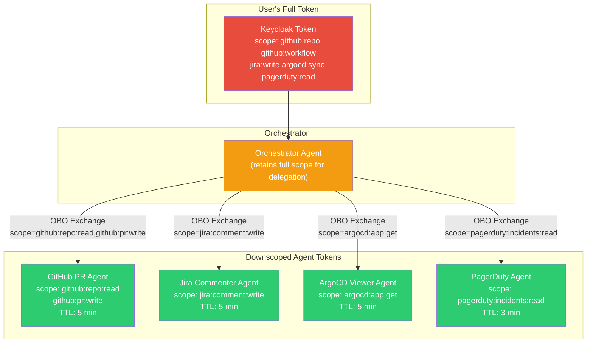
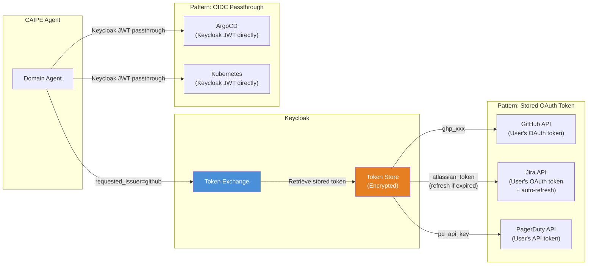
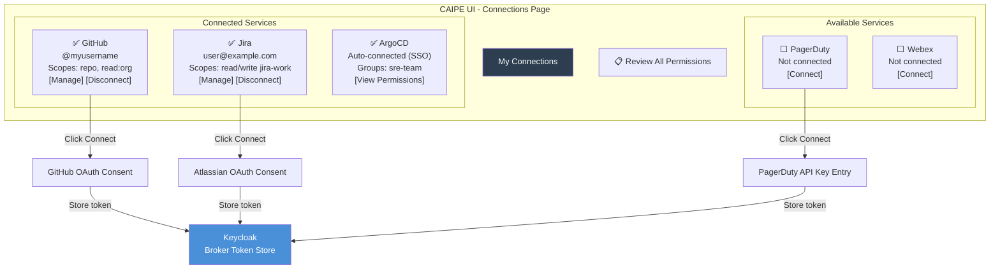
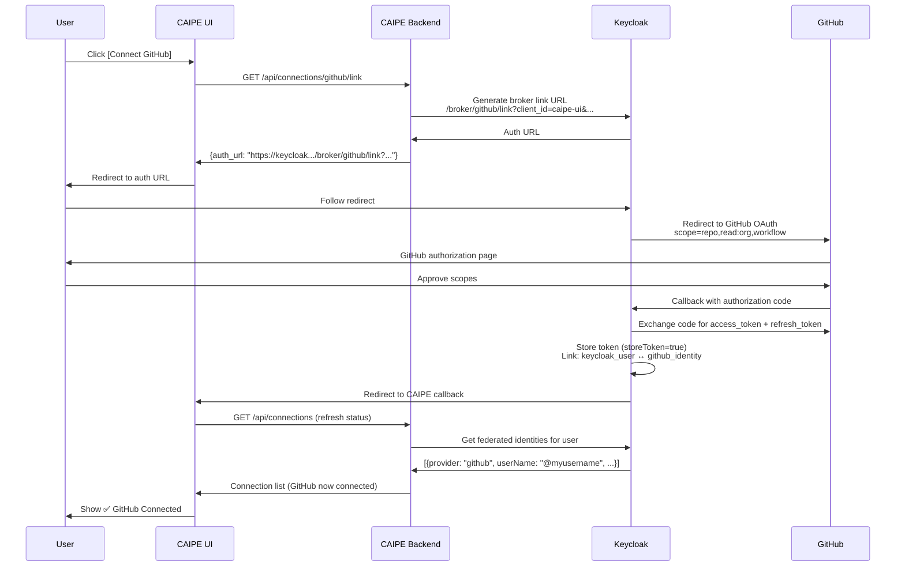
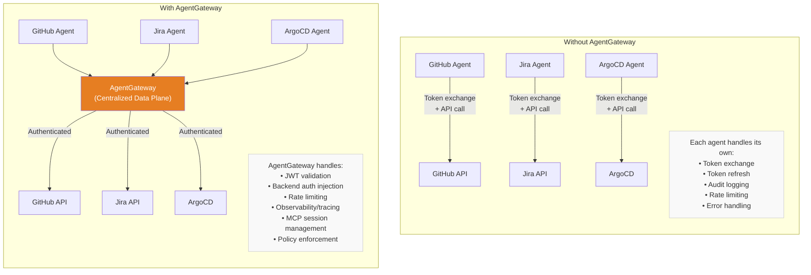
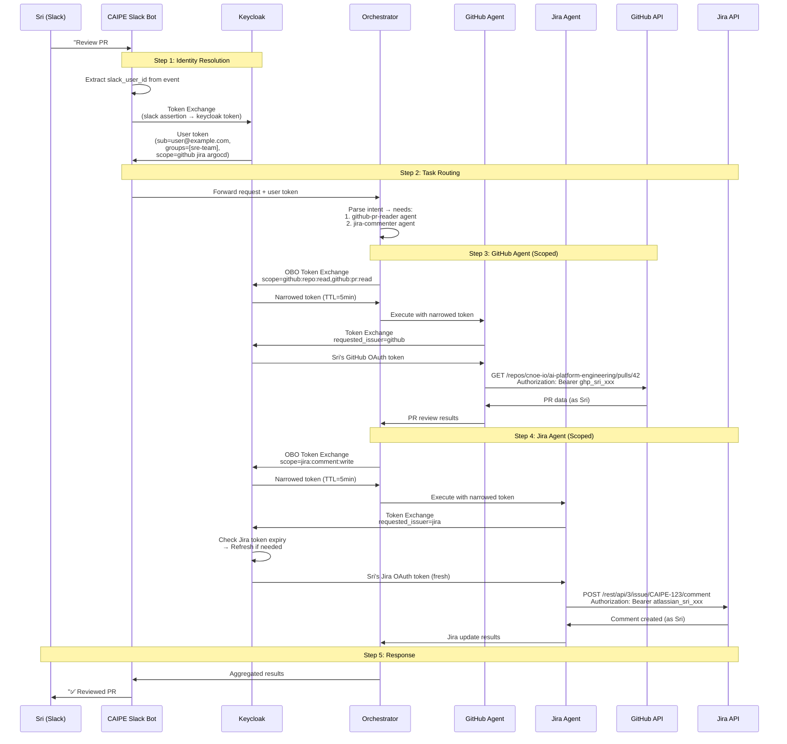

# Enterprise Identity Federation and User Impersonation in CAIPE

## Overview

This document describes the architecture and implementation patterns for propagating enterprise user identity through the CAIPE (Community AI Platform Engineering) multi-agent system, enabling agents to act **on behalf of authenticated users** when interacting with downstream services such as GitHub, Jira, ArgoCD, PagerDuty, and others.

The core challenge in an enterprise agentic platform is maintaining a **chain of trust** from the human user through multiple service hops — without over-privileging any individual agent or service. This document addresses that challenge using standards-based OAuth 2.0 Token Exchange (RFC 8693), On-Behalf-Of (OBO) delegation, and Keycloak as the central identity broker.

### Goals

- **User-level accountability**: Every action taken by a CAIPE agent is attributable to the human user who initiated it
- **Principle of least privilege**: Each agent receives the minimum token scope necessary for its task
- **Enterprise SSO integration**: Works with existing Okta/SAML/OIDC-based enterprise identity providers
- **Self-service connector management**: Users link their service accounts through the CAIPE UI
- **Auditability**: Full delegation chain visible in JWT claims and observability systems

### Scope

This document covers:

- Enterprise identity flow from Slack (with Okta SSO) through CAIPE to downstream services
- One-time user consent and identity linking
- Token exchange and On-Behalf-Of (OBO) workflows
- Dynamic agent scope narrowing
- CAIPE UI-based connector management
- The role of AgentGateway (optional vs. required)
- Keycloak configuration and CRD-based connector definitions

---

## Architecture Context

### The Identity Chain Problem

In a typical CAIPE deployment, the identity must propagate across multiple hops:

```
Human User (Slack) → Slack Bot → CAIPE Orchestrator → Domain Agents → Downstream Services
                                                                        (GitHub, Jira, ArgoCD, etc.)
```

Each hop introduces an identity boundary. Without proper delegation, the downstream service either sees the **bot's identity** (losing user accountability) or requires **shared credentials** (a security anti-pattern). The architecture described here ensures the **original user's identity** is preserved and verifiable at every hop.

### Enterprise Slack with Okta SSO

In enterprise environments, Slack is federated through an enterprise Identity Provider (e.g., Okta):

```
Okta (Source of Truth) → Slack Enterprise Grid (SAML/OIDC SP) → Slack Bot → CAIPE
```

**Critical constraint**: Slack does not expose the upstream Okta token to bot applications. When a user interacts with a Slack bot, the bot receives Slack-scoped identifiers (`user_id`, `team_id`, `enterprise_id`) and profile data (email, display name) — but never the upstream Okta assertion or token. Slack consumed and terminated that SAML/OIDC flow at login time.

This means we cannot simply relay an Okta token through Slack. Instead, we use a verified identity linking pattern combined with Keycloak as the central identity broker.

---

## Solution Architecture

### High-Level Architecture Diagram



### One-Time User Consent with Identity Linking

This is the recommended approach for enterprise environments. It provides cryptographically verified identity linking through a one-time OIDC consent flow, after which all subsequent interactions are frictionless.

#### Why One-Time User Consent with Identity Linking?

- **Stronger than email matching alone**: Identity is verified through an actual OIDC authentication event, not just email lookup
- **User-controlled**: Users explicitly consent to linking their accounts
- **Revocable**: Users can disconnect services at any time
- **Enterprise-compatible**: Works with Okta, Azure AD, Ping, and any OIDC-compliant IDP

#### Consent Flow Sequence



#### Keycloak Identity Linking Configuration

Keycloak must be configured with Okta as an OIDC Identity Provider broker. This enables Keycloak to federate user identities and group memberships from Okta:

```json
{
  "alias": "enterprise-idp",
  "displayName": "Enterprise IdP (e.g. Okta)",
  "providerId": "oidc",
  "enabled": true,
  "trustEmail": true,
  "storeToken": false,
  "firstBrokerLoginFlowAlias": "first broker login",
  "config": {
    "authorizationUrl": "https://<idp-domain>/oauth2/default/v1/authorize",
    "tokenUrl": "https://<idp-domain>/oauth2/default/v1/token",
    "userInfoUrl": "https://<idp-domain>/oauth2/default/v1/userinfo",
    "clientId": "<keycloak-client-id>",
    "clientSecret": "${vault.idp-client-secret}",
    "issuer": "https://<idp-domain>/oauth2/default",
    "defaultScope": "openid profile email groups",
    "syncMode": "FORCE",
    "validateSignature": "true",
    "useJwksUrl": "true",
    "jwksUrl": "https://<idp-domain>/oauth2/default/v1/keys"
  }
}
```

Key configuration notes:

- **`syncMode: FORCE`** ensures Okta group memberships are refreshed on every login, keeping RBAC current
- **`trustEmail: true`** allows Keycloak to auto-link accounts by verified email without manual user action
- **`storeToken: false`** for Okta itself (we don't need to impersonate via Okta — it's just the identity source)

The Slack Bot is registered as a confidential client in Keycloak with token exchange permissions:

```json
{
  "clientId": "caipe-slack-bot",
  "secret": "${vault.slack-bot-client-secret}",
  "enabled": true,
  "clientAuthenticatorType": "client-secret",
  "directAccessGrantsEnabled": false,
  "serviceAccountsEnabled": true,
  "authorizationServicesEnabled": true,
  "standardFlowEnabled": false,
  "protocol": "openid-connect",
  "attributes": {
    "token.exchange.permissions": "caipe-backend"
  }
}
```

---

## Token Exchange and On-Behalf-Of (OBO) Workflows

### RFC 8693 Token Exchange Flow

Once the user's identity is linked via one-time consent, every subsequent Slack interaction triggers a token exchange. The Slack Bot presents a signed assertion containing the Slack user ID, and Keycloak resolves it to the linked Keycloak identity:



### Token Exchange Request/Response Examples

**Slack Bot → Keycloak (Initial Exchange)**:

```http
POST /realms/caipe/protocol/openid-connect/token HTTP/1.1
Host: keycloak.caipe.example.com
Content-Type: application/x-www-form-urlencoded

grant_type=urn:ietf:params:oauth:grant-type:token-exchange
&client_id=caipe-slack-bot
&client_secret=<bot_client_secret>
&subject_token=<signed_jwt_with_slack_user_id>
&subject_token_type=urn:ietf:params:oauth:token-type:jwt
&audience=caipe-backend
&requested_token_type=urn:ietf:params:oauth:token-type:access_token
```

**Orchestrator → Keycloak (OBO with Scope Narrowing)**:

```http
POST /realms/caipe/protocol/openid-connect/token HTTP/1.1
Host: keycloak.caipe.example.com
Content-Type: application/x-www-form-urlencoded

grant_type=urn:ietf:params:oauth:grant-type:token-exchange
&client_id=caipe-github-agent
&client_secret=<agent_client_secret>
&subject_token=<user_keycloak_token>
&subject_token_type=urn:ietf:params:oauth:token-type:access_token
&scope=github:repo:read github:pr:write
&audience=caipe-github-agent
&requested_token_type=urn:ietf:params:oauth:token-type:access_token
```

**Agent → Keycloak (External Token Retrieval)**:

```http
POST /realms/caipe/protocol/openid-connect/token HTTP/1.1
Host: keycloak.caipe.example.com
Content-Type: application/x-www-form-urlencoded

grant_type=urn:ietf:params:oauth:grant-type:token-exchange
&client_id=caipe-github-agent
&client_secret=<agent_client_secret>
&subject_token=<narrowed_user_token>
&subject_token_type=urn:ietf:params:oauth:token-type:access_token
&requested_issuer=github
```

The `requested_issuer` parameter tells Keycloak to return the stored external IDP token rather than issuing a new Keycloak token. This is a built-in Keycloak feature for exactly this use case.

---

## Dynamic Agent Scope Narrowing

### The Problem with Flat Tokens

If every agent in a CAIPE task execution receives the same broad token, a PagerDuty-reading agent has unnecessary GitHub write access. In CAIPE's multi-agent architecture where agents are dynamically composed from task configs and SKILLS.md files, this is a significant attack surface.

### Chained Token Exchange with Progressive Scope Reduction

Each agent in the execution chain receives a **progressively narrower token**, following the principle of least privilege:



**Critical guarantee**: Keycloak will never issue a token with broader scope than the parent. If the orchestrator's token has `github:repo:read` and an agent requests `github:repo:write`, the exchange fails. Scope can only narrow, never widen.

### Deriving Scopes from Task Configs

Each CAIPE task config declares what permissions its agents need. The orchestrator reads the task config and mints a token with exactly the declared scopes:

```yaml
# task_config: github-pr-review-and-jira-update
name: "Review PR and Update Jira"
agents:
  - id: pr-reader
    mcp_tools: ["github_get_pull_request", "github_list_files"]
    required_scopes:
      github: ["repo:read", "pull_request:read"]
    max_token_ttl_seconds: 300

  - id: pr-commenter
    mcp_tools: ["github_create_review_comment"]
    required_scopes:
      github: ["pull_request:write"]
    max_token_ttl_seconds: 300

  - id: jira-linker
    mcp_tools: ["jira_add_comment", "jira_get_issue"]
    required_scopes:
      jira: ["comment:write", "issue:read"]
    max_token_ttl_seconds: 300
```

### Implementation: Impersonating Tool Executor

```python
class ImpersonatingToolExecutor:
    """
    Manages token exchange and scope narrowing for CAIPE agent impersonation.
    Each agent receives the minimum token scope required for its task.
    """

    def __init__(self, keycloak_client: KeycloakClient):
        self.kc = keycloak_client

    async def get_scoped_agent_token(
        self,
        user_token: str,
        agent_id: str,
        required_scopes: list[str],
        max_ttl_seconds: int = 300,
    ) -> str:
        """
        Mint a narrowly-scoped token for a specific dynamic agent.
        Keycloak will reject if requested scopes exceed the parent token's scopes.
        """
        response = await self.kc.token_exchange(
            grant_type="urn:ietf:params:oauth:grant-type:token-exchange",
            subject_token=user_token,
            subject_token_type="urn:ietf:params:oauth:token-type:access_token",
            client_id=f"caipe-agent-{agent_id}",
            client_secret=self.get_agent_secret(agent_id),
            scope=" ".join(required_scopes),
            audience=f"caipe-agent-{agent_id}",
        )
        return response["access_token"]

    async def get_user_token_for_service(
        self, user_keycloak_token: str, service: str
    ) -> str:
        """
        Exchange user's Keycloak token for a service-specific token.

        For OIDC-native services (ArgoCD): returns the Keycloak token itself.
        For OAuth-brokered services (GitHub, Jira): returns the stored external token.
        """
        if service in ("argocd", "kubernetes"):
            # ArgoCD trusts Keycloak directly — just pass through
            return user_keycloak_token

        # For GitHub, Jira, PagerDuty — retrieve stored broker token
        response = await self.kc.token_exchange(
            grant_type="urn:ietf:params:oauth:grant-type:token-exchange",
            subject_token=user_keycloak_token,
            subject_token_type="urn:ietf:params:oauth:token-type:access_token",
            requested_issuer=service,  # "github", "jira", "pagerduty"
        )
        return response["access_token"]

    async def execute_task(
        self, user_token: str, task_config: dict
    ) -> dict:
        """
        Execute a CAIPE task with per-agent scope narrowing.
        """
        results = {}
        for agent_cfg in task_config["agents"]:
            # Step 1: Mint narrowly-scoped token for this agent
            scoped_token = await self.get_scoped_agent_token(
                user_token=user_token,
                agent_id=agent_cfg["id"],
                required_scopes=self._flatten_scopes(agent_cfg["required_scopes"]),
                max_ttl_seconds=agent_cfg.get("max_token_ttl_seconds", 300),
            )

            # Step 2: For each downstream service, retrieve the service-specific token
            for service in agent_cfg["required_scopes"]:
                svc_token = await self.get_user_token_for_service(scoped_token, service)
                # Step 3: Execute agent with service-specific token
                result = await self._run_agent(agent_cfg["id"], svc_token, service)
                results[agent_cfg["id"]] = result

        return results

    def _flatten_scopes(self, scopes_by_service: dict) -> list[str]:
        """Flatten {service: [scopes]} to [service:scope, ...]"""
        return [
            f"{svc}:{scope}"
            for svc, scope_list in scopes_by_service.items()
            for scope in scope_list
        ]
```

### JWT Delegation Chain

The resulting token carries the full audit trail as nested `act` claims:

```json
{
  "sub": "user@example.com",
  "scope": "github:repo:read github:pull_request:read",
  "aud": "caipe-agent-pr-reader",
  "groups": ["sre-team", "platform-admins"],
  "act": {
    "sub": "caipe-orchestrator",
    "act": {
      "sub": "caipe-slack-bot"
    }
  },
  "exp": 1711234800,
  "iat": 1711234500,
  "iss": "https://keycloak.caipe.example.com/realms/caipe"
}
```

This gives complete visibility into: who the user is, the full delegation chain, the narrowed scope, and the token lifetime — all in one JWT.

---

## Per-Service Impersonation Patterns

Each downstream service has its own authentication idiom. This section details how CAIPE agents impersonate users for each service type.

### Service Impersonation Overview



### GitHub: OAuth App with Stored User Tokens

GitHub uses standard OAuth 2.0 with fine-grained scopes. During the extended consent flow, the user authorizes a GitHub OAuth App, and Keycloak stores the resulting token.

**Token retrieval**: Agent calls token exchange with `requested_issuer=github`. Keycloak returns the stored GitHub access token.

**Token lifecycle**: GitHub OAuth tokens do not expire (unless revoked). The agent should handle 401 responses by triggering a re-consent flow via Slack message.

**Keycloak broker configuration for GitHub**:

```json
{
  "alias": "github",
  "displayName": "GitHub",
  "providerId": "github",
  "enabled": true,
  "storeToken": true,
  "trustEmail": true,
  "config": {
    "clientId": "caipe-github-oauth-app",
    "clientSecret": "${vault.github-client-secret}",
    "defaultScope": "repo read:org workflow",
    "syncMode": "IMPORT"
  }
}
```

The critical setting is **`storeToken: true`** — this tells Keycloak to persist the external IDP token so it can be retrieved later via token exchange with `requested_issuer`.

### Jira/Atlassian: OAuth 2.0 (3LO) with Auto-Refresh

Atlassian uses OAuth 2.0 three-legged authorization with short-lived access tokens (1 hour) and long-lived refresh tokens.

**Token retrieval**: Agent calls token exchange with `requested_issuer=jira`. Keycloak checks the stored access token, and if expired, automatically refreshes it using the stored refresh token before returning it to the agent.

**Keycloak broker configuration for Jira**:

```json
{
  "alias": "jira",
  "displayName": "Jira / Atlassian",
  "providerId": "oidc",
  "enabled": true,
  "storeToken": true,
  "config": {
    "authorizationUrl": "https://auth.atlassian.com/authorize",
    "tokenUrl": "https://auth.atlassian.com/oauth/token",
    "clientId": "caipe-jira-app",
    "clientSecret": "${vault.jira-client-secret}",
    "defaultScope": "read:jira-work write:jira-work read:jira-user offline_access",
    "clientAuthMethod": "client_secret_post"
  }
}
```

**Important**: The `offline_access` scope is required to obtain a refresh token for long-lived impersonation. Atlassian refresh tokens expire after 365 days of non-use.

### ArgoCD: OIDC Passthrough (No Stored Token Needed)

ArgoCD natively supports OIDC authentication and group-based RBAC. Since CAIPE already uses Keycloak, no separate token storage is needed — the agent passes the Keycloak JWT directly to ArgoCD.

**ArgoCD OIDC configuration** (`argocd-cm` ConfigMap):

```yaml
oidc.config: |
  name: Keycloak
  issuer: https://keycloak.caipe.example.com/realms/caipe
  clientID: argocd
  clientSecret: $oidc.keycloak.clientSecret
  requestedScopes: ["openid", "profile", "email", "groups"]
```

**ArgoCD RBAC configuration** (`argocd-rbac-cm` ConfigMap):

```yaml
policy.csv: |
  p, role:sre-team, applications, sync, */*, allow
  p, role:sre-team, applications, get, */*, allow
  p, role:platform-admin, applications, *, */*, allow
  g, sre-team, role:sre-team
  g, platform-admins, role:platform-admin
```

The agent's Keycloak token contains the user's Okta groups (federated through Keycloak). ArgoCD validates the token against Keycloak's OIDC endpoint and resolves groups to permissions. No consent step is needed beyond the initial identity linking.

### PagerDuty and Other API-Key Services

For services that use API keys rather than OAuth, the pattern is similar to GitHub but with user-generated keys:

- User generates a PagerDuty personal REST API key
- User enters it in the CAIPE UI Connections page (stored encrypted in Keycloak)
- Agents retrieve it via token exchange with `requested_issuer=pagerduty`

---

## CAIPE UI Connector Management

### Self-Service Connections Page

The CAIPE UI provides a self-service "Connections" page where users link their service accounts. This is a first-class feature of the platform, enabling users to manage their connected services without administrator intervention.



### OAuth Dance from the UI

When a user clicks "Connect GitHub," the CAIPE UI initiates an OAuth flow through Keycloak's Account Linking API:



### Backend API for Connection Management

```python
from fastapi import APIRouter, Depends, HTTPException
from typing import Optional

router = APIRouter(prefix="/api/connections")


@router.get("/")
async def list_connections(user: User = Depends(get_current_user)):
    """List all available connectors and their status for this user."""
    brokers = await keycloak_admin.get_identity_providers()
    linked = await keycloak_admin.get_federated_identities(user.keycloak_id)
    linked_map = {l["identityProvider"]: l for l in linked}

    return [
        {
            "provider": broker["alias"],
            "display_name": broker["displayName"],
            "connected": broker["alias"] in linked_map,
            "username": linked_map.get(broker["alias"], {}).get("userName"),
            "scopes": broker["config"].get("defaultScope", "").split(),
            "auto": broker["alias"] in ("argocd", "kubernetes"),
        }
        for broker in brokers
        if broker["alias"] != "enterprise-idp"  # Hide the primary IDP
    ]


@router.get("/{provider}/link")
async def initiate_link(provider: str, user: User = Depends(get_current_user)):
    """Generate the Keycloak broker link URL for OAuth flow."""
    link_url = await keycloak_admin.get_broker_link_url(
        user_id=user.keycloak_id,
        provider=provider,
        redirect_uri=f"{settings.CAIPE_UI_URL}/connections/callback",
    )
    return {"auth_url": link_url}


@router.delete("/{provider}")
async def disconnect(provider: str, user: User = Depends(get_current_user)):
    """Revoke a linked identity and clean up tokens."""
    # Remove from Keycloak
    await keycloak_admin.remove_federated_identity(
        user_id=user.keycloak_id,
        provider=provider,
    )
    # Also revoke at the upstream provider
    await revoke_upstream_token(provider, user.keycloak_id)
    return {"status": "disconnected"}


@router.get("/{provider}/permissions")
async def get_permissions(
    provider: str, user: User = Depends(get_current_user)
):
    """Show what scopes/permissions are granted for this provider."""
    token = await keycloak_admin.get_stored_broker_token(
        user_id=user.keycloak_id,
        provider=provider,
    )
    if not token:
        raise HTTPException(status_code=404, detail="Not connected")

    if provider == "github":
        scopes = await github_check_token_scopes(token)
        return {"scopes": scopes, "granted_at": token.get("created_at")}
    elif provider == "jira":
        scopes = token.get("scope", "").split()
        return {"scopes": scopes, "expires_in": token.get("expires_in")}

    return {"scopes": token.get("scope", "").split()}
```

### Slack Bot Integration with Missing Connections

When a user tries to use a CAIPE agent from Slack that requires a connection they have not set up, the bot sends a deeplink to the CAIPE connections page:

```python
async def handle_agent_execution(slack_event: dict, agent_config: dict):
    user_token = await get_user_keycloak_token(slack_event["user"])

    # Check if user has required connections
    missing = await check_missing_connections(
        user_token,
        agent_config["required_scopes"],
    )

    if missing:
        await slack_client.chat_postMessage(
            channel=slack_event["channel"],
            blocks=[
                {
                    "type": "section",
                    "text": {
                        "type": "mrkdwn",
                        "text": (
                            f"To run *{agent_config['name']}*, "
                            f"I need you to connect: *{', '.join(missing)}*"
                        ),
                    },
                    "accessory": {
                        "type": "button",
                        "text": {"type": "plain_text", "text": "Connect Services"},
                        "url": (
                            f"https://caipe.example.com/connections"
                            f"?setup={','.join(missing)}"
                        ),
                        "action_id": "open_connections",
                    },
                }
            ],
        )
        return

    # All connections present — proceed with agent execution
    await execute_agent_with_impersonation(user_token, agent_config)
```

### CRD-Based Connector Definitions (GitOps-Friendly)

To make connectors declarative and manageable via GitOps, define them as Custom Resource Definitions that the CAIPE operator syncs to Keycloak:

```yaml
apiVersion: caipe.cnoe.io/v1alpha1
kind: IdentityConnector
metadata:
  name: github-connector
  namespace: caipe-system
spec:
  provider: github
  displayName: "GitHub"
  icon: "github-mark.svg"
  oauth:
    authorizationUrl: "https://github.com/login/oauth/authorize"
    tokenUrl: "https://github.com/login/oauth/access_token"
    clientId:
      secretRef: { name: github-oauth, key: client-id }
    clientSecret:
      secretRef: { name: github-oauth, key: client-secret }
    scopes: ["repo", "read:org", "workflow"]
  scopeMapping:
    # Map CAIPE abstract scopes to provider-specific scopes
    "code:read": "repo:read"
    "code:write": "repo"
    "ci:trigger": "workflow"
  tokenLifecycle:
    storeToken: true
    refreshEnabled: false  # GitHub tokens don't expire
    revokeOnDisconnect: true
    revokeEndpoint: "https://api.github.com/applications/{client_id}/token"
---
apiVersion: caipe.cnoe.io/v1alpha1
kind: IdentityConnector
metadata:
  name: jira-connector
  namespace: caipe-system
spec:
  provider: jira
  displayName: "Jira / Atlassian"
  icon: "atlassian-mark.svg"
  oauth:
    authorizationUrl: "https://auth.atlassian.com/authorize"
    tokenUrl: "https://auth.atlassian.com/oauth/token"
    clientId:
      secretRef: { name: jira-oauth, key: client-id }
    clientSecret:
      secretRef: { name: jira-oauth, key: client-secret }
    scopes: ["read:jira-work", "write:jira-work", "read:jira-user", "offline_access"]
  scopeMapping:
    "issue:read": "read:jira-work"
    "issue:write": "write:jira-work"
    "comment:write": "write:jira-work"
  tokenLifecycle:
    storeToken: true
    refreshEnabled: true
    refreshTokenExpiryDays: 365
    revokeOnDisconnect: true
---
apiVersion: caipe.cnoe.io/v1alpha1
kind: IdentityConnector
metadata:
  name: argocd-connector
  namespace: caipe-system
spec:
  provider: argocd
  displayName: "ArgoCD"
  icon: "argocd-mark.svg"
  oidcPassthrough:
    enabled: true
    # No OAuth dance needed — uses Keycloak JWT directly
    # RBAC is determined by Okta groups in the Keycloak token
  autoConnect: true  # Shows as auto-connected in UI
  groupMapping:
    "sre-team": "role:sre-team"
    "platform-admins": "role:platform-admin"
```

The CAIPE operator watches these CRDs and configures Keycloak identity providers accordingly. Adding a new connector is a `kubectl apply` or a PR to the CAIPE infrastructure repo — fully GitOps.

---

## AgentGateway: Optional Enhancement or Required Component?

### Short Answer

**AgentGateway is not required** for the identity federation and impersonation patterns described in this document. All token exchange, OBO, and impersonation flows work with Keycloak alone. However, AgentGateway provides significant **operational benefits** when deployed, particularly around centralized policy enforcement, observability, and traffic management.

### What Works Without AgentGateway

The core identity architecture is entirely Keycloak-driven:

| Capability | Without AgentGateway | With AgentGateway |
|---|---|---|
| Token Exchange (RFC 8693) | Keycloak directly | Keycloak directly |
| OBO / Scope Narrowing | Keycloak directly | Keycloak directly |
| External Token Retrieval | Keycloak `requested_issuer` | Keycloak `requested_issuer` |
| Identity Linking | Keycloak broker API | Keycloak broker API |
| Connector Management UI | CAIPE Backend + Keycloak | CAIPE Backend + Keycloak |

In the "without AgentGateway" model, each CAIPE agent is responsible for:

1. Performing its own token exchange with Keycloak
2. Attaching the correct token to outbound requests
3. Handling token refresh and expiry
4. Logging audit events

This works and is the recommended starting point.

### What AgentGateway Adds

AgentGateway provides a **centralized data plane** for agent-to-tool and agent-to-agent communication, adding capabilities that are difficult to implement consistently across individual agents:



#### Specific AgentGateway Benefits

**1. Centralized JWT Validation and Backend Auth**

AgentGateway can validate the Keycloak JWT at the gateway level and inject backend-specific authentication (stored OAuth tokens) into outbound requests, removing this responsibility from individual agents:

```yaml
# AgentGateway configuration with Keycloak auth
binds:
  - port: 8080
    listeners:
      - name: caipe-mcp-listener
        routes:
          - name: github-tools
            match:
              prefix: /mcp/github
            backends:
              - mcp:
                  host: github-mcp-server:8080
            policies:
              authentication:
                jwt:
                  issuer: https://keycloak.caipe.example.com/realms/caipe
                  audiences: ["caipe-backend"]
                  jwksUri: https://keycloak.caipe.example.com/realms/caipe/protocol/openid-connect/certs
                  requiredScopes: ["github:repo:read"]
              backendAuth:
                passthrough: {}  # Forward validated JWT claims to backend
```

**2. MCP Session-Aware Routing**

AgentGateway maintains MCP session state across multiple backend MCP servers, handling tool multiplexing and session affinity — critical for CAIPE's architecture where multiple MCP tool servers (GitHub, Jira, ArgoCD, PagerDuty) serve tools through a single gateway endpoint.

**3. Observability and Audit**

AgentGateway provides built-in OpenTelemetry integration for tracing agent-to-tool communication, including the identity context from JWT claims. This creates a unified audit trail without requiring each agent to implement its own logging.

**4. Rate Limiting Per User**

AgentGateway can enforce per-user rate limits based on JWT claims, preventing a single user (or a runaway agent acting on their behalf) from overwhelming downstream services.

### Recommendation

**Start without AgentGateway** using the Keycloak-native token exchange patterns described in this document. This is simpler to deploy and debug, and covers all identity and impersonation requirements.

**Add AgentGateway when you need**:
- Centralized policy enforcement across many agents
- MCP multiplexing for tool discovery and routing
- Unified observability for agent-to-tool traffic
- Production-grade rate limiting and resiliency (retries, timeouts, circuit breaking)
- Multi-tenant environments where agents from different teams/users share infrastructure

When AgentGateway is added, the identity architecture remains the same — Keycloak is still the token broker. AgentGateway simply becomes the enforcement point for policies that were previously implemented in agent code.

---

## End-to-End Flow: Complete Example

This section traces a complete user interaction from Slack message through impersonated downstream actions.



---

## Security Considerations

### Token Storage Encryption

Keycloak encrypts stored broker tokens at rest. Verify that database-level encryption is enabled in production deployments. The stored tokens are high-value targets and should be protected accordingly.

### Scope Minimization

Each agent client in Keycloak should only be permitted to exchange tokens for the services it needs. Use Keycloak's fine-grained authorization permissions to enforce this:

- The GitHub agent client can request `requested_issuer=github` but not `requested_issuer=jira`
- The Jira agent client can request `requested_issuer=jira` but not `requested_issuer=github`

### Consent Revocation

Build a `/disconnect` command in the Slack bot and a "Disconnect" button in the CAIPE UI. Revocation should:

1. Delete the stored broker token in Keycloak
2. Revoke the token at the upstream provider (GitHub, Atlassian)
3. Log the revocation event for audit

### Audit Trail

Every token exchange must be logged. Keycloak's event system captures these events natively. Forward them to your observability stack (OpenTelemetry, Splunk, etc.). The CAIPE agent should also log which user identity it is acting under for each downstream call.

### Token Lifetime Alignment

Different services have different token lifetime characteristics:

| Service | Token Type | Lifetime | Refresh |
|---|---|---|---|
| GitHub | OAuth access token | No expiry (until revoked) | N/A |
| Jira/Atlassian | OAuth access token | 1 hour | Refresh token (365 day expiry on non-use) |
| ArgoCD | Keycloak JWT | Configurable (e.g., 30 min) | Re-exchange from parent token |
| PagerDuty | API key | No expiry (until revoked) | N/A |

Agent code must handle both long-lived and short-lived token patterns gracefully, including the case where a refresh token itself has expired.

### Failed Exchange Handling

When a token exchange fails (scope exceeded, connection revoked, refresh token expired), the agent should:

1. Not retry with escalated privileges
2. Report the failure to the orchestrator
3. Trigger a re-consent flow via Slack or UI notification
4. Log the failure with full context for debugging

---

## References

- [RFC 8693 - OAuth 2.0 Token Exchange](https://datatracker.ietf.org/doc/html/rfc8693)
- [Keycloak Token Exchange Documentation](https://www.keycloak.org/docs/latest/securing_apps/#_token-exchange)
- [Keycloak Identity Brokering](https://www.keycloak.org/docs/latest/server_admin/#_identity_broker)
- [AgentGateway Authentication & Identity](https://agentgateway.dev/docs/standalone/main/integrations/auth/)
- [AgentGateway Keycloak Integration](https://agentgateway.dev/docs/standalone/main/integrations/auth/keycloak/)
- [GitHub OAuth Apps](https://docs.github.com/en/apps/oauth-apps)
- [Atlassian OAuth 2.0 (3LO)](https://developer.atlassian.com/cloud/jira/platform/oauth-2-3lo-apps/)
- [ArgoCD OIDC Configuration](https://argo-cd.readthedocs.io/en/stable/operator-manual/user-management/#existing-oidc-provider)
- [CAIPE Documentation](https://cnoe-io.github.io/ai-platform-engineering/)
