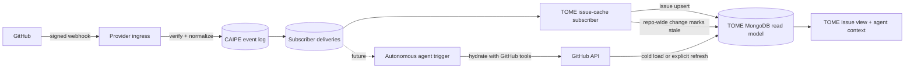

# Event-driven agents and webhooks

CAIPE accepts provider webhooks once and fans normalized events out to TOME and
autonomous-agent subscribers. Provider payloads are triggers, not a second
system of record.



## Boundaries

- `/api/webhooks/github` owns raw-body HMAC verification and normalization.
- `caipe_events` is an append-only, TTL-bound trigger log. Its `_id` is the
  provider delivery id, so redelivery is idempotent.
- `caipe_event_deliveries` contains one leased delivery per subscriber.
- Subscribers are at-least-once. Each subscriber must make its side effects
  idempotent.
- TOME stores a disposable issue read model and repository sync health.
  GitHub remains authoritative for issue content, workflow, comments, and
  history; no TOME-owned issue entity is created.
- The old `/api/agentic-sdlc/webhooks/github` route is a compatibility alias;
  it does not create Agentic SDLC projections.

## Delivery behavior

1. Verify the provider signature against the exact request bytes.
2. Reject repositories that are not attached to an authorized CAIPE resource.
3. Normalize a small CloudEvents-style envelope.
4. Persist the event and subscriber deliveries before returning `202`.
5. Claim deliveries with a MongoDB lease.
6. Retry with bounded exponential backoff; move exhausted deliveries to
   `dead_letter`.
7. Expire event and delivery records after the configured retention period.

MongoDB is the initial transport because it is already required by the CAIPE
UI and supports replica-safe claims. The event envelope and subscriber contract
are transport-neutral; a Redis Streams, NATS, or Kafka adapter can replace the
MongoDB store without changing provider ingress or consumers.

## Autonomous-agent subscriber

An agent trigger should be another subscriber, not logic inside a webhook
route. Its handler should:

- match an explicit topic and resource filter;
- resolve a configured service account and agent version;
- hydrate authoritative state through the GitHub tool at execution time;
- enforce OpenFGA and policy checks before starting a run;
- use `event_id + subscription_id` as its run idempotency key;
- require human approval for configured high-impact actions;
- record run, retry, and dead-letter status without copying issue state.

This keeps event arrival separate from agent authorization and execution.

## GitHub configuration

Set these UI environment variables:

```bash
TOME_GITHUB_WEBHOOK_ENABLED=true
GITHUB_WEBHOOK_SECRET=<shared-random-secret>
# Optional when the public UI origin cannot be inferred:
TOME_GITHUB_WEBHOOK_URL=https://caipe.example.com/api/webhooks/github
```

A TOME editor with GitHub repository administration access can install the
subscription through:

```text
POST /api/tome/projects/{slug}/github-webhooks
{ "repo": "example/service" }
```

Subscribe to `issues`, `issue_comment`, `label`, and `milestone`. Issue events
upsert the affected row. Repository-wide label or milestone events mark the
snapshot stale for reconciliation on the next authorized load. An explicit
Refresh always performs a full reconciliation; ordinary reads never poll.
