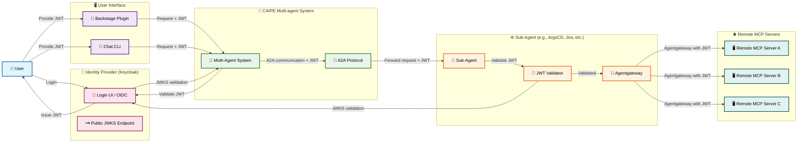
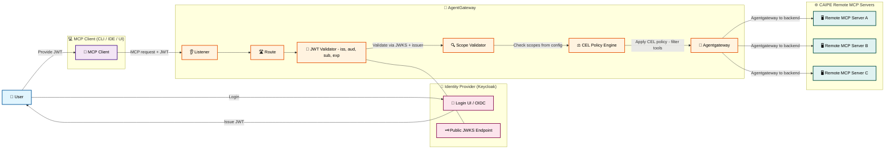
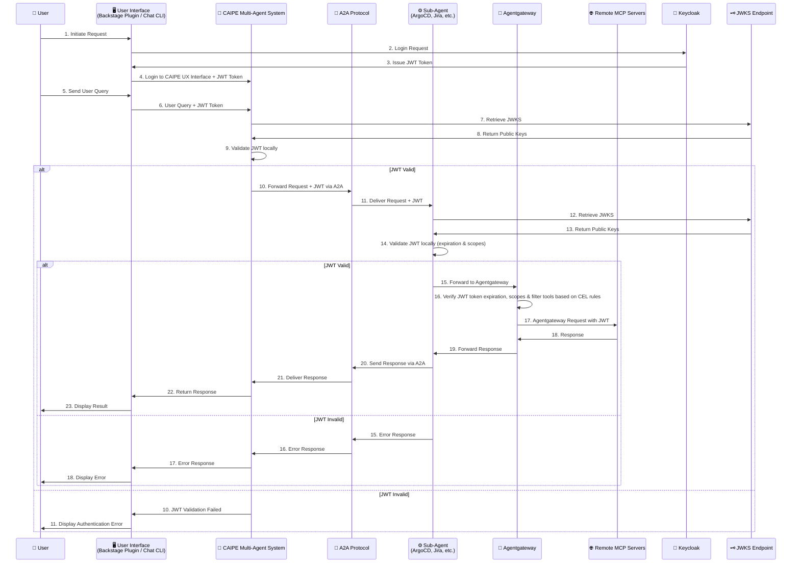

# Use Agentgateway as MCP Proxy

## CAIPE Multi-Agent MCP Flow Solution Architecture

## Inside Agentgateway Flow

## Detailed Sequence Flow

## Helm routing modes: Gateway API vs CRD-free static

The umbrella Helm chart can provision AgentGateway MCP routing in two ways, selected by `global.agentgateway.routingMode` (only relevant when `global.agentgateway.enabled=true`):

| Mode | What the chart renders | Cluster requirements | When to use |
| --- | --- | --- | --- |
| `static` (default) | A single ConfigMap (`<release>-agentgateway-static-config`) holding the standalone proxy config — one `/mcp/<id>` route + MCP backend per enabled target. No custom resources. | None beyond the standalone `agentgateway` proxy Deployment (`agentgateway.enabled=true`) | Default. Works on any cluster, including ones you do **not** own or where you cannot install cluster-scoped CRDs/controllers. `helm diff`/`helm upgrade` stay clean because no CRD-backed objects are rendered. |
| `gateway-api` | `Gateway`, `HTTPRoute`, `AgentgatewayBackend`, and optional `AgentgatewayPolicy` custom resources | Gateway API + AgentGateway CRDs (`gateways`/`httproutes.gateway.networking.k8s.io`, `agentgatewaybackends`/`agentgatewaypolicies.agentgateway.dev`) **and** an AgentGateway/Gateway API controller | Opt-in. You control the cluster and have (or can install) the CRDs and controller and want the controller-managed Gateway data plane. |

**MCP endpoint discovery without CRDs.** In `static` mode the standalone proxy is the source of truth for routes. The proxy exposes its live config at the admin `/config` endpoint, and the CAIPE UI discover/sync flow (`/api/mcp-servers/agentgateway/*`) reads MCP targets from there. So MCP endpoints are still discoverable and registrable in the UI without any Gateway API / AgentGateway CRDs in the cluster. For local Docker Compose, the same shape is kept in sync by `deploy/agentgateway/config_bridge.py`, which polls the BFF's internal AgentGateway target API instead of reading MongoDB directly.
