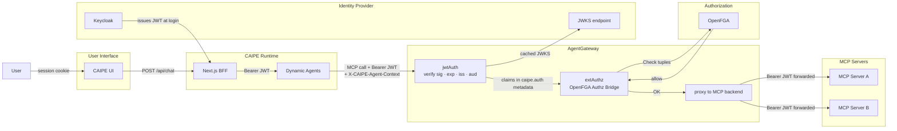
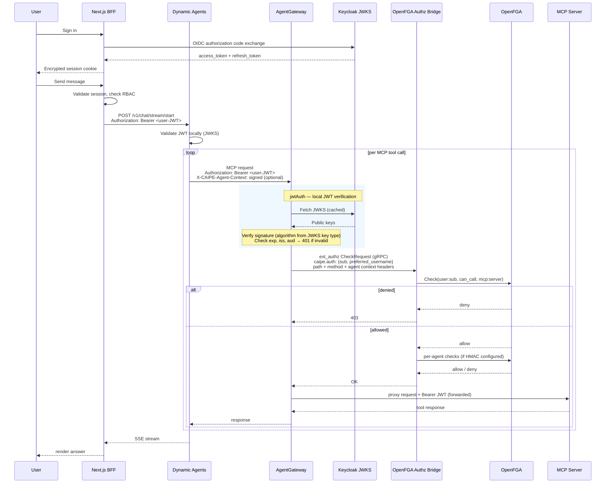

# AgentGateway as MCP Proxy

AgentGateway is the single **Policy Enforcement Point (PEP)** for all MCP tool
calls. It validates the Keycloak JWT locally (`jwtAuth`) and calls OpenFGA via
`extAuthz` for each request before proxying to the MCP backend.

## Request Flow

## Inside AgentGateway

For each inbound MCP request AgentGateway runs two sequential checks:

| Step | Component | What it verifies | Failure response |
|---|---|---|---|
| 1 | **jwtAuth** | JWT signature (verified via JWKS), `exp`, `iss`, `aud` | 401 Unauthorized |
| 2 | **extAuthz** | OpenFGA relationship checks via the Authz Bridge (see below) | 403 Forbidden |

On success the request is proxied to the MCP backend with the original
`Authorization: Bearer` header forwarded unchanged — MCP servers receive the
same JWT for their own secondary validation.

## extAuthz — what the Authz Bridge checks

The bridge receives a gRPC `CheckRequest` with decoded JWT claims in
`caipe.auth` metadata (AgentGateway consumes the bearer and does not forward
it raw). It then runs:

1. **`user:sub can_call mcp:server`** — base user permission for this MCP server
2. If `CAIPE_AGENT_CONTEXT_HMAC_SECRET` is set and the call is `tools/call`:
   - Verify `X-CAIPE-Agent-Context` HMAC signature and expiry
   - **`user:sub can_use agent:agent_id`**
   - **`agent:agent_id can_call tool:server/name`** (wildcard fallback: `tool:server/*`)

All checks must pass. The bridge fails **closed** — any error or timeout returns
403 (never fail-open). See [Agent Context HMAC](../security/agent-context-hmac.md) for
the full signed-header flow.

## Detailed Sequence

## Helm routing modes: Gateway API vs CRD-free static

The umbrella Helm chart can provision AgentGateway MCP routing in two ways, selected by `global.agentgateway.routingMode` (only relevant when `global.agentgateway.enabled=true`):

| Mode | What the chart renders | Cluster requirements | When to use |
| --- | --- | --- | --- |
| `static` (default) | A single ConfigMap (`<release>-agentgateway-static-config`) holding the standalone proxy config — one `/mcp/<id>` route + MCP backend per enabled target. No custom resources. | None beyond the standalone `agentgateway` proxy Deployment (`agentgateway.enabled=true`) | Default. Works on any cluster, including ones you do **not** own or where you cannot install cluster-scoped CRDs/controllers. `helm diff`/`helm upgrade` stay clean because no CRD-backed objects are rendered. |
| `gateway-api` | `Gateway`, `HTTPRoute`, `AgentgatewayBackend`, and optional `AgentgatewayPolicy` custom resources | Gateway API + AgentGateway CRDs (`gateways`/`httproutes.gateway.networking.k8s.io`, `agentgatewaybackends`/`agentgatewaypolicies.agentgateway.dev`) **and** an AgentGateway/Gateway API controller | Opt-in. You control the cluster and have (or can install) the CRDs and controller and want the controller-managed Gateway data plane. |

**MCP endpoint discovery without CRDs.** In `static` mode the standalone proxy is the source of truth for routes. The proxy exposes its live config at the admin `/config` endpoint, and the CAIPE UI discover/sync flow (`/api/mcp-servers/agentgateway/*`) reads MCP targets from there. So MCP endpoints are still discoverable and registrable in the UI without any Gateway API / AgentGateway CRDs in the cluster. For local Docker Compose, the same shape is kept in sync by `deploy/agentgateway/config_bridge.py`, which polls the BFF's internal AgentGateway target API instead of reading MongoDB directly.
