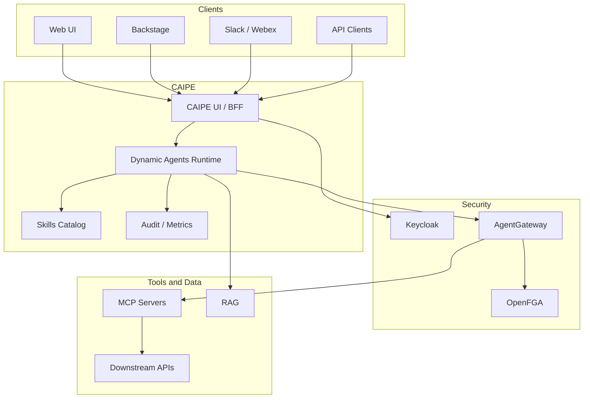

# Solution Architecture

CAIPE (Community AI Platform Engineering) uses Dynamic Agents as the default agent runtime.
Users interact through the web UI, Backstage, bots, or API clients; the UI/BFF proxies requests to
Dynamic Agents, and Dynamic Agents call MCP tools through AgentGateway with Keycloak/OpenFGA
authorization.

## Runtime Flow

1. **Client request**
   Users send chat, skill, or admin requests through a supported client.
2. **BFF and identity boundary**
   The CAIPE UI/BFF validates session context, forwards user tokens, and applies route-level RBAC.
3. **Dynamic Agents runtime**
   Dynamic Agents loads the selected agent profile, prompt, model, skills, and allowed MCP tools.
4. **Tool access**
   AgentGateway validates MCP calls and delegates authorization to OpenFGA-backed policies.
5. **Knowledge and integrations**
   RAG, MCP servers, and downstream SaaS/platform APIs execute with scoped user or service credentials.
6. **Observability and governance**
   Audit logs, metrics, tracing, and admin controls cover runtime activity and tool access.

See [Scheduler](./scheduler.md) for recurring and delayed Dynamic Agent runs,
including the user JWT, token-exchange, and OpenFGA authorization paths.

---

## Request Path

---
