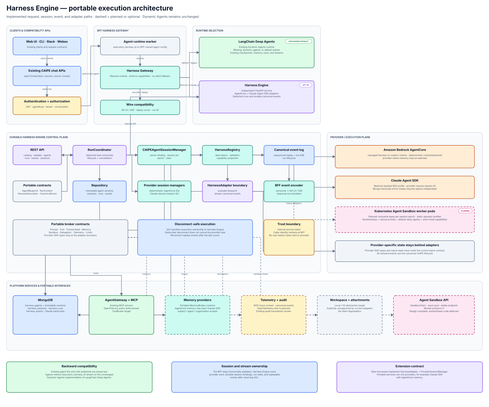
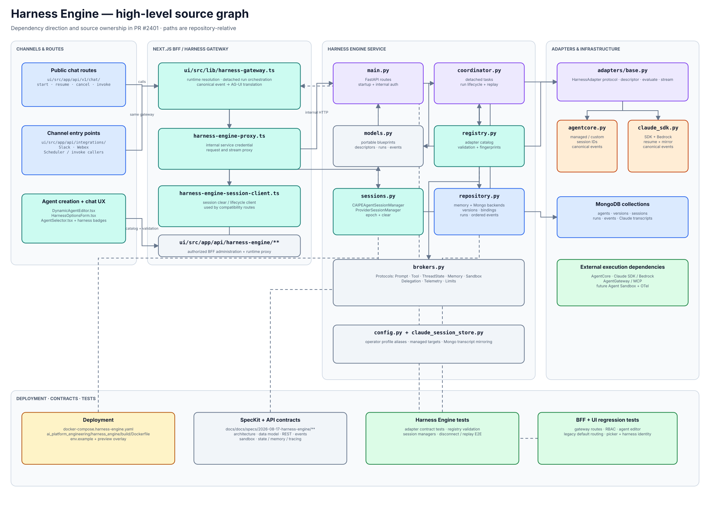

# Solution Architecture

Users reach CAIPE through Slack, Webex, the UI, or CLI. Keycloak authenticates every path, CAIPE Agent(s) run the request, and AgentGateway routes MCP tool calls after OpenFGA authorization.

## CAIPE System Architecture

## Harness Engine

Harness Gateway preserves the existing CAIPE chat APIs while routing each
authorized agent to either the unchanged Dynamic Agents runtime or the
independent Harness Engine. Solid paths are implemented in PR #2401; dashed
paths are portable interfaces or sandbox capabilities planned for later work.

Editable source: [CAIPE system architecture](https://github.com/cnoe-io/ai-platform-engineering/blob/main/docs/excalidraw/caipe-system-architecture.excalidraw)

### Source graph

The source graph shows where the compatibility boundary, durable control plane,
provider adapters, deployment configuration, contracts, and regression tests
live in the repository.

Editable source: [Harness Engine source graph](https://github.com/cnoe-io/ai-platform-engineering/blob/main/docs/excalidraw/harness-engine-source-graph.excalidraw)

## CAIPE Dynamic Agents

## CAIPE Authorization Flow

### Authz High Level 

### Authz OpenFGA

## CAIPE Supporting Services

