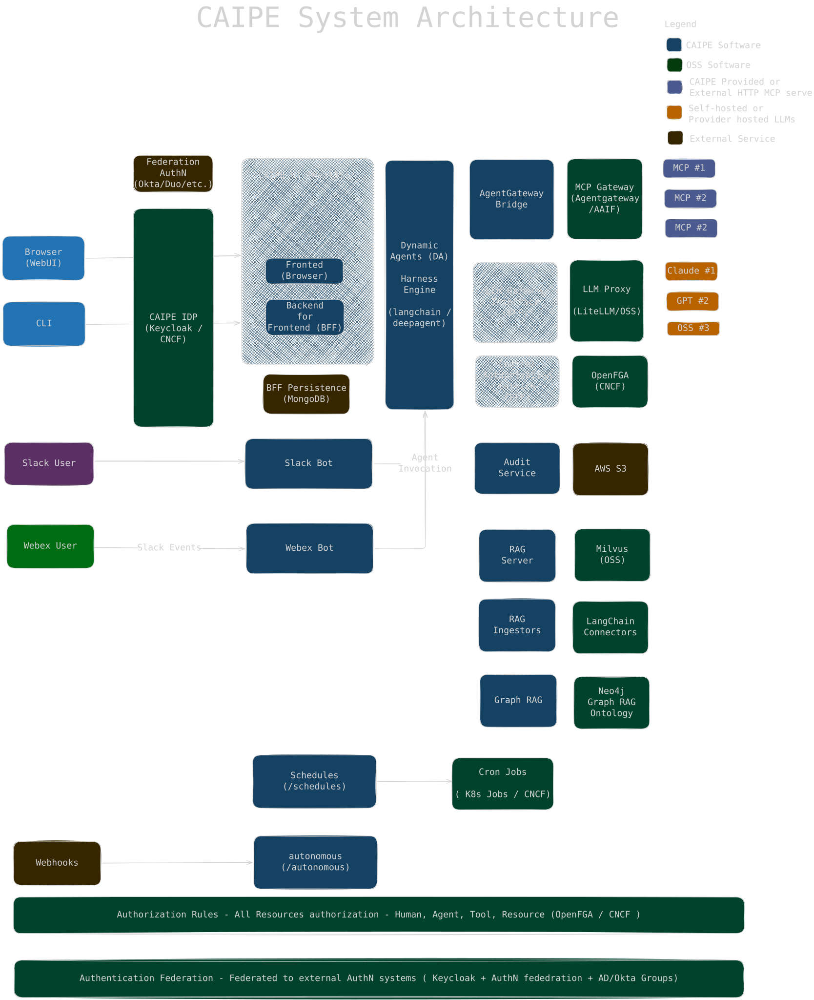
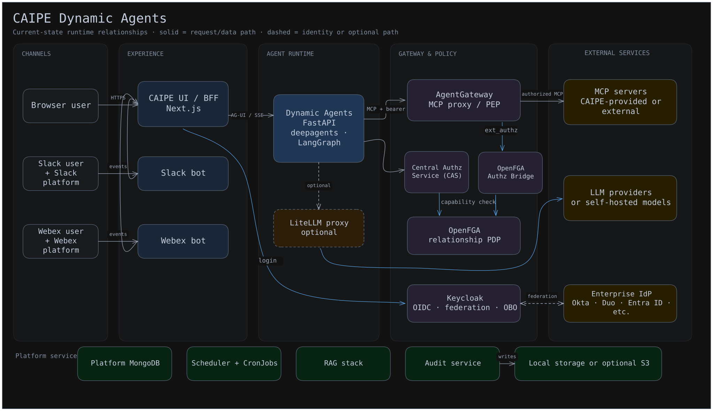
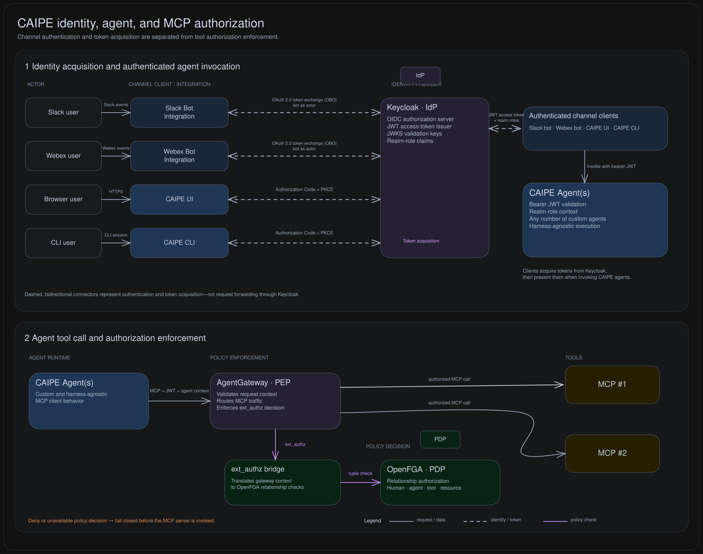
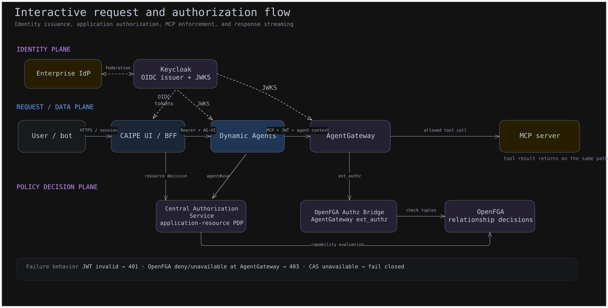
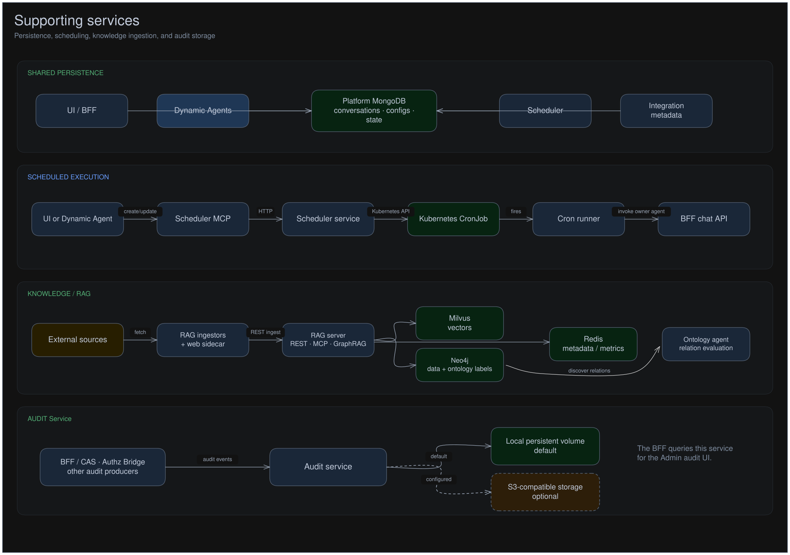

# Solution Architecture

Users reach CAIPE through Slack, Webex, the UI, or CLI. Keycloak authenticates every path, CAIPE Agent(s) run the request, and AgentGateway routes MCP tool calls after OpenFGA authorization.

## CAIPE System Architecture

## CAIPE Dynamic Agents

## CAIPE Authorization Flow

### Authz High Level 

### Authz OpenFGA

## CAIPE Supporting Services

