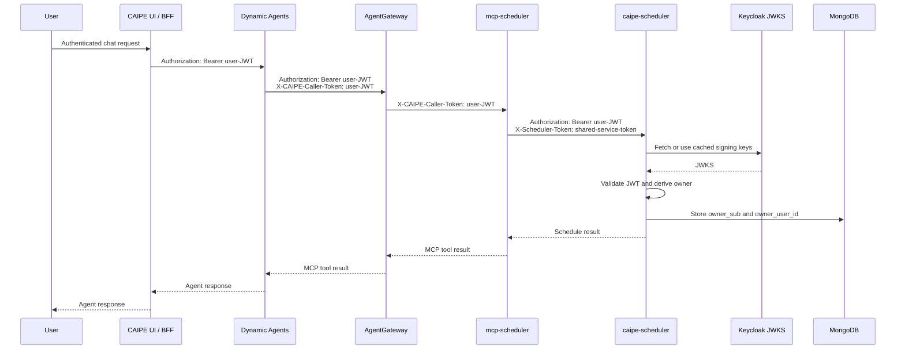
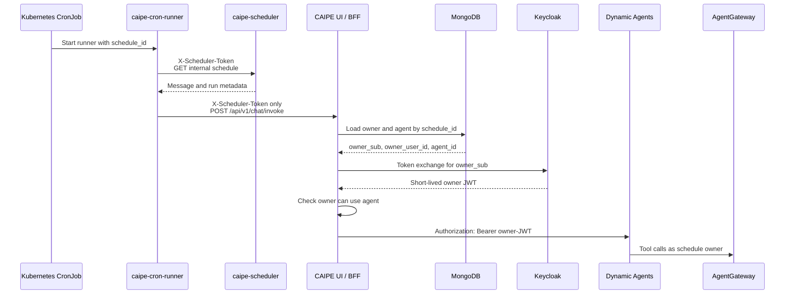
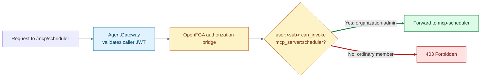

# Scheduler

The scheduler runs Dynamic Agent chats on recurring cron schedules or as delayed
one-off jobs. It is disabled by default. Enabling it installs:

- `caipe-scheduler`, which stores schedules in MongoDB and manages Kubernetes
  CronJobs and Jobs.
- `mcp-scheduler`, which exposes schedule operations to Dynamic Agents.
- `caipe-cron-runner`, the short-lived container started by each CronJob or Job.
- CAIPE UI/BFF wiring that turns a scheduled fire into a chat owned by the user
  who created the schedule.

Dynamic Agents, the CAIPE UI, Keycloak, AgentGateway, and MongoDB are required.
OpenFGA is optional for the scheduler itself, but is required for the admin-only
policy described below.

The umbrella chart ships with the feature off:

```yaml
global:
  scheduler:
    enabled: false
```

## Identity and token flow

Schedule creation and scheduled execution use different credentials.

### Create or manage a schedule

The live user's Keycloak JWT determines schedule ownership. Dynamic Agents
resolves the scheduler MCP's `caller_token` credential source and places that
JWT in `X-CAIPE-Caller-Token`. AgentGateway authenticates and authorizes the
request, then forwards that header to `mcp-scheduler`.

`mcp-scheduler` does not validate or decode the JWT. It relays the opaque value
to `caipe-scheduler` as an `Authorization` bearer. The scheduler validates the
signature, issuer, audience, and expiry, then derives `owner_sub` and
`owner_user_id` from the claims. An agent cannot choose or override the owner.



`schedulerMcp.auth.mode` intentionally remains `none`. AgentGateway is the MCP
authentication boundary, while `caipe-scheduler` is the ownership boundary and
validates the forwarded JWT itself.

### Execute a scheduled run

Cron runner pods do not hold a user JWT. They authenticate to the BFF only with
the shared `X-Scheduler-Token`. The BFF ignores any caller-supplied owner or
agent identity, loads both from the authoritative MongoDB schedule record, and
uses the dedicated `caipe-scheduler-runner` Keycloak client to mint a short-lived
JWT for the stored owner.

The BFF checks that the owner can still use the selected agent and forwards the
minted owner JWT to Dynamic Agents. All later AgentGateway and MCP calls therefore
run with the schedule owner's current permissions. A disabled owner, removed
agent grant, failed token exchange, or missing schedule record fails closed.



The shared scheduler token proves only that the request came from the scheduler
subsystem. It is never accepted as user identity. Use the same Kubernetes Secret
for the scheduler, scheduler MCP, cron runner, and BFF, and do not place its
literal value in a values file.

## Enable the scheduler

The following example uses a Helm release named `caipe` in namespace `caipe`
with the bundled Keycloak. Replace the public issuer and MongoDB Secret values
for your environment. The internal JWKS URL may remain cluster-local, but the
issuer must exactly match the `iss` claim in user tokens.

```yaml
tags:
  caipe-ui: true
  dynamic-agents: true
  keycloak: true

global:
  scheduler:
    enabled: true
    serviceTokenSecretName: caipe-scheduler-service-token
    serviceTokenSecretKey: token
  agentgateway:
    enabled: true
    static:
      jwtAuth:
        enabled: true
        issuer: https://id.example.com/realms/caipe
        jwksUrl: http://caipe-keycloak:8080/realms/caipe/protocol/openid-connect/certs
        audiences:
          - caipe-platform
          - agentgateway

scheduler:
  mongo:
    # Use the same MongoDB as the CAIPE UI.
    existingSecret: caipe-caipe-ui-secret
    existingSecretKey: MONGODB_URI
    database: caipe
  auth:
    jwksUrl: http://caipe-keycloak:8080/realms/caipe/protocol/openid-connect/certs
    issuer: https://id.example.com/realms/caipe
    audiences:
      - caipe-platform

schedulerMcp:
  enabled: true
  auth:
    mode: none

keycloak:
  features:
    tokenExchange: true
    adminFineGrainedAuthz: true
  schedulerTokenExchange:
    enabled: true
    botClientId: caipe-scheduler-runner

caipe-ui:
  schedulerRunnerClient:
    clientId: caipe-scheduler-runner
  appConfig:
    mcp_servers:
      - id: scheduler
        name: Scheduler
        description: Cron-style scheduled Dynamic Agent chat runs.
        transport: http
        endpoint: http://caipe-agentgateway:4000/mcp/scheduler
        enabled: true
        credential_sources:
          - kind: caller_token
            target: header
            name: X-CAIPE-Caller-Token
```

When `scheduler.serviceToken.existingSecret` is empty, the chart creates and
preserves the Secret named by `global.scheduler.serviceTokenSecretName`. For an
operator-managed Secret, set both locations to the same Secret name and key:

```yaml
global:
  scheduler:
    serviceTokenSecretName: my-scheduler-service-token
    serviceTokenSecretKey: token

scheduler:
  serviceToken:
    existingSecret: my-scheduler-service-token
    existingSecretKey: token
```

With the bundled Keycloak, leaving
`keycloak.schedulerTokenExchange.secretRef` and
`caipe-ui.schedulerRunnerClient.secretName` empty makes the chart use its
release-derived scheduler-runner Secret. If the Secret is managed externally,
set both values to the same name. It must contain the key
`KC_SCHEDULER_CLIENT_SECRET`:

```yaml
keycloak:
  schedulerTokenExchange:
    secretRef: my-scheduler-runner-client

caipe-ui:
  schedulerRunnerClient:
    secretName: my-scheduler-runner-client
    secretKey: KC_SCHEDULER_CLIENT_SECRET
```

Finally, grant the scheduler tools only to agents that should be able to create
or manage schedules. For a config-driven agent:

```yaml
caipe-ui:
  appConfig:
    agents:
      - id: scheduled-operations
        name: Scheduled Operations
        enabled: true
        # Add the model and prompt fields required by your deployment.
        allowed_tools:
          scheduler:
            - create_schedule
            - list_schedules
            - get_schedule
            - update_schedule
            - pause_schedule
            - resume_schedule
            - restart_schedule
            - schedule_one_off
            - list_one_off_runs
            - delete_schedule
```

Helm replaces lists rather than merging list entries. If `mcp_servers` or
`agents` already exists in another values file, add the scheduler entries to
that existing list instead of defining a second list in a later values file.

## Restrict scheduler tools to organization admins

Enable OpenFGA, the AgentGateway authorization bridge, JWT validation, and the
selective scheduler server check:

```yaml
openfga:
  enabled: true

openfgaAuthzBridge:
  enabled: true

global:
  agentgateway:
    enabled: true
    extAuth:
      enabled: true
      # The default service name is <release>-openfga-authz-bridge.
      port: 9100

openfga-authz-bridge:
  openfga:
    httpUrl: http://caipe-openfga:8080
    storeName: caipe-openfga
  tokenValidation:
    jwksUrl: http://caipe-keycloak:8080/realms/caipe/protocol/openid-connect/certs
    issuer: https://id.example.com/realms/caipe
    audiences:
      - caipe-platform
      - agentgateway
  restrictedMcpServers:
    - scheduler # <- This enables the admin-only check for /mcp/scheduler requests.
```

For every request under `/mcp/scheduler`, the bridge checks:

```text
user:<JWT sub> can_invoke mcp_server:scheduler
```



The config-driven MCP relationship reconciler gives organization members
`reader` and `user`, but deliberately removes their `invoker` relationship. It
gives `organization:<org>#admin` the `manager` relationship. In the OpenFGA
model, `manager` implies `can_manage`, and `can_manage` implies `can_invoke`.
The resulting default policy is:

| Caller | Discover scheduler MCP | Invoke scheduler MCP |
|---|---:|---:|
| Organization member | Yes | No |
| Organization admin | Yes | Yes |

This assumes identity bootstrap or synchronization has written
`user:<sub> admin organization:<org>` for each platform administrator.

Do not grant `invoker`, `owner`, or another relation that implies `can_invoke`
on `mcp_server:scheduler` to a non-admin user or team if the intended policy is
strictly admin-only.

This caller check is independent of agent tool authorization. An admin must use
an agent whose `allowed_tools.scheduler` entries have been reconciled into the
agent-to-tool OpenFGA tuples. Conversely, a non-admin is denied at the scheduler
MCP server check even if the selected agent has scheduler tools.

For signed agent context and per-tool enforcement, configure the same HMAC
Secret for Dynamic Agents and the bridge:

```yaml
dynamic-agents:
  agentContext:
    existingSecret:
      name: caipe-agent-context
      key: CAIPE_AGENT_CONTEXT_HMAC_SECRET

openfga-authz-bridge:
  agentContext:
    existingSecret:
      name: caipe-agent-context
      key: CAIPE_AGENT_CONTEXT_HMAC_SECRET
```

## Operational behavior

- Schedule ownership is persisted in MongoDB. The owner supplied by an MCP tool
  argument or cron runner request is never trusted.
- Cron runner pods have no Kubernetes API token and no stored user bearer.
- Existing CronJobs are reconciled to the configured cron-runner image when the
  scheduler starts. The schedule version history records deployment-driven
  image updates.
- Kubernetes CronJob retry and concurrency settings are controlled by the
  scheduler-created job template, while BFF idempotency prevents a successful
  scheduled conversation from being created twice for the same run.
- If OpenFGA or the authorization bridge is unavailable, AgentGateway denies the
  restricted call rather than bypassing authorization.
