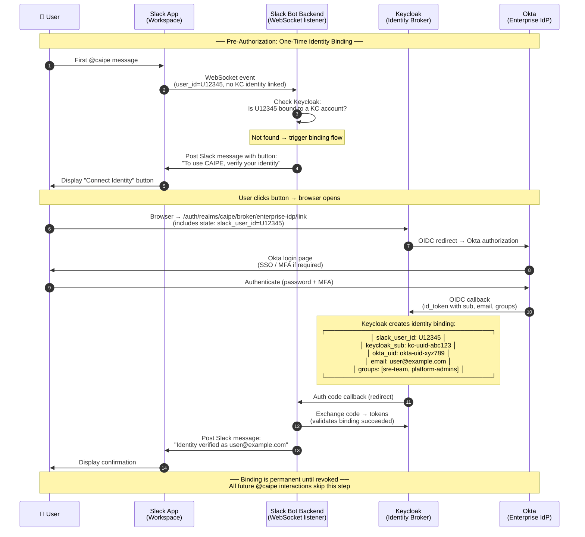
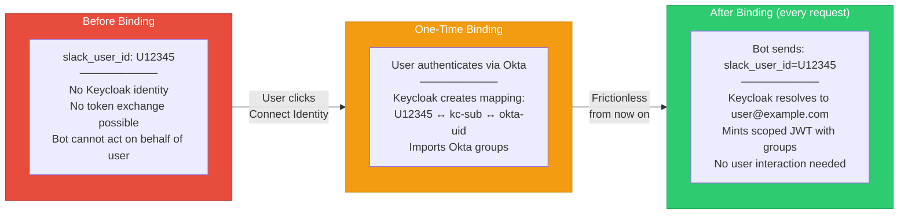
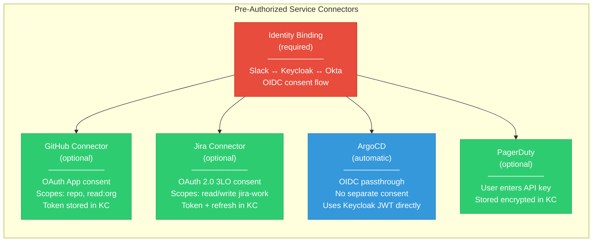
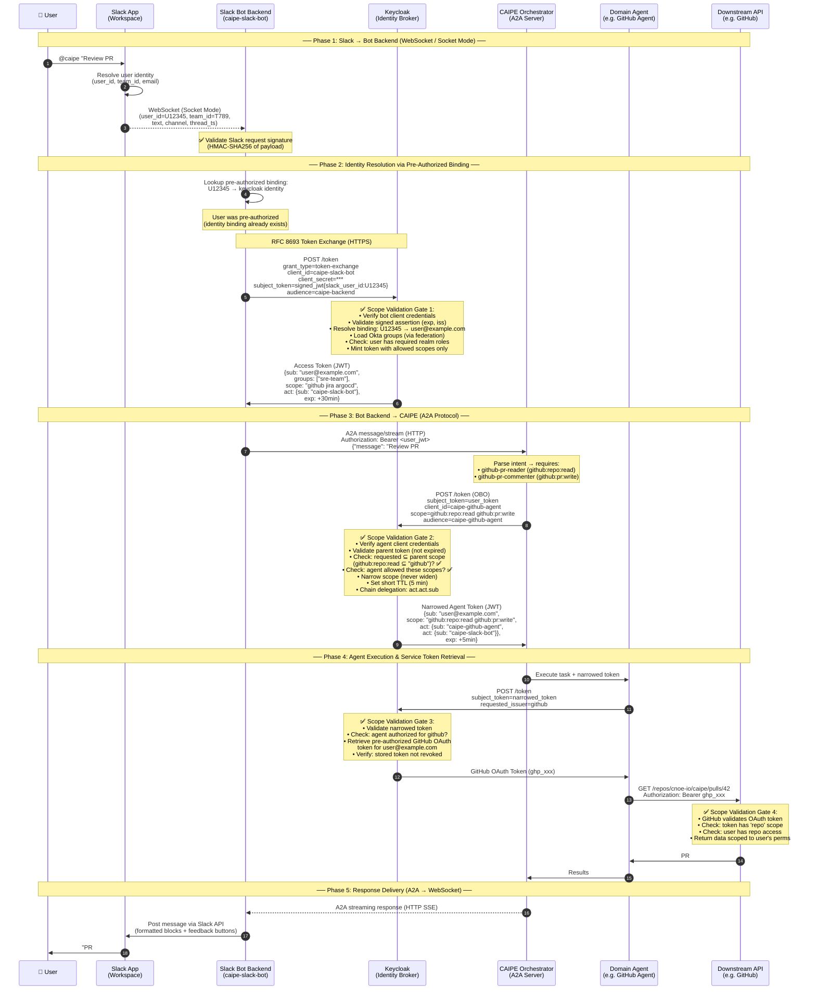
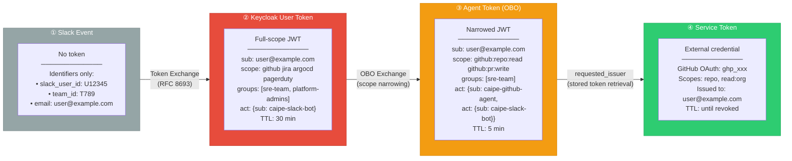
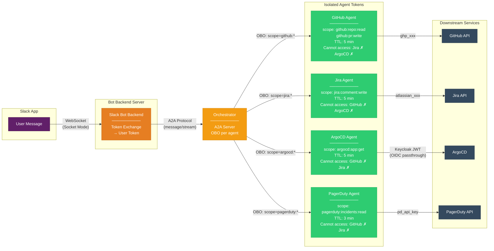
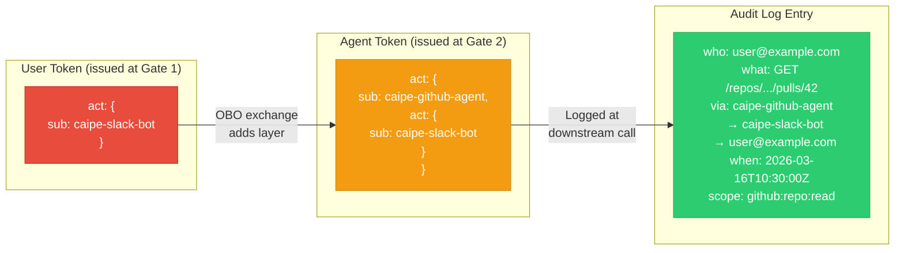
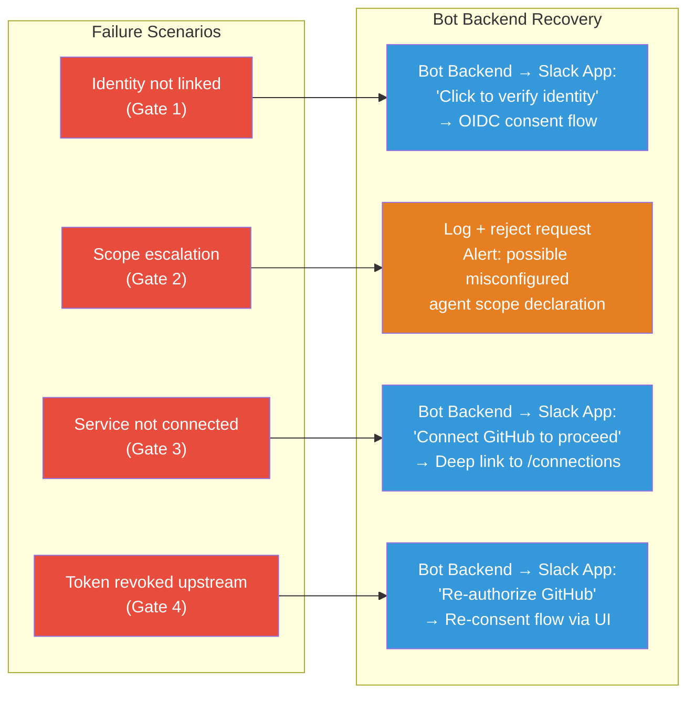

# Slack Bot Authorization Architecture

This document provides a visual reference for the end-to-end authorization flow when a user interacts with CAIPE through Slack. It covers the trust chain from Okta enterprise SSO through Slack, Keycloak token exchange, CAIPE orchestration, and user scope validation at every boundary.

For the full design rationale and implementation details, see [Enterprise Identity Federation](./enterprise-identity-federation.md).

---

## Authorization Topology

The following diagram shows every actor in the authorization chain, the trust relationships between them, and what credentials or tokens flow across each boundary.

```mermaid
graph LR
    subgraph IDP["Enterprise IdP"]
        OKTA["Okta<br/>(Source of Truth)<br/>─────────────<br/>• SAML/OIDC IdP<br/>• Groups & Attributes<br/>• MFA Enforcement"]
    end

    subgraph SLACK_PLATFORM["Slack App (Client)"]
        SLACK_APP["Slack Workspace<br/>─────────────<br/>• User sends @mention<br/>• SAML SP (via Okta)<br/>• Delivers events to bot<br/>• Renders bot responses"]
    end

    subgraph BOT_BACKEND["Slack Bot Backend Server"]
        BOT["Bot Server<br/>(Confidential Client)<br/>─────────────<br/>• WebSocket listener<br/>• Extracts slack_user_id<br/>• Token exchange with KC<br/>• Forwards user token"]
    end

    subgraph IDENTITY["Identity Broker"]
        KC["Keycloak<br/>─────────────<br/>• OIDC IdP Broker (Okta)<br/>• RFC 8693 Token Exchange<br/>• OBO Scope Narrowing<br/>• Broker Token Store"]
    end

    subgraph CAIPE["CAIPE Agent Platform"]
        ORCH["Orchestrator<br/>(A2A Server)<br/>─────────────<br/>• Parses intent & routes<br/>• OBO exchange per agent<br/>• Scope narrowing"]
        AGENTS["Domain Agents<br/>─────────────<br/>• GitHub / Jira / ArgoCD<br/>• Retrieves service token<br/>• Calls downstream APIs"]
    end

    subgraph DS_SVC["Downstream Services"]
        DS["GitHub · Jira · ArgoCD<br/>PagerDuty · K8s"]
    end

    OKTA ==>|"① SAML SSO<br/>(user login)"| SLACK_APP
    OKTA ==>|"② OIDC Broker<br/>(groups, attributes)"| KC
    SLACK_APP ==>|"③ WebSocket<br/>(Slack Socket Mode)<br/>user_id, message"| BOT
    BOT ==>|"④ Token Exchange<br/>(RFC 8693 / HTTPS)"| KC
    KC ==>|"⑤ Scoped User Token<br/>(JWT + groups)"| BOT
    BOT ==>|"⑥ A2A Protocol<br/>(message/stream)<br/>user token + request"| ORCH
    ORCH ==>|"⑦ OBO Exchange<br/>(HTTPS)"| KC
    KC ==>|"⑧ Agent Token<br/>(min scope, short TTL)"| ORCH
    ORCH ==>|"⑨ A2A / direct<br/>narrowed token + task"| AGENTS
    AGENTS ==>|"⑩ Token Exchange<br/>(HTTPS)"| KC
    KC ==>|"⑪ External Token<br/>(e.g. ghp_xxx)"| AGENTS
    AGENTS ==>|"⑫ API Call<br/>(as user)"| DS

    style OKTA fill:#007DC1,color:#fff,stroke:#005a8c
    style KC fill:#4A90D9,color:#fff,stroke:#2d6da3
    style BOT fill:#E67E22,color:#fff,stroke:#bf6516
    style ORCH fill:#2ECC71,color:#fff,stroke:#1a9c54
    style AGENTS fill:#9B59B6,color:#fff,stroke:#7d3c98
    style SLACK_APP fill:#611f69,color:#fff,stroke:#4a154b
    style DS fill:#34495E,color:#fff,stroke:#2c3e50
```



### Trust Boundaries

| Boundary | Protocol | Trust Mechanism | What Crosses |
|---|---|---|---|
| Okta → Slack App | SAML 2.0 / OIDC | SAML assertion | Authenticated user session |
| Okta → Keycloak | OIDC | Signed tokens | `id_token`, groups, email |
| Slack App → Bot Backend | **WebSocket** (Socket Mode) | Slack-signed payloads (HMAC-SHA256) | `user_id`, `team_id`, message |
| Bot Backend → Keycloak | HTTPS | Client credentials + signed JWT assertion | `slack_user_id` claim |
| Keycloak → Bot Backend | HTTPS | Signed Keycloak access token | `sub`, `groups`, `scope`, `act` |
| Bot Backend → Orchestrator | **A2A Protocol** (`message/stream`) | Bearer token (user JWT) | User token + request payload |
| Orchestrator → Keycloak | HTTPS | OBO token exchange | Parent token + requested scope |
| Orchestrator → Agents | A2A / internal | Narrowed token + task payload | Scoped JWT + task context |
| Agent → Keycloak | HTTPS | Token exchange (`requested_issuer`) | Narrowed token → external token |
| Agent → Downstream | HTTPS | Provider-specific auth (OAuth, API key, JWT) | User's own credentials |

---

## Pre-Authorization: User Identity Binding

Before any runtime authorization can happen, the user must complete a **one-time identity binding** that links their Slack identity to a Keycloak account (backed by Okta SSO). This is analogous to how Deno apps pre-authorize with Keycloak — the user proves who they are once, and all subsequent interactions are frictionless.

This step creates a permanent mapping: `slack_user_id ↔ keycloak_sub ↔ okta_uid`.



### What the Binding Enables

Once bound, the Bot Backend can perform **RFC 8693 token exchanges** on every subsequent interaction without any user involvement:



### Service Connector Pre-Authorization

Beyond identity binding, users can also **pre-authorize downstream service connectors** (GitHub, Jira, PagerDuty, etc.) through the CAIPE UI Connections page or via Slack commands. Each connector follows a similar one-time OAuth consent pattern:



---

## Runtime Authorization Sequence

After pre-authorization is complete, this sequence diagram traces a single user message from Slack through every authorization gate at runtime. No user interaction is required — the Bot Backend resolves identity and obtains tokens automatically.



---

## Scope Validation Gates

Every authorization boundary enforces scope validation. This flowchart shows the decision logic at each gate and what happens when validation fails.

```mermaid
flowchart LR
    START([Slack App<br/>delivers event]) --> G1

    subgraph G1["Gate 1: Bot Backend → Keycloak<br/>(Token Exchange)"]
        direction TB
        G1_1{Bot client<br/>credentials valid?}
        G1_2{Signed JWT<br/>assertion valid?<br/>(exp, iss, sig)}
        G1_3{slack_user_id<br/>linked in KC?}
        G1_4{User has<br/>required realm<br/>roles?}
        G1_5[Mint scoped token<br/>with Okta groups]

        G1_1 -->|Yes| G1_2
        G1_1 -->|No| G1_F1[/"401: Invalid client"/]
        G1_2 -->|Yes| G1_3
        G1_2 -->|No| G1_F2[/"400: Invalid assertion"/]
        G1_3 -->|Yes| G1_4
        G1_3 -->|No| G1_F3[/"Trigger identity<br/>linking flow"/]
        G1_4 -->|Yes| G1_5
        G1_4 -->|No| G1_F4[/"403: Insufficient<br/>realm roles"/]
    end

    G1_5 --> G2

    subgraph G2["Gate 2: Orchestrator → Keycloak<br/>(OBO / Scope Narrowing)"]
        direction TB
        G2_1{Agent client<br/>credentials valid?}
        G2_2{Parent token<br/>valid & not<br/>expired?}
        G2_3{Requested scope<br/>⊆ parent scope?}
        G2_4{Agent allowed<br/>these scopes<br/>in KC policy?}
        G2_5[Mint narrowed token<br/>TTL ≤ 5 min]

        G2_1 -->|Yes| G2_2
        G2_1 -->|No| G2_F1[/"401: Invalid<br/>agent client"/]
        G2_2 -->|Yes| G2_3
        G2_2 -->|No| G2_F2[/"401: Token expired,<br/>re-exchange needed"/]
        G2_3 -->|Yes| G2_4
        G2_3 -->|No| G2_F3[/"403: Scope escalation<br/>denied (never widen)"/]
        G2_4 -->|Yes| G2_5
        G2_4 -->|No| G2_F4[/"403: Agent not<br/>authorized for scope"/]
    end

    G2_5 --> G3

    subgraph G3["Gate 3: Agent → Keycloak<br/>(External Token Retrieval)"]
        direction TB
        G3_1{Narrowed token<br/>valid?}
        G3_2{Agent authorized<br/>for requested_issuer?}
        G3_3{User has stored<br/>token for service?}
        G3_4{Stored token<br/>valid / refreshable?}
        G3_5[Return external<br/>service token]

        G3_1 -->|Yes| G3_2
        G3_1 -->|No| G3_F1[/"401: Token<br/>invalid"/]
        G3_2 -->|Yes| G3_3
        G3_2 -->|No| G3_F2[/"403: Agent cannot<br/>access this issuer"/]
        G3_3 -->|Yes| G3_4
        G3_3 -->|No| G3_F3[/"Prompt user to<br/>connect service"/]
        G3_4 -->|Yes| G3_5
        G3_4 -->|No| G3_F4[/"Trigger re-consent<br/>(refresh expired)"/]
    end

    G3_5 --> G4

    subgraph G4["Gate 4: Downstream Service<br/>(Provider Validation)"]
        direction TB
        G4_1{Token / API key<br/>valid?}
        G4_2{User has access<br/>to resource?}
        G4_3[Return data<br/>scoped to user perms]

        G4_1 -->|Yes| G4_2
        G4_1 -->|No| G4_F1[/"401: Revoked or<br/>expired upstream"/]
        G4_2 -->|Yes| G4_3
        G4_2 -->|No| G4_F2[/"403: User lacks<br/>provider-level access"/]
    end

    G4_3 --> DONE([Result returned<br/>via Slack App])

    style G1 fill:#1a3a5c,color:#fff,stroke:#0d2137
    style G2 fill:#1a5c3a,color:#fff,stroke:#0d3721
    style G3 fill:#5c3a1a,color:#fff,stroke:#37210d
    style G4 fill:#3a1a5c,color:#fff,stroke:#210d37
    style START fill:#611f69,color:#fff
    style DONE fill:#611f69,color:#fff
```

---

## Token Lifecycle & Scope Narrowing

This diagram visualizes how the token transforms as it flows through the CAIPE authorization chain — showing scope reduction, TTL shortening, and delegation chain growth at each hop.



### Scope Reduction Guarantee

```
User Token scope:     github  jira  argocd  pagerduty    (4 services)
                         ↓
GitHub Agent scope:   github:repo:read  github:pr:write   (2 fine-grained)
                         ↓
Service Token:        repo  read:org                       (GitHub-native scopes)
```

At every exchange, Keycloak enforces: **requested scope ⊆ parent scope**. Scope can only narrow, never widen. An agent that holds `github:repo:read` cannot request `github:repo:write` — the exchange fails with 403.

---

## Multi-Agent Scope Isolation

When the orchestrator routes a user request to multiple agents, each agent receives an independently scoped token. A compromised agent token cannot access services beyond its granted scope.



---

## JWT Delegation Chain (Audit Trail)

The `act` (actor) claim in each JWT records the full delegation chain, providing a complete audit trail from the original user through every intermediary.



Every action taken by a CAIPE agent is attributable to the human user who initiated it. The delegation chain is embedded in the JWT and logged at every boundary for forensic traceability.

---

## Error Handling & Recovery Flows

When authorization fails at any gate, the system responds with specific recovery actions rather than generic errors.



---

## Related Documentation

- [Enterprise Identity Federation](./enterprise-identity-federation.md) — full design, Keycloak configuration, CRD definitions, and implementation code
- [A2A Authentication](../security/a2a-auth.md) — bot-to-supervisor OAuth2 client credentials setup
- [Slack Bot Integration](../integrations/slack-bot.md) — deployment, configuration, and channel setup
- [CAIPE UI Auth Flow](../ui/auth-flow.md) — browser-based OIDC authentication for the web UI
