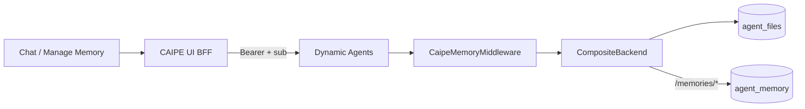
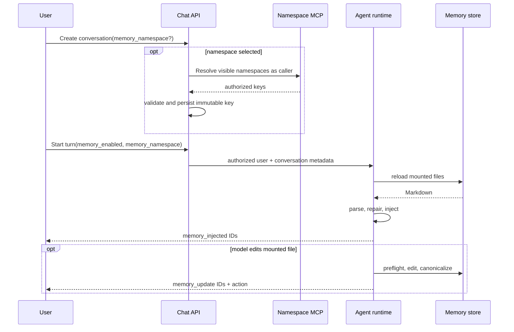
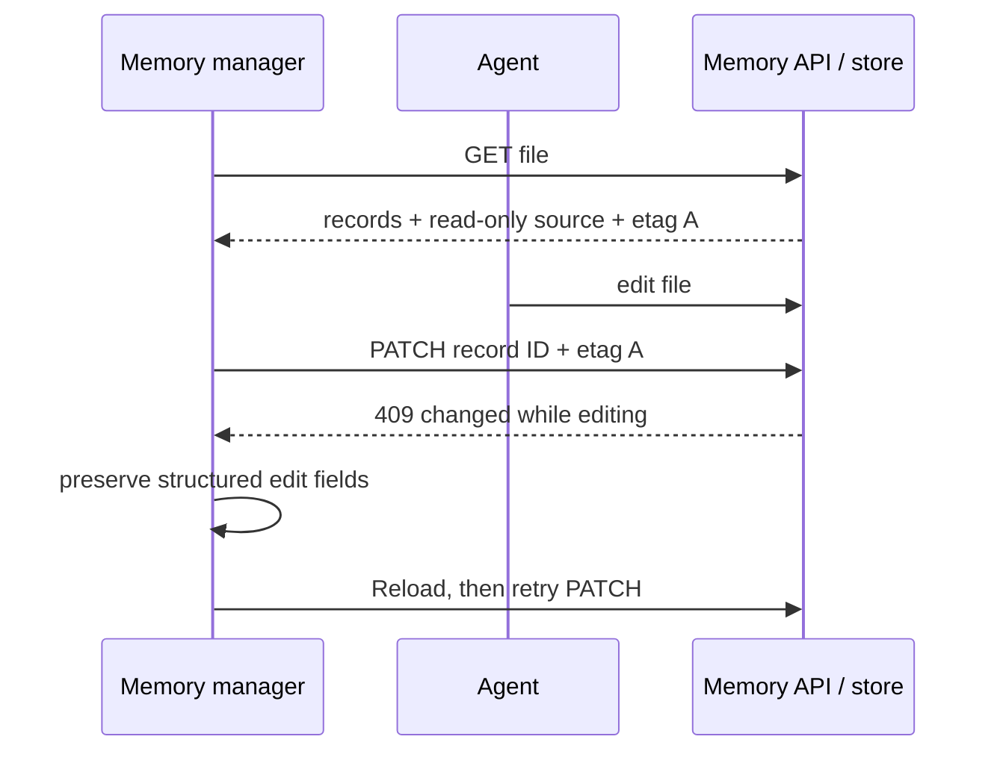

# User Memory Architecture

- **Status:** Implemented
- **Last verified:** 2026-08-05

For the user and operator workflow, see [User Memory](../features/user-memory).

## Design

CAIPE uses `deepagents==0.6.4` `MemoryMiddleware` with a policy subclass that
reloads files every turn, repairs record metadata, enforces the file budget, and
emits memory events. Memory is Markdown, routed through the agent filesystem,
but stored separately from ordinary agent files.



| Property | Ordinary files | Memory files |
| --- | --- | --- |
| GridFS bucket | `agent_files` | `agent_memory` |
| Namespace | `(agent_id, conversation_id, "filesystem")` | `(sub, "memory")` |
| TTL | Configured, normally 6 hours | `0` — no expiry |
| Backend path | default route | `/memories/` route |

The immutable Keycloak `sub` is the owner key. Email fallback is allowed only
in debug mode. The BFF is a thin proxy; parsing and rendering live in one Python
codec.

## Mounted files and permissions

Every memory-enabled root graph mounts exactly two or three files:

```text
/memories/global/AGENTS.md
/memories/agents/<current-agent>/AGENTS.md
/memories/namespaces/<conversation-namespace>/AGENTS.md  # optional
```

The graph grants read and write access to those exact paths, followed by a deny
for `/memories/**`. Inactive namespaces, another agent's file, and every memory
path in a subagent are denied. `ls`, `glob`, and `grep` results are permission
filtered as well as direct reads and writes.

Mounted files are seeded with a visible stub:

```markdown
<!-- caipe-memory:file v=1 scope=global -->
_No memories saved here yet._
```

The text line matters: upstream middleware removes HTML comments and omits an
otherwise empty file, which would hide the writable path from the model.

## File format

Records are ordinary Markdown sections with an invisible metadata delimiter:

```markdown
<!-- caipe-memory:file v=1 scope=global -->
## Prefer concise answers
<!-- caipe-memory:rec v=1 id=mem_0a1b2c3d4e5f60718293 title=Prefer%20concise%20answers src=agent by=agent-abc created=2026-01-02T03%3A04%3A05Z updated=2026-02-03T04%3A05%3A06Z -->

Keep responses under five bullets unless asked for detail.
```

Marker values are percent encoded. Bodies reversibly escape HTML-comment
delimiters and backslashes, so headings, horizontal rules, fenced code, and
comment-like text round-trip. The codec adopts unmarked `##` sections, mints
stable IDs, repairs malformed or duplicate IDs, and rejects normalized-title
collisions. Titles are unique within one file; records are never silently
merged by title.

The API preserves `memory_id`, source, creator, and timestamps. Unknown
`category` metadata remains readable for compatibility; it is not a product
field. There is no `enabled` field—delete removes a record.

## Request lifecycle



The chat toggle gates automatic memory loading, prompt injection, and memory
writes for a turn. Memory is reloaded every enabled turn so an external edit or
an earlier model edit is immediately visible. Scheduled `/invoke` runs use the
same non-expiring memory store and may carry `memory_namespace`.

## Namespace authorization

Namespaces may be static, supplied by a caller-authorized MCP tool, or custom
when `allow_custom` is enabled. Dynamic results are cached briefly and selected
keys are revalidated at conversation creation.

`namespace_scoped_tools` removes a configured argument from the tool schema and
binds the trusted conversation key. A `require_namespace` tool is absent in an
unscoped chat. This prevents prompt text or model output from selecting another
working context.

## Concurrency

The management API reads structured records, the read-only `AGENTS.md` source,
and an etag. Add, Edit, and Delete are structured operations. Non-empty
whole-file writes are rejected.



The API also provides append and delete-by-ID operations, implemented as
server-side parse/modify/render operations. Add and Edit require a non-empty
title and body. A normalized-title collision returns a conflict naming the
existing record; the client offers to edit it or choose another title. The UI
shows a read-only Source with Copy and Download. An empty write resets a
mounted file to the stub; an unmounted file is deleted.
This clear-only operation is the sole whole-file write. Each file is limited to
8,000 characters. Existing over-budget data is never truncated automatically.

## Security controls

- All memory endpoints derive `(sub, "memory")` from authenticated context;
  request bodies never choose an owner or store namespace.
- The dedicated two-part namespace is structurally rejected by generic file
  APIs, which require three parts.
- Generic file endpoints resolve the conversation in namespace element 2 and
  require its owner on list, read, write, file delete, and namespace delete.
- Memory bodies and `memory_contents` are removed from tracing spans.
- `format_file` refuses `/memories/` paths because it is bound to the ordinary
  filesystem store.
- Subagents receive an explicit `/memories/**` deny.

## Streaming events

| Event | Data | Meaning |
| --- | --- | --- |
| `memory_injected` | `memory_ids` | Mounted records were supplied to the root model |
| `memory_update` | `memory_ids`, `action` | Records were created, updated, or deleted |

`memory_context_used` is removed. The UI parser maps persisted legacy events to
`memory_injected` so old transcripts retain their badge.
