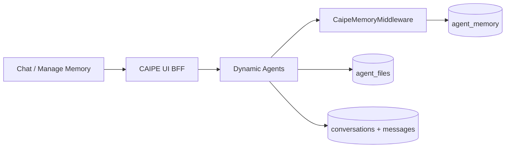
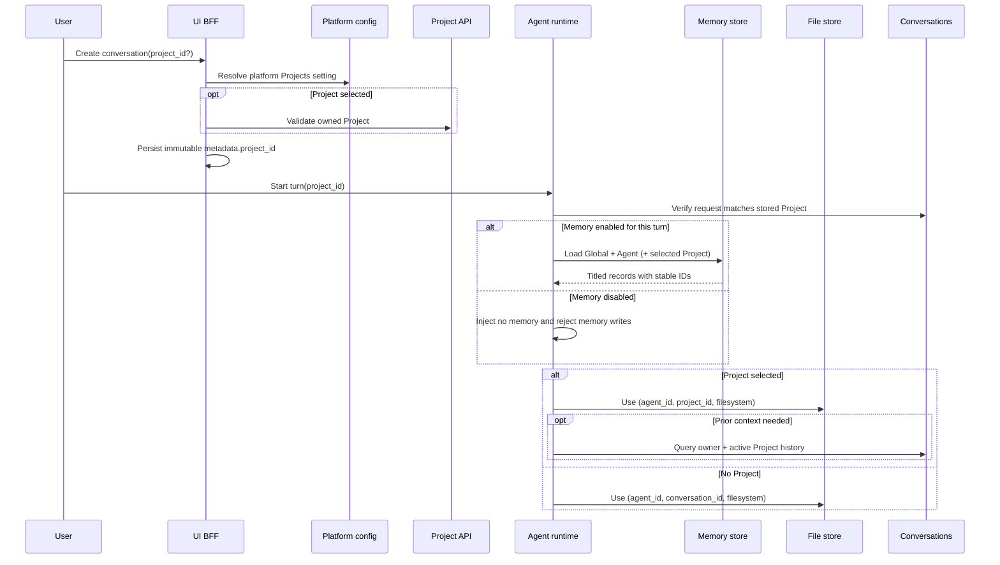

# User Memory and Projects Architecture

- **Status:** Implemented
- **Last verified:** 2026-08-19

For the user workflow, see [User Memory and Projects](../features/user-memory).

## Configuration boundaries

| Capability | Source of truth | Scope |
| --- | --- | --- |
| Projects available | `platform_config.projects.enabled`, falling back to `PROJECTS_ENABLED` | Whole platform |
| Memory available | `builtin_tools.memory.enabled` | One agent |
| Model may create a Project | `builtin_tools.create_project.enabled` | One agent, one tool |
| Active Project | immutable `conversation.metadata.project_id` | One conversation |
| Memory used on this turn | request `memory_enabled` | One turn |

Project participation is not an agent capability. When Projects are enabled,
all agents may be selected in a Project chat. The per-agent `create_project`
setting grants only the model-visible creation tool. The user-facing sidebar
creation API remains available independently.

## Storage model



| Data | Identity | Retention |
| --- | --- | --- |
| Memory | `(owner_subject, "memory")` plus canonical path | No expiry |
| Unscoped files | `(agent_id, conversation_id, "filesystem")` | Configured TTL |
| Project files | `(agent_id, project_id, "filesystem")` | No expiry |
| Project chats | `owner_subject + metadata.project_id` | Conversation policy |

The Project memory file is the authoritative catalog entry:

```text
/memories/projects/<project_id>/AGENTS.md
```

```markdown
<!-- caipe-memory:file v=1 scope=project project_id=project_a project_name=Project%20A -->
_No memories saved here yet._
```

There is no second Project metadata collection. A unique GridFS index on
`metadata.namespace + metadata.key` makes create-only Project creation
race-safe. The codec restores file-level Project metadata after model edits.

## Runtime scope

A memory-enabled unscoped chat mounts Global and Agent memory. A
memory-enabled Project chat mounts Global, Agent, and exactly the selected
Project. A memory-disabled agent mounts no memory, even in a Project chat, but
the Project still scopes files and history. Exact allow rules precede a final
`/memories/**` deny. Subagents retain the full memory deny.



The selected Project is independent of `memory_enabled`. Disabling memory for
a turn suppresses memory injection and writes, while Project files and history
remain scoped to the conversation's immutable Project.

## Project tools

When Projects are enabled platform-wide, root agents receive `list_projects`.
Agents with `builtin_tools.create_project.enabled` also receive `create_project`.
Project chats additionally receive `list_project_chats`,
`search_project_chats`, and `read_project_chat`.

The runtime closure binds `owner_subject` and `project_id`; neither appears as a
model-controlled tool argument. History results contain bounded metadata or
user/assistant transcript text. System messages, reasoning, traces, and file
contents are excluded. History is queried on demand rather than injected.

The sidebar Project list is not part of runtime scope selection. It creates
Projects and filters the History UI. Only the new-chat picker writes
`conversation.metadata.project_id`.

## File authorization

Conversation-facing file endpoints accept `conversation_id + agent_id`, load
the owned conversation, verify the agent participant, read immutable
`metadata.project_id`, and derive the namespace. This replaces the assumption
that namespace component two is always a conversation ID.

Clearing or deleting one Project chat does not delete its shared Project
workspace. Unscoped conversation cleanup may delete its isolated workspace.

## Structured memory integrity

Memory records are Markdown `##` sections with hidden stable IDs and
provenance. Manage Memory performs etag-protected Add, Edit, and Delete
operations. Source is read-only. Normalized duplicate titles return `409`
instead of merging. Clearing a Project file preserves its immutable marker and
placeholder.

Manual Add requires a title and body and stores both without AI rewriting.
Agent edits are reconciled back into the same record IDs and must use a unique
title for each new fact. Heading-less legacy content is promoted once to a
`General memory` compatibility record; agent writes to that record are
rejected so unrelated facts cannot accumulate there.

Streaming continues to emit `memory_injected` and `memory_update` record IDs,
which power the injected-memory and updated-memory UI actions.
