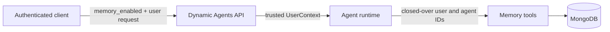
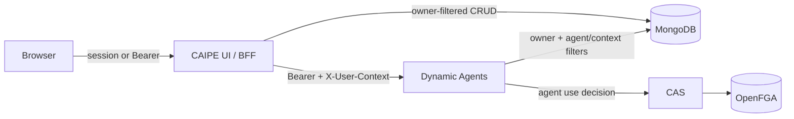

# User Memory

- **Status:** Implemented in CAIPE UI and Dynamic Agents
- **Last verified:** 2026-08-03

This page describes the current implementation. It separates authentication,
agent RBAC, and memory ownership because they are different enforcement layers.

## Goal

Provide durable user preferences and contextual notes to dynamic agents without
embedding domain-specific concepts in the platform.

Memory is private to one authenticated owner. It is not currently a shared,
team, organization, or administrator-managed resource.

## Scopes

| Scope | Applies to | Required identity |
| --- | --- | --- |
| `global` | All agents used by one user | authenticated user |
| `agent` | One user and one agent | authenticated user + agent ID |
| `context` | One user and one domain object | authenticated user + namespace + type + ID |

Specific memories are retrieved alongside broader memories. Agent instructions
remain higher priority than all memory content.

`global` means global across one owner's agents. It never means global across
users. Scope is a relevance partition inside an owner's data; it is not an
OpenFGA resource or a sharing boundary.

## Data Model

Memories are stored in the `user_memories` MongoDB collection.

```json
{
  "memory_id": "mem_example",
  "owner_user_id": "test-user@example.com",
  "scope": "context",
  "agent_id": null,
  "context_namespace": "catalog",
  "context_type": "item",
  "context_id": "example-item",
  "category": "preference",
  "key": "summary_style",
  "normalized_key": "summary_style",
  "value": "Prefer concise bullets with action items first.",
  "enabled": true,
  "source": "agent",
  "created_by_agent_id": "agent-example",
  "created_at": "2026-01-01T00:00:00Z",
  "updated_at": "2026-01-01T00:00:00Z"
}
```

Active contexts are stored separately in `user_memory_contexts`. They bind a
trusted user, agent, and conversation to a context discovered through a
configured provider tool.

The unique memory index covers:

```text
owner_user_id + scope + agent_id + context_namespace + context_type
+ context_id + normalized_key
```

## Trust Boundary

The model never supplies `owner_user_id` or the current agent ID.



The runtime creates memory tools only when the agent opts in and trusted user
context plus MongoDB storage are available. Runtime cache entries are
invalidated when the trusted user changes, preventing a tool closure from being
reused for another identity.

## Authentication and Authorization

### Short answer

The feature meets the private-memory authorization requirement: a normal user
cannot read or mutate another user's memories through supported application
paths. It uses authenticated ownership checks rather than a separate OpenFGA
object for every memory.

- The management API authenticates the caller, then enforces private ownership
  in every MongoDB query.
- Starting or resuming a Dynamic Agent requires the existing CAS/OpenFGA
  `agent#use` decision before memory can be injected or memory tools can run.
- The runtime binds the authenticated email and current agent ID into tool
  closures. The model cannot select `owner_user_id` or the current agent ID.
- There is intentionally no team grant or administrator override for private
  user memory.

This is ownership-based authorization plus inherited agent RBAC. A dedicated
memory RBAC resource is unnecessary unless memory sharing or delegated
administration becomes a product requirement.

### Enforcement matrix

| Operation | Authentication and RBAC | Object-level enforcement |
| --- | --- | --- |
| List memories in the UI | NextAuth session or validated Bearer identity | Query always includes `owner_user_id = authenticated email` |
| Create memory in the UI | Same authenticated identity | Server assigns `owner_user_id`; request bodies cannot choose an owner |
| Edit, enable, disable, or delete | Same authenticated identity | Mutation filter includes memory ID and authenticated owner |
| Start or resume agent chat | Valid Bearer plus fail-closed CAS/OpenFGA `agent#use` check | Agent config is loaded only after the allow decision |
| Automatic prompt injection | Authorized agent runtime | Query includes authenticated owner and current agent/context filters |
| Agent memory tools | Authorized agent runtime | Tools close over authenticated owner and current agent ID |
| Activate context memory | Configured context-provider MCP tool must succeed | Active context is stored for owner + agent + conversation |

An administrator does not gain access to another user's memories through the
memory API. Database administrators remain outside this application boundary.

### Request paths



The `/api/user/memories` route calls `getAuthFromBearerOrSession` directly. It
does not call `withAuth`, `withRbacAuth`, or `requireRbacPermission`, so memory
CRUD does not produce a CAS/OpenFGA decision. That is intentional for the
current private-owner model: the authenticated owner predicate is the access
decision.

The Dynamic Agents chat routes separately require `agent#use`. A memory tagged
with an agent ID does not grant access to that agent. Conversely, the management
API does not validate `agent#use` when an authenticated owner creates an
agent-scoped record; the record is only consumed if the owner can later run that
agent.

### Owner identity

The current storage key is the authenticated, normalized email exposed as
`user.email`. The client and model never provide it.

Email ownership is simple and matches the imported implementation, but it is
not as stable as the Keycloak `sub` claim:

- changing a user's email creates a new memory namespace;
- reassigning an old email could reassign access to records under that email;
- migration to `sub` requires updating both UI and Dynamic Agents readers and
  writers together.

Production deployments should prevent email reuse or migrate
`owner_user_id` to the immutable subject before relying on memories as a
long-lived identity store.

## Agent Configuration

Memory is disabled by default. Enable it in an agent's built-in tools:

```yaml
builtin_tools:
  memory:
    enabled: true
    context_providers:
      - server: catalog
        tool: get_item
        context_namespace: catalog
        context_type: item
        context_id_arg: item_id
        display_name_result_path: name
```

A context provider activates context memory only after its configured tool
succeeds. Arbitrary chat text and unrelated tool calls do not establish a
context.

## Runtime Flow

1. The client sends `memory_enabled` with each start or resume request.
2. On the first turn of a conversation, the runtime retrieves enabled global,
   current-agent, and active-context memories.
3. The runtime formats those records into a compact system-context block and
   emits a memory-injected event containing only the IDs used.
4. The agent can call `remember`, `recall_memory`, `list_memories`,
   `update_memory`, or `forget_memory`.
5. When a configured context-provider tool succeeds, the runtime records the
   active context and appends matching context memory to that tool result.
6. Memory changes and context-memory use are emitted as stream events so the
   chat UI can show auditable, clickable badges.

If the chat toggle is off, automatic retrieval is skipped and memory tools
return a disabled response without reading or changing storage.

Only the first request in a conversation receives the initial memory prompt.
Later context memories are attached after a configured context-provider tool
succeeds.

## Tool Surface

```text
remember(scope, category, value, key?, context_namespace?, context_type?, context_id?)
recall_memory(query?, scope?, context_namespace?, context_type?, context_id?)
list_memories(scope?, context_namespace?, context_type?, context_id?)
update_memory(memory_id, value?, category?, key?, enabled?)
forget_memory(memory_id)
```

Global, agent-scoped, and context-scoped memory can be created without a
separate confirmation step. Agent-created changes are surfaced in the
transcript.

## Prompt Formatting and Limits

- Maximum stored value length: 4,000 characters.
- Maximum automatically injected records: 12.
- Maximum formatted prompt block: 3,500 characters.
- Prompt content contains values and scope labels, not IDs, keys, provenance,
  or timestamps.
- Records are grouped as user, agent, and context preferences.
- Disabled records are excluded from recall and injection.

Memory values are stored as ordinary MongoDB document fields and are sent to
the configured model provider when injected into a prompt. Do not store
passwords, API keys, tokens, regulated secrets, or data that the configured
model provider must not receive. Encryption at rest, backup protection, and
retention are deployment responsibilities.

## UI Behavior

- The Memory toggle appears beside the composer and defaults on only when the
  selected agent enables `builtin_tools.memory`.
- For agents that do not enable memory, the toggle is off and disabled. Its
  explanation directs the user to contact an administrator.
- The toggle locks after the first user message so one conversation does not
  switch memory policy mid-thread.
- The management dialog lists all enabled and disabled memories for the signed-in
  user and supports add, edit, enable/disable, and delete.
- Manual creation supports global and current-agent scope. Context records are
  created after a configured provider establishes the context.
- Transcript badges identify injected, context-used, and changed memories and
  open the dialog filtered to those records.

## Configuration

Memory requires all of the following:

- MongoDB available to both CAIPE UI and Dynamic Agents;
- memory enabled in the agent's `builtin_tools` configuration;
- a request with `memory_enabled: true`;
- trusted user context in Dynamic Agents;
- optional context-provider configuration for context activation.

The collection names default to:

```text
user_memories
user_memory_contexts
```

## API Behavior

The browser management surface uses `/api/user/memories`:

| Method | Behavior |
| --- | --- |
| `GET` | Lists only the authenticated owner's records; supports ID, scope, agent, and context filters |
| `POST` | Upserts one owner-scoped record by scope/context/key identity |
| `PATCH` | Updates value, category, key, or enabled state for an owned memory ID |
| `DELETE` | Deletes an owned memory ID |

The dialog offers manual creation for `global` and the current `agent` scope.
The HTTP API also accepts `context` when namespace, type, and ID are all
provided. Context-provider activation remains the normal runtime path.

## Current Limitations

These are current implementation facts, not security guarantees:

- **Email is the owner key:** identity is not yet stored using immutable
  Keycloak `sub`.
- **Catalog-key authentication is not explicitly rejected:** the generic auth
  helper maps a catalog key to a synthetic owner. It cannot read a named user's
  records, but browser/OIDC-only deployments should add an explicit rejection.
- **Dynamic Agents trusts the BFF identity header:** the validated Bearer and
  `X-User-Context` email are not cryptographically bound inside Dynamic Agents.
  Keep the service private to the trusted BFF path, or derive and compare the
  owner identity from validated JWT claims before exposing it directly.
- **SSO-disabled mode is not a multi-user boundary:** local development falls
  back to a shared anonymous identity when no session is present.
- **Context is a relevance scope, not authorization:** explicit context
  coordinates can be supplied to memory tools. Authorization to the domain
  object must be enforced by its MCP/provider service.
- **The chat toggle is not persisted:** it defaults on in component state and
  locks when a user message exists. Reloading a conversation does not restore a
  previously disabled selection.
- **No TTL or user-level purge endpoint:** records persist until individually
  deleted or removed by an authorized database operation.
- **No dedicated memory audit log:** transcript events show memory use and
  changes to the current user, but CRUD does not emit a separate audit record.

Before adding team sharing, administrator access, or service-account memory,
evaluate a dedicated authorization resource and adopt immutable subject
ownership. Neither is required for private, owner-only memory. Do not overload
`global` to mean organization-wide.

## Verification

Relevant automated coverage includes:

- owner-bound memory service operations and scope validation;
- global, agent, and context writes created without a confirmation step;
- layered global, agent, and context prompt construction;
- initial injection tracking;
- custom SSE and AG-UI memory events;
- propagation of `memory_enabled` for start and resume requests.

The primary implementation files are:

```text
ui/src/app/api/user/memories/route.ts
ui/src/components/chat/DynamicAgentChatPanel.tsx
ai_platform_engineering/dynamic_agents/src/dynamic_agents/services/memory.py
ai_platform_engineering/dynamic_agents/src/dynamic_agents/services/builtin_tools.py
ai_platform_engineering/dynamic_agents/src/dynamic_agents/services/agent_runtime.py
ai_platform_engineering/dynamic_agents/src/dynamic_agents/auth/authz.py
```
