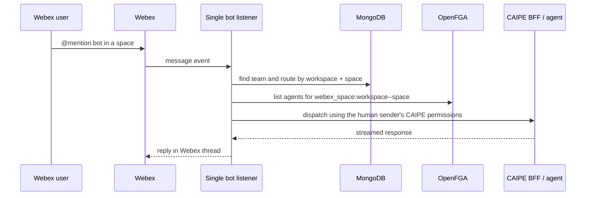
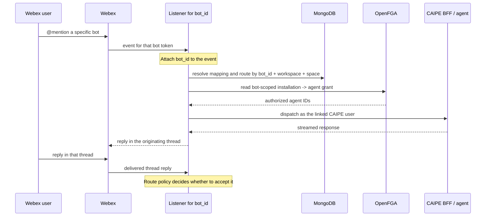

# Webex Bot Routing and Migration

This document defines the intended Webex bot architecture and the boundary
between legacy single-bot data and current multi-bot data. It is a normative
design note. A UI or runtime behavior that conflicts with these rules is a bug.

## Core Invariants

1. Every route in the new multi-bot architecture belongs to one explicit
   `bot_id`. Legacy single-bot routes have no `bot_id` until an admin migrates
   them.
2. A physical Webex space may be configured for more than one bot, but each
   bot has an independent route and authorization boundary.
3. The runtime never guesses which bot owns a legacy record.
4. Legacy and partially migrated records appear only in **Legacy migration**.
5. Only fully current records appear in **Configured spaces**.
6. OpenFGA decides whether a bot installation may dispatch to an agent. MongoDB
   stores the route behavior for that same bot installation.
7. A Mongo route without its matching OpenFGA grant is not repaired by silently
   deleting or reassigning it. It remains a migration or consistency problem
   requiring an explicit admin action.

## Webex Delivery Semantics

Webex group-space delivery is not equivalent to Slack channel delivery.

- A bot starts a group-space interaction when a user `@mentions` it.
- After the bot participates, Webex can deliver replies in that conversation
  thread to the bot.
- A bot cannot opt into arbitrary unmentioned messages elsewhere in the space.
- A routing setting cannot expand what the Webex platform delivers.

The existing route values are internal filters over events Webex has already
delivered:

| Stored value | Webex meaning |
|---|---|
| `mention` | Accept explicit `@mention` events. A later reply must mention the bot again. |
| `all` | Accept explicit `@mention` events and delivered replies in a thread where the bot is participating. It does not mean arbitrary plain space messages. |
| `message` | Accept delivered non-mention events. This is not a valid way to start an arbitrary group-space conversation. |

Webex UI copy must therefore never claim that `all` enables plain space
messages. It should describe `all` as **mentions and thread replies**. A normal
`mention` route is a valid policy, not a health failure.

## Legacy Single-Bot Architecture

The old deployment had one Webex bot token and no durable bot identity in the
routing key.

Legacy ownership was represented as follows:

| Store | Legacy key |
|---|---|
| `webex_space_team_mappings` | `workspace + space`, with no `bot_id` |
| `webex_space_agent_routes` | `workspace + space + agent`, with no `bot_id` |
| OpenFGA agent grant | `webex_space:<workspace>--<space> user agent:<agent_id>` |

That model was sufficient only because exactly one bot could consume the data.
Once multiple bot tokens share one runtime, the old records cannot identify
which physical bot they belong to.

## Current Multi-Bot Architecture

The deployment config contains an explicit bot catalog. One runtime pod starts
one listener per token, and every inbound event is tagged with the listener's
stable `bot_id` before routing begins.

### Current Storage

| Store | Current key or relationship |
|---|---|
| `webex_space_team_mappings` | `bot_id + workspace + space` |
| `webex_space_agent_routes` | `bot_id + workspace + space + agent` |
| `webex_direct_user_routes` | `bot_id + Keycloak user` |
| OpenFGA installation identity | `webex_bot:<bot_id> bot webex_bot_installation:<bot_id>--<workspace>--<space>` |
| OpenFGA physical-space link | `webex_space:<workspace>--<space> space webex_bot_installation:<bot_id>--<workspace>--<space>` |
| OpenFGA agent grant | `webex_bot_installation:<bot_id>--<workspace>--<space> user agent:<agent_id>` |

The physical `webex_space` object remains the boundary for team visibility and
space administration. The `webex_bot_installation` object is the boundary for
runtime agent dispatch. This prevents bot A from inheriting bot B's route in the
same physical space.

### Group-Space Flow

1. The listener identifies the bot from the token/client that received the
   event. The payload cannot choose or override `bot_id`.
2. The runtime resolves the team mapping using `bot_id + workspace + space`.
3. The runtime resolves the human Webex sender to the corresponding Keycloak
   identity and obtains the on-behalf-of token used for CAIPE authorization.
   The bot identity itself is never linked to a CAIPE user.
4. The runtime reads agent IDs granted to the exact bot installation in
   OpenFGA.
5. It loads Mongo route metadata for the same `bot_id + workspace + space`.
6. Only agents present in both the active OpenFGA set and active Mongo route set
   are eligible.
7. The route's Webex listen policy filters the delivered event.
8. The selected agent is invoked as the linked user, so normal user, team,
   agent, MCP, and tool authorization still applies.
9. The response is posted to the originating Webex thread.

### Direct-Message Flow

Direct messages do not use a group-space team mapping. In `allowlist` mode the
runtime resolves `bot_id + Keycloak user` in `webex_direct_user_routes`. A user
may be allowed for one bot and denied for another. A missing or disabled entry
is ignored without a bot response.

In `all_users` mode, the runtime admits any enabled deployment user. A missing
`webex_direct_user_routes` row inherits the selected bot's policy; an explicit
row may override the agent or deny that user. Agent resolution checks an
in-memory `use <agent>` override for the user and DM room, then the selected
bot's live `directMessages.defaultAgentId`.
Every candidate is checked against the linked user's complete OpenFGA access.
A matched team may be returned as audit context, but no team is configured or
stored on a direct-message route.

## Data States and UI Ownership

The UI must classify each physical space before rendering it.

| State | Definition | UI location |
|---|---|---|
| Legacy | A botless Mongo mapping, botless Mongo route, or physical-space OpenFGA agent grant exists. | Legacy migration only |
| Partial migration | A bot-scoped mapping exists but no active route exists for that same bot. | Legacy migration only |
| Current | The mapping and an active route are both scoped to the same explicit bot. | Configured spaces |

The presence of a bot-scoped team mapping alone does not make a space current.
This matters during interrupted migrations: a botless route must never be
borrowed by a bot-scoped mapping.

Consequently:

- **Configured spaces** requires both a bot-scoped mapping and an active route
  for the selected bot.
- **Legacy migration** is the only place that may enumerate, inspect, migrate,
  or delete old ownership data.
- Configured-space diagnostics report the effective listen mode. For example,
  a mention-only route warns that unrelated plain space messages will not start
  a dispatch.
- These warnings describe routing scope; they do not imply that Webex delivers
  every arbitrary plain message to the bot.

## Explicit Migration

Migration is admin-controlled because old records contain no historical bot
identity. The platform cannot safely infer the owner from catalog order, a
default bot, or whichever token happens to be present.

### Probe

**Probe legacy data** groups all old components by physical
`workspace + space` and shows:

- botless team mappings;
- botless agent routes;
- legacy `webex_space -> agent` OpenFGA grants; and
- enough identifiers and counts for an admin to verify the selection.

A coordinate remains a migration candidate while any legacy pieces remain.
Current pieces must not hide legacy data that still needs migration or deletion.

### Migrate

For each selected coordinate, the admin chooses the bot that historically owned
the data. Applying migration:

1. validates that the selected `bot_id` is configured;
2. stamps matching botless Mongo team mappings with that `bot_id`;
3. stamps matching botless Mongo agent routes with that `bot_id`;
4. writes the installation identity and physical-space link tuples;
5. writes one bot-installation-to-agent grant per legacy agent;
6. creates default `mention` route metadata only when an old OpenFGA grant had
   no corresponding Mongo route;
7. deletes the exact old physical-space-to-agent tuples; and
8. verifies that no legacy component remains before the space becomes visible
   under **Configured spaces**.

Existing route metadata, including priority and listen policy, is preserved.
Migration does not grant a different agent, choose a bot automatically, or
change direct-message allowlists.

### Delete

The admin may delete selected legacy coordinates instead of migrating them.
Deletion removes only the selected coordinate's botless mappings, botless
routes, and exact legacy OpenFGA agent grants. It must not delete current
bot-scoped records or another physical space's records.

### Failure Behavior

Migration must fail closed. If a required OpenFGA write or MongoDB update fails,
the coordinate remains in **Legacy migration**. It must not appear in
**Configured spaces** until its bot-scoped mapping and active route exist.

## Configured Spaces Contract

The normal **Configured spaces** tab shows fully current bot-scoped spaces,
their saved team and agent assignment, and the diagnostics behavior inherited
from the shared connector administration surface. Health and route warnings
are computed for the selected bot installation rather than for the physical
space across every bot.

Legacy and partially migrated records remain exclusively in **Legacy migration**
until an admin migrates or deletes them.
