# Sub-Agent Tool Message Streaming Analysis

## Overview

This document tracks the investigation and implementation of enhanced transparency for sub-agent tool messages in the CAIPE streaming architecture. The goal was to make detailed sub-agent tool executions visible to end users for better debugging and transparency.

## Problem Statement (RESOLVED)

Users were seeing:
- ❌ Only high-level supervisor notifications without agent context
- ❌ Duplicate content (full response appeared twice)
- ❌ Missing detailed sub-agent tool execution steps

After fixes, users now see:
- ✅ `🔧 Supervisor: Calling Argocd...`
- ✅ `🔧 Argocd: Calling tool: Version_Service__Version`
- ✅ `✅ Argocd: Tool Version_Service__Version completed`
- ✅ `✅ Supervisor: Argocd completed`
- ✅ No duplication - content streams once
- ✅ Clean formatting without markdown (**)

## Architecture Discovery

Through extensive debugging and live event capture from both supervisor (port 8000) and sub-agent (port 8001), we mapped the complete A2A event flow from sub-agents to end users:

```mermaid
flowchart TD
    %% End User Layer
    User["👤 End User<br/>curl :8000"] --> Supervisor["🎛️ Supervisor<br/>platform-engineer-p2p:8000"]
    
    %% Supervisor Streaming Handler
    Supervisor --> |"A2A Request<br/>POST /"| StreamHandler["🔄 Stream Handler<br/>agent.py"]
    StreamHandler --> |astream_events v2| LangGraph["🧠 LangGraph<br/>Deep Agent"]
    
    %% LangGraph Native Events
    LangGraph --> |on_chat_model_stream| TokenStream["📝 Token Streaming<br/>Execution Plan"]
    LangGraph --> |on_tool_start| ToolStartEvent["🔧 Tool Start<br/>name: argocd"]
    LangGraph --> |on_tool_end| ToolEndEvent["✅ Tool End<br/>name: argocd"]
    
    %% Supervisor A2A Event Generation
    ToolStartEvent --> SupervisorA2A1["📤 A2A: artifact-update<br/>name: tool_notification_start<br/>append: false"]
    ToolEndEvent --> SupervisorA2A2["📤 A2A: artifact-update<br/>name: tool_notification_end<br/>append: false"]
    TokenStream --> SupervisorA2A3["📤 A2A: artifact-update<br/>name: streaming_result<br/>append: true"]
    
    %% Sub-Agent Communication
    LangGraph --> |A2ARemoteAgentConnectTool| A2AClient["🔗 A2A Client<br/>a2a_remote_agent_connect.py"]
    A2AClient --> |"HTTP POST<br/>agent-argocd-p2p:8000"| SubAgent["🤖 Sub-Agent<br/>ArgoCD Agent:8000"]
    
    %% Sub-Agent A2A Event Generation
    SubAgent --> |"1. Initial Task"| SubA2ATask["📤 A2A: task<br/>kind: task<br/>status: submitted<br/>history: message array"]
    SubAgent --> |"2. Tool Start"| SubA2AStatus1["📤 A2A: status-update<br/>final: false<br/>state: working<br/>text: 🔧 Argocd: Calling tool: Version_Service__Version"]
    SubAgent --> |"3. Tool Complete"| SubA2AStatus2["📤 A2A: status-update<br/>final: false<br/>state: working<br/>text: ✅ Argocd: Tool Version_Service__Version completed"]
    SubAgent --> |"4. Response"| SubA2AStatus3["📤 A2A: status-update<br/>final: false<br/>state: working<br/>text: version details (NOT STREAMED)"]
    SubAgent --> |"5. Result"| SubA2AArtifact["📤 A2A: artifact-update<br/>lastChunk: true<br/>text: empty"]
    SubAgent --> |"6. Final"| SubA2AStatus4["📤 A2A: status-update<br/>final: true<br/>state: completed"]
    
    %% Status Processing in Supervisor's A2A Client (FILTERED)
    SubA2AStatus1 --> |"47 chars<br/>HAS 🔧"| StatusProcessor["⚙️ Supervisor Status Processor<br/>a2a_remote_agent_connect.py<br/>FILTERS by tool indicators"]
    SubA2AStatus2 --> |"49 chars<br/>HAS ✅"| StatusProcessor
    SubA2AStatus3 --> |"500+ chars<br/>NO INDICATOR<br/>⏭️ SKIPPED"| StatusSkipped["❌ Skipped<br/>Not a tool message"]
    
    %% Processing Actions in Supervisor
    StatusProcessor --> Accumulate["📥 Supervisor accumulates<br/>accumulated_text.append"]
    StatusProcessor --> StreamWrite["📤 Supervisor streams<br/>writer a2a_event"]
    StatusProcessor --> LogDebug["📝 Supervisor logs<br/>logger.info Streamed"]
    
    %% Custom Event Flow (NOW WORKING)
    StreamWrite --> |get_stream_writer| CustomEvent["🎨 Custom Event<br/>type: a2a_event<br/>data: text"]
    CustomEvent --> |✅ CAPTURED| SupervisorAstream["✅ Supervisor astream<br/>stream_mode: custom"]
    SupervisorAstream --> |"processes<br/>item_type: custom"| UserOutput["📺 User Output"]
    
    %% Accumulated text final return
    Accumulate --> |"final return<br/>tool result"| SupervisorA2A2
    
    %% Working Output Path
    SupervisorA2A1 --> |SSE| UserOutput
    SupervisorA2A2 --> |SSE| UserOutput
    SupervisorA2A3 --> |SSE| UserOutput
    
    %% Final SSE Stream
    UserOutput --> |"data: JSON<br/>Server-Sent Events"| StreamResponse["📡 SSE Response"]
    StreamResponse --> User
    
    %% Fallback Mode Not Triggered
    LangGraph -.-> |exception only| FallbackMode["🔄 Fallback Mode<br/>astream with custom events"]
    
    %% A2A Event Type Specifications
    subgraph A2AEventTypes ["A2A Event Types Captured"]
        direction TB
        Task["📋 task<br/>Initial request<br/>history and status"]
        StatusUpdate["📊 status-update<br/>Progress notifications<br/>message and final flag"]
        ArtifactUpdate["📦 artifact-update<br/>Content streaming<br/>parts and append flag"]
    end
    
    %% Supervisor Event Details
    subgraph SupervisorEvents ["Supervisor A2A Events Port 8000"]
        direction TB
        SE1["task - state submitted"]
        SE2["artifact-update - tool_notification_start<br/>🔧 Supervisor: Calling Argocd..."]
        SE3["artifact-update - tool_notification_start<br/>🔧 Argocd: Calling tool: Version_Service__Version"]
        SE4["artifact-update - tool_notification_end<br/>✅ Argocd: Tool Version_Service__Version completed"]
        SE5["artifact-update - tool_notification_end<br/>✅ Supervisor: Argocd completed"]
        SE6["artifact-update - streaming_result<br/>append true token by token"]
    end
    
    %% Sub-Agent Event Details
    subgraph SubAgentEvents ["Sub-Agent A2A Events Port 8001"]
        direction TB
        SA1["task - state submitted"]
        SA2["status-update - final false<br/>🔧 Argocd: Calling tool: Version_Service__Version<br/>✅ STREAMED"]
        SA3["status-update - final false<br/>✅ Argocd: Tool Version_Service__Version completed<br/>✅ STREAMED"]
        SA4["status-update - final false<br/>Full version response 500+ chars<br/>❌ FILTERED - Not streamed"]
        SA5["artifact-update - lastChunk true<br/>empty text result"]
        SA6["status-update - final true<br/>state completed"]
    end
    
    %% What User Sees
    subgraph UserExperience ["What User Sees - AFTER FIX (No Duplication)"]
        direction LR
        UE1["✅ Execution Plan ⟦⟧"]
        UE2["✅ 🔧 Supervisor: Calling Argocd..."]
        UE3["✅ 🔧 Argocd: Calling tool: Version_Service__Version"]
        UE4["✅ ✅ Argocd: Tool Version_Service__Version completed"]
        UE5["✅ ✅ Supervisor: Argocd completed"]
        UE6["✅ Token-by-token streaming (once)"]
        UE7["✅ Final version response"]
    end
    
    %% Styling
    classDef working fill:#d4edda,stroke:#155724,color:#155724,stroke-width:2px
    classDef broken fill:#f8d7da,stroke:#721c24,color:#721c24,stroke-width:2px
    classDef processing fill:#fff3cd,stroke:#856404,color:#856404
    classDef a2aEvent fill:#e7f3ff,stroke:#0066cc,color:#003d7a,stroke-width:2px
    classDef subagent fill:#f0e6ff,stroke:#6600cc,color:#4d0099
    
    class SupervisorA2A1,SupervisorA2A2,SupervisorA2A3,UE1,UE2,UE3,UE4,UE5,UE6,UE7,CustomEvent,SupervisorAstream working
    class StatusProcessor,Accumulate,StreamWrite,LogDebug processing
    class SubA2ATask,SubA2AStatus1,SubA2AStatus2,SubA2AStatus3,SubA2AArtifact,SubA2AStatus4 a2aEvent
    class SubAgent,Task,StatusUpdate,ArtifactUpdate subagent
    class StatusSkipped broken
```



## A2A Event Types Reference

Based on live event capture from both supervisor (:8000) and sub-agent (:8001), here are the three main A2A event types used in the streaming architecture:

### 1. `task` Event
**Purpose:** Initial request submission and task creation

**Structure:**
```json
{
  "id": "subagent-events",
  "jsonrpc": "2.0",
  "result": {
    "contextId": "2754658e-fff7-4d47-9951-e1ad0b817a46",
    "history": [{
      "contextId": "2754658e-fff7-4d47-9951-e1ad0b817a46",
      "kind": "message",
      "messageId": "msg-subagent-events",
      "parts": [{"kind": "text", "text": "show version"}],
      "role": "user",
      "taskId": "ca89f822-cc4d-475e-a4ee-18829c696b31"
    }],
    "id": "ca89f822-cc4d-475e-a4ee-18829c696b31",
    "kind": "task",
    "status": {"state": "submitted"}
  }
}
```

**Key Properties:**
- `kind`: Always "task"
- `status.state`: "submitted" → "working" → "completed"
- `history`: Array of message objects showing conversation context
- `taskId`: Unique identifier for tracking this specific task

### 2. `status-update` Event
**Purpose:** Progress notifications and detailed status messages from sub-agents

**Structure:**
```json
{
  "id": "subagent-events",
  "jsonrpc": "2.0",
  "result": {
    "contextId": "2754658e-fff7-4d47-9951-e1ad0b817a46",
    "final": false,
    "kind": "status-update",
    "status": {
      "message": {
        "contextId": "2754658e-fff7-4d47-9951-e1ad0b817a46",
        "kind": "message",
        "messageId": "a47eaa07-0097-4821-9efc-887fcc063238",
        "parts": [{"kind": "text", "text": "🔧 Calling tool: **version_service__version**\n"}],
        "role": "agent",
        "taskId": "ca89f822-cc4d-475e-a4ee-18829c696b31"
      },
      "state": "working"
    },
    "taskId": "ca89f822-cc4d-475e-a4ee-18829c696b31"
  }
}
```

**Key Properties:**
- `kind`: Always "status-update"
- `final`: `false` for intermediate updates, `true` for completion
- `status.message.parts[].text`: Contains the actual status message (e.g., "🔧 Calling tool: **version_service__version**")
- `status.state`: "working" during execution, "completed" when final

**Sub-Agent Usage Pattern:**
1. **Tool Start:** `final: false`, text: "🔧 Calling tool: **tool_name**"
2. **Tool Complete:** `final: false`, text: "✅ Tool **tool_name** completed"
3. **Response:** `final: false`, text: Full response content
4. **Completion:** `final: true`, state: "completed", no message

### 3. `artifact-update` Event
**Purpose:** Content streaming and result delivery

**Structure:**
```json
{
  "id": "supervisor-events",
  "jsonrpc": "2.0",
  "result": {
    "append": false,
    "artifact": {
      "artifactId": "8dee27df-e31f-4f47-a9b0-bb51c8df1b94",
      "description": "Tool call started: argocd",
      "name": "tool_notification_start",
      "parts": [{"kind": "text", "text": "\n🔧 Calling argocd...\n"}]
    },
    "contextId": "56b93a29-648e-44a0-bad0-cf691c20e660",
    "kind": "artifact-update",
    "lastChunk": false,
    "taskId": "d68188a5-a8ed-4822-abec-9fd174af40d0"
  }
}
```

**Key Properties:**
- `kind`: Always "artifact-update"
- `append`: `false` for new artifact, `true` for appending to existing
- `artifact.name`: Purpose identifier
  - Supervisor: "tool_notification_start", "tool_notification_end", "streaming_result"
  - Sub-Agent: "current_result"
- `lastChunk`: `true` indicates final artifact chunk
- `artifact.parts[].text`: Contains the actual content

**Supervisor Usage Pattern:**
1. **Tool Start:** `name: "tool_notification_start"`, append: false, text: "🔧 Calling argocd..."
2. **Token Streaming:** `name: "streaming_result"`, append: true, text: individual tokens
3. **Tool End:** `name: "tool_notification_end"`, append: false, text: "✅ argocd completed"

**Sub-Agent Usage Pattern:**
1. **Empty Result:** `name: "current_result"`, lastChunk: true, text: "" (signals end of response)

## A2A Protocol Communication Flow

### Two Distinct Processes

This architecture involves **two separate processes** running different codebases:

1. **Supervisor Agent (port 8000)**
   - **Codebase:** `platform-engineer-p2p` service
   - **Role:** Orchestrates sub-agents, processes end-user requests
   - **Key Files:**
     - `ai_platform_engineering/multi_agents/platform_engineer/protocol_bindings/a2a/agent.py`
     - `ai_platform_engineering/utils/a2a_common/a2a_remote_agent_connect.py`

2. **Sub-Agent (port 8001)**
   - **Codebase:** `agent-argocd-p2p` service (example)
   - **Role:** Executes specific domain tools, generates detailed status updates
   - **Key Files:**
     - `ai_platform_engineering/utils/a2a_common/base_strands_agent.py`

### Protocol Overview

The **Agent-to-Agent (A2A)** protocol is the communication standard used by CAIPE for real-time streaming between agents. It operates over HTTP with Server-Sent Events (SSE) and follows a JSON-RPC 2.0 structure.

### Supervisor → Sub-Agent Communication

When the supervisor needs to call a sub-agent:

1. **HTTP POST Request** sent to sub-agent endpoint (e.g., `http://agent-argocd-p2p:8000`)
2. **A2A Request Format:**
```json
{
  "id": "request-id",
  "method": "message/stream",
  "params": {
    "message": {
      "role": "user",
      "parts": [{"kind": "text", "text": "show version"}],
      "messageId": "unique-msg-id"
    }
  }
}
```

3. **Sub-Agent Response:** Streamed as SSE with JSON-RPC 2.0 responses

### Event Flow Timeline

Based on live capture from ArgoCD sub-agent request:

| # | Time | Event Type | Purpose | Text Content |
|---|------|------------|---------|--------------|
| 1 | T+0ms | `task` | Initialize | state: "submitted" |
| 2 | T+500ms | `status-update` | Tool start | "🔧 Calling tool: **version_service__version**" |
| 3 | T+800ms | `status-update` | Tool complete | "✅ Tool **version_service__version** completed" |
| 4 | T+1000ms | `status-update` | Response | Full version details (500+ chars) |
| 5 | T+1200ms | `artifact-update` | Result marker | Empty string, lastChunk: true |
| 6 | T+1250ms | `status-update` | Completion | final: true, state: "completed" |

### A2A Client Processing (Supervisor Agent)

**Location:** Supervisor Agent codebase  
**File:** `ai_platform_engineering/utils/a2a_common/a2a_remote_agent_connect.py`  
**Method:** `_arun` (lines 239-252)

This code runs in the **Supervisor Agent** and processes events received FROM Sub-Agents:

```python
# Processing status-update events from Sub-Agent
if kind == "status-update":
    status = result.get('status')
    if status and isinstance(status, dict):
        message = status.get('message', {})
        parts = message.get('parts', [])
        if parts:
            text = parts[0].get('text', '')
            if text:
                accumulated_text.append(text)  # For final return
                writer({"type": "a2a_event", "data": text})  # For streaming
                logger.info(f"✅ Streamed + accumulated: {len(text)} chars")
```

### Supervisor Event Processing (Supervisor Agent)

**Location:** Supervisor Agent codebase  
**File:** `ai_platform_engineering/multi_agents/platform_engineer/protocol_bindings/a2a/agent.py`  
**Method:** `stream` (astream_events loop, lines 107-153)

**Native LangGraph Events (Working):**
- `on_tool_start` → Generates `artifact-update` with "tool_notification_start"
- `on_chat_model_stream` → Generates `artifact-update` with "streaming_result"
- `on_tool_end` → Generates `artifact-update` with "tool_notification_end"

**Custom Events (Not Working in Primary Mode):**
- `on_custom` → Should process `{"type": "a2a_event"}` from sub-agents
- **Issue:** Primary `astream_events` mode ignores custom events
- **Only works in fallback `astream` mode**

### A2A Response Format to End User

All events are wrapped in Server-Sent Events (SSE) format:

```
data: {"id":"supervisor-events","jsonrpc":"2.0","result":{...}}

data: {"id":"supervisor-events","jsonrpc":"2.0","result":{...}}
```

Each `result` object contains one of the three A2A event types described above.

## Key Technical Discoveries

### 1. LangGraph Streaming Architecture Limitation

**Critical Finding:** LangGraph has two streaming modes with different event handling capabilities:

- **`astream_events` (primary):** Handles native LangGraph events (`on_tool_start`, `on_chat_model_stream`, `on_tool_end`)
- **`astream` (fallback):** Handles custom events from `get_stream_writer()`

**The Issue:** Custom events generated by `get_stream_writer()` are **not processed** by `astream_events`, even though they are successfully generated and logged.

### 2. Event Processing Pipeline

The complete event processing pipeline:

```
Sub-Agent → Status-Update Events → A2A Client → Stream Writer → Custom Events → [DROPPED] → User
                                                                                     ↓
Supervisor → LangGraph Events → astream_events → Tool Notifications → [SUCCESS] → User
```

### 3. Working vs Non-Working Events

**✅ Working (Visible to User):**
- Execution plans with `⟦⟧` markers
- Supervisor tool notifications: `🔧 Calling argocd...`
- Supervisor completion notifications: `✅ argocd completed`

**❌ Not Working (Captured but Not Visible):**
- Sub-agent tool details: `🔧 Calling tool: **version_service__version**`
- Sub-agent completions: `✅ Tool **version_service__version** completed`
- Detailed sub-agent responses (captured and accumulated but not streamed to user)

## Implementation Changes Made

### 1. Removed Status-Update Filtering

**File:** `ai_platform_engineering/utils/a2a_common/a2a_remote_agent_connect.py`

**Before:**
```python
if text and not text.startswith(('🔧', '✅', '❌', '🔍')):
    accumulated_text.append(text)
    logger.debug(f"✅ Accumulated text from status-update: {len(text)} chars")
```

**After:**
```python
if text:
    accumulated_text.append(text)
    # Stream status-update text immediately for real-time display
    writer({"type": "a2a_event", "data": text})
    logger.info(f"✅ Streamed + accumulated text from status-update: {len(text)} chars")
```

**Impact:** All sub-agent tool messages are now captured and attempted to be streamed.

### 2. Enhanced Error Handling

**File:** `ai_platform_engineering/multi_agents/platform_engineer/protocol_bindings/a2a/agent.py`

**Added:**
```python
import asyncio

# In main streaming loop
except asyncio.CancelledError:
    logging.info("Primary stream cancelled by client disconnection")
    return

# In fallback streaming loop  
except asyncio.CancelledError:
    logging.info("Fallback stream cancelled by client disconnection")
    return
```

**Impact:** Graceful handling of client disconnections without server-side errors.

### 3. Custom Event Handler (Attempted)

**File:** `ai_platform_engineering/multi_agents/platform_engineer/protocol_bindings/a2a/agent.py`

**Added:**
```python
# Handle custom events from sub-agents (like detailed tool messages)
elif event_type == "on_custom":
    custom_data = event.get("data", {})
    if isinstance(custom_data, dict) and custom_data.get("type") == "a2a_event":
        custom_text = custom_data.get("data", "")
        if custom_text:
            logging.info(f"Processing custom a2a_event: {len(custom_text)} chars")
            yield {
                "is_task_complete": False,
                "require_user_input": False,
                "content": custom_text,
                "custom_event": {
                    "type": "sub_agent_detail",
                    "source": "a2a_tool"
                }
            }
```

**Impact:** This handler was added but never triggered due to LangGraph's architecture limitations.

### 4. Logging Enhancement

**Changed:** Debug-level logs to INFO-level for better visibility during debugging.

**Impact:** Confirmed that status-update events are being processed correctly:
```
✅ Streamed + accumulated text from status-update: 45 chars
✅ Streamed + accumulated text from status-update: 46 chars  
✅ Streamed + accumulated text from status-update: 400+ chars
```

## Current Status

### ✅ Successfully Implemented
1. **Transparent status-update processing** - All sub-agent messages are captured and processed
2. **Real-time streaming infrastructure** - Events are immediately passed to stream writer
3. **Robust error handling** - Client disconnections handled gracefully
4. **Enhanced logging** - Full visibility into event processing pipeline
5. **Comprehensive architecture mapping** - Complete understanding of event flow

### ❌ Architectural Limitation
- **Custom events not displayed:** Due to LangGraph's `astream_events` mode not processing custom events from `get_stream_writer()`
- **Sub-agent tool details not visible:** Users still don't see detailed tool execution steps

### 📊 Current User Experience

**What Users See:**
```
⟦🎯 Execution Plan: Retrieve ArgoCD Version Information⟧
🔧 Calling argocd...
✅ argocd completed
[Final response with version details]
```

**What Users Don't See (but is captured):**
```
🔧 Calling tool: **version_service__version**
✅ Tool **version_service__version** completed
```

## Possible Solutions

### Option 1: Force Fallback Mode
Modify the supervisor to use `astream` instead of `astream_events` to enable custom event processing.

**Pros:** Would display detailed sub-agent tool messages
**Cons:** Might lose token-level streaming capabilities

### Option 2: Enhanced Supervisor Notifications
Add more detailed information to supervisor-level tool notifications using available metadata.

**Pros:** Works within current architecture
**Cons:** Limited detail compared to actual sub-agent messages

### Option 3: Hybrid Approach
Use both streaming modes or implement custom event bridging.

**Pros:** Best of both worlds
**Cons:** Increased complexity

## Files Modified

- `ai_platform_engineering/utils/a2a_common/a2a_remote_agent_connect.py`
- `ai_platform_engineering/multi_agents/platform_engineer/protocol_bindings/a2a/agent.py`

## Testing Validation

### Test Command
```bash
curl -X POST http://10.99.255.178:8000 \
  -H "Content-Type: application/json" \
  -H "Accept: text/event-stream" \
  -d '{"id":"test","method":"message/stream","params":{"message":{"role":"user","parts":[{"kind":"text","text":"show argocd version"}],"messageId":"msg-test"}}}'
```

### Log Validation
```bash
docker logs platform-engineer-p2p --since=2m | grep -E "(Streamed.*accumulated|Processing.*custom)"
```

**Expected Output:**
```
✅ Streamed + accumulated text from status-update: 45 chars
✅ Streamed + accumulated text from status-update: 46 chars
✅ Streamed + accumulated text from status-update: 400+ chars
```

## Next Steps

1. **Decision on solution approach** - Choose between forcing fallback mode, enhancing supervisor notifications, or hybrid approach
2. **Implementation** - Based on chosen solution
3. **Testing** - Validate that detailed tool messages reach end users
4. **Documentation updates** - Update this diagram as changes are implemented

---

**Last Updated:** 2025-10-25  
**Status:** Infrastructure Complete - Architecture Limitation Identified  
**Next Action Required:** Choose solution approach for displaying sub-agent tool details
