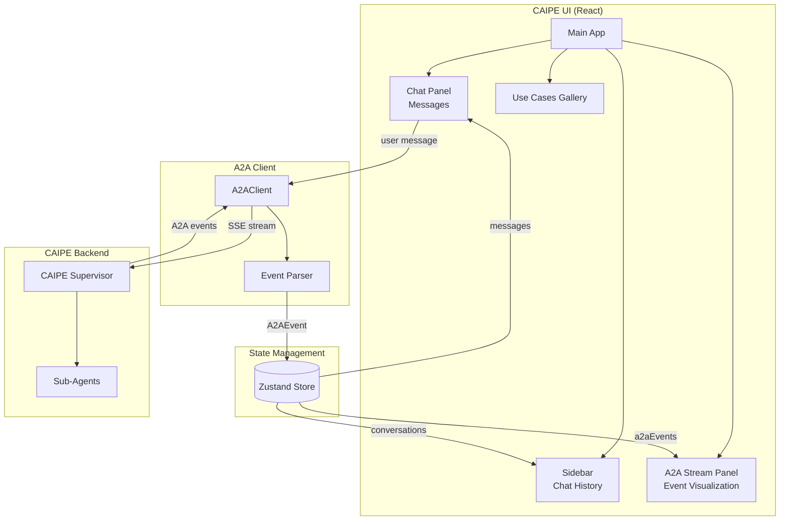
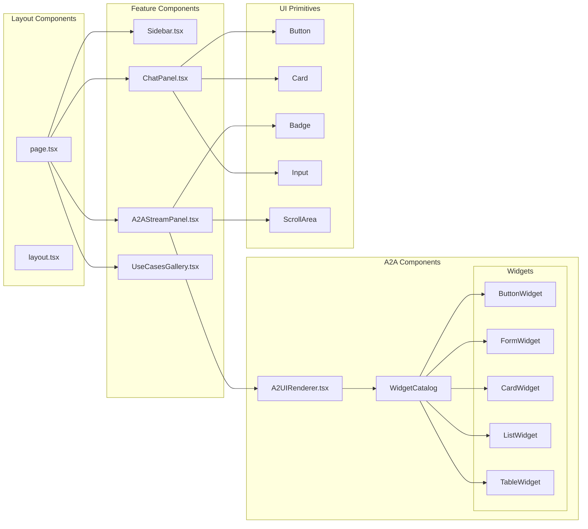
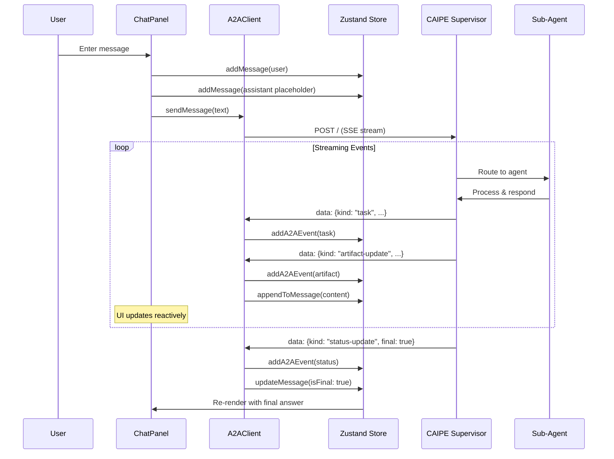
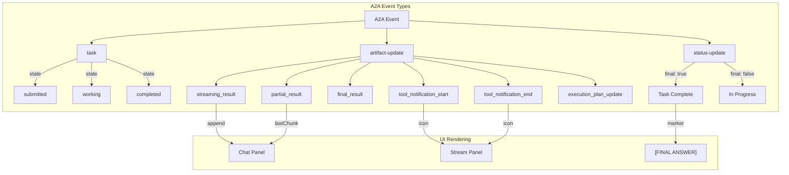
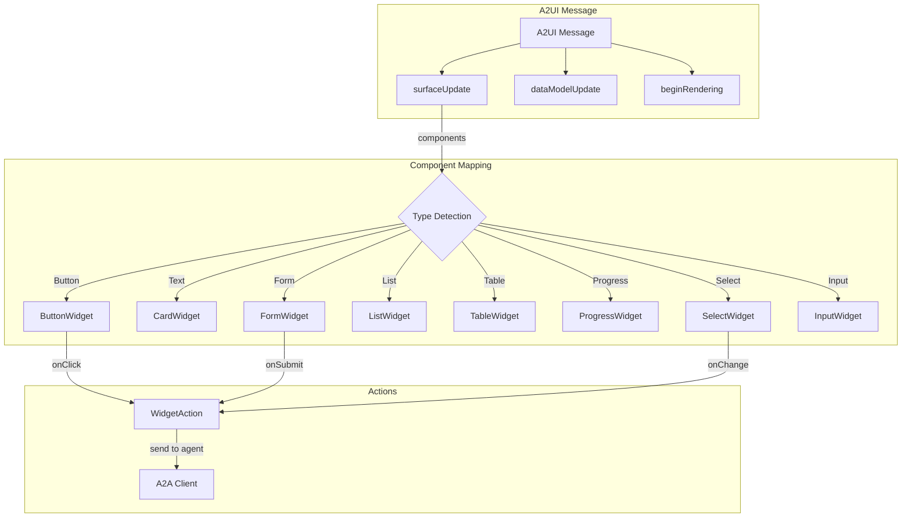
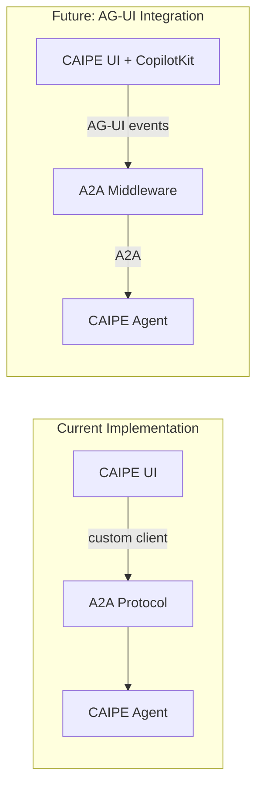

# ADR: CAIPE UI Architecture and Technology Decisions

| Field | Value |
|-------|-------|
| **Date** | 2026-01-16 |
| **Status** | 🟢 Implemented |
| **Author** | AI Platform Engineering Team |
| **Related Issues** | N/A |

## Context

The CAIPE (Community AI Platform Engineering) platform needed a modern web UI to visualize A2A (Agent-to-Agent) protocol messages in real-time. The UI needed to support:

1. **3-panel layout**: Chat history, main chat interface, and A2A message stream visualization
2. **A2A protocol compliance**: Full support for the A2A specification events
3. **Widget support**: Declarative UI components for agent-generated interfaces
4. **Use cases gallery**: Pre-built scenarios inspired by [AG-UI Dojo](https://dojo.ag-ui.com)

## Protocol Landscape

Understanding the three prominent agentic protocols is crucial for this architecture:

```mermaid
graph LR
    subgraph "Agentic Protocol Stack"
        AGUI["AG-UI<br/>(Agent↔User)"]
        A2A["A2A<br/>(Agent↔Agent)"]
        A2UI["A2UI<br/>(Generative UI)"]
        MCP["MCP<br/>(Tools & Data)"]
    end

    User[👤 User] --> AGUI
    AGUI --> |"events"| Agent[🤖 Agent]
    Agent --> A2A
    A2A --> |"coordination"| SubAgent[🤖 Sub-Agent]
    Agent --> MCP
    MCP --> |"tools"| Tools[🔧 Tools]
    Agent --> |"UI widgets"| A2UI
    A2UI --> |"render"| AGUI
```



| Layer | Protocol | Purpose | Origin |
|-------|----------|---------|--------|
| **Agent ↔ User** | [AG-UI](https://docs.ag-ui.com/introduction) | Event-based protocol connecting agents to user-facing applications | CopilotKit |
| **Agent ↔ Agent** | [A2A](https://a2a-protocol.org/) | How agents coordinate and share work across distributed systems | Google |
| **Agent → UI** | [A2UI](https://a2ui.org/) | Declarative specification for agents to deliver UI widgets | Google |
| **Agent ↔ Tools** | [MCP](https://modelcontextprotocol.io/) | Securely connect to external systems, tools, and data sources | Anthropic |

> **Key Insight**: AG-UI and A2UI are **complementary**, not competing. AG-UI is the transport layer (how events flow), while A2UI is the UI specification (what widgets to render). See [AG-UI docs on MCP, A2A, and AG-UI](https://docs.ag-ui.com/concepts/mcp-a2a-and-ag-ui).

## Technologies Evaluated

### 1. CopilotKit + AG-UI

**What it is**: [CopilotKit](https://docs.copilotkit.ai/) is a framework for building AI copilots with React. AG-UI is its underlying event protocol.

**Evaluation**:
- ✅ Excellent React integration with `@copilotkit/react-core` and `@copilotkit/react-ui`
- ✅ Built-in AG-UI event streaming (TEXT_MESSAGE_CONTENT, TOOL_CALL, STATE_DELTA)
- ✅ Human-in-the-loop patterns with interrupts
- ✅ Partnerships with LangGraph, CrewAI, Google ADK, AWS Strands
- ✅ [AG-UI Dojo](https://dojo.ag-ui.com) provides excellent demos
- ⚠️ Tightly coupled to CopilotKit's runtime/backend architecture
- ⚠️ Would require adapting our A2A protocol to AG-UI's message format
- ⚠️ Additional abstraction layer between UI and native A2A endpoints

**Decision**: **Inspired by, but not directly integrated**

We adopted CopilotKit/AG-UI architectural patterns (event streaming, state management, component structure) but implemented custom components to maintain direct A2A protocol compliance without an adapter layer.

**Future**: Consider adding [A2A Middleware for AG-UI](https://docs.copilotkit.ai/a2a-protocol) when stable.

### 2. A2UI (Agent-to-User Interface)

**What it is**: [A2UI](https://a2ui.org/) is Google's declarative UI specification (v0.8 stable) that allows agents to return JSON-defined UI components.

**Evaluation**:
- ✅ Declarative, JSON-based UI specification
- ✅ Platform-agnostic (web, mobile, desktop)
- ✅ Supports streaming updates via `surfaceUpdate`, `dataModelUpdate`, `beginRendering`
- ✅ Rich component catalog (Button, Form, List, Table, Chart, Map, etc.)
- ✅ [A2UI Composer](https://a2ui-composer.ag-ui.com) for building/testing
- ⚠️ Still evolving specification (v0.8)
- ⚠️ No official React renderer library (reference implementations available)

**Decision**: **Partially implemented**

We implemented an A2UI-compatible renderer (`A2UIRenderer.tsx`) and widget catalog that can parse A2UI messages and render them as React components. This enables future compatibility with agents that emit A2UI-formatted responses.

### 3. AG-UI Event Protocol

**What it is**: [AG-UI](https://docs.ag-ui.com/introduction) is an open, lightweight, event-based protocol that standardizes how AI agents connect to user-facing applications.

**Key AG-UI Capabilities** (from [docs](https://docs.ag-ui.com/introduction)):
- Streaming chat with cancel/resume
- Multimodality (files, images, audio)
- Generative UI (static and declarative)
- Shared state (read-only & read-write)
- Thinking steps visualization
- Frontend tool calls
- Interrupts (human-in-the-loop)
- Sub-agents and composition
- Custom events

**Evaluation**:
- ✅ Designed for real-time agent-UI communication
- ✅ Supports all streaming patterns we need
- ✅ Compatible with A2A via [A2A Middleware](https://docs.copilotkit.ai/a2a-protocol)
- ✅ SDKs available (TypeScript, Python, Go, Kotlin, Java, Rust, Dart)
- ⚠️ Primary implementation through CopilotKit ecosystem

**Decision**: **Patterns adopted, direct integration planned**

We adopted AG-UI's event-driven architecture patterns in our A2A client and stream visualization. Native AG-UI integration via the A2A Middleware is planned for future iterations.

## Decision

### What We Built

We built a **custom React application** that:

1. **Directly implements A2A protocol** - No abstraction layers between UI and A2A endpoints
2. **Includes A2UI-compatible widget rendering** - Future-proof for A2UI-formatted agent responses
3. **Adopts patterns from CopilotKit and AG-UI** - Best practices without tight coupling
4. **Uses modern React ecosystem** - Next.js 15, React 19, Zustand, Framer Motion

### Technology Stack

| Layer | Technology | Rationale |
|-------|-----------|-----------|
| **Framework** | Next.js 15 (App Router) | Server components, streaming, standalone builds |
| **UI Library** | React 19 | Latest features, concurrent rendering |
| **Styling** | Tailwind CSS + Radix UI | Utility-first CSS with accessible primitives |
| **State** | Zustand | Lightweight, TypeScript-first state management |
| **Animations** | Framer Motion | Declarative animations for streaming UX |
| **Markdown** | react-markdown + remark-gfm | Rich text rendering for agent responses |
| **Syntax Highlighting** | react-syntax-highlighter | Code block formatting |

### Why Not Direct CopilotKit Integration?

```
┌─────────────────────────────────────────────────────────────────┐
│                      With CopilotKit                            │
├─────────────────────────────────────────────────────────────────┤
│                                                                 │
│   Browser ──► CopilotKit React ──► CopilotKit Runtime ──► LLM  │
│                     │                      │                    │
│                     └──────────────────────┘                    │
│                          (Abstraction)                          │
│                                                                 │
│   Problem: A2A protocol needs to bypass CopilotKit Runtime      │
│                                                                 │
└─────────────────────────────────────────────────────────────────┘

┌─────────────────────────────────────────────────────────────────┐
│                      Our Implementation                         │
├─────────────────────────────────────────────────────────────────┤
│                                                                 │
│   Browser ──► Custom React App ──► A2A Protocol ──► CAIPE Agent │
│                     │                    │                      │
│                     └────────────────────┘                      │
│                      (Direct Connection)                        │
│                                                                 │
│   Benefit: Full control over A2A message handling               │
│                                                                 │
└─────────────────────────────────────────────────────────────────┘
```

## Architecture

### High-Level Architecture



### Component Architecture



### A2A Message Flow



### A2A Event Types Handled



### Widget Catalog (A2UI Support)



## Consequences

### Positive

1. **Full A2A Protocol Control**: Direct implementation means we handle every event type exactly as needed
2. **No Vendor Lock-in**: Not dependent on CopilotKit's roadmap or breaking changes
3. **Future A2UI Compatibility**: Widget catalog ready for A2UI-formatted responses when agents support it
4. **Lightweight**: Only includes dependencies we actually use (~1100 packages vs potential 2000+)
5. **Customizable**: Every component can be modified without fighting framework abstractions

### Negative

1. **More Code to Maintain**: Custom A2A client instead of using a library
2. **No CopilotKit Ecosystem**: Can't use CopilotKit plugins or community extensions
3. **Manual A2UI Updates**: Need to update widget catalog manually as A2UI spec evolves

### Neutral

1. **Similar Patterns**: Code structure follows CopilotKit patterns, making future migration possible
2. **AG-UI Alignment**: Event handling aligns with AG-UI concepts for conceptual compatibility

## File Structure

```
ui/
├── src/
│   ├── app/                      # Next.js App Router
│   │   ├── globals.css           # Tailwind + custom A2A theme
│   │   ├── layout.tsx            # Root layout
│   │   └── page.tsx              # 3-panel main page
│   │
│   ├── components/
│   │   ├── a2a/                  # A2A-specific components
│   │   │   ├── A2AStreamPanel.tsx    # Event stream visualization
│   │   │   ├── A2UIRenderer.tsx      # A2UI message renderer
│   │   │   └── widgets/              # A2UI widget implementations
│   │   │       └── index.tsx         # Button, Form, Card, List, etc.
│   │   │
│   │   ├── chat/
│   │   │   └── ChatPanel.tsx     # Chat interface with markdown
│   │   │
│   │   ├── gallery/
│   │   │   └── UseCasesGallery.tsx   # Use cases (inspired by AG-UI)
│   │   │
│   │   ├── layout/
│   │   │   └── Sidebar.tsx       # Navigation + history
│   │   │
│   │   └── ui/                   # Shared primitives (shadcn/ui style)
│   │
│   ├── lib/
│   │   ├── a2a-client.ts         # A2A SSE client (custom)
│   │   └── utils.ts              # Helpers, [FINAL ANSWER] extraction
│   │
│   ├── store/
│   │   └── chat-store.ts         # Zustand state management
│   │
│   └── types/
│       └── a2a.ts                # A2A protocol TypeScript types
│
├── Dockerfile                    # Production multi-stage build
├── package.json
└── README.md
```

## Future: Native AG-UI Integration

AG-UI provides an [A2A Middleware](https://docs.copilotkit.ai/a2a-protocol) that bridges A2A agents to AG-UI clients. This is the recommended path for full CopilotKit ecosystem integration.



### AG-UI Integration Roadmap

| Phase | Feature | Status |
|-------|---------|--------|
| **Phase 1** | Custom A2A client with AG-UI patterns | ✅ Complete |
| **Phase 2** | A2UI widget catalog compatible | ✅ Complete |
| **Phase 3** | Native AG-UI client via A2A Middleware | 🟡 Planned |
| **Phase 4** | Full CopilotKit integration | 🟡 Planned |
| **Phase 5** | Human-in-the-loop interrupts | 🟡 Planned |

### Resources for AG-UI Integration

- [AG-UI Dojo](https://dojo.ag-ui.com) - Live demos of AG-UI features
- [A2A Middleware Docs](https://docs.copilotkit.ai/a2a-protocol) - Bridge A2A to AG-UI
- [AG-UI Events Reference](https://docs.ag-ui.com/concepts/events) - Event types and payload formats
- [A2UI Composer](https://a2ui-composer.ag-ui.com) - Build and test A2UI widgets

## References

- [A2A Protocol Specification](https://github.com/google/A2A) - Agent-to-Agent protocol
- [A2UI Specification v0.8](https://a2ui.org/specification/v0.8-a2ui/) - Declarative UI spec
- [AG-UI Documentation](https://docs.ag-ui.com/introduction) - Agent-User Interaction protocol
- [CopilotKit Documentation](https://docs.copilotkit.ai/) - AI Copilot framework
- [AG-UI Dojo](https://dojo.ag-ui.com) - Interactive demos
- [A2UI Composer](https://a2ui-composer.ag-ui.com) - Widget builder

## Appendix: Technology Comparison Matrix

| Feature | CopilotKit | A2UI | AG-UI | Our Implementation |
|---------|------------|------|-------|-------------------|
| React Integration | Native | Manual | Via CopilotKit | Native |
| A2A Protocol | Via adapter | N/A | Via adapter | Direct |
| Streaming Support | Built-in | Spec only | Built-in | Custom SSE |
| Widget Catalog | Limited | Extensive | Limited | Custom (8 types) |
| State Management | Built-in | N/A | Built-in | Zustand |
| Vendor Lock-in | High | None | Medium | None |
| Bundle Size | ~500KB | N/A | ~300KB | ~200KB |
| Customization | Limited | Full | Limited | Full |

---

**Signed-off-by**: AI Platform Engineering Team
