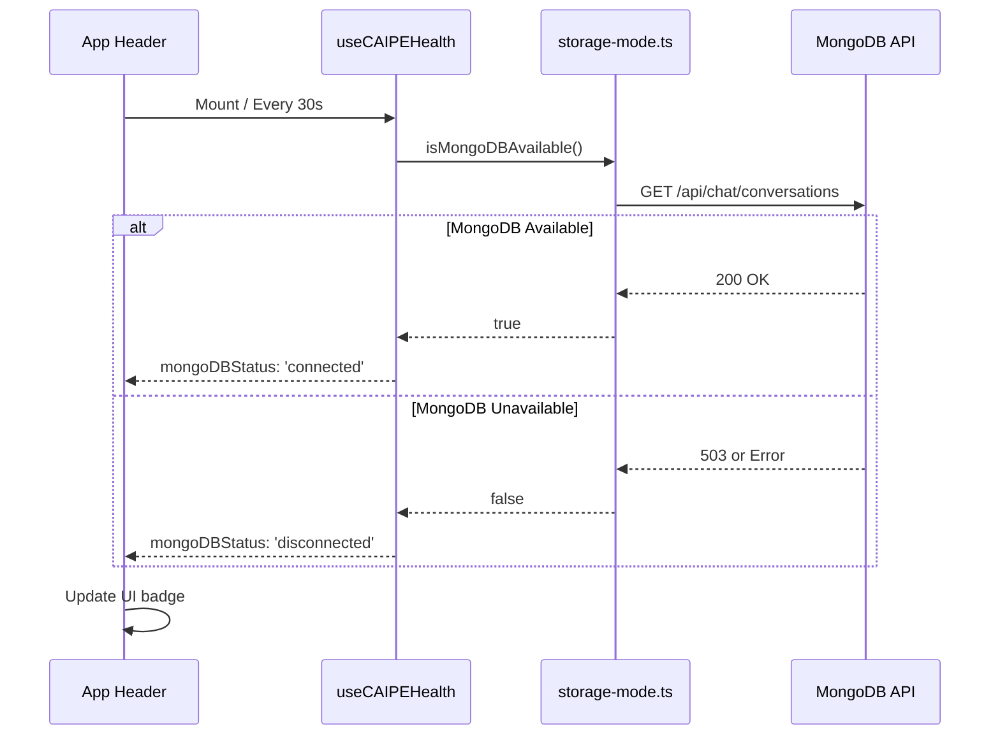

# MongoDB Health Status Integration

MongoDB status has been added to the CAIPE Health indicator in the header!

## What Changed

### 1. Health Hook Enhanced (`ui/src/hooks/use-caipe-health.ts`)

Added MongoDB status checking to the existing health check:

```typescript
interface UseCAIPEHealthResult {
  status: HealthStatus;
  url: string;
  // ... existing fields ...
  
  // NEW: MongoDB status fields
  mongoDBStatus: 'connected' | 'disconnected' | 'checking';
  storageMode: 'mongodb' | 'localStorage' | null;
}
```

**Check Frequency**: Every 30 seconds (same as CAIPE supervisor health check)

### 2. Header UI Updated (`ui/src/components/layout/AppHeader.tsx`)

Added a new "Storage Backend" section to the health popover showing:
- MongoDB connection status (green = connected, amber = disconnected)
- Storage mode (MongoDB or localStorage)
- Descriptive text about the storage mode

## Visual Preview

### Health Button (Header)

**Before**: Only showed CAIPE supervisor status
```
┌──────────────────┐
│ • Connected      │
└──────────────────┘
```

**After**: Same button, but click reveals MongoDB status in popover

### Health Popover (Expanded)

**With MongoDB Connected**:
```
┌────────────────────────────────────┐
│ CAIPE Supervisor                   │
│ http://localhost:8000              │
├────────────────────────────────────┤
│                                    │
│ 🤖 Platform Engineer               │
│    AI-powered platform engineering │
│                                    │
├────────────────────────────────────┤
│ STORAGE BACKEND          • MongoDB │ ← NEW!
│ ✓ Persistent storage with          │
│   cross-device sync                │
├────────────────────────────────────┤
│ CONNECTED INTEGRATIONS        12   │
│ • GitHub  • Jira  • ArgoCD ...     │
├────────────────────────────────────┤
│ • Health check active  Next in 25s │
└────────────────────────────────────┘
```

**With MongoDB Disconnected**:
```
┌────────────────────────────────────┐
│ CAIPE Supervisor                   │
│ http://localhost:8000              │
├────────────────────────────────────┤
│                                    │
│ 🤖 Platform Engineer               │
│    AI-powered platform engineering │
│                                    │
├────────────────────────────────────┤
│ STORAGE BACKEND   • localStorage   │ ← Shows local mode
│ Local browser storage (no sync)    │
├────────────────────────────────────┤
│ CONNECTED INTEGRATIONS        12   │
│ • GitHub  • Jira  • ArgoCD ...     │
├────────────────────────────────────┤
│ • Health check active  Next in 25s │
└────────────────────────────────────┘
```

## Status Indicators

| MongoDB Status | Badge Color | Badge Icon | Description |
|----------------|-------------|------------|-------------|
| **Connected** | Green | • (green dot) | MongoDB is available and working |
| **Disconnected** | Amber | • (amber dot) | MongoDB unavailable, using localStorage |
| **Checking** | Gray | ⟳ (spinner) | Currently checking MongoDB status |

## How It Works



## User Benefits

1. **Transparency**: Users can see if their data is being saved to MongoDB or localStorage
2. **Status at a Glance**: No need to open developer tools to check backend status
3. **Automatic Updates**: Status refreshes every 30 seconds automatically
4. **Visual Clarity**: Color-coded badges make status instantly recognizable
5. **No Extra Clicks**: Integrated into existing health check UI

## Testing

### Test 1: MongoDB Connected
```bash
# Ensure MongoDB is running
docker ps | grep mongo

# Open http://localhost:3000
# Click the "Connected" badge in header
# ✅ Should show "MongoDB" with green badge
# ✅ Text: "Persistent storage with cross-device sync"
```

### Test 2: MongoDB Disconnected
```bash
# Stop MongoDB
docker stop caipe-mongo

# Wait ~30 seconds or refresh page
# Click the "Connected" badge in header
# ✅ Should show "localStorage" with amber badge
# ✅ Text: "Local browser storage (no sync)"
```

### Test 3: MongoDB Comes Back Online
```bash
# Start MongoDB
docker start caipe-mongo

# Wait ~30 seconds (next health check)
# Click the "Connected" badge in header
# ✅ Should automatically update to "MongoDB" with green badge
```

## Configuration

No additional configuration needed! The MongoDB status check:
- Uses the existing storage mode detection
- Shares the same 30-second poll interval
- Works automatically with hybrid storage system

## Performance Impact

**Minimal**: 
- Health check already runs every 30s
- MongoDB check reuses existing `storage-mode.ts` infrastructure
- No additional API calls (uses cached result from storage mode)
- Adds ~1ms to existing health check

## Technical Details

### Hook Changes
```typescript
// Added to useCAIPEHealth return value:
{
  mongoDBStatus: 'connected' | 'disconnected' | 'checking',
  storageMode: 'mongodb' | 'localStorage' | null
}
```

### Component Changes
```typescript
// AppHeader now destructures additional fields:
const { 
  status, 
  url, 
  // ... existing fields ...
  mongoDBStatus,      // NEW
  storageMode         // NEW
} = useCAIPEHealth();
```

## Future Enhancements

Potential improvements:
1. **Last Sync Time**: Show when last MongoDB sync occurred
2. **Manual Refresh**: Button to force check MongoDB status immediately
3. **Sync Queue**: Show pending operations waiting for MongoDB
4. **Historical Uptime**: Track MongoDB availability over time
5. **Notification**: Alert when MongoDB goes offline/online

## Summary

MongoDB status is now **fully integrated** into the existing health check UI:

- ✅ Visible in header health popover
- ✅ Updates every 30 seconds automatically  
- ✅ Color-coded for quick recognition
- ✅ Descriptive text explains storage mode
- ✅ Zero additional configuration needed
- ✅ Works seamlessly with hybrid storage system

Users can now see at a glance whether their conversations are being saved to MongoDB (persistent) or localStorage (local-only)! 🎉
