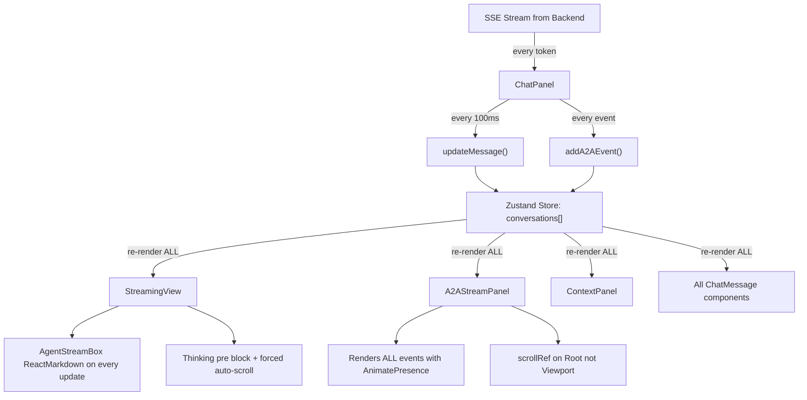

# UI Scroll Performance & Rendering Fixes

**Date**: 2026-02-10
**Status**: Implemented
**Author**: Sri Aradhyula <sraradhy@cisco.com>

## Context

The CAIPE UI was experiencing performance issues in three areas:

1. **Thinking messages**: Auto-scroll forced users to the bottom on every 100ms content update, causing layout thrashing and preventing users from reading earlier content.
2. **A2A Debug panel**: Broken scroll (ref pointed to non-scrollable element), all events rendered without virtualization, and excessive re-renders from broad Zustand store subscriptions.
3. **History rendering**: No `React.memo` on any component, causing the entire message list to re-render on every streaming update. `ReactMarkdown` ran on every token chunk during streaming.

## Architecture Before

## Fixes Implemented

### Fix 1: Remove Auto-Scroll from Thinking Messages

**File**: `ui/src/components/chat/ChatPanel.tsx` (StreamingView)

**Problem**: The thinking `<pre>` block auto-scrolled on every content update (every 100ms). This caused layout thrashing and was disorienting — users often want to read the beginning of the thinking output, not chase the bottom.

**Changes**:
- Removed the `useEffect` that auto-scrolled the `streamingOutputRef` container
- Removed `isUserScrolled` state, `isAutoScrollingRef`, `handleScroll` callback
- Removed the "Resume auto-scroll" button inside the thinking section
- The thinking section is now a simple scrollable container with no forced scroll behavior

**Impact**: High | **Effort**: Low

---

### Fix 2: Fix A2A Debug Panel Broken Scroll

**File**: `ui/src/components/a2a/A2AStreamPanel.tsx`

**Problem**: `A2AStreamPanel` passed `ref={scrollRef}` to `<ScrollArea>`, but the `ScrollArea` component forwards `ref` to the Radix Root element (a non-scrollable wrapper). The actual scrollable element is the Viewport. So `scrollRef.current.scrollTop = scrollRef.current.scrollHeight` was a no-op.

**Change**: `ref={scrollRef}` → `viewportRef={scrollRef}` on the `<ScrollArea>` component. The `ScrollArea` component already supports `viewportRef` (defined in `ui/src/components/ui/scroll-area.tsx`).

**Impact**: High | **Effort**: Trivial

---

### Fix 3: Virtualize A2A Debug Event List

**File**: `ui/src/components/a2a/A2AStreamPanel.tsx`

**Problem**: All A2A events (can be hundreds per conversation) were rendered with `AnimatePresence mode="popLayout"` and `motion.div` animations. Each event had initial/animate/exit transitions. This was extremely expensive with large event counts.

**Changes**:
- Replaced `AnimatePresence` + `filteredEvents.map()` with `@tanstack/react-virtual` `useVirtualizer`
- Only visible events are rendered in the DOM (estimated row height ~68px, overscan 5)
- Used `measureElement` for dynamic row heights (expanded events resize correctly)
- Kept `AnimatePresence` only for the expand/collapse of individual event details

**Impact**: High | **Effort**: Medium

---

### Fix 4: Optimize Re-renders with Zustand Selectors

**Files**: `ui/src/components/a2a/A2AStreamPanel.tsx`, `ui/src/components/a2a/ContextPanel.tsx`

**Problem**: Both components pulled the entire `conversations` array from Zustand. Any change to any conversation (messages, streaming state, etc.) triggered a re-render. The `useMemo` for `a2aEvents` depended on `conversations`, so it recomputed on every store update.

**Changes**:
- Replaced `useChatStore()` destructuring with targeted selectors using `useShallow` from `zustand/react/shallow`
- Used separate `useCallback`-based selectors for `a2aEvents` / `conversationEvents` so they only re-render when the specific conversation's events change
- Applied the same pattern to both `A2AStreamPanel` and `ContextPanel`

**Impact**: High | **Effort**: Low

---

### Fix 5: Single-Pass Event Counting

**File**: `ui/src/components/a2a/A2AStreamPanel.tsx`

**Problem**: `eventCounts` ran 6 separate `.filter()` passes over `a2aEvents` on every render.

**Change**: Replaced with a single `useMemo` that accumulates counts in one `for` loop.

**Impact**: Low | **Effort**: Trivial

---

### Fix 6: React.memo on ChatMessage and AgentStreamBox

**Files**: `ui/src/components/chat/ChatPanel.tsx`, `ui/src/components/chat/AgentStreamBox.tsx`

**Problem**: Zero components in the UI used `React.memo`. During streaming, every 100ms store update re-rendered the entire message list and all agent stream boxes — even though only the last message was changing.

**Changes**:
- Wrapped `ChatMessage` in `React.memo`
- Wrapped `AgentStreamBox` in `React.memo`
- Stabilized `handleStop`, `handleFeedbackChange`, and `handleFeedbackSubmit` callbacks with `useCallback` in the parent to avoid creating new function references on each render

**Impact**: High | **Effort**: Medium

---

### Fix 7: Defer ReactMarkdown During Streaming

**File**: `ui/src/components/chat/AgentStreamBox.tsx`

**Problem**: `AgentStreamBox` ran `ReactMarkdown` with `remarkGfm` on every `streamContent` update during streaming. Markdown parsing on every token chunk is expensive.

**Change**: During streaming (`agentStatus` is `streaming` or `processing`), render plain `<pre>` text. Switch to `ReactMarkdown` only when `agentStatus` is `completed` or `idle`.

**Impact**: High | **Effort**: Low

---

## MongoDB Read Thrashing Analysis

**Verdict**: No significant MongoDB read thrashing detected. Redis or additional caching is NOT needed at this time.

### Current Protections Already in Place

| Protection | Location | Details |
|-----------|----------|---------|
| Message load cooldown | `chat-store.ts` | 5-second cooldown + `inFlight` guard per conversation |
| Conversation load guard | `chat-store.ts` | `isLoadingConversations` flag blocks concurrent loads |
| Connection pooling | `mongodb.ts` | Singleton pooled connection via `connectToDatabase()` |
| Storage mode cache | `storage-mode.ts` | 60-second in-memory cache for `isMongoDBAvailable()` |
| Client-side cache | `chat-store.ts` | Zustand store with localStorage/MongoDB persistence |

### Minor Risks (Low Priority, Not Addressed)

- **Sidebar visibility change**: Triggers `loadConversationsFromServer` on every tab-visible event with no cooldown. Quick tab switching can cause sequential loads. Consider adding a 30s cooldown.
- **Chat UUID useEffect deps**: `localConversations` in the dependency array causes effect re-runs on any conversation update, but the 5s cooldown prevents actual MongoDB reads.

### Why Redis Is Not Needed

- Read patterns are user-initiated or have existing cooldowns
- No hot-path polling that hammers MongoDB (health checks hit non-MongoDB endpoints)
- Workflow run polling (15s) only activates when Agent Builder history is open
- The Zustand store already acts as a client-side cache for conversations and messages
- Adding Redis would add infrastructure complexity with minimal benefit for current usage patterns

---

## Impact Summary

| Fix | Target Issue | Impact | Effort |
|-----|-------------|--------|--------|
| 1. Remove thinking auto-scroll | Thinking scroll struggle | High | Low |
| 2. Fix scrollRef to viewportRef | A2A Debug scroll broken | High | Trivial |
| 3. Virtualize A2A event list | A2A Debug rendering | High | Medium |
| 4. Zustand selectors | All panel re-renders | High | Low |
| 5. Single-pass eventCounts | A2A Debug minor | Low | Trivial |
| 6. React.memo on components | History + streaming renders | High | Medium |
| 7. Defer ReactMarkdown | AgentStreamBox during stream | High | Low |

## Files Changed

| File | Changes |
|------|---------|
| `ui/src/components/chat/ChatPanel.tsx` | Fix 1 (thinking auto-scroll), Fix 6 (React.memo + stable callbacks) |
| `ui/src/components/a2a/A2AStreamPanel.tsx` | Fix 2 (scroll ref), Fix 3 (virtualization), Fix 4 (selectors), Fix 5 (counts) |
| `ui/src/components/a2a/ContextPanel.tsx` | Fix 4 (Zustand selectors) |
| `ui/src/components/chat/AgentStreamBox.tsx` | Fix 6 (React.memo), Fix 7 (defer markdown) |

## Dependencies

- `@tanstack/react-virtual` — already present in the project, used for virtualizing the A2A Debug event list
