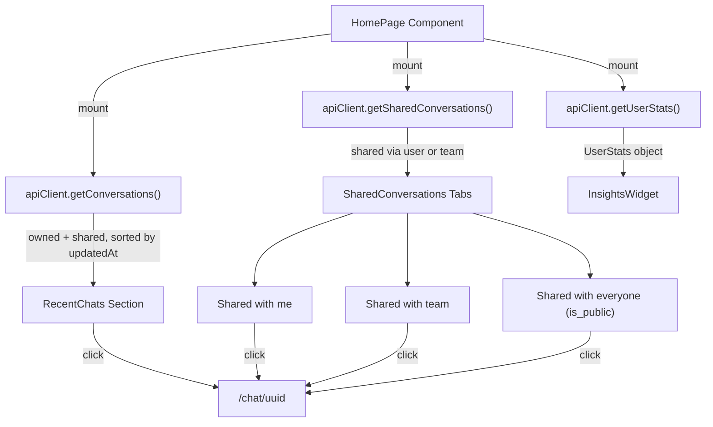

# UI Home Page — Dashboard Landing Experience

**Status**: Implemented
**Category**: Features & Enhancements
**Date**: March 3, 2026
**Updated**: March 4, 2026

## Problem Statement

The CAIPE UI currently redirects `/` to `/skills` via a client-side `router.replace()` in `app/page.tsx`. This creates several issues:

1. **No orientation for new users**: Landing directly on the skills gallery gives no context about the platform's other capabilities (Chat, Knowledge Bases, Insights). Users don't know what they can do.
2. **No shared content discovery**: Conversations shared with a user (via individuals or teams) are invisible unless the user already has the direct URL. The `getSharedConversations()` API exists and is wired up in `api-client.ts` but is unused in the UI.
3. **No "pick up where you left off"**: Users must navigate to Chat and use the sidebar to find their most recent conversation. There is no quick-access surface for resuming work.
4. **Underutilized sharing infrastructure**: The `is_public` field exists on the `Conversation` type (`sharing.is_public`) in both `types/a2a.ts` and `types/mongodb.ts`, but the `ShareDialog` component does not surface a toggle for it. There is no way for users to share conversations with everyone.
5. **App feels like a "skills catalog"**: Emphasizing skills as the landing page positions the product as a workflow catalog rather than an AI platform with multiple capabilities.

## Decision

Replace the `/` redirect with a proper dashboard-style home page that serves as the primary entry point. The page surfaces recent chats, shared conversations (by individual, team, and everyone), platform capability cards, and a personal insights widget. The page lives inside the `(app)` route group to inherit the global `AppHeader` layout.

### Why a Home Page at `/`

The home page lives at `/` (not `/dashboard` or `/home`) because:

- `/` is the natural entry point; the logo in AppHeader already links to `/`
- It eliminates the redirect hop (better performance, no flash)
- It follows standard web application conventions

### Why Inside the `(app)` Route Group

The page is at `src/app/(app)/page.tsx` rather than `src/app/page.tsx` because the `(app)` route group wraps children in a layout that renders `AppHeader` — the global navigation bar with Skills, Chat, Knowledge Bases, and Admin tabs. Placing the page outside this group would render it without navigation.

## Alternatives Considered

| Alternative | Pros | Cons | Decision |
|---|---|---|---|
| **Dashboard home page at `/` (chosen)** | Natural entry point, eliminates redirect, surfaces shared content and capabilities | New page to build and maintain | **Selected** |
| Enhanced `/skills` page with dashboard widgets | No new route, incremental change | Conflates skill catalog with dashboard; skills page already has its own UX (gallery + runner); becomes cluttered | Rejected |
| Separate `/dashboard` route, keep `/` redirect | Doesn't change existing flow | Extra redirect still exists; two "home" concepts confuse users; logo click goes to redirect, not dashboard | Rejected |
| Keep current redirect, add shared chats to sidebar | Minimal change | Sidebar is per-chat-page only; doesn't help new users orient; doesn't surface capabilities | Rejected |

## Solution Architecture

### Page Structure

```
┌──────────────────────────────────────────────────┐
│  AppHeader  [Home] [Skills] [Chat] [KB] [Admin]  │
├──────────────────────────────────────────────────┤
│  Welcome Banner                                  │
│  "Welcome back, {firstName}"                     │
├──────────────────────────────────────────────────┤
│  Capability Cards (Chat | Skills | KB*)          │
│  * Knowledge Bases shown only if RAG_ENABLED     │
├──────────────────────────────────────────────────┤
│  Recent Chats (grid)      │  Insights Widget*    │
│                            │  * MongoDB only      │
├──────────────────────────────────────────────────┤
│  Shared Conversations* (tabbed)                  │
│  [With me] [Team] [Everyone]                     │
│  * MongoDB only                                  │
├──────────────────────────────────────────────────┤
│         ⚡ Powered by caipe.io                    │
└──────────────────────────────────────────────────┘
```

### Navigation Change

A "Home" pill was added as the first item in AppHeader's navigation pills. The `getActiveTab()` function was updated to return `"home"` when the pathname is exactly `/`.

### Data Flow



### ShareDialog Enhancement

The existing `ShareDialog` component (`src/components/chat/ShareDialog.tsx`) was updated to include a "Share with everyone" toggle (`role="switch"`, `data-testid="share-public-toggle"`) that sets `sharing.is_public` on the conversation. The backend field already existed; only the UI toggle was missing.

### Graceful Degradation

When MongoDB is unavailable (`storageMode !== 'mongodb'`):

| Section | Behavior |
|---------|----------|
| Welcome Banner | Shown (uses session user name) |
| Capability Cards | Shown (static content, no API) |
| Recent Chats | Shown (loaded from localStorage via chat store) |
| Shared with me | Hidden (requires MongoDB) |
| Shared with team | Hidden (requires MongoDB) |
| Shared with everyone | Hidden (requires MongoDB) |
| Insights Widget | Hidden (requires MongoDB) |
| "Powered by" Footer | Shown (unconditional) |

## Components Changed

### New Components

| Component | Path | Purpose |
|-----------|------|---------|
| `HomePage` | `src/app/(app)/page.tsx` | Dashboard home page at `/` |
| `WelcomeBanner` | `src/components/home/WelcomeBanner.tsx` | Personalized greeting with time-of-day awareness |
| `CapabilityCards` | `src/components/home/CapabilityCards.tsx` | Chat / Skills / KB feature cards (KB conditional on RAG_ENABLED) |
| `RecentChats` | `src/components/home/RecentChats.tsx` | Grid of recent conversation cards with "New Chat" link |
| `SharedConversations` | `src/components/home/SharedConversations.tsx` | Tabbed view: with me / team / everyone |
| `InsightsWidget` | `src/components/home/InsightsWidget.tsx` | Personal stats summary with "View all" link to `/insights` |
| `ConversationCard` | `src/components/home/ConversationCard.tsx` | Reusable card for conversation entries with relative timestamps |

### Modified Components

| Component | Path | Change |
|-----------|------|--------|
| `AppHeader` | `src/components/layout/AppHeader.tsx` | Added "Home" nav pill as first tab; updated `getActiveTab()` to detect `/` |
| `ShareDialog` | `src/components/chat/ShareDialog.tsx` | Added "Share with everyone" toggle for `is_public` |

### Existing APIs Used (No Backend Changes)

| API | Client Method | Already Existed | Previously Used |
|-----|--------------|-----------------|-----------------|
| `GET /api/chat/conversations` | `getConversations()` | Yes | Yes (Sidebar) |
| `GET /api/chat/shared` | `getSharedConversations()` | Yes | **No** (unused) |
| `GET /api/users/me/stats` | `getUserStats()` | Yes | Yes (Insights page) |
| `POST /api/chat/conversations/:id/share` | `shareConversation()` | Yes | Yes (ShareDialog) |

## Testing

### Unit Tests (Jest) — 1953 tests across 82 suites

- Home page integration tests: AuthGuard, page structure, footer, welcome banner, capability cards, recent chats, shared conversations, insights widget, localStorage mode, auth guard, error handling
- Component tests: ConversationCard, RecentChats, SharedConversations, InsightsWidget, CapabilityCards, WelcomeBanner
- AppHeader: Home tab visibility, link, active/inactive styling
- ShareDialog: Public toggle rendering, ARIA, toggle on/off, store update, error handling

### Manual Verification

- Log in and verify all sections render on `/`
- Share a conversation with a user, verify it appears on their home page
- Mark a conversation public, verify any other user sees it
- Test across all 8 themes for visual consistency
- Test with MongoDB disabled — shared sections hidden, capabilities and recent chats still shown

## Related

- Spec: `ui/.specify/specs/ui-home-page.md`
- Existing: `ui/src/components/chat/ShareDialog.tsx` (added `is_public` toggle)
- Existing: `ui/src/lib/api-client.ts` (`getSharedConversations`, `getUserStats`)
- Existing: `ui/src/app/(app)/insights/page.tsx` (full insights; widget links here)
- Existing: `ui/src/types/mongodb.ts` (`Conversation.sharing.is_public`)
