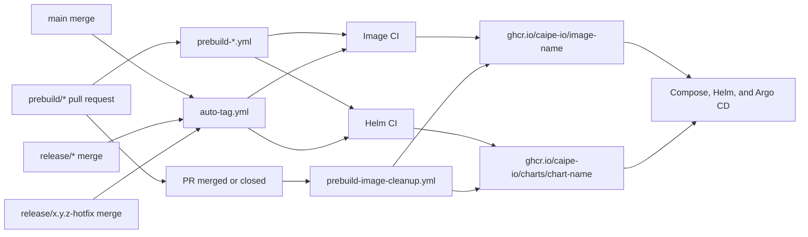

# CI Infrastructure

CAIPE publishes each repo-owned artifact to one canonical GitHub Container
Registry (GHCR) package. The artifact lifecycle is encoded in its tag or chart
version, not in a separate registry path.

This keeps Argo CD, Helm values, Compose files, vulnerability scans, and release
automation on the same package reference from prebuild through final release.

## Architecture



## Package Model

| Artifact | Canonical package | Lifecycle selector |
| --- | --- | --- |
| Container image | `ghcr.io/caipe-io/<image>` | Docker tag |
| Helm chart | `oci://ghcr.io/caipe-io/charts/<chart>` | Chart version |

Examples:

```text
ghcr.io/caipe-io/caipe-ui:0.6.0-dev.6
ghcr.io/caipe-io/caipe-ui:0.6.0-rc.1
ghcr.io/caipe-io/caipe-ui:0.6.0

oci://ghcr.io/caipe-io/charts/ai-platform-engineering:0.6.0-dev.6
oci://ghcr.io/caipe-io/charts/ai-platform-engineering:0.6.0-rc.1
oci://ghcr.io/caipe-io/charts/ai-platform-engineering:0.6.0
```

Do not create lifecycle-specific package paths such as:

```text
ghcr.io/caipe-io/prebuild/<image>
ghcr.io/caipe-io/pre-release/<image>
ghcr.io/caipe-io/pre-release-helm-charts/<chart>
```

One package preserves download history and package permissions while allowing a
deployment to move between lifecycles by changing only its immutable tag or
version.

## Artifact Lifecycles

| Lifecycle | Source | Example selector | Retention |
| --- | --- | --- | --- |
| PR prebuild | `prebuild/*` pull request | `feature-name-3` | Deleted when the PR closes |
| Development | Merge to `main` | `0.6.0-dev.6` | Retained |
| Release candidate | `release/x.y.z` | `0.6.0-rc.1` | Retained until release cleanup |
| Hotfix candidate | Hotfix flow | `0.6.0-hotfix.1` | Retained until release cleanup |
| Final release | Release finalization | `0.6.0` | Retained |

`release/*` and hotfix branches remain supported. Their workflows select a
different version; they do not select a different package tree.

## Workflow Responsibilities

| Workflow or action | Responsibility |
| --- | --- |
| `pr-version-bump.yml` | Determines PR flow and version changes; dispatches prebuild work |
| `auto-tag.yml` | Creates development, release-candidate, hotfix, and chart-only tags |
| `prebuild-*.yml` | Builds temporary PR images in canonical packages |
| `prebuild-helm.yml` | Publishes temporary chart versions in canonical chart packages |
| `ci-*.yml` | Builds or retags versioned images after a Git tag |
| `ci-helm.yml` | Publishes versioned charts after a Git tag |
| `release-manual.yml` | Creates the final release tag and draft GitHub Release |
| `release-finalize.yml` | Publishes the release after required artifact workflows complete |
| `prebuild-image-cleanup.yml` | Deletes temporary image tags and chart versions when a PR closes |
| `security-scan.yml` | Scans the exact canonical image package and selected tag |

See [CI/CD and Releases](../ci-cd-and-releases.md) for the branch and version
state machine and [Prebuild Flow](../prebuild-flow.md) for PR artifact details.

## Package Ownership Boundary

Only artifacts built by this repository move to `caipe-io` packages. A chart
may still reference an external image when another repository owns its build
and release lifecycle.

Examples of external packages include legacy `agent-*` images and the custom
Playwright image. Do not rename those references until the owning repository
publishes an equivalent package and version in the new organization.

## Public Package Visibility

The source repository being public does not automatically make a new GHCR
package public. A new package is initially governed by the CAIPE organization
package policy and its own visibility setting.

For OSS artifacts, the required state is:

- The CAIPE organization allows **Public** package creation under
  **Settings → Packages → Package creation**.
- Every repo-owned image and chart package is set to **Public**.
- `ai-platform-engineering` retains Actions access with the role required to
  publish and clean up package versions.
- Anonymous consumers can pull the selected image or chart version.

Changing the organization policy is broader than changing one package: it lets
organization members create public packages in the future. Treat it as an
organization-level governance decision.

After the first publication of a new package:

1. Open the package's **Package settings** page.
2. Select **Change visibility**.
3. Change the package to **Public** and confirm the package name.
4. Verify anonymous image or chart access.

Changing visibility does not republish or retag the artifact.

## Stable Migration Compatibility

Do not change a stable installer from `cnoe-io` to `caipe-io` until every tag it
references exists and is public in the new organization. Otherwise, the source
configuration is correct but first installation fails with an authentication or
manifest-not-found error.

During migration:

- New development, prebuild, release-candidate, and final artifacts publish to
  canonical `caipe-io` packages.
- Source chart defaults and future release tooling use the canonical packages.
- A stable Compose or installation example may temporarily retain a pinned
  `cnoe-io` artifact.
- Update the repository and version together after verifying the new artifact.

The compatibility exception is for consumers only. Do not publish new artifacts
to legacy package trees.

## Verification

Verify an image without relying on a local registry login:

```bash
docker manifest inspect ghcr.io/caipe-io/<image>:<tag>
```

Verify a chart:

```bash
helm show chart \
  oci://ghcr.io/caipe-io/charts/<chart> \
  --version <version>
```

Before changing a stable consumer, verify every image and chart referenced by
that installation path. A successful prerelease package does not prove that an
older stable tag was copied.

## Invariants

CI changes must preserve these rules:

- One canonical package per repo-owned artifact.
- Lifecycle encoded in the tag or chart version.
- Public read access for OSS artifacts.
- Write access limited to approved repositories and release automation.
- Temporary PR artifacts deleted when the PR closes.
- No stable consumer cutover before all referenced artifacts exist publicly.
- External package references change only with coordination from their owner.
