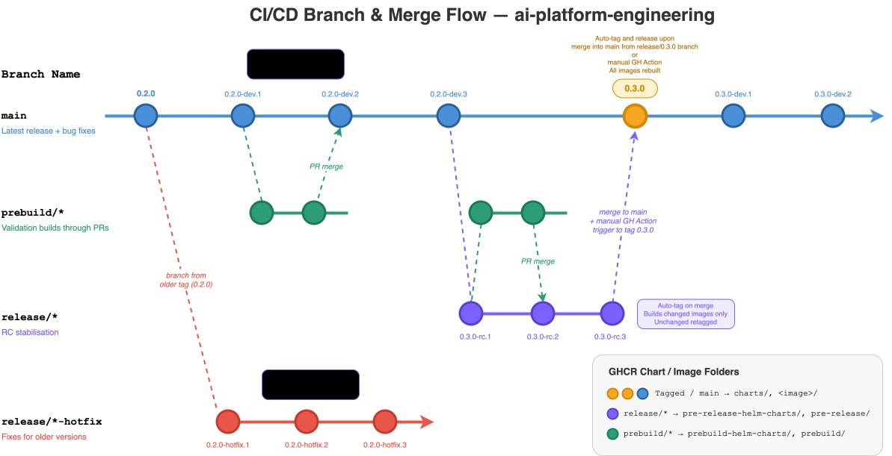
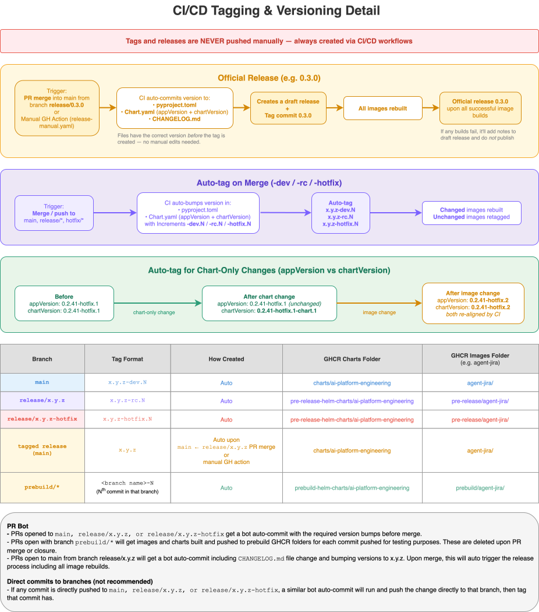

# CI/CD and Releases

This page is the map for the repo's CI/CD flow: PR version bumps, prebuild artifacts, dev/RC/hotfix tags, and final releases.

## Branch Flow

The diagrams below show the branch, tag, and artifact flow used by the release workflows.



## Version Tags

Below diagram shows the details of how the auto release and tags work based on the target branch `main`, `release/x.y.z` and `release/x.y.z-hotfix`.



The CI/CD system uses self-describing tags. The suffix tells workflows where the change came from and where artifacts should be published.

| Tag shape | Created from | Purpose |
| --- | --- | --- |
| `x.y.z-dev.N` | `main` | Development build after merge to main |
| `x.y.z-dev.N-chart.M` | chart-only change on `main` | Development Helm chart update without image rebuild |
| `x.y.z-rc.N` | `release/x.y.z` | Release candidate build |
| `x.y.z-rc.N-chart.M` | chart-only change on `release/x.y.z` | Release candidate Helm chart update without image rebuild |
| `x.y.z-hotfix.N` | `release/x.y.z-hotfix` | Hotfix candidate build |
| `x.y.z-hotfix.N-chart.M` | chart-only change on hotfix branch | Hotfix Helm chart update without image rebuild |
| `x.y.z` | final release flow | Production release |

`N` increments when image-affecting source changes are detected. `M` increments when only chart files changed after the latest base tag.

## Artifact Locations

Docker image and Helm chart registry paths are separated by artifact lifecycle.

| Artifact type | Flow | Registry path |
| --- | --- | --- |
| Docker images | `-dev.N` and final `x.y.z` | `ghcr.io/cnoe-io/<image>` |
| Docker images | `-rc.N` and `-hotfix.N` | `ghcr.io/cnoe-io/pre-release/<image>` |
| Docker images | `prebuild/*` branches | `ghcr.io/cnoe-io/prebuild/<image>` |
| Helm charts | final `x.y.z` | `ghcr.io/cnoe-io/charts` |
| Helm charts | prerelease and chart-only tags | `ghcr.io/cnoe-io/pre-release-helm-charts` |
| Helm charts | prebuild PR testing | `ghcr.io/cnoe-io/prebuild-helm-charts` |

## PR Flow

`pr-version-bump.yml` runs on PRs targeting `main` or `release/**` when app, build, Python package, lockfile, or chart paths change.

It does four main things:

1. Checks whether the PR branch contains the latest base branch and whether GitHub reports merge conflicts.
2. Applies a PR flow label such as `dev`, `0.4.0`, `0.4.0-hotfix`, or `release/0.4.0`.
3. Computes the version that the target branch would receive after merge.
4. Commits version file updates back to the PR branch.

If the PR branch is behind or has conflicts, the workflow posts an update comment with commands to merge the latest base branch. The workflow then fails so the PR cannot merge with stale version calculations.

For normal PRs, version calculation is handled by `.github/actions/determine-version/action.yml`, and file updates are handled by `.github/actions/update-version-files/action.yml`.

For `release/x.y.z -> main` PRs, the workflow uses `.github/actions/prepare-release/action.yml` to set the final `x.y.z` version and generate the changelog.

## Chart-Only Changes

Chart-only changes are treated specially so image builds are not wasted.

The `determine-version` action diffs the current commit against the latest relevant tag or branch point. If changed files are limited to `charts/**`, the next tag keeps the same base tag and appends or increments `-chart.M` to chart version only.

Examples:

```text
0.4.0-dev.3 -> 0.4.0-dev.3-chart.1
0.4.0-dev.3-chart.1 -> 0.4.0-dev.3-chart.2
0.4.0-rc.2 -> 0.4.0-rc.2-chart.1
```

where appVersion and image tags remain at `0.4.0-dev.3` or `0.4.0-rc.2`.

In chart-only mode, `update-version-files`:

- Updates only changed charts and parent charts that depend on them.
- Updates local dependency version references for bumped charts.
- Leaves `appVersion`, `pyproject.toml`, and `uv.lock` unchanged.
- Outputs the chart-only tag as the final version.

Docker CI workflows detect `-chart.M` and skip image builds entirely and publish only the chart.

## Docker Image CI

The main image workflows are tag-driven:

- `ci-supervisor-agent.yml`
- `ci-dynamic-agents.yml`
- `ci-a2a-sub-agent.yml`
- `ci-mcp-sub-agent.yml`
- `ci-a2a-rag.yml`
- `ci-caipe-ui.yml`
- `ci-slack-bot.yml`

Each workflow resolves the tag through `.github/actions/determine-release-tag/action.yml`.

For prerelease tags with `N > 1`, workflows build only changed images and retag unchanged images from the previous tag. If the source image for retagging does not exist, the workflow falls back to a fresh build.

For first prerelease tags and final release tags, workflows build all relevant images.

For `-rc.N` and `-hotfix.N` tags, images publish under `pre-release/`. For `-dev.N` and final release tags, images publish at the normal image path.

## Prebuild Artifacts

Prebuild artifacts are temporary test artifacts published from PRs before merge.

Use prebuilds when you want to test Docker images or Helm charts without waiting for a branch merge and official tag.

1. Create a branch called `prebuild/*` e.g. `prebuild/feat/add-feature-A
2. Open a PR from the prebuild branch to the intended target branch (this can be any).
3. THe `pr-version-bump.yml` workflow detects the `prebuild/*` source branch and dispatches a prebuild workflow (as well as the normal version bump flow if the target branch is `main` or `release/**`).
4. The prebuild workflow builds and publishes images to `ghcr.io/cnoe-io/prebuild/<image>` and charts to `ghcr.io/cnoe-io/prebuild-charts` with a tag matching the branch name *Note: only changed images / charts are built*.
5. Each new commit to the prebuild branch triggers a new prebuild with the same tag, overwriting the previous prebuild artifacts.
6. Use the prebuild artifacts for testing.
7. Upon PR merge or closure, all prebuild artifacts with the branch tag are automatically deleted.

## Release Candidate Flow

Use a `release/x.y.z` branch when preparing a new release.

1. Create or update the release branch.
2. Open PRs targeting `release/x.y.z`.
3. Let `pr-version-bump.yml` update the PR branch with version bumps.
4. Merge PRs into `release/x.y.z`.
5. `auto-tag.yml` creates tag `x.y.z-rc.N` or `x.y.z-rc.N-chart.M` (chart only change).
6. Tag pushes trigger Docker and Helm CI.
7. Test the published RC artifacts from GHCR.

RC Docker images are under `ghcr.io/cnoe-io/pre-release/<image>`.

RC Helm charts are under `ghcr.io/cnoe-io/pre-release-helm-charts`.

## Final Release Flow

Final releases use plain `x.y.z` tags.

The usual path is:

1. Open a PR from `release/x.y.z` to `main`.
2. `pr-version-bump.yml` detects the release merge PR.
3. The workflow prepares the final version files and changelog.
4. Merge the release PR to `main`.
5. `auto-tag.yml` detects the release branch merge and dispatches `release-manual.yml`.
6. `release-manual.yml` validates the version, creates the final tag, pushes it, and creates a draft GitHub Release.
7. The final tag triggers Docker image and Helm chart CI.
8. CI workflows notify `release-finalize.yml` as they complete.
9. `release-finalize.yml` publishes the draft release after all required CI workflows pass.

After publishing, `release-finalize.yml` also dispatches post-release security scanning and quick sanity integration tests. It cleans up old RC tags whose base version is older than the newly published release.

If one or more required CI workflows fail, the GitHub Release remains in draft state and receives a failure note for investigation.

## Hotfix Flow

Use a `release/x.y.z-hotfix` branch when patching an already released version.

The flow mirrors release candidates:

1. Create `release/x.y.z-hotfix`.
2. Open PRs targeting the hotfix branch.
3. Merge approved fixes.
4. `auto-tag.yml` creates `x.y.z-hotfix.N` or `x.y.z-hotfix.N-chart.M`.
5. Tag-triggered CI publishes hotfix artifacts under the prerelease registry paths.

When ready to publish the fixed version, run the final release flow with the intended final semver tag.

## Useful Workflow Reference

| Workflow or action | Responsibility |
| --- | --- |
| `.github/workflows/pr-version-bump.yml` | PR labels, branch freshness checks, PR version commits, Helm prebuild dispatch |
| `.github/workflows/auto-tag.yml` | Creates `-dev.N`, `-rc.N`, `-hotfix.N`, and `-chart.M` tags after merge |
| `.github/workflows/release-manual.yml` | Creates final `x.y.z` tag and draft GitHub Release |
| `.github/workflows/release-finalize.yml` | Publishes draft release after required CI workflows pass |
| `.github/workflows/ci-*.yml` | Publishes tagged Docker images |
| `.github/workflows/ci-helm.yml` | Publishes tagged Helm charts |
| `.github/workflows/prebuild-*.yml` | Publishes temporary prebuild images and charts for PR testing |
| `.github/actions/determine-version/action.yml` | Computes the next branch-aware version tag |
| `.github/actions/update-version-files/action.yml` | Updates pyproject, lockfile, and chart versions |
| `.github/actions/determine-release-tag/action.yml` | Resolves the tag used by image CI workflows |
| `.github/actions/prepare-release/action.yml` | Updates final release files and generates changelog |

## Troubleshooting

If a PR version bump fails with a branch update comment, merge the latest target branch into the PR branch and push again.

If a prebuild does not publish immediately after the version bump workflow commits, wait for the next PR workflow run. Prebuild publishing intentionally skips when a new version-bump commit was just pushed.

If an image workflow retags an older image unexpectedly, check whether the changed paths matched that image's path filters. For prerelease `N > 1`, unchanged image paths are retagged by design.

If Docker builds do not run for a chart-only tag, that is expected. `-chart.M` tags publish Helm updates only.

If a final release stays as a draft, inspect the required CI workflows listed in `release-finalize.yml`. The release is published only after all required workflows pass or are skipped successfully.
