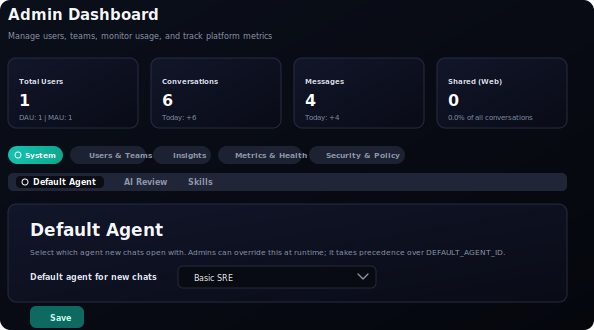

# Admin Settings

The Admin Dashboard is the operator surface for managing CAIPE UI behavior,
access, metrics, and policy controls. Admin settings are available from the
`Admin` tab in the main navigation and are grouped so operators can find
routine tasks without scanning a long row of unrelated tabs.

## Admin Dashboard Sections

The top-level Admin Dashboard categories are:

| Category | Tabs | Purpose |
|----------|------|---------|
| `System` | `Default Agent`, `AI Review`, `Skills` | Configure core CAIPE behavior and system-level agent features. |
| `Users & Teams` | `Users`, `Teams` | Review users, assign roles, and manage collaboration groups. |
| `Insights` | `Feedback`, `Statistics` | Inspect user feedback, satisfaction trends, and product usage. |
| `Metrics & Health` | `Metrics`, `Health` | Check platform telemetry and service health. |
| `Security & Policy` | `Audit Logs`, `Policy` | Review administrative activity and policy controls. |

Some tabs only appear when the related feature is enabled or when the current
user has full admin access. Read-only admin viewers can inspect supported
dashboard areas but cannot save administrative changes.

## Default Agent

`System` → `Default Agent` controls which agent opens when a user starts a new
chat. This setting is useful when an installation wants new conversations to
start with a specialized dynamic agent instead of the supervisor.

The selector always includes `Default CAIPE Supervisor`. Choosing this option
means new chats use the built-in supervisor flow rather than a dynamic agent.

When dynamic agents are available, each registered agent appears in the same
selector. Choosing one and clicking `Save` stores that agent as the runtime
default for new chats.

## Precedence

The runtime admin setting takes precedence over bootstrap configuration:

1. If an admin saves a default agent in the UI, CAIPE uses that persisted value.
2. If no UI value has been saved, CAIPE can fall back to the `DEFAULT_AGENT_ID`
   deployment value.
3. If neither is configured, new chats use `Default CAIPE Supervisor`.

When CAIPE is currently using `DEFAULT_AGENT_ID`, the UI displays a note that
saving from the Admin Dashboard will override the bootstrap default at runtime.

## Missing Agents

If a previously saved default dynamic agent is no longer available, the
Default Agent panel warns administrators and new chats fall back to the
supervisor. Pick another available agent or choose `Default CAIPE Supervisor`
and save to clear the stale runtime setting.

## Access Control

Only full admins can change the Default Agent setting. Non-admin or read-only
admin users can view the configured value, but the selector is disabled and
the `Save` action is hidden.

Admin access is determined by the UI authentication and role configuration.
For SSO-enabled deployments, role and view access come from configured identity
groups. In local or no-SSO development, avoid granting anonymous admin access
unless the environment explicitly requires it.

## Related Pages

- [Custom Agents](./custom-agents.md)
- [Skills](./skills/README.md)
